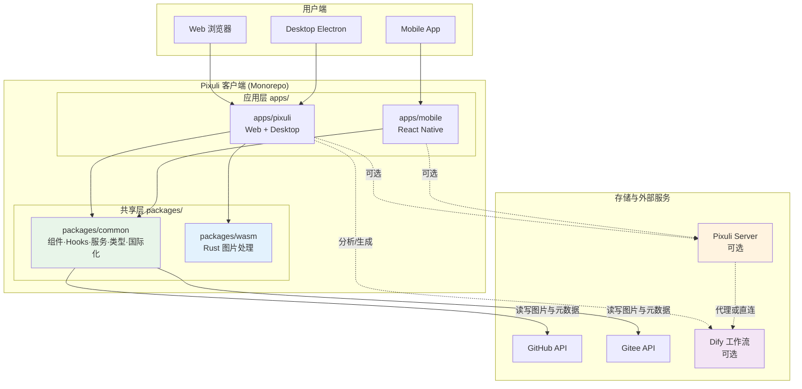
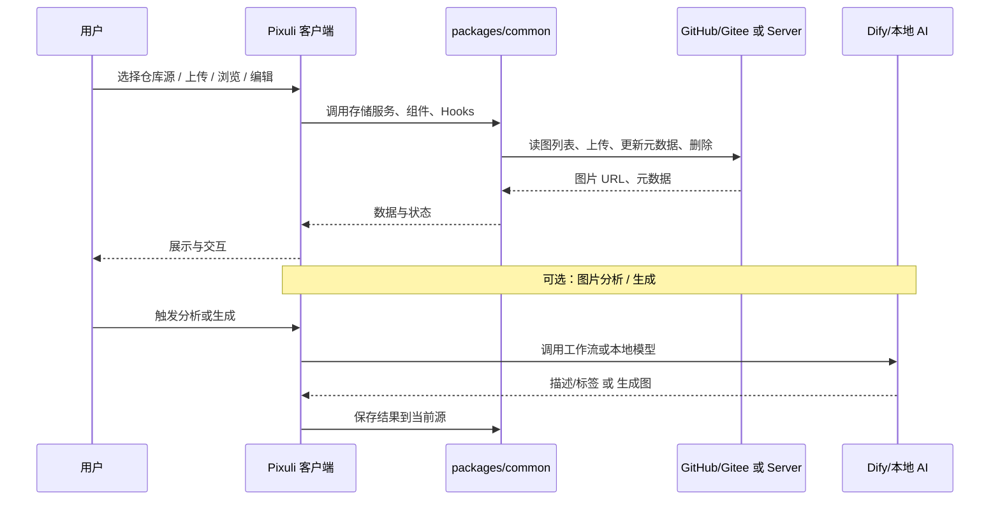
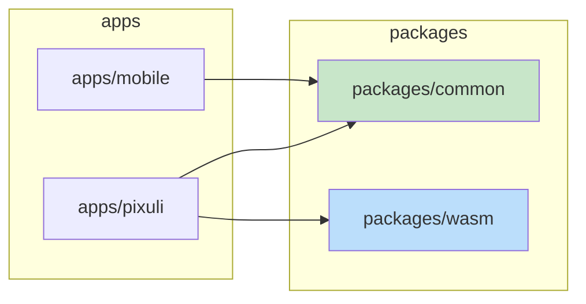
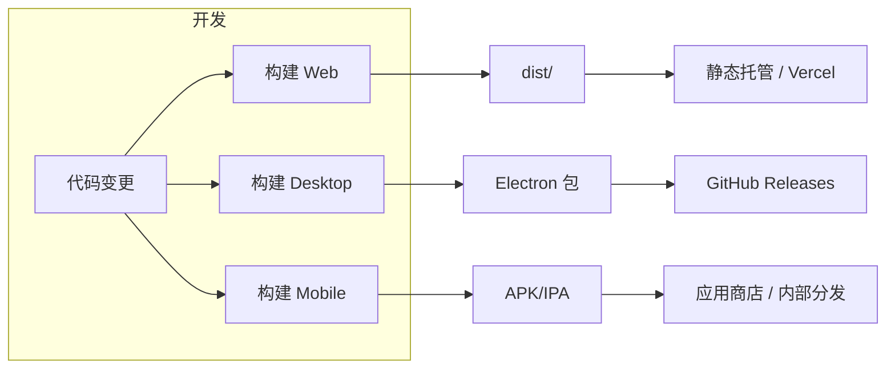
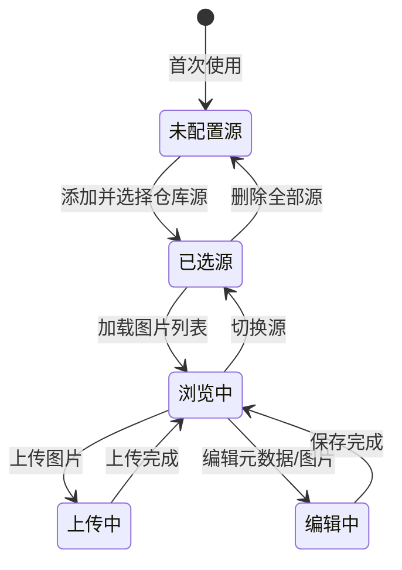

# Pixuli 整体系统设计

## 目录

- [一、方案概述](#一方案概述)
- [二、专业术语](#二专业术语)
- [三、系统架构设计](#三系统架构设计)
- [四、模块与职责](#四模块与职责)
- [五、数据流与存储](#五数据流与存储)
- [六、技术栈与平台能力](#六技术栈与平台能力)
- [七、部署与构建形态](#七部署与构建形态)
- [八、与设计文档及 CI/CD 的衔接](#八与设计文档及-cicd-的衔接)
- [九、扩展与演进](#九扩展与演进)
- [十、附录](#十附录)

---

## 一、方案概述

### 1.1 目标

为 **Pixuli** 项目建立一套**整体系统设计说明**，用于：

- **统一认知**：产品、前端、后端、多端开发对系统边界、模块划分、数据流形成一致理解。
- **指导实现**：与 [01-product](../01-product/) 下的 PRD 及
  [02-design](./README.md) 下的各专项设计文档配合，指导开发与排期。
- **对外展示**：便于文档站、Wiki、新成员入职时快速把握系统全貌。

### 1.2 设计原则

- **多端一致**：Web、Desktop、Mobile 在业务能力与体验上尽量一致，通过
  `packages/common` 与平台适配层实现「一套逻辑、多端运行」。
- **存储可选**：默认以 **GitHub / Gitee 仓库**
  作为图床，不依赖自建后端；**Pixuli Server**
  为可选增强，提供统一 API、鉴权、MinIO 等能力。
- **性能与体积**：Web/Desktop 使用 Rust
  WASM 做重计算（压缩、转换等），Mobile 使用原生实现，避免在移动端引入 WASM 体积与兼容成本。
- **可扩展**：AI 能力（分析、生成）通过 Dify 工作流或本地模型接入，压缩/编辑/转换采用传统实现，便于后续按需扩展新能力。

### 1.3 系统定位

| 维度         | 说明                                                                                           |
| ------------ | ---------------------------------------------------------------------------------------------- |
| **产品定位** | 智能图床与图片管理：以仓库为存储、支持多端浏览、上传、编辑、压缩、格式转换、元数据管理与检索。 |
| **目标用户** | 个人博客/静态站运营者、内容创作者、需要自托管图床的开发者与运维。                              |
| **核心价值** | 版本化存储（Git）、多端统一体验、可选 AI 分析/生成、可选服务端增强。                           |

---

## 二、专业术语

### 2.1 架构与工程术语

| 术语           | 英文             | 说明                                                                                              |
| -------------- | ---------------- | ------------------------------------------------------------------------------------------------- |
| **Monorepo**   | Monorepo         | 单一仓库内管理多个应用与共享包，Pixuli 使用 pnpm workspace 管理 apps、packages、server、benchmark |
| **共享包**     | Shared Package   | 被多应用引用的 npm 包，如 `packages/common`、`packages/wasm`                                      |
| **平台适配层** | Platform Adapter | 抽象平台差异的接口与实现，使同一业务逻辑在 Web/Desktop/Mobile 上分别调用对应能力                  |
| **图床**       | Image Hosting    | 图片存储与访问服务，本项目中指 GitHub/Gitee 仓库或 Pixuli Server 提供的存储                       |

### 2.2 前端与多端术语

| 术语           | 英文              | 说明                                                                      |
| -------------- | ----------------- | ------------------------------------------------------------------------- |
| **Web 端**     | Web               | 基于 Vite + React，运行在浏览器中的 Web 应用，支持 PWA                    |
| **Desktop 端** | Desktop           | 基于 Electron + React 的桌面应用，与 Web 共享同一套前端代码与 Vite 构建   |
| **Mobile 端**  | Mobile            | 基于 React Native + Expo 的移动应用，使用 RN 组件与原生能力               |
| **仓库源**     | Repository Source | 用户配置的 GitHub 或 Gitee 仓库，作为当前图片存储的「来源」               |
| **当前源**     | Current Source    | 用户选中的、用于读写图片的仓库配置（owner、repo、branch、path、token 等） |

### 2.3 图片处理术语

| 术语         | 英文              | 说明                                                                         |
| ------------ | ----------------- | ---------------------------------------------------------------------------- |
| **WASM**     | WebAssembly       | 由 Rust 编译得到的二进制模块，在 Web/Node 中运行，用于高性能图片压缩、转换等 |
| **图片分析** | Image Analysis    | 由图片得到文本描述、标签、场景等（image→text），可依赖 AI 或规则             |
| **图片生成** | Image Generation  | 由文本或条件生成图片（text→image），通常依赖 AI 工作流（如 Dify）            |
| **格式转换** | Format Conversion | 图片在不同编码格式间转换（如 PNG→JPEG、JPEG→WebP）                           |
| **元数据**   | Metadata          | 与图片关联的名称、描述、标签、尺寸、拍摄信息等，可存于仓库或服务端           |

### 2.4 服务与部署术语

| 术语              | 英文           | 说明                                                                                   |
| ----------------- | -------------- | -------------------------------------------------------------------------------------- |
| **Pixuli Server** | Pixuli Server  | 可选的 NestJS 后端服务，提供图片 CRUD API、鉴权、MinIO/本地存储、可扩展 MCP/智能搜索等 |
| **Dify**          | Dify           | 开源 LLM 应用开发平台，通过工作流 API 实现图片分析、图片生成等能力                     |
| **制品**          | Build Artifact | 构建产物（如 Web 的 dist/、Desktop 的 Electron 包、Mobile 的 APK/IPA），用于发布或部署 |

---

## 三、系统架构设计

### 3.1 整体架构图



### 3.2 分层说明

| 层级           | 含义               | 主要产物                                         |
| -------------- | ------------------ | ------------------------------------------------ |
| **用户端**     | 用户使用的运行环境 | 浏览器、Electron 窗口、移动设备                  |
| **应用层**     | 各端入口应用       | `apps/pixuli`（Web/Desktop 一体）、`apps/mobile` |
| **共享层**     | 跨端复用代码与能力 | `packages/common`、`packages/wasm`               |
| **存储与外部** | 持久化与增强能力   | GitHub/Gitee、可选 Pixuli Server、可选 Dify      |

### 3.3 核心数据流（简化）



---

## 四、模块与职责

### 4.1 仓库目录与模块映射

| 路径                | 模块名称              | 职责简述                                                                                                                                              |
| ------------------- | --------------------- | ----------------------------------------------------------------------------------------------------------------------------------------------------- |
| **apps/pixuli**     | Web + Desktop 应用    | 同一套 Vite + React 代码，Web 以浏览器运行，Desktop 以 Electron 包装；图片列表、上传、编辑、设置、操作日志等；Desktop 主进程提供 WASM、AI、系统能力。 |
| **apps/mobile**     | 移动端应用            | React Native + Expo，图库、上传、裁剪/压缩/转换、相机、幻灯片等；使用 common 与原生图片能力。                                                         |
| **packages/common** | 跨端共享库            | 组件（Web/RN 双实现或平台导出）、Hooks、GitHub/Gitee 存储服务、平台适配器、类型、国际化、操作日志等。                                                 |
| **packages/wasm**   | WASM 图片处理         | Rust 编写，编译为 WebAssembly；压缩、格式转换、基础编辑等（Web/Desktop 使用）；Mobile 不使用。                                                        |
| **server**          | Pixuli Server（可选） | NestJS + Prisma + MySQL，图片上传/列表/详情/删除/元数据更新，Local/MinIO 存储，API Key 鉴权，标签与查询。                                             |
| **benchmark**       | 性能基准              | 对 WASM 等做压缩/转换等基准测试，不参与主应用构建。                                                                                                   |

### 4.2 应用层与共享层依赖关系



- **apps/pixuli** 依赖 **common**（UI、状态、存储、国际化）与
  **wasm**（Web/Desktop 下图片处理）。
- **apps/mobile** 仅依赖
  **common**；图片处理使用原生（如 expo-image-manipulator），不依赖 wasm。

### 4.3 平台能力矩阵（与 PRD 一致）

| 能力                        | Web                | Desktop            | Mobile        |
| --------------------------- | ------------------ | ------------------ | ------------- |
| 仓库源管理（GitHub/Gitee）  | ✅                 | ✅                 | ✅            |
| 图片 CRUD、幻灯片、操作日志 | ✅                 | ✅                 | ✅            |
| 格式转换/压缩/编辑          | 框架就绪，逻辑待接 | 框架就绪，逻辑待接 | ✅ 部分已实现 |
| PWA / 离线                  | ✅                 | ⏳                 | ⏳            |
| AI 分析/生成                | ⏳                 | ⏳ 桌面已接本地 AI | ⏳ 低优先级   |
| 相机/相册                   | —                  | —                  | ✅            |

---

## 五、数据流与存储

### 5.1 图片与元数据存储模式

| 模式            | 说明                    | 数据所在                                                                                   |
| --------------- | ----------------------- | ------------------------------------------------------------------------------------------ |
| **仅仓库**      | 默认模式，不启用 Server | 图片文件与元数据（如 JSON）均存于用户配置的 GitHub/Gitee 仓库                              |
| **Server 模式** | 启用 Pixuli Server      | 图片文件存于 Server 配置的 Local/MinIO，元数据存 MySQL（Prisma）；客户端通过 REST API 读写 |

### 5.2 客户端配置与状态

- **仓库源配置**：Web/Desktop 使用 **localStorage**，Mobile 使用
  **AsyncStorage**；内容包含 owner、repo、branch、path、token 等，**仅存本地**，不提交到第三方。
- **状态管理**：使用
  **Zustand**，图片列表、当前源、筛选与排序、操作日志等在各端一致使用 store。

### 5.3 与外部系统的数据流

- **GitHub/Gitee**：通过各自 REST
  API 上传文件、读写仓库内元数据文件（如按 path 约定的 JSON）；列表与详情由 common 内存储服务封装。
- **Pixuli Server**：通过 REST（如
  `/api/images/*`）上传、列表、详情、元数据更新、删除；鉴权为 API
  Key（Header 或 Bearer）。
- **Dify**：客户端或 Server 通过 HTTP 调用工作流 run
  API，传入图片（Base64/URL）或 prompt，接收文本或图片结果；API
  Key 存客户端本地或 Server 环境变量。

---

## 六、技术栈与平台能力

### 6.1 技术栈总览

| 层级                    | 技术选型                       | 说明                                    |
| ----------------------- | ------------------------------ | --------------------------------------- |
| 前端框架                | React 19.x + TypeScript        | 三端统一技术栈                          |
| 构建工具                | Vite                           | Web/Desktop 构建                        |
| 桌面运行时              | Electron                       | 跨平台桌面，主进程可调 Node、WASM、HTTP |
| 移动端                  | React Native + Expo            | 跨平台移动应用                          |
| 状态管理                | Zustand                        | 轻量、与框架解耦                        |
| 图片处理（Web/Desktop） | Rust (WASM)                    | 压缩、转换、基础编辑等                  |
| 图片处理（Mobile）      | expo-image-manipulator         | 裁剪、缩放、格式等                      |
| 图床默认                | GitHub API / Gitee API         | 仓库即图床                              |
| 可选后端                | NestJS + Prisma + MySQL        | 图片与元数据、MinIO/本地存储            |
| 可选 AI                 | Dify 工作流 / Ollama / Qwen 等 | 图片分析、图片生成                      |

### 6.2 关键设计文档与能力对应

| 能力域          | 设计文档                                                                                                | 要点                                           |
| --------------- | ------------------------------------------------------------------------------------------------------- | ---------------------------------------------- |
| 跨端资源共享    | [01-cross-platform-resources](./01-cross-platform-resources.md)                                         | common 三层架构、平台导出、Web 与 RN 组件分离  |
| 跨端图片处理    | [02-cross-image-process](./02-cross-image-process.md)                                                   | 统一接口 + 平台适配器，WASM vs 原生            |
| 性能优化与监控  | [03-performance](./03-performance.md)                                                                   | 虚拟滚动、懒加载、Worker、性能采集与面板       |
| 跨端日志        | [04-cross-platform-logging](./04-cross-platform-logging.md)                                             | LogInterceptorService、DevTools 面板           |
| Dify 与处理选型 | [05-Dify-Integration-And-Image-Processing-Design](./05-Dify-Integration-And-Image-Processing-Design.md) | 分析/生成走 Dify，压缩/转换/基础编辑走传统实现 |

---

## 七、部署与构建形态

### 7.1 客户端制品形态

| 端      | 构建产物                             | 发布方式                                       |
| ------- | ------------------------------------ | ---------------------------------------------- |
| Web     | 静态资源（如 `dist/`）               | 可部署至 Vercel、Nginx、任意静态托管；支持 PWA |
| Desktop | Electron 安装包（Windows/macOS）     | GitHub Releases 提供 exe、dmg 等               |
| Mobile  | Android APK、iOS IPA（或 Expo 渠道） | 应用商店或内部分发                             |

### 7.2 服务端部署（Pixuli Server）

- **技术**：NestJS + Prisma + MySQL；存储为本地磁盘或 MinIO。
- **部署方式**：与客户端解耦，可 Docker 部署或直接 Node 进程；环境变量配置数据库、存储类型、API
  Key 等。

### 7.3 构建与发布流程（概念）



- Web/Desktop/Mobile 的构建由 **pnpm**
  与各自脚本（如 Vite、Electron-builder、EAS）完成；具体流水线见仓库
  `.github/workflows/`（如 release-web、release-desktop、release-mobile）。

---

## 八、与设计文档及 CI/CD 的衔接

### 8.1 文档体系

| 文档/目录                    | 用途                                                                      |
| ---------------------------- | ------------------------------------------------------------------------- |
| [01-product](../01-product/) | 产品需求（PRD）、使用教程等                                               |
| [02-design](./README.md)     | 架构与方案设计索引；本系统设计为 00-System-Design，与 01～05 专项设计并列 |

### 8.2 本系统设计与各文档的关系

- **00-System-Design（本文）**：描述系统全貌、模块、数据流、技术栈与部署形态，不替代各专项设计，而是与之互补。
- **01～05 专项设计**：在各自领域内细化（资源共享、图片处理、性能、日志、Dify）；实现时以 PRD 为需求来源、以专项设计为技术方案。
- **CICD.md**：若 Pixuli 的 Web 静态站或 Pixuli
  Server 需要接入同一套 CI/CD，可按照 CICD 中的「项目契约」（build.sh、artifacts.yml、deploy.sh）与 Workflow 设计进行接入。

### 8.3 新增能力时的参考顺序

1. **PRD**：确认需求与优先级（01-product）。
2. **系统设计**：判断新能力归属模块（apps/common/server）及与现有数据流的关系（本文）。
3. **专项设计**：若涉及跨端资源、图片处理、性能、日志、AI，查阅 02-design 下对应文档。
4. **部署**：若涉及新制品或新服务，参考 CICD.md 的契约与 Workflow 设计。

---

## 九、扩展与演进

### 9.1 已规划方向（与 PRD 一致）

- **批量元数据编辑**：多选图片后统一改标签、描述等；逻辑在 common + 各端 UI。
- **布局与性能**：列数/瀑布流/虚拟列表等，见 03-performance。
- **AI 能力**：自动打标、场景识别、OCR、文生图；接入方式见 05-Dify 与现有 Desktop
  aiService。
- **Pixuli Server 增强**：MCP、智能搜索、任务队列、审计与监控等，见 PRD 4.12。

### 9.2 架构扩展原则

- **新端或新入口**：优先复用 `packages/common`，通过平台适配器接入新环境。
- **新存储后端**：在 common 中抽象「存储服务接口」，新增实现（如 S3、OSS）而不破坏现有 GitHub/Gitee 调用方。
- **新 AI 能力**：优先通过 Dify 工作流扩展；若需本地模型，在 Desktop 主进程或 Server 侧扩展，对前端暴露统一「分析/生成」抽象。

---

## 十、附录

### 10.1 仓库结构速览

```
Pixuli/
├── apps/
│   ├── pixuli/              # Web + Desktop（Vite + React + Electron）
│   └── mobile/               # React Native + Expo
├── packages/
│   ├── common/               # 共享组件、Hooks、服务、类型、国际化
│   └── wasm/                 # Rust WASM 图片处理（Web/Desktop）
├── server/                   # 可选 NestJS 后端
├── benchmark/                # 性能基准
├── .github/
│   ├── 01-product/           # PRD、教程
│   ├── 02-design/            # 系统设计 + 专项设计
│   └── workflows/            # 构建与发布 Workflow
├── pnpm-workspace.yaml
└── package.json
```

### 10.2 状态图（客户端与存储）



### 10.3 参考文档

- [Pixuli README](../../README.md) - 项目介绍与快速开始
- [PRD - 产品需求文档](../01-product/01-Product-Requirements-Document.md)
- [设计文档索引](./README.md)
- [CI/CD 方案](../CICD.md)（适用于需自建部署的场景）

### 10.4 相关文件清单

| 类型       | 路径/说明                                   |
| ---------- | ------------------------------------------- |
| 应用入口   | `apps/pixuli`、`apps/mobile`                |
| 共享库     | `packages/common`、`packages/wasm`          |
| 可选服务端 | `server/`                                   |
| 产品与设计 | `.github/01-product/`、`.github/02-design/` |
| 流水线     | `.github/workflows/*.yml`                   |
