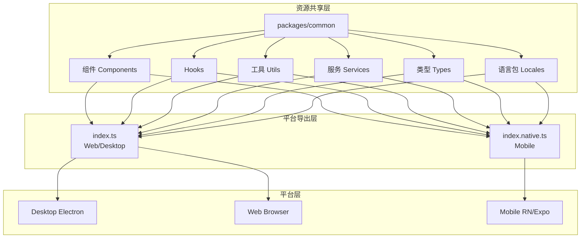

# 跨端资源共享设计方案

## 目录

- [一、方案概述](#一方案概述)
- [二、专业术语](#二专业术语)
- [三、整体架构](#三整体架构)
- [四、资源共享策略](#四资源共享策略)
- [五、平台适配方案](#五平台适配方案)
- [六、实现策略与最佳实践](#六实现策略与最佳实践)
- [七、注意事项](#七注意事项)
- [八、附录](#八附录)

---

## 一、方案概述

### 1.1 目标

本文档描述 Pixuli 项目中跨端（Web 端、Desktop 端、移动端）资源共享的设计方案，基于
`packages/common` 共享库的实现，用于：

- **代码复用**：最大化三端代码复用率，减少重复开发。
- **一致性**：保证三端功能与体验一致。
- **可维护性**：统一资源库，便于维护与更新。
- **类型安全**：通过完整 TypeScript 类型定义，确保跨端类型一致。

### 1.2 设计原则

- **分层设计**：业务逻辑层、适配层、平台层分离。
- **平台适配**：通过适配层与平台特定实现处理平台差异。
- **渐进增强**：基础功能通用，高级功能可按平台特定实现。
- **类型优先**：使用 TypeScript 确保类型安全。
- **纯函数原则**：组件实现为纯函数，通过 Props 获取外部数据，通过回调与外部通信。

### 1.3 范围

- 适用端：Web（Vite +
  React）、Desktop（Electron + 同一套 Web 代码）、Mobile（React Native +
  Expo）。
- 共享范围：组件、Hooks、工具函数、服务、类型定义、国际化语言包。
- 与
  [00-System-Design](./00-System-Design.md)、[02-cross-image-process](./02-cross-image-process.md)
  等设计文档配合使用。

---

## 二、专业术语

### 2.1 架构与平台术语

| 术语           | 英文                  | 说明                                                                          |
| -------------- | --------------------- | ----------------------------------------------------------------------------- |
| **资源共享层** | Shared Resource Layer | `packages/common` 内组件、Hooks、工具、服务、类型、语言包等可被多端引用的代码 |
| **平台导出层** | Export Layer          | 通过不同入口文件（如 `index.ts` / `index.native.ts`）向各平台导出对应实现     |
| **平台层**     | Platform Layer        | 实际运行环境：Desktop（Electron）、Web（Browser）、Mobile（React Native）     |
| **平台适配器** | Platform Adapter      | 抽象平台差异的接口与实现，如 `PlatformAdapter`，供服务层注入使用              |

### 2.2 组件与实现术语

| 术语                | 英文                    | 说明                                                                                        |
| ------------------- | ----------------------- | ------------------------------------------------------------------------------------------- |
| **Web 版本组件**    | Web Component           | 使用 HTML 元素（`<div>`, `<button>` 等）与 DOM API 的实现，供 Web/Desktop 使用              |
| **Native 版本组件** | Native Component        | 使用 React Native 组件（`<View>`, `<TouchableOpacity>` 等）与 RN API 的实现，供 Mobile 使用 |
| **共享代码**        | Shared Code             | 平台无关的类型、工具函数、Hooks，通常放在组件或模块下的 `common/` 目录                      |
| **纯函数组件**      | Pure Function Component | 不依赖外部可变状态，通过 Props 入参与回调出参与外部通信的组件                               |

---

## 三、整体架构

### 3.1 平台运行环境区分

Pixuli 三端运行环境可简化为两类：

| 类型                | 包含端                    | 共同特征                                                             |
| ------------------- | ------------------------- | -------------------------------------------------------------------- |
| **Web 端运行环境**  | PC 端（Electron）、Web 端 | 使用 HTML 元素与 DOM API；PC 端基于 Electron，本质为浏览器环境       |
| **React Native 端** | 移动端                    | 使用 RN 组件（`<View>`, `<TouchableOpacity>` 等）与 React Native API |

### 3.2 三层架构模型

跨端资源共享采用三层架构，通过 Monorepo 与 `packages/common` 实现：



### 3.3 目录结构

| 路径                  | 说明                                                                                |
| --------------------- | ----------------------------------------------------------------------------------- |
| `src/index.ts`        | Web/Desktop 平台入口，导出 Web 版本组件与共享能力                                   |
| `src/index.native.ts` | React Native 平台入口，由 Metro 解析，导出 Native 版本                              |
| `src/components/`     | 组件目录；平台特定组件含 `common/`、`web/`、`native/` 或 `.web.tsx` / `.native.tsx` |
| `src/hooks/`          | 共享或平台相关 Hooks                                                                |
| `src/utils/`          | 纯函数工具与平台适配工具                                                            |
| `src/services/`       | 存储服务、平台适配器接口与实现                                                      |
| `src/types/`          | 共享类型与平台相关类型                                                              |
| `src/locales/`        | 国际化 JSON 与加载逻辑                                                              |

```
packages/common/
├── src/
│   ├── index.ts
│   ├── index.native.ts
│   ├── components/
│   ├── hooks/
│   ├── utils/
│   ├── services/
│   ├── types/
│   └── locales/
└── package.json
```

---

## 四、资源共享策略

### 4.1 组件

#### 4.1.1 平台区分与实现原则

- **Web 端组件**：使用 HTML 元素与 DOM API。
- **React Native 端组件**：使用 RN 组件与 RN API。
- **纯函数原则**：组件通过 Props 获取数据，通过回调与外部通信；仅保留必要 UI 状态。

#### 4.1.2 组件分类

| 类型             | 说明                     | 实现方式                                                        |
| ---------------- | ------------------------ | --------------------------------------------------------------- |
| **完全共享逻辑** | 平台无关逻辑             | 抽到 `common/`：types、utils、hooks                             |
| **平台特定 UI**  | 因元素/API 不同需两套 UI | `.web.tsx` 与 `.native.tsx`，或 `web/` / `native/` 目录分别实现 |
| **导出**         | 各端使用各自入口         | `index.ts` 导出 Web 版，`index.native.ts` 导出 Native 版        |

#### 4.1.3 推荐目录结构（平台特定组件）

```
components/my-component/
├── common/
│   ├── types.ts
│   ├── utils.ts
│   └── hooks.ts
├── web/
│   └── MyComponent.web.tsx
└── native/
    └── MyComponent.native.tsx
```

### 4.2 工具函数

- **完全共享**：纯逻辑、不依赖平台 API（如 `filterUtils`、`sortUtils`）。
- **平台适配**：需文件、存储等平台能力时，通过参数注入平台适配器或平台特定实现。

### 4.3 服务层

- **平台适配器模式**：通过 `PlatformAdapter` 接口统一文件、存储、网络等差异。
- **依赖注入**：业务服务（如
  `GitHubStorageService`、`GiteeStorageService`）在构造函数中注入适配器。
- **统一接口**：对应用层暴露统一业务接口，隐藏平台差异。

### 4.4 Hooks

- **共享 Hooks**：纯逻辑、不依赖平台 API（如 `useInfiniteScroll`）。
- **平台相关 Hooks**：需平台 API 时提供平台特定实现或通过适配器调用（如
  `useKeyboard` 在 RN 端需特殊处理）。

### 4.5 类型定义

- **共享类型**：平台无关的接口与类型。
- **平台相关类型**：通过联合类型或条件类型区分（如 `File | string` 表示 Web
  File 与 Mobile URI）。

### 4.6 语言包

- **统一格式**：JSON；三端共用同一套 key 与文件。
- **动态加载**：支持运行时切换语言。

---

## 五、平台适配方案

### 5.1 平台特定导出

| 入口文件          | 使用端       | 说明                               |
| ----------------- | ------------ | ---------------------------------- |
| `index.ts`        | Web、Desktop | Vite/构建默认解析                  |
| `index.native.ts` | Mobile       | Metro bundler 按 `.native.ts` 解析 |

### 5.2 平台适配器

- **接口**：`PlatformAdapter` 定义文件大小、MIME 类型、图片尺寸等能力的抽象。
- **实现**：各端提供默认或自定义实现，在创建存储服务等时注入。
- **使用**：服务类通过构造函数接收适配器，内部统一调用接口方法。

### 5.3 平台差异对照（概要）

| 能力          | Web/Desktop                     | Mobile                     |
| ------------- | ------------------------------- | -------------------------- |
| 文件/图片输入 | `File`、DOM API                 | URI、`expo-file-system` 等 |
| 持久化配置    | `localStorage` / Electron store | `AsyncStorage`             |
| 网络          | `fetch` / Node `http`           | `fetch`                    |
| UI 与样式     | HTML + CSS                      | RN 组件 + `StyleSheet`     |
| 事件          | DOM 事件                        | RN 事件（`onPress` 等）    |

---

## 六、实现策略与最佳实践

### 6.1 组件实现

- **Props 设计**：数据 Props、回调 Props、配置 Props、必要时平台特定 Props。
- **共享代码提取**：类型、工具、Hooks 放入
  `common/`，避免在 web/native 中重复实现。
- **平台检测**：通过不同入口与构建配置区分平台，而非依赖运行时 UA 等检测。

### 6.2 代码组织

- 平台无关逻辑集中在 `common/`。
- 平台特定实现放在 `web/`、`native/` 或 `.web.tsx` / `.native.tsx`。
- 公共 API 在 `index.ts` / `index.native.ts` 中统一导出。

### 6.3 UI/UX 适配

- **Web/Desktop**：CSS 或 CSS-in-JS；键盘快捷键、DOM 事件。
- **React Native**：`StyleSheet.create`、主题与 `colorScheme`；触摸与 RN 事件。

---

## 七、注意事项

### 7.1 平台差异处理

- **API 差异**：文件系统、持久化、网络在各端实现方式不同，统一通过适配器或平台分支封装。
- **UI 差异**：组件库与样式系统不同，需分别实现 Web 与 Native 两套 UI，共享逻辑与数据层。

### 7.2 构建与依赖

- **Web/Desktop**：以 `index.ts` 为入口。
- **React Native**：Metro 配置使用 `index.native.ts`。
- **平台特定依赖**：通过 `peerDependencies` 或 `optionalDependencies`
  声明，避免在不需要的端打包。

### 7.3 测试

- 对 `common/` 下共享逻辑做单元测试。
- 对 Web 与 Native 组件分别做渲染/集成测试。

---

## 八、附录

### 8.1 代码复用统计（参考）

| 类别     | 共享比例（约）                 |
| -------- | ------------------------------ |
| 组件     | 60–70%（通过 common 与双实现） |
| 工具函数 | 约 90%                         |
| 服务层   | 约 80%（平台适配器封装差异）   |
| Hooks    | 约 70%                         |
| 类型定义 | 约 95%                         |
| 语言包   | 100%                           |

总体约 **75–80%** 代码在三端共享，其余为平台特定实现。

### 8.2 开发指南摘要

1. **新建平台特定组件**：创建目录 → 在 `common/` 定义类型与共享逻辑 → 在
   `web/`、`native/` 实现 UI → 在对应 index 中导出。
2. **新建平台适配器**：实现 `PlatformAdapter` 接口，在服务构造时注入。
3. **保持纯函数**：组件通过 Props 与回调通信，避免隐式依赖全局状态。

### 8.3 相关文档

- [00-System-Design - 整体系统设计](./00-System-Design.md)
- [02-cross-image-process - 跨端图片处理](./02-cross-image-process.md)
- [03-performance - 性能优化与监控](./03-performance.md)
