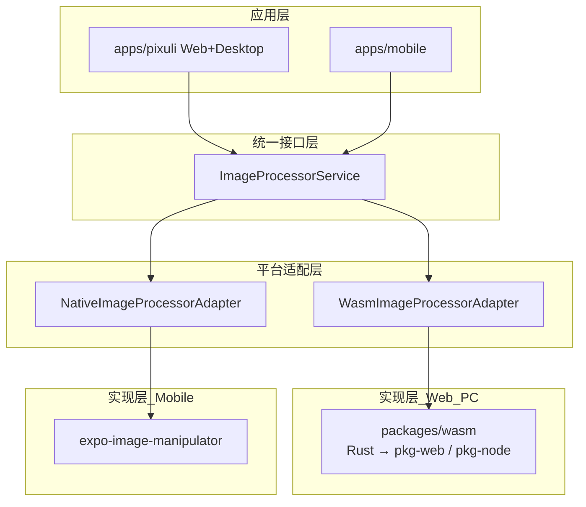
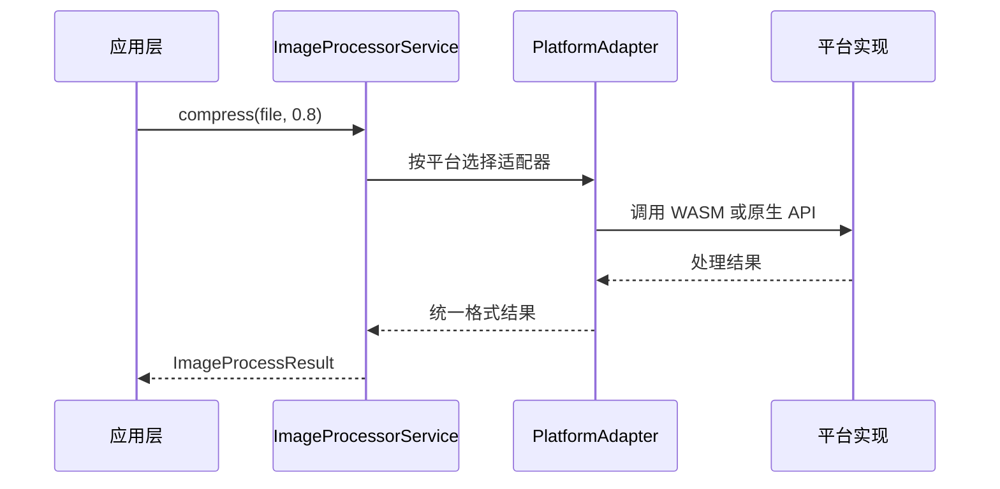

# 跨端高性能图片处理方案设计

## 目录

- [一、方案概述](#一方案概述)
- [二、专业术语](#二专业术语)
- [三、架构设计](#三架构设计)
- [四、功能模块](#四功能模块)
- [五、统一接口与平台适配](#五统一接口与平台适配)
- [六、技术栈与项目结构](#六技术栈与项目结构)
- [七、应用场景与性能](#七应用场景与性能)
- [八、注意事项与安全](#八注意事项与安全)
- [九、附录](#九附录)

---

## 一、方案概述

### 1.1 目标

本文档描述 Pixuli 跨端图片处理方案的设计，用于：

- **高性能**：Web/Desktop 使用 Rust +
  WASM，Mobile 使用原生实现，在各端达到较优性能与体积。
- **跨平台统一**：通过统一接口实现三端一致的 API，应用层无平台分支。
- **可维护与可扩展**：统一接口、实现分离，便于增加新功能或新平台。

### 1.2 设计原则

- **平台择优**：Web/PC 用 WASM（压缩、转换、编辑等），Mobile 用原生（如 expo-image-manipulator），不在一端勉强复用另一端实现。
- **统一接口**：通过 `ImageProcessorService`
  抽象对外 API，内部按平台选择适配器。
- **类型安全**：TypeScript 统一定义入参、出参与错误形态。
- **内存与错误可控**：WASM 侧利用 Rust 内存安全；各端统一错误格式与降级策略。

### 1.3 架构决策

| 决策                      | 说明                                                                                       |
| ------------------------- | ------------------------------------------------------------------------------------------ |
| **统一接口 + 平台适配器** | 应用层只依赖 `ImageProcessorService`；Web/PC 使用 Wasm 适配器，Mobile 使用 Native 适配器。 |
| **Web/PC 使用 WASM**      | Rust 编译为 WASM，供浏览器与 Electron（含主进程 Node）调用；高性能、格式与算法可控。       |
| **Mobile 使用原生**       | 不引入 WASM，使用 expo-image-manipulator 等，减小体积、避免 WASM 加载与兼容成本。          |

**优势**：性能与体积在各端均较优；接口统一、实现分离，维护与扩展成本可控。

---

## 二、专业术语

### 2.1 图片处理术语

| 术语                      | 英文                  | 说明                                                                                            |
| ------------------------- | --------------------- | ----------------------------------------------------------------------------------------------- |
| **WASM**                  | WebAssembly           | 由 Rust 等编译得到的二进制模块，在 Web/Node 中运行，用于高性能计算                              |
| **平台适配器**            | Platform Adapter      | 实现统一图片处理接口的某一端具体逻辑，如 WasmImageProcessorAdapter、NativeImageProcessorAdapter |
| **ImageProcessorService** | ImageProcessorService | 对外统一图片处理 API 的抽象，内部按平台选择适配器                                               |
| **压缩**                  | Compression           | 在可接受画质下减小文件体积（如质量参数、WebP/JPEG 编码）                                        |
| **格式转换**              | Format Conversion     | 解码后以另一种编码输出（如 PNG→JPEG、JPEG→WebP）                                                |

### 2.2 平台与实现术语

| 术语                       | 英文                   | 说明                                                                          |
| -------------------------- | ---------------------- | ----------------------------------------------------------------------------- |
| **pkg-web**                | Web build              | wasm-pack 以 `--target web` 产出的 WASM 包，供浏览器使用                      |
| **pkg-node**               | Node build             | wasm-pack 以 `--target nodejs` 产出的 WASM 包，供 Electron 主进程或 Node 使用 |
| **expo-image-manipulator** | Expo Image Manipulator | Expo 提供的图片裁剪、旋转、缩放、格式等原生能力，供 Mobile 使用               |

---

## 三、架构设计

### 3.1 整体架构图

### 3.2 平台适配流程

### 3.3 平台支持策略

| 端                     | 实现                     | 入口/适配器                 |
| ---------------------- | ------------------------ | --------------------------- |
| Web / Desktop 渲染进程 | packages/wasm (pkg-web)  | WasmImageProcessorAdapter   |
| Desktop 主进程         | packages/wasm (pkg-node) | WasmImageProcessorAdapter   |
| Mobile                 | expo-image-manipulator   | NativeImageProcessorAdapter |

---

## 四、功能模块

### 4.1 压缩 (compress)

| 能力      | Web/PC                                                                  | Mobile              |
| --------- | ----------------------------------------------------------------------- | ------------------- |
| WebP 压缩 | WASM（当前 WebP 在 WASM 中受限于纯 Rust 实现，见 packages/wasm README） | JPEG/PNG 等质量压缩 |
| 质量控制  | 支持                                                                    | 支持                |
| 批量压缩  | 支持                                                                    | 支持                |
| 压缩统计  | 大小、压缩率等                                                          | 同左                |

### 4.2 格式转换 (convert)

| 能力     | Web/PC                                     | Mobile          |
| -------- | ------------------------------------------ | --------------- |
| 多格式   | JPEG、PNG、WebP、GIF、BMP、TIFF 等（WASM） | JPEG、PNG、WebP |
| 尺寸调整 | 支持，可保持宽高比                         | 支持            |
| 批量转换 | 支持                                       | 支持            |

### 4.3 图片分析 (analyze)

| 能力     | Web/PC                                                                   | Mobile     |
| -------- | ------------------------------------------------------------------------ | ---------- |
| 基础信息 | 尺寸、格式、通道数、主色等                                               | 基础信息   |
| AI 分析  | 对象检测、场景识别、标签/描述生成等（Desktop 另见 aiService、Dify 设计） | 可选或降级 |

### 4.4 图片编辑 (edit)

| 能力        | Web/PC                                     | Mobile       |
| ----------- | ------------------------------------------ | ------------ |
| 裁剪        | 矩形、宽高比、可选智能裁剪                 | 矩形、宽高比 |
| 旋转 / 翻转 | 任意角度、90° 步进、水平/垂直翻转          | 支持         |
| 滤镜        | 亮度、对比度、饱和度、模糊、锐化等（WASM） | 依原生能力   |
| 批量编辑    | 支持                                       | 支持         |

---

## 五、统一接口与平台适配

### 5.1 接口定义（概要）

统一服务对外提供以下能力（具体签名以代码为准）：

| 方法                                               | 说明                               |
| -------------------------------------------------- | ---------------------------------- |
| `compress(input, quality)`                         | 压缩图片，返回统一结果格式         |
| `convertFormat(input, format, quality?)`           | 格式转换                           |
| `crop(input, region)`                              | 按区域裁剪                         |
| `rotate(input, degrees)`                           | 旋转                               |
| `resize(input, width?, height?, keepAspectRatio?)` | 尺寸调整                           |
| `process(input, options)`                          | 综合处理（质量、格式、尺寸等组合） |
| `getInfo(input)`                                   | 获取图片基本信息                   |

输入类型：Web/PC 多为 `File` 或二进制；Mobile 多为 `string`（URI）。接口设计为
`File | string` 或适配器内做转换。输出统一包含
`uri`（或等效）及元数据，便于各端上传或展示。

### 5.2 平台适配器职责

| 适配器                          | 职责                                                                                          |
| ------------------------------- | --------------------------------------------------------------------------------------------- |
| **WasmImageProcessorAdapter**   | 调用 pixuli-wasm；将 File/二进制与 WASM 互转；将结果转为统一结构（如 Data URL 或 Blob URL）。 |
| **NativeImageProcessorAdapter** | 调用 expo-image-manipulator；输入输出为 URI；返回统一结构（uri 等）。                         |

---

## 六、技术栈与项目结构

### 6.1 技术栈

| 端         | 核心技术                                                                                          |
| ---------- | ------------------------------------------------------------------------------------------------- |
| **Web/PC** | Rust、wasm-bindgen、image-rs、wasm-pack；可选 webp、ort（ONNX）、ndarray 等（见 packages/wasm）。 |
| **Mobile** | expo-image-manipulator、expo-file-system 等。                                                     |

### 6.2 项目结构（概要）

| 路径                                     | 说明                                                   |
| ---------------------------------------- | ------------------------------------------------------ |
| `packages/common/src/services/`          | ImageProcessorService 统一接口及工厂/平台选择逻辑      |
| `packages/common/src/services/adapters/` | WasmImageProcessorAdapter、NativeImageProcessorAdapter |
| `packages/wasm/src/`                     | Rust 源码：compress、convert、analyze、edit 等         |
| `packages/wasm/pkg-web/`、`pkg-node/`    | wasm-pack 构建产物                                     |

---

## 七、应用场景与性能

### 7.1 典型场景

| 场景               | 说明               | 平台实现                       |
| ------------------ | ------------------ | ------------------------------ |
| 上传前压缩         | 减少上传体积与时间 | 三端均支持，实现不同           |
| 格式统一           | 批量转为目标格式   | WASM / 原生                    |
| 尺寸调整           | 缩略图或固定最大边 | 同上                           |
| 基础信息 / AI 分析 | 元数据与标签、描述 | Web/PC 完整，Mobile 基础或可选 |

### 7.2 性能与限制（参考）

| 端                | 优势                         | 限制                          |
| ----------------- | ---------------------------- | ----------------------------- |
| **Web/PC (WASM)** | 高性能、多格式、可扩展 AI    | 模块体积与首次加载/初始化时间 |
| **Mobile (原生)** | 体积小、无 WASM 加载、启动快 | 格式与高级功能相对受限        |

具体性能指标（如单张 2MB 处理时间、压缩率）见 [九、附录](#九附录)。

---

## 八、注意事项与安全

### 8.1 平台差异

- **输入**：Web/PC 多为 `File` 或 ArrayBuffer；Mobile 为 URI。适配器内部做转换。
- **输出**：统一为带 `uri`（或等效）的结果结构，各端按需转为上传或展示格式。
- **功能差异**：AI 分析、部分滤镜与格式以 Web/PC 为主；Mobile 可降级或隐藏。

### 8.2 错误与降级

- 统一错误类型与错误信息，便于日志与用户提示。
- 某端或某功能不可用时，返回明确错误或降级到基础能力。

### 8.3 安全与健壮性

- **输入校验**：格式、大小、参数范围（如 quality 0–1）在接口或适配器内校验。
- **内存**：WASM 侧依赖 Rust 与 WASM 边界；Mobile 侧及时释放大对象。
- **测试**：接口级测试、各平台适配器测试、集成与性能基准（见 benchmark/）。

---

## 九、附录

### 9.1 性能指标（参考）

以下为设计目标或典型值，实际以 benchmark 与真机为准：

| 指标              | Web/PC (WASM)     | Mobile (原生)   |
| ----------------- | ----------------- | --------------- |
| 单张 2MB 压缩     | &lt; 100ms 量级   | &lt; 150ms 量级 |
| 单张 2MB 格式转换 | &lt; 150ms 量级   | &lt; 200ms 量级 |
| 基础信息获取      | &lt; 10ms 量级    | &lt; 50ms 量级  |
| 批量处理          | 支持并发/批量 API | 支持批量        |

### 9.2 最佳实践摘要

- **统一接口**：业务只依赖 ImageProcessorService，不直接依赖 WASM 或原生模块。
- **预加载**：Web/Desktop 可在应用启动时预加载 WASM，减少首次调用延迟。
- **错误与日志**：使用统一错误格式，并接入
  [04-cross-platform-logging](./04-cross-platform-logging.md) 便于排查。

### 9.3 相关文档

- [00-System-Design - 整体系统设计](./00-System-Design.md)
- [01-cross-platform-resources - 跨端资源共享](./01-cross-platform-resources.md)
- [05-Dify-Integration-And-Image-Processing-Design - Dify 与图片处理选型](./05-Dify-Integration-And-Image-Processing-Design.md)
- [packages/wasm README](../../packages/wasm/README.md) - WASM 构建与现状
