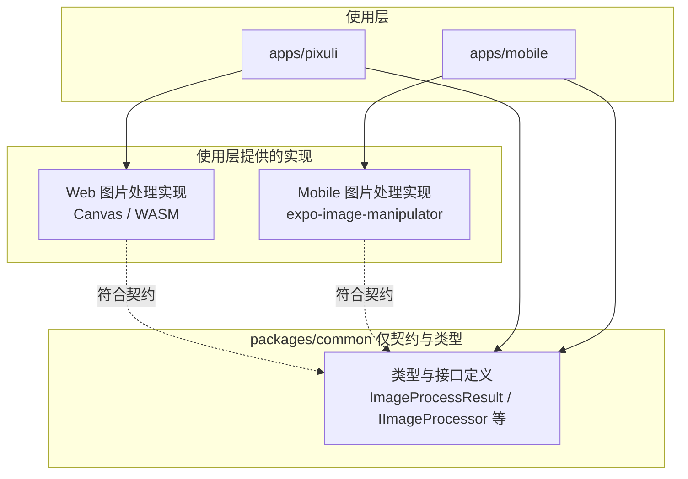
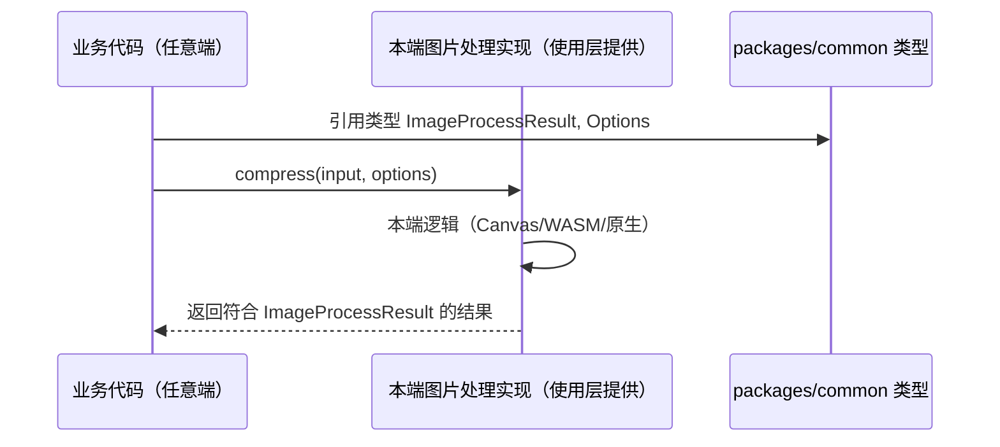

# 跨端图片处理方案设计

## 目录

- [一、方案定位与原则](#一方案定位与原则)
- [二、common 的职责：只做数据格式与契约](#二common-的职责只做数据格式与契约)
- [三、使用层的职责：提供符合契约的实现](#三使用层的职责提供符合契约的实现)
- [四、架构设计](#四架构设计)
- [五、契约定义（方法签名与数据类型）](#五契约定义方法签名与数据类型)
- [六、当前实现情况](#六当前实现情况)
- [七、迁移方案](#七迁移方案)
- [八、技术栈与项目结构](#八技术栈与项目结构)
- [九、附录](#九附录)

---

## 一、方案定位与原则

### 1.1 目标

本方案约定 Pixuli **三端（Web、Desktop、Mobile）**
的图片处理在**数据格式与调用契约上统一**，但**具体处理逻辑由各端自行实现**：

- **packages/common**：**不包含**任何平台相关的图片处理逻辑（不调用 Canvas、WASM、expo 等）。只负责**数据格式的统一与维护**，以及**方法签名与返回值的契约定义**。
- **使用层（各端应用）**：各自提供符合 common 契约的**图片处理工具函数/实现**（如压缩、格式转换），内部可使用 Canvas、WASM、expo-image-manipulator 等；调用方统一使用 common 定义的类型与契约，保证入参、出参一致。

### 1.2 设计原则

- **common 不关心平台**：common 层不依赖、不实现任何具体平台的图片处理能力，只定义「入参是什么、出参是什么、方法长什么样」。
- **使用层提供实现**：各端在各自工程内实现图片处理逻辑，并保证满足 common 规定的接口与返回值类型（如
  `ImageProcessResult`）。
- **类型与契约在 common 维护**：所有三端共用的类型（Options、Result）、以及「处理器」的接口形状（如
  `compress(input, options): Promise<ImageProcessResult>`）仅在 common 定义与演进，保证三端数据格式统一。

---

## 二、common 的职责：只做数据格式与契约

### 2.1 只做两件事

| 职责                     | 说明                                                                                                                                                                                                                 |
| ------------------------ | -------------------------------------------------------------------------------------------------------------------------------------------------------------------------------------------------------------------- |
| **数据格式的统一与维护** | 在 packages/common 中定义并导出所有图片处理相关的**类型**：如 `ImageProcessResult`、`ImageCompressionOptions`、`ImageConversionOptions`、`OutputMimeType` 等。三端均从 common 引用这些类型，保证入参、出参结构一致。 |
| **方法契约的定义**       | 在 common 中定义**处理器接口**（如 `IImageProcessor`）：规定 `compress`、`convert` 等方法的**方法名、参数类型、返回值类型**。不包含任何实现；具体实现由使用层提供。                                                  |

### 2.2 common 不做什么

- **不实现**压缩、转换、裁剪等具体算法或调用（不调用 Canvas、WASM、expo-image-manipulator）。
- **不选择**运行在哪个平台、用哪种技术；不包含「Web 适配器」「Native 适配器」等平台分支逻辑。
- **不依赖**各端运行环境（不依赖 DOM、Node、React
  Native 等），仅提供纯类型与接口定义，以便各端引用。

---

## 三、使用层的职责：提供符合契约的实现

### 3.1 使用层需要提供什么

各端应用（apps/pixuli、apps/mobile 等）需要**自己实现**图片处理逻辑，并对外暴露符合 common 契约的**图片处理工具**：

- **方法签名**：与 common 定义的接口一致（例如
  `compress(input, options): Promise<ImageProcessResult>`）。
- **返回值**：必须符合 common 定义的
  `ImageProcessResult`（或契约规定的其他类型），便于上游业务统一处理（展示、上传、统计等）。

### 3.2 各端可采用的实现方式

| 端            | 实现方式（由使用层自行选择） | 说明                                                                                                                    |
| ------------- | ---------------------------- | ----------------------------------------------------------------------------------------------------------------------- |
| Web / Desktop | Canvas API、或 packages/wasm | 在 apps/pixuli（或对应工程）内实现，接收 `File` 等，返回 `ImageProcessResult`。                                         |
| Mobile        | expo-image-manipulator 等    | 在 apps/mobile 内实现，接收 URI 等，返回与 common 约定一致的 `ImageProcessResult`（如 uri、尺寸、大小、压缩率等字段）。 |

- common 不关心各端内部用 Canvas 还是 WASM 还是原生；只要**入参、出参符合 common 的契约**即可。

### 3.3 使用方式（建议）

- 各端在应用入口或模块内**注册/注入**本端的图片处理实现（例如通过 Context、DI 或单例），业务代码统一调用「当前端的处理器」，而不写
  `if (web) ... else if (mobile) ...`。
- 业务层只依赖 **common 的类型**（从 common 导入
  `ImageProcessResult`、Options 等），以及**本端提供的、符合契约的处理器实例**（从本端模块或 Context 获取）。

---

## 四、架构设计

### 4.1 整体架构（common 仅契约与类型，实现在使用层）

```mermaid
graph TB
    subgraph 使用层
        A1[apps/pixuli]
        A2[apps/mobile]
    end

    subgraph 使用层提供的实现
        B1[Web 图片处理实现<br/>Canvas / WASM]
        B2[Mobile 图片处理实现<br/>expo-image-manipulator]
    end

    subgraph packages/common 仅契约与类型
        C[类型与接口定义<br/>ImageProcessResult / IImageProcessor 等]
    end

    A1 --> B1
    A2 --> B2
    B1 -.符合契约.-> C
    B2 -.符合契约.-> C
    A1 --> C
    A2 --> C
```

- **common**：只提供 C（类型 + 接口契约）；不包含 B1/B2。
- **使用层**：A1/A2 引用 common 的类型；B1/B2 由各端实现并满足 C 的契约。

### 4.2 调用关系

```mermaid
sequenceDiagram
    participant Biz as 业务代码（任意端）
    participant Impl as 本端图片处理实现（使用层提供）
    participant Common as packages/common 类型

    Biz->>Common: 引用类型 ImageProcessResult, Options
    Biz->>Impl: compress(input, options)
    Impl->>Impl: 本端逻辑（Canvas/WASM/原生）
    Impl-->>Biz: 返回符合 ImageProcessResult 的结果
```

- 业务代码依赖 common 的**类型**，调用**本端提供的**处理器实现；common 不参与具体调用链。

---

## 五、契约定义（方法签名与数据类型）

### 5.1 统一类型（common 定义并维护）

以下类型在 **packages/common** 中定义，三端共用：

- **ImageProcessResult**：统一结果结构
  - `uri`、`blob`/`file`（可选）、`originalSize`、`processedSize`、`compressionRatio`、`width`、`height`、`originalWidth`、`originalHeight`、`mimeType`
    等。
- **ImageCompressionOptions**：压缩选项（quality、maxWidth、maxHeight、outputFormat、minSizeToCompress 等）。
- **ImageConversionOptions**：转换选项（quality、maxWidth、maxHeight、maintainAspectRatio 等）。
- **OutputMimeType**：支持的输出 MIME（如
  `'image/jpeg' | 'image/png' | 'image/webp'`）。

### 5.2 处理器接口（common 定义，使用层实现）

common 中可定义**接口**（无实现），规定使用层必须提供的方法形状，例如：

| 方法                               | 约定                                                                                                   |
| ---------------------------------- | ------------------------------------------------------------------------------------------------------ |
| `compress(input, options)`         | 入参：`File \| string`（或扩展）+ `ImageCompressionOptions`；返回：`Promise<ImageProcessResult>`。     |
| `convert(input, format, options?)` | 入参：`File \| string`、目标格式、可选 `ImageConversionOptions`；返回：`Promise<ImageProcessResult>`。 |

- 输入：各端可接受 `File`（Web/Desktop）或
  `string`（URI，Mobile）；实现内部自行处理类型差异。
- 输出：**必须**符合 common 的 `ImageProcessResult`，便于三端业务统一使用。

### 5.3 输入输出约定（非流式）

- **整图处理**：当前约定为整图读入、整图输出，不做流式。
- **输入**：`File | string`（或各端约定扩展类型），由使用层实现自行解析。
- **输出**：统一为 `ImageProcessResult`；Web 侧可为 Blob URL +
  File，Mobile 侧为本地 file URI，但字段名与含义一致。

---

## 六、当前实现情况

### 6.1 packages/common 现状

| 项目                   | 位置                                           | 说明                                                                                                                                                        |
| ---------------------- | ---------------------------------------------- | ----------------------------------------------------------------------------------------------------------------------------------------------------------- |
| **类型**               | `packages/common/src/types/image.ts`           | `ImageCompressionOptions`、`ImageProcessResult`、`ImageConversionOptions`、`OutputMimeType` 等已定义并导出，**符合「common 只做数据格式」**。               |
| **Web 实现（待迁出）** | `packages/common/src/services/imageProcessor/` | 当前存在 `WebImageProcessorService`（Canvas 实现）。按新逻辑，**具体处理逻辑不应放在 common**；应视为过渡实现，目标迁至使用层（见迁移方案）。               |
| **工具**               | `packages/common/src/utils/imageUtils.ts`      | `compressImage`、`getImageDimensions` 等内含 Canvas 逻辑，同样属于「具体实现」；若需统一契约，应由使用层提供实现，common 仅保留与契约相关的类型或工具类型。 |

### 6.2 各端使用情况

| 端              | 当前状态                                                                                                                                                                       |
| --------------- | ------------------------------------------------------------------------------------------------------------------------------------------------------------------------------ |
| **apps/pixuli** | 压缩页、转换页使用 common 的 `webImageProcessorService`（实现在 common 内）；上传组件等使用 `compressImage`。按新逻辑，这些实现应迁至 apps/pixuli，并实现 common 的接口契约。  |
| **apps/mobile** | 使用 **apps/mobile/utils/imageUtils.ts** 的 `processImage(uri, options)`；返回形态与 common 的 `ImageProcessResult` 不完全一致。需在 mobile 层封装为符合 common 契约的返回值。 |

### 6.3 与目标架构的差距

- common 内仍有**具体图片处理实现**（Web 用 Canvas）；目标为 common
  **仅保留类型与契约**，实现全部在使用层。
- 使用层尚未统一「注入符合 common 契约的处理器」；部分仍直接依赖 common 内的实现或各端私有 utils。

---

## 七、迁移方案

### 7.1 目标状态

- **common**：仅包含图片处理相关的**类型**与**接口契约**（如
  `IImageProcessor`）；**不包含**任何具体实现（无 Canvas、WASM、expo 调用）。
- **使用层**：各端提供符合 common 契约的图片处理工具函数/对象，业务代码通过本端注入的处理器调用，并统一使用 common 的类型。

### 7.2 阶段一：在 common 中明确契约，收敛实现

- 在 common 中**正式定义**处理器接口（如
  `IImageProcessor`）：仅方法签名与返回值类型，无实现。
- **保留**
  common 内现有类型（`ImageProcessResult`、Options 等），确保三端继续从 common 引用。
- 将 common 内现有的 **Web 实现**（`WebImageProcessorService` /
  `webImageProcessorService`）**迁出**至
  **apps/pixuli**（或 Web/Desktop 专用包）：在 apps/pixuli 中实现
  `IImageProcessor`，内部使用 Canvas 或 WASM，返回 `ImageProcessResult`。
- apps/pixuli 的压缩页、转换页、上传组件等改为使用**本端提供的**处理器实例（来自 apps/pixuli），不再从 common 导入具体实现。

### 7.3 阶段二：使用层统一注入与调用

- **apps/pixuli**：在应用内注册/注入本端图片处理器（实现 common 的
  `IImageProcessor`）；业务代码通过 Context 或单例获取该处理器并调用
  `compress`、`convert` 等。
- **apps/mobile**：在应用内实现符合 common 契约的处理器（内部仍可用
  `processImage` / expo-image-manipulator），将返回值映射为 common 的
  `ImageProcessResult`；同样通过注入方式供业务使用。
- 两端的业务代码**只依赖**
  common 的类型与接口定义，以及**本端注入的处理器**，不依赖对端的实现或 common 内的具体逻辑。

### 7.4 阶段三：清理 common 中的实现代码

- 从 packages/common 中**移除**图片处理的具体实现（如
  `webImageProcessor.ts`、以及 utils 中纯图片处理相关的实现）；若存在仅被 Web 使用的工具（如
  `calculateDisplayDimensions`），可迁至 apps/pixuli 或保留为「与契约无直接关系的工具」并在文档中说明。
- common 仅保留：类型定义、处理器接口定义、以及必要的文档说明契约与使用方式。

### 7.5 迁移检查清单

- [ ] common 中定义并导出
      `IImageProcessor`（或等价接口），仅方法签名与类型，无实现。
- [ ] common 中移除或迁出所有具体图片处理实现（Canvas/WASM/expo 等）。
- [ ] apps/pixuli 实现并注入符合契约的 Web/Desktop 图片处理器；压缩页、转换页、上传等改为使用该处理器。
- [ ] apps/mobile 实现并注入符合契约的图片处理器，返回
      `ImageProcessResult`；业务改为使用该处理器。
- [ ] 三端业务仅依赖 common 的类型与契约，以及本端提供的处理器；无跨端实现依赖。

---

## 八、技术栈与项目结构

### 8.1 common 内保留内容（目标）

| 路径                                                     | 内容                                                                                                   |
| -------------------------------------------------------- | ------------------------------------------------------------------------------------------------------ |
| `packages/common/src/types/image.ts`                     | 类型：`ImageProcessResult`、`ImageCompressionOptions`、`ImageConversionOptions`、`OutputMimeType` 等。 |
| `packages/common/src/services/imageProcessor/`（或等价） | 仅**接口定义**（如 `IImageProcessor`）、以及导出类型；无具体实现文件。                                 |

### 8.2 使用层各端

| 端          | 实现位置（建议）                      | 实现方式                                                                                |
| ----------- | ------------------------------------- | --------------------------------------------------------------------------------------- |
| Web/Desktop | apps/pixuli 或 packages 下 Web 专用包 | Canvas API 或 packages/wasm，实现 `IImageProcessor`，返回 `ImageProcessResult`。        |
| Mobile      | apps/mobile                           | expo-image-manipulator 等，封装为符合 `IImageProcessor` 的接口与 `ImageProcessResult`。 |

---

## 九、附录

### 9.1 专业术语

| 术语                   | 说明                                                                           |
| ---------------------- | ------------------------------------------------------------------------------ |
| **契约**               | common 中定义的方法签名与数据类型；使用层实现必须满足的接口与返回值形状。      |
| **ImageProcessResult** | common 定义并维护的统一结果类型；各端实现必须返回符合该结构的对象。            |
| **使用层**             | 各端应用（apps/pixuli、apps/mobile）；负责提供符合 common 契约的图片处理实现。 |

### 9.2 为何 common 不做具体实现

- **平台差异大**：Web（Canvas/WASM）、Mobile（原生）依赖不同运行时与依赖，若实现放在 common，common 会依赖多套环境或需要大量条件分支，违背「common 只做类型与契约」的边界。
- **依赖与体积**：具体实现会引入 Canvas、WASM、expo 等依赖，不利于 common 保持轻量、可被任意端引用。
- **职责清晰**：common 只负责「数据长什么样、方法叫什么、返回什么」；「怎么算」由使用层各端自行负责，便于各端选型与优化。

### 9.3 相关文档

- [00-System-Design - 整体系统设计](./00-System-Design.md)
- [01-cross-platform-resources - 跨端资源共享](./01-cross-platform-resources.md)
- [05-Dify-Integration-And-Image-Processing-Design - Dify 与图片处理选型](./05-Dify-Integration-And-Image-Processing-Design.md)
- [packages/wasm README](../../packages/wasm/README.md) - WASM 构建与现状
