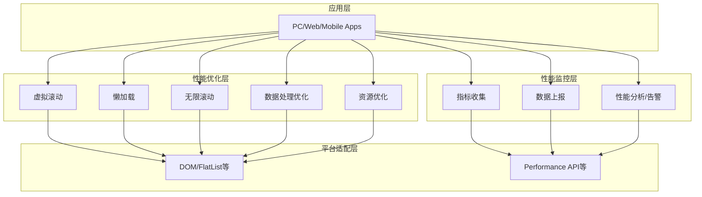

# 性能优化与监控设计方案

## 目录

- [一、方案概述](#一方案概述)
- [二、专业术语](#二专业术语)
- [三、架构设计](#三架构设计)
- [四、性能优化策略](#四性能优化策略)
- [五、性能监控策略](#五性能监控策略)
- [六、跨平台适配](#六跨平台适配)
- [七、注意事项](#七注意事项)
- [八、附录](#八附录)

---

## 一、方案概述

### 1.1 目标

本文档描述 Pixuli 跨平台（Web、Desktop、Mobile）的性能优化与性能监控方案，用于：

- **性能优化**：提升加载时间、渲染性能与内存使用，保持 UI 流畅。
- **性能监控**：采集、上报与展示关键性能指标，便于发现与定位问题。
- **跨平台支持**：在 PC（Electron）、Web、移动端（React
  Native）提供一致优化与监控能力。

### 1.2 解决的问题

| 问题       | 说明                                               |
| ---------- | -------------------------------------------------- |
| 渲染性能   | 大量 DOM/组件导致渲染下降，需虚拟滚动、懒加载等    |
| 内存占用   | 大量数据同时加载易导致溢出，需分页、缓存与释放策略 |
| 主线程阻塞 | 数据处理阻塞 UI，需 Worker/后台线程与异步处理      |
| 性能可见性 | 缺乏监控难以定位瓶颈，需指标采集与可视化           |

### 1.3 范围

- 优化对象：列表渲染（虚拟滚动、懒加载、无限滚动）、数据处理（Worker/后台线程）、资源与代码分割。
- 监控对象：渲染（FPS、渲染时间）、加载（首屏、资源）、内存、网络、交互响应。
- 与
  [02-cross-image-process](./02-cross-image-process.md)、[04-cross-platform-logging](./04-cross-platform-logging.md)
  等配合使用。

---

## 二、专业术语

### 2.1 性能优化术语

| 术语           | 英文            | 说明                                              |
| -------------- | --------------- | ------------------------------------------------- |
| **虚拟滚动**   | Virtual Scroll  | 仅渲染视口内及缓冲区内的列表项，减少 DOM/组件数量 |
| **懒加载**     | Lazy Load       | 在元素进入视口时再加载资源（如图片、组件）        |
| **无限滚动**   | Infinite Scroll | 滚动到底部时自动加载下一页数据                    |
| **Web Worker** | Web Worker      | 浏览器后台线程，用于执行耗时计算而不阻塞主线程    |

### 2.2 性能监控术语

| 术语         | 英文              | 说明                                    |
| ------------ | ----------------- | --------------------------------------- |
| **FPS**      | Frames Per Second | 每秒渲染帧数，用于衡量流畅度            |
| **首屏渲染** | First Paint / FCP | 首屏内容首次绘制完成的时间              |
| **长任务**   | Long Task         | 阻塞主线程超过一定阈值（如 50ms）的任务 |
| **性能面板** | Performance Panel | 用于展示性能指标与趋势的 UI 组件        |

---

## 三、架构设计

### 3.1 整体分层

### 3.2 共享逻辑与平台实现

| 层级                | 内容                               | 说明                                                         |
| ------------------- | ---------------------------------- | ------------------------------------------------------------ |
| **packages/common** | Hooks、工具函数                    | 如 useVirtualScroll、useInfiniteScroll、useLazyLoad 的逻辑层 |
| **PC/Web**          | DOM API、Web Worker                | 虚拟列表用 DOM；数据处理用 Worker                            |
| **Mobile**          | FlatList/VirtualizedList、后台线程 | 使用 RN 虚拟列表与原生能力                                   |

---

## 四、性能优化策略

### 4.1 虚拟滚动

| 端         | 实现要点                                                                       |
| ---------- | ------------------------------------------------------------------------------ |
| **PC/Web** | 仅渲染可见区域 + 缓冲区；固定高度或动态高度；ResizeObserver 监听容器；滚动防抖 |
| **Mobile** | FlatList/VirtualizedList；getItemLayout、windowSize、removeClippedSubviews     |

### 4.2 懒加载

| 端         | 实现要点                                                                           |
| ---------- | ---------------------------------------------------------------------------------- |
| **PC/Web** | Intersection Observer 检测可见性；rootMargin 预加载；占位符；缩略图 + 点击加载原图 |
| **Mobile** | onViewableItemsChanged、viewabilityConfig；占位符与图片尺寸优化                    |

### 4.3 无限滚动

- 分页大小与加载阈值合理设置；防抖避免频繁触发；加载状态与重置机制。

### 4.4 数据处理优化

| 端         | 实现要点                                                             |
| ---------- | -------------------------------------------------------------------- |
| **PC/Web** | Web Worker 中过滤/排序/分页；Transferable 减少拷贝；可选用 Worker 池 |
| **Mobile** | 后台线程处理；批量处理与结果缓存                                     |

### 4.5 资源优化

- 图片：压缩、格式、尺寸（与
  [02-cross-image-process](./02-cross-image-process.md) 衔接）。
- 代码分割与按需加载；关键资源预加载；缓存策略（Electron/Service
  Worker/AsyncStorage 等）。

---

## 五、性能监控策略

### 5.1 指标收集

| 类别 | 指标示例                                   |
| ---- | ------------------------------------------ |
| 渲染 | FPS、单帧渲染时间、长任务                  |
| 加载 | 页面加载时间、首屏渲染、资源加载、DOM 就绪 |
| 内存 | 占用、峰值、泄漏检测、GC                   |
| 网络 | 请求耗时、传输大小、缓存命中率、错误率     |
| 交互 | 点击响应时间、滚动流畅度、输入延迟         |

### 5.2 上报与分析

- **上报**：实时上报关键指标；非关键可批量或采样；错误单独上报。
- **分析**：性能面板可视化；历史对比与趋势；异常告警。

### 5.3 平台适配

| 端         | 采集方式                                                 |
| ---------- | -------------------------------------------------------- |
| **PC/Web** | Performance API、Memory API、Navigation Timing、Fetch 等 |
| **Mobile** | RN 性能 API、原生性能接口或 JSI                          |

---

## 六、跨平台适配

### 6.1 虚拟滚动适配

- **PC/Web**：基于 scrollTop 与容器高度计算可见范围，绝对定位渲染可见项。
- **Mobile**：FlatList/VirtualizedList + getItemLayout、windowSize。

### 6.2 懒加载适配

- **PC/Web**：IntersectionObserver + rootMargin。
- **Mobile**：onViewableItemsChanged + viewabilityConfig。

### 6.3 数据处理与监控适配

- **PC/Web**：Web Worker + postMessage；Performance/Memory API。
- **Mobile**：后台线程；RN 或原生性能 API。

---

## 七、注意事项

### 7.1 跨平台差异

- 各端性能特征不同（PC 最强、移动端需更省内存与电量），优化策略需区分。
- 监控采样频率与上报量需控制，避免影响性能与隐私。

### 7.2 性能目标（参考）

| 类别 | 目标示例                             |
| ---- | ------------------------------------ |
| 加载 | 首屏 &lt; 1s，页面 &lt; 3s           |
| 渲染 | FPS &gt; 55，长任务 &lt; 50ms        |
| 内存 | 占用与峰值可控，无泄漏               |
| 网络 | 请求 &lt; 500ms，缓存命中率 &gt; 80% |

### 7.3 隐私与开关

- 避免上报敏感数据；可按用户同意与开关控制监控；上报数据可加密。

---

## 八、附录

### 8.1 性能基准（参考）

- 大数据列表：虚拟列表初始节点数 &lt; 50，滚动 FPS &gt; 55。
- 图片处理：单张 &lt; 200ms，批量吞吐与内存见
  [02-cross-image-process](./02-cross-image-process.md)。

### 8.2 相关文档

- [00-System-Design - 整体系统设计](./00-System-Design.md)
- [02-cross-image-process - 跨端图片处理](./02-cross-image-process.md)
- [04-cross-platform-logging - 跨端日志收集](./04-cross-platform-logging.md)
