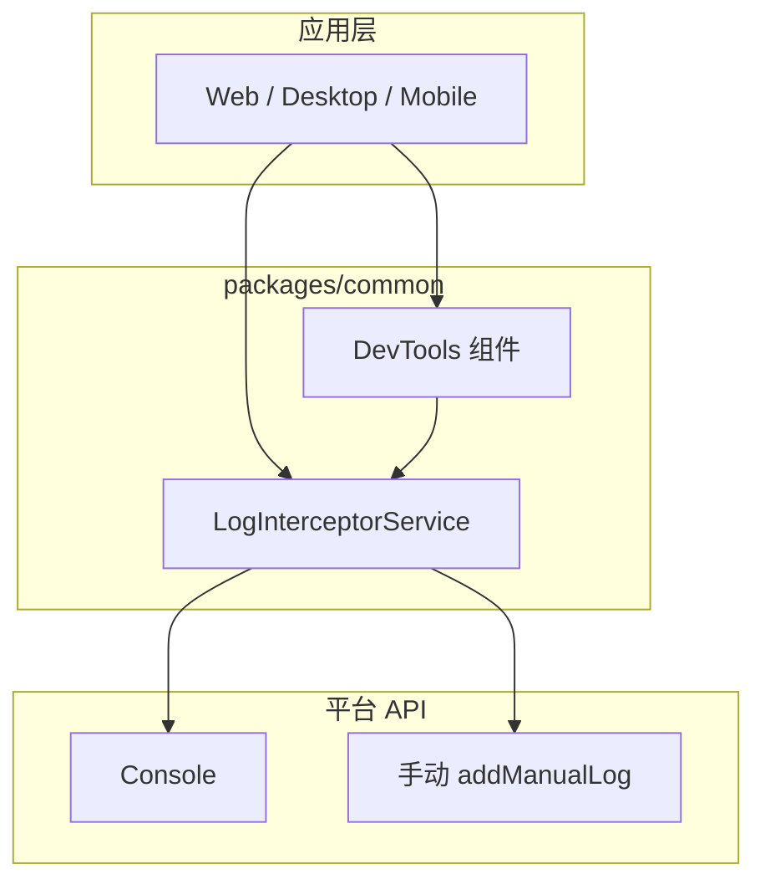

# 跨端日志输出收集设计方案

## 目录

- [一、方案概述](#一方案概述)
- [二、专业术语](#二专业术语)
- [三、架构设计](#三架构设计)
- [四、核心模块](#四核心模块)
- [五、实现要点](#五实现要点)
- [六、安全、性能与测试](#六安全性能与测试)
- [七、附录](#七附录)

---

## 一、方案概述

### 1.1 目标

本文档描述 Pixuli 跨平台（Web、Desktop、Mobile）的日志输出与收集方案，用于：

- **统一日志接口**：提供跨平台一致的日志使用方式。
- **日志拦截与收集**：自动拦截 console 输出并收集，便于调试与问题排查。
- **日志管理**：支持过滤、搜索、导出；提供可视化查看（DevTools）。
- **跨平台支持**：在 PC（Electron）、Web、移动端（React
  Native）均可使用，且不影响应用性能。

### 1.2 解决的问题

| 问题       | 说明                                   |
| ---------- | -------------------------------------- |
| 日志分散   | 各平台输出方式不同，难以统一管理       |
| 日志丢失   | 控制台在刷新后清空，无法追溯           |
| 生产排查   | 生产环境无法直接看控制台，难以定位问题 |
| 格式不统一 | 不同开发者的日志格式不一致，难以分析   |

### 1.3 范围

- 适用端：Web、Desktop（Electron 渲染进程/主进程）、Mobile（React Native）。
- 与
  [03-performance](./03-performance.md)（性能面板可集成）、[01-cross-platform-resources](./01-cross-platform-resources.md)（common 内实现）配合使用。

---

## 二、专业术语

### 2.1 日志相关术语

| 术语                      | 英文                    | 说明                                                                 |
| ------------------------- | ----------------------- | -------------------------------------------------------------------- |
| **LogInterceptorService** | Log Interceptor Service | 负责拦截 console、存储日志、通知监听器的核心服务                     |
| **LogEntry**              | Log Entry               | 单条日志数据结构：id、level、message、args、timestamp、stack（可选） |
| **LogLevel**              | Log Level               | 日志级别：log、info、warn、error、debug                              |
| **DevTools 组件**         | DevTools Component      | 用于展示日志与（可选）性能指标的浮球与侧边面板 UI                    |

### 2.2 平台相关术语

| 术语             | 英文                 | 说明                                                                |
| ---------------- | -------------------- | ------------------------------------------------------------------- |
| **Console 拦截** | Console Interception | 在 Web/Electron 中重写 console 各方法，在保留原输出的同时写入收集器 |
| **手动添加日志** | Manual Log           | 在无法拦截 console 的平台（如 RN）通过 API 手动写入一条日志         |

---

## 三、架构设计

### 3.1 整体架构



### 3.2 数据流

- **收集**：Console 输出 → 保留原样输出 → 格式化为 LogEntry
  → 写入内存数组 → 检查数量上限 → 通知监听器。
- **展示**：用户打开 DevTools
  → 选择日志/性能标签 → 应用过滤 → 展示列表；DevTools 作为监听器订阅 LogInterceptorService。

### 3.3 模块关系

| 模块                      | 职责                                                               |
| ------------------------- | ------------------------------------------------------------------ |
| **LogInterceptorService** | 拦截（或接收手动日志）、存储、过滤、清空、监听器通知、最大条数限制 |
| **DevTools 组件**         | 浮球按钮、侧边面板、日志列表、级别过滤、导出、可选性能指标展示     |
| **平台适配**              | Web/Electron 使用 console 拦截；RN 使用 addManualLog 或适配器      |

---

## 四、核心模块

### 4.1 LogInterceptorService

#### 4.1.1 功能特性

| 特性         | 说明                                                          |
| ------------ | ------------------------------------------------------------- |
| 自动拦截     | 拦截 console 的 log、info、warn、error、debug（Web/Electron） |
| 原始输出保留 | 拦截后仍调用原始 console，不影响正常调试                      |
| 日志存储     | 内存数组存储，支持最大条数（如 1000），超出删除最旧           |
| 事件通知     | 监听器模式，新增日志时通知所有监听器                          |
| 跨平台       | Web/Electron 自动拦截；RN 通过 addManualLog 等写入            |

#### 4.1.2 日志数据结构（示例）

```typescript
interface LogEntry {
  id: string;
  level: LogLevel; // 'log' | 'info' | 'warn' | 'error' | 'debug'
  message: string;
  args: any[];
  timestamp: number;
  stack?: string; // 仅 error/warn 可选带堆栈
}
```

#### 4.1.3 API 概要

| 方法                                | 说明                         |
| ----------------------------------- | ---------------------------- |
| start() / stop()                    | 开始/停止拦截                |
| addManualLog(level, message, args?) | 手动添加一条（供 RN 等使用） |
| getLogs() / getLogsByLevel(level)   | 获取全部或按级别过滤         |
| clearLogs()                         | 清空                         |
| addListener / removeListener        | 订阅/取消订阅日志变化        |
| setMaxLogs(max)                     | 设置最大条数                 |

### 4.2 DevTools 组件

| 功能         | 说明                                                        |
| ------------ | ----------------------------------------------------------- |
| 浮球按钮     | 可拖动，点击打开侧边面板                                    |
| 侧边面板     | 从右侧滑出，高度撑满视口；标签：日志 / 性能                 |
| 日志列表     | 按级别颜色区分，支持过滤、自动滚动、导出 JSON               |
| 国际化       | 中英文等                                                    |
| 性能（可选） | 与 [03-performance](./03-performance.md) 集成，展示关键指标 |

---

## 五、实现要点

### 5.1 日志拦截（Web/Electron）

- 保存原始 `console.log` 等引用；重写
  `console.log = (...args) => { 原方法(...args); addLog('log', args); }`；其他 level 同理。

### 5.2 存储策略

- 内存数组；默认最大 1000 条，超出时 shift 删除最旧；避免频繁大数组操作以控制性能。

### 5.3 事件通知

- 使用 Set 存储监听器；每次添加日志后遍历通知；监听器异常不影响收集。

### 5.4 平台适配

| 平台                | 实现方式                                                      |
| ------------------- | ------------------------------------------------------------- |
| **Web / Electron**  | 拦截全局 console                                              |
| **Electron 主进程** | 同 Node 环境，可拦截 console 或通过 IPC 转发渲染进程日志      |
| **React Native**    | 不依赖全局 console 拦截，通过 addManualLog 或封装 logger 调用 |

---

## 六、安全、性能与测试

### 6.1 安全与隐私

- **本地存储**：日志仅存内存，不默认上报服务器；导出由用户主动触发。
- **敏感信息**：建议避免在日志中输出密码、Token 等；生产环境可关闭拦截或限制条数。
- **清理**：提供清空接口；刷新或关闭页面后内存释放。

### 6.2 性能

- 限制最大条数；格式化与通知尽量不阻塞主线程；DevTools 列表量大时可考虑虚拟滚动。

### 6.3 测试

- **单元测试**：LogInterceptorService 的拦截、存储、过滤、监听器。
- **集成测试**：各平台下 DevTools 展示、过滤、导出；与性能面板联合展示（若集成）。

---

## 七、附录

### 7.1 使用示例

- **Web/Electron**：引入 DevTools 与 logInterceptorService；挂载 DevTools；拦截通常自动 start。
- **React Native**：引入 logInterceptorService；在需要处调用
  `addManualLog('info', 'message', [...])`；可选挂载 RN 版 DevTools 或仅使用服务层。

### 7.2 相关文档

- [00-System-Design - 整体系统设计](./00-System-Design.md)
- [01-cross-platform-resources - 跨端资源共享](./01-cross-platform-resources.md)
- [03-performance - 性能优化与监控](./03-performance.md)
