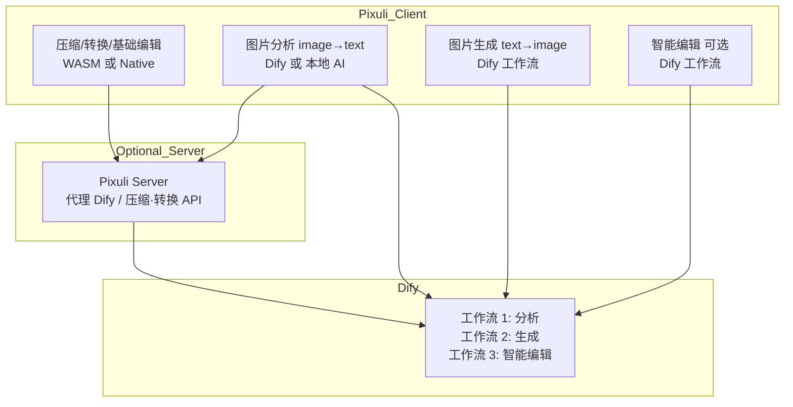

# Dify 工作流接入与图片处理方案设计

## 目录

- [一、方案概述](#一方案概述)
- [二、专业术语](#二专业术语)
- [三、现状简述](#三现状简述)
- [四、Dify 工作流接入方案](#四dify-工作流接入方案)
- [五、压缩、编辑、转换的实现选型](#五压缩编辑转换的实现选型)
- [六、架构示意与实现阶段](#六架构示意与实现阶段)
- [七、附录](#七附录)

---

## 一、方案概述

### 1.1 目的

本文档描述：

1. **Dify 工作流接入方案**：图片分析（image→text）与图片生成（text→image）的接口设计与实现路径。
2. **图片压缩、编辑、格式转换**：上述能力是接入 AI（如 Dify）还是通过传统方式（WASM/服务端/原生）实现更合适的分析与建议。

### 1.2 范围

- 产品、前端、后端、桌面端（Electron）开发：方案理解与排期。
- 与现有 PRD（F-TOOL-ANZ-01、F-TOOL-GEN-01、F-WEB-DESK-08）及可选 Pixuli
  Server 的衔接。

---

## 二、专业术语

### 2.1 Dify 与工作流术语

| 术语                | 英文             | 说明                                                                    |
| ------------------- | ---------------- | ----------------------------------------------------------------------- |
| **Dify**            | Dify             | 开源 LLM 应用开发平台，支持通过工作流 API 编排多步能力                  |
| **工作流 run API**  | Workflow Run API | `POST /v1/workflows/run`，传入 inputs、response_mode、user 等执行工作流 |
| **response_mode**   | Response Mode    | blocking（同步返回）或 streaming（SSE 流式）；分析多用 blocking         |
| **workflow_run_id** | Workflow Run ID  | 异步执行时用于轮询 `GET /v1/workflows/run/{id}` 获取结果                |

### 2.2 图片能力术语

| 术语              | 英文          | 说明                                                               |
| ----------------- | ------------- | ------------------------------------------------------------------ |
| **图片分析**      | Image → Text  | 输入图片，输出描述、标签、场景等文本，用于自动打标与检索           |
| **图片生成**      | Text → Image  | 输入 prompt，输出图片（URL 或 Base64）                             |
| **智能/创意编辑** | AI-based Edit | 去背景、风格化、扩图、修复等，适合用 AI 工作流；与基础几何编辑区分 |

---

## 三、现状简述

### 3.1 已有能力

| 能力          | 现状                                                                             | 位置                                              |
| ------------- | -------------------------------------------------------------------------------- | ------------------------------------------------- |
| 图片分析 (AI) | 桌面端已接 Qwen LLM、Ollama、Shimmy；Web/Mobile 待统一                           | `apps/pixuli/electron/main/services/aiService.ts` |
| 图片生成      | 未实现，PRD 计划含 Dify 集成                                                     | F-TOOL-GEN-01                                     |
| 格式转换      | WASM 已实现（JPEG/PNG 等），逻辑待与 UI 打通                                     | `packages/wasm/src/convert/`                      |
| 压缩          | WASM 有 WebP 设计，因依赖 C 在 WASM 中暂不可用；Mobile 用 expo-image-manipulator | `packages/wasm/src/compress/`                     |
| 编辑          | Mobile 有裁剪/缩放/格式；Web/Desktop 有页面框架，逻辑待接                        | `packages/wasm/src/edit/`、Mobile `processImage`  |
| 服务端图片    | Server 使用 Sharp 做元数据等，未暴露压缩/转换 API                                | `server/src/images/`                              |

### 3.2 技术栈对齐

- **前端**：React + Zustand，多端复用 `packages/common`。
- **桌面**：Electron，主进程可调 Node/HTTP，已有 `aiAPI` 暴露。
- **可选后端**：NestJS + Prisma，可增加代理 Dify 或做后处理。

---

## 四、Dify 工作流接入方案

### 4.1 选型理由

- **统一编排**：分析、生成及后续扩展（如 OCR、风格迁移）在 Dify 内用工作流编排，便于迭代。
- **与现有 AI 并存**：桌面端保留 Qwen/Ollama/Shimmy 本地分析；Dify 作为「云端/统一工作流」选项，通过配置切换。
- **多端一致**：Web/Desktop/Mobile 均可通过同一套 Dify 工作流 API 调用。

### 4.2 图片分析（Image → Text）

**含义**：上传一张图片，返回文本描述、标签、场景等，用于自动打标、描述、检索。

#### 4.2.1 工作流约定（在 Dify 中配置）

- **输入**：`image`（multipart）或 `image_url` 或
  `image_base64`（按 Dify 支持情况选用）。
- **输出（示例）**：`description`、`tags`、`scene_type`
  等；变量名以 Dify 工作流编辑器为准。

#### 4.2.2 调用方式

- **端点**：`POST https://<dify-host>/v1/workflows/run`
- **认证**：`Authorization: Bearer <api_key>`
- **Body**：`inputs`（上述输入变量）、`response_mode`（blocking/streaming）、`user`（如
  `pixuli-{clientId}`）
- **图片传递**：小图/缩略图可用 Base64（`inputs.image_base64`）；大图或需审计时可经 Pixuli
  Server 上传后传 `image_url`。

#### 4.2.3 各端集成要点

| 端          | 建议                                                                                       |
| ----------- | ------------------------------------------------------------------------------------------ |
| **Web**     | 通过 Pixuli Server 代理（推荐）或直连 Dify（需处理 CORS 与 API Key 安全）                  |
| **Desktop** | 主进程 aiService 或 difyService 用 Node fetch 调 Dify；API Key 存本地（如 electron-store） |
| **Mobile**  | 建议经 Server 代理；若直连需安全存储 Key                                                   |

#### 4.2.4 与现有分析的统一抽象

- 在 common 或各端定义「图片分析 Provider」：输入图片与选项，输出统一结构（如
  `{ description, tags, source: 'dify'|'ollama'|... }`）。
- 桌面端设置中增加「Dify 工作流（图片分析）」开关与配置；调用时按配置选择 Dify 或本地 Ollama/Qwen/Shimmy。

### 4.3 图片生成（Text → Image）

**含义**：根据文本 prompt 生成图片，结果可保存到当前图床或本地。

#### 4.3.1 工作流约定

- **输入**：`prompt`；可选 `negative_prompt`、`size`、`style` 等。
- **输出**：图片以 URL 或 Base64 形式输出（如 `image_url`、`image_base64`）。

#### 4.3.2 调用方式

- 同上 `POST /v1/workflows/run`，inputs 传 prompt 等。
- **长耗时**：生成可能超过 30s，可用 blocking 并放宽超时，或异步 run 后轮询
  `GET /v1/workflows/run/{workflow_run_id}` 取结果。

#### 4.3.3 结果落盘与入库

- 返回 URL：下载为 Blob/ArrayBuffer 后走现有「上传到当前图床」逻辑。
- 返回 Base64：解码后同样走上传流程。
- 元数据：可将 prompt、workflow_run_id 等写入图片描述或扩展元数据。

### 4.4 配置与安全

- **配置项**：Dify API Base URL、API Key、分析/生成工作流标识（若 API 需要）。
- **安全**：不在前端代码或仓库中写死 API
  Key；Web 直连时考虑短期 Token 或 Server 代理。
- **错误与重试**：对 429/5xx 做有限次重试；超时与网络错误给出明确提示并记录到操作日志。

### 4.5 实现阶段建议

| 阶段 | 内容                                                                                                        |
| ---- | ----------------------------------------------------------------------------------------------------------- |
| 1    | Desktop 主进程实现 Dify 工作流调用（分析 + 生成），配置存本地，与现有 aiAPI 并列或替换为「Dify 工作流」选项 |
| 2    | 定义 common 侧「分析/生成」抽象与类型，Web 通过 Server 代理调用 Dify                                        |
| 3    | 可选：Pixuli Server 提供 `/api/ai/analyze`、`/api/ai/generate` 代理到 Dify，统一鉴权与限流                  |
| 4    | Mobile 通过 Server 或直连（需安全存储 Key）接入同一套工作流                                                 |

---

## 五、压缩、编辑、转换的实现选型

### 5.1 结论概览

| 能力                                            | 建议实现方式                          | 说明                               |
| ----------------------------------------------- | ------------------------------------- | ---------------------------------- |
| **压缩**                                        | 传统（WASM / 服务端 / 原生）          | 确定性、可预期体积与画质，无需 AI  |
| **格式转换**                                    | 传统（WASM / 服务端 / 原生）          | 编解码即可，已有 WASM convert 基础 |
| **基础编辑**（裁剪、旋转、缩放、翻转）          | 传统（WASM / expo-image-manipulator） | 几何与像素级操作，算法成熟         |
| **智能/创意编辑**（去背景、风格化、扩图、修复） | 可选 AI（Dify 工作流）                | 语义与生成类，适合工作流编排       |

### 5.2 压缩

- **不建议用 AI 做「压缩」**：压缩目标为在给定画质下减小体积或给定体积下保真，属信号处理，用编码器（JPEG/PNG/WebP）更合适。
- **推荐**：Web/Desktop 用 WASM +
  image-rs 做 JPEG/PNG 质量压缩与尺寸缩放；WebP 在 WASM 中可调研纯 Rust 实现或由 Server（Sharp）提供；Mobile 保持 expo-image-manipulator；可选 Server 提供
  `POST /api/images/compress`。

### 5.3 编辑

- **基础编辑**：WASM、Mobile 已有实现，Web/Desktop 将同一套参数传到 WASM 或 Server；无需 Dify。
- **智能/创意编辑**：去背景、风格迁移、扩图等适合 Dify 工作流；输入图片 + 参数，输出新图 URL/Base64，再由前端上传到图床；可与「图片生成」共用 Dify 配置与运行机制。

### 5.4 格式转换

- **不建议用 AI**：解码→编码即可；WASM 已有 convert 模块，服务端 Sharp 也可做；Mobile 继续用现有能力；如需 WebP 且 WASM 暂不可用可由 Server 提供转换接口。

### 5.5 与 PRD 的对应

- **F-TOOL-EDT-01 /
  F-TOOL-ANZ-01**：编辑与基础分析以传统 + 现有 AI（含 Dify 分析）实现。
- **F-TOOL-GEN-01**：文本生成图片由 Dify 工作流实现。
- **F-WEB-DESK-08（AI 能力）**：自动打标、场景识别等以 Dify 图片分析工作流为主；压缩/转换/基础编辑不走 AI。

---

## 六、架构示意与实现阶段

### 6.1 架构示意

### 6.2 实现阶段（与 4.5 一致）

见 [4.5 实现阶段建议](#45-实现阶段建议)。

---

## 七、附录

### 7.1 后续可补充内容

- Dify 工作流输入/输出变量的具体命名与版本管理（便于多环境切换）。
- Pixuli Server 代理 Dify 的接口规范（请求/响应、错误码、限流）。
- 压缩/转换在 Web 端使用 WASM 时的降级策略（如 WASM 加载失败时是否回退到 Server）。
- 安全：API Key 存储、Server 代理时的鉴权与审计。

### 7.2 相关文档

- [00-System-Design - 整体系统设计](./00-System-Design.md)
- [02-cross-image-process - 跨端图片处理](./02-cross-image-process.md)
- [01-product PRD](../01-product/01-Product-Requirements-Document.md)
