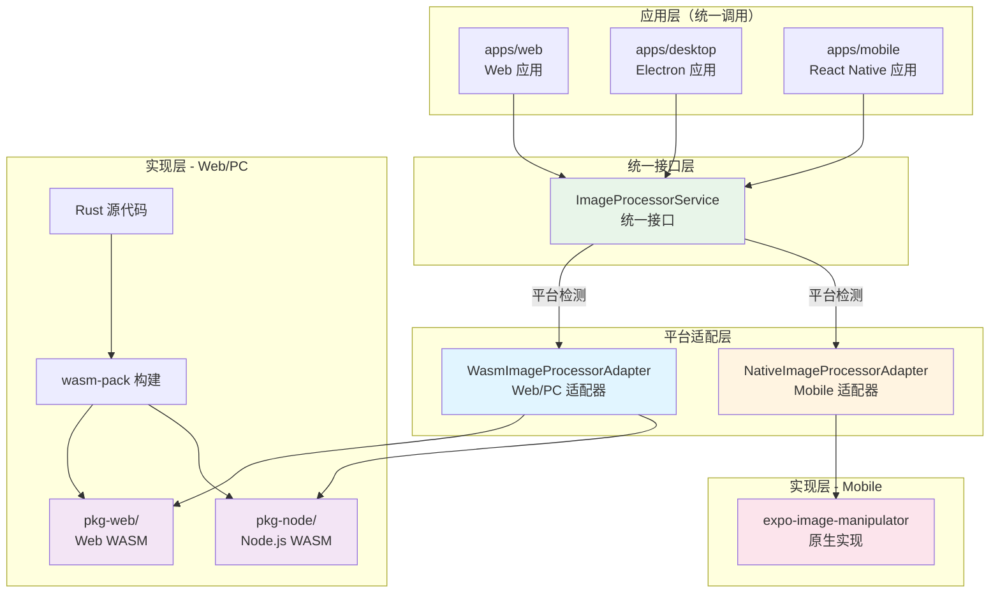
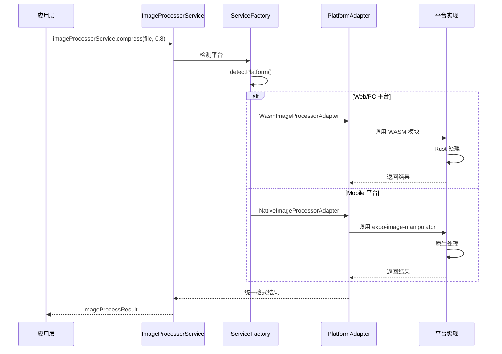
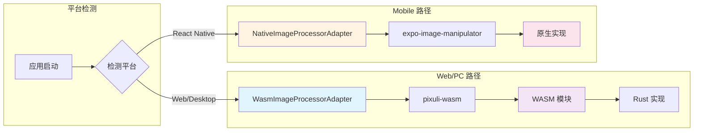

# 🚀 跨端高性能图片处理方案设计

本文档详细描述了 Pixuli 项目中跨端高性能图片处理方案的设计，包括架构设计、平台适配策略、WASM 在 Web/PC 的应用、Mobile 原生实现，以及统一接口设计。

---

## 🎯 设计目的

### 核心目标

- **高性能**：使用 Rust + WASM（Web/PC）和原生实现（Mobile）提供最佳性能
- **跨平台统一**：通过统一接口实现跨平台一致的 API
- **平台优化**：各平台使用最适合的实现方案
  - **Web/PC**：WASM 高性能实现
  - **Mobile**：原生实现（expo-image-manipulator），体积小、性能优
- **内存安全**：利用 Rust 的内存安全特性（Web/PC）
- **类型安全**：通过 TypeScript 类型定义确保接口类型安全
- **可扩展性**：模块化设计，易于添加新功能
- **维护成本可控**：统一接口，实现分离

### 解决的问题

- **性能瓶颈**：JavaScript 处理大量图片时性能不足
- **跨平台一致性**：不同平台需要统一的 API 和行为
- **平台特性差异**：各平台有不同的限制和优势
- **维护成本**：避免维护多套完全不同的代码
- **内存管理**：需要精确控制内存使用，避免内存泄漏
- **并发处理**：支持批量图片处理，提高处理效率
- **格式支持**：支持多种图片格式的转换和处理

### 架构决策

**采用统一接口 + 平台适配器模式**

- **Web/PC**：使用 WASM（Rust 实现），高性能
- **Mobile**：使用原生实现（expo-image-manipulator），体积小、性能优
- **统一接口**：通过 `ImageProcessorService` 统一 API，自动平台适配

**优势**：

- ✅ **性能最优**：各平台使用最适合的实现
- ✅ **体积最优**：Mobile 无需 WASM，体积小
- ✅ **维护可控**：接口统一，实现分离
- ✅ **功能完整**：Mobile 所有功能可用
- ✅ **扩展性好**：未来可以轻松添加新平台

---

## 📦 负责内容

### 核心功能模块

#### 1. 图片压缩模块 (compress)

- **WebP 压缩**：支持有损和无损 WebP 格式压缩（Web/PC）
- **JPEG/PNG 压缩**：支持多种格式压缩（Mobile）
- **质量控制**：可调节压缩质量（0-1）
- **批量压缩**：支持多张图片批量压缩处理
- **压缩统计**：返回详细的压缩统计信息（压缩率、大小等）

#### 2. 图片格式转换模块 (convert)

- **多格式支持**：支持 JPEG、PNG、WebP、GIF、BMP、TIFF 格式转换
- **智能转换**：自动处理透明度和颜色空间
- **尺寸调整**：支持图片尺寸调整和宽高比保持
- **批量转换**：支持多张图片批量格式转换
- **转换选项**：支持质量、透明度、无损等选项配置

#### 3. 图片分析模块 (analyze)

- **基础信息获取**：
  - 获取图片尺寸、格式、通道数等信息
  - 检测图片文件格式
  - 分析图片主要颜色
- **AI 分析功能**（Web/PC）：
  - 对象检测：检测图片中的对象和位置
  - 场景识别：识别图片场景类型
  - 标签生成：自动生成图片标签
  - 描述生成：生成图片描述文本
- **模型支持**：支持 ONNX Runtime 模型（Qwen 等，Node 端）

#### 4. 图片编辑模块 (edit)

- **裁剪功能**：
  - 矩形裁剪：支持指定区域裁剪
  - 宽高比裁剪：支持固定宽高比裁剪
  - 智能裁剪：基于内容识别的智能裁剪（Web/PC）
- **旋转功能**：
  - 角度旋转：支持任意角度旋转
  - 90度旋转：快速旋转（90°、180°、270°）
  - 自动旋转：根据 EXIF 信息自动旋转
- **翻转功能**：
  - 水平翻转
  - 垂直翻转
- **滤镜功能**（Web/PC）：
  - 亮度调整
  - 对比度调整
  - 饱和度调整
  - 色调调整
  - 模糊效果
  - 锐化效果
  - 灰度转换
  - 复古滤镜
  - 黑白滤镜
- **批量编辑**：支持多张图片批量应用编辑操作

### 技术特性

- **统一接口**：三端使用完全相同的 API
- **自动适配**：自动检测平台，选择最佳实现
- **异步支持**：所有函数都支持异步调用
- **错误处理**：完善的错误处理和错误信息返回
- **类型安全**：完整的 TypeScript 类型定义
- **测试覆盖**：完整的单元测试和集成测试

---

## 🏗️ 架构设计

### 整体架构



### 平台适配流程



### 平台支持策略



### 技术栈

#### Web/PC 平台（WASM）

**核心依赖**：

- **Rust**：主要开发语言，提供高性能和内存安全
- **wasm-bindgen**：生成 WebAssembly 和 JavaScript 之间的绑定
- **image-rs**：Rust 图片处理核心库
- **webp**：WebP 格式支持库
- **serde**：序列化支持
- **ort**：ONNX Runtime 绑定，用于 AI 分析（需要条件编译，仅 Node.js）
- **ndarray**：多维数组处理，用于 AI 计算

**构建工具**：

- **wasm-pack**：构建和发布 WASM 包的工具
- **Cargo**：Rust 包管理器

#### Mobile 平台（原生）

**核心依赖**：

- **expo-image-manipulator**：Expo 图片处理原生库
- **expo-image**：Expo 图片组件和工具
- **expo-file-system**：文件系统操作

**优势**：

- ✅ 原生性能，无需 WASM 加载时间
- ✅ 体积小，无需 WASM 模块
- ✅ 功能完整，所有操作都可用
- ✅ 配置简单，无需特殊配置

### 项目结构

```
packages/
├── common/
│   └── src/
│       └── services/
│           ├── imageProcessorService.ts      # 统一接口定义
│           └── adapters/
│               ├── wasmImageProcessorAdapter.ts    # Web/PC 适配器
│               └── nativeImageProcessorAdapter.ts  # Mobile 适配器
│
└── wasm/
    ├── src/                                  # Rust 源代码（Web/PC 使用）
    │   ├── lib.rs
    │   ├── compress/
    │   ├── convert/
    │   ├── analyze/
    │   └── edit/
    ├── Cargo.toml
    ├── pkg-web/                              # Web 版本构建产物
    ├── pkg-node/                             # Node.js 版本构建产物
    └── package.json
```

---

## 🚀 应用场景

### 1. 图片压缩场景

- **上传前压缩**：在上传到云端前压缩图片，减少上传时间和存储空间
- **批量压缩**：批量处理大量图片，提高处理效率
- **质量优化**：根据需求调整压缩质量，平衡文件大小和图片质量

**平台实现**：

- **Web/PC**：WASM 实现，支持 WebP 压缩
- **Mobile**：原生实现，支持 JPEG/PNG/WebP 压缩

### 2. 格式转换场景

- **格式统一**：将不同格式的图片转换为统一格式
- **兼容性处理**：转换为更兼容的格式（如 WebP 转 JPEG）
- **尺寸调整**：在转换时同时调整图片尺寸

**平台实现**：

- **Web/PC**：WASM 实现，支持多种格式转换
- **Mobile**：原生实现，支持 JPEG/PNG/WebP 转换

### 3. 图片分析场景

- **信息获取**：快速获取图片基本信息（尺寸、格式等）
- **自动标签**：自动为图片生成标签，便于分类和搜索（Web/PC）
- **内容识别**：识别图片中的对象和场景（Web/PC）
- **智能描述**：生成图片描述，提升用户体验（Web/PC）

**平台实现**：

- **Web/PC**：WASM 实现，支持基础分析和 AI 分析
- **Mobile**：原生实现，支持基础信息获取

### 4. 图片编辑场景

- **快速裁剪**：在应用中快速裁剪图片
- **旋转调整**：调整图片方向
- **滤镜应用**：应用各种滤镜效果，美化图片（Web/PC）
- **批量编辑**：批量应用相同的编辑操作

**平台实现**：

- **Web/PC**：WASM 实现，支持完整编辑功能
- **Mobile**：原生实现，支持裁剪、旋转、尺寸调整

---

## ⚙️ 性能特点

### Web/PC 平台（WASM）

#### 压缩性能

- **压缩率**：WebP 比 JPEG 小 25-35%，比 PNG 小 25-50%
- **处理速度**：单张 2MB 图片压缩时间 < 100ms
- **内存占用**：流式处理，内存占用低
- **批量处理**：支持并发处理，提高吞吐量

#### 格式转换性能

- **格式支持**：支持 6 种主流格式无缝转换
- **智能优化**：根据目标格式自动优化参数
- **并发处理**：支持并发处理多张图片

#### 图片分析性能

- **基础分析**：图片信息获取速度 < 10ms
- **AI 分析**：支持 ONNX Runtime 模型
- **GPU 加速**：支持 GPU 加速（如果可用）
- **批量分析**：支持批量图片分析

#### 图片编辑性能

- **编辑速度**：单张 2MB 图片编辑时间 < 200ms
- **滤镜处理**：实时滤镜预览支持
- **批量编辑**：支持批量应用编辑操作

### Mobile 平台（原生）

#### 压缩性能

- **处理速度**：单张 2MB 图片压缩时间 < 150ms
- **内存占用**：原生实现，内存占用低
- **批量处理**：支持批量处理

#### 格式转换性能

- **格式支持**：支持 JPEG/PNG/WebP 转换
- **转换速度**：单张 2MB 图片转换时间 < 200ms
- **质量保持**：转换后质量损失 < 5%

#### 图片信息获取

- **获取速度**：图片信息获取时间 < 50ms
- **准确性**：100% 准确

#### 图片编辑性能

- **编辑速度**：单张 2MB 图片编辑时间 < 250ms
- **批量编辑**：支持批量编辑

---

## 📋 平台支持详情

### Web/PC 平台（WASM）

| 运行环境          | WASM 目标         | WASM 支持   | 说明                                |
| ----------------- | ----------------- | ----------- | ----------------------------------- |
| Web 浏览器        | `--target web`    | ✅ 原生支持 | Chrome 57+, Firefox 52+, Safari 11+ |
| Node.js           | `--target nodejs` | ✅ 原生支持 | Node.js v8.0.0+（推荐 v14+）        |
| Electron 渲染进程 | `--target web`    | ✅ 原生支持 | 基于浏览器环境                      |
| Electron 主进程   | `--target nodejs` | ✅ 原生支持 | 基于 Node.js 环境                   |

**优势**：

- ✅ 高性能：接近原生性能（80-90%）
- ✅ 功能完整：支持所有图片处理功能
- ✅ 统一代码：Web 和 PC 使用同一套 WASM 代码

**限制**：

- ⚠️ 体积较大：WASM 模块 + 绑定代码
- ⚠️ 初始化时间：首次加载需要初始化（50-200ms）

### Mobile 平台（原生）

| 运行环境     | 实现方式               | 支持状态 | 说明           |
| ------------ | ---------------------- | -------- | -------------- |
| React Native | expo-image-manipulator | ✅ 支持  | Expo SDK 45+   |
| iOS          | 原生实现               | ✅ 支持  | 通过 Expo 桥接 |
| Android      | 原生实现               | ✅ 支持  | 通过 Expo 桥接 |

**优势**：

- ✅ **体积小**：无需 WASM 模块和加载器
- ✅ **性能优**：原生实现，性能最佳
- ✅ **配置简单**：无需禁用 Hermes，无需复杂配置
- ✅ **功能完整**：所有功能都可用
- ✅ **启动快**：无需 WASM 初始化时间

**限制**：

- ⚠️ 功能限制：不支持 AI 分析等高级功能
- ⚠️ 格式限制：主要支持 JPEG/PNG/WebP

---

## 🎯 统一接口设计

### 接口定义

```typescript
/**
 * 图片处理服务接口
 * 统一三端的图片处理 API
 */
export interface ImageProcessorService {
  /**
   * 压缩图片
   */
  compress(input: File | string, quality: number): Promise<ImageProcessResult>;

  /**
   * 转换图片格式
   */
  convertFormat(
    input: File | string,
    format: 'jpeg' | 'png' | 'webp',
    quality?: number,
  ): Promise<ImageProcessResult>;

  /**
   * 裁剪图片
   */
  crop(
    input: File | string,
    region: { x: number; y: number; width: number; height: number },
  ): Promise<ImageProcessResult>;

  /**
   * 旋转图片
   */
  rotate(input: File | string, degrees: number): Promise<ImageProcessResult>;

  /**
   * 调整图片尺寸
   */
  resize(
    input: File | string,
    width?: number,
    height?: number,
    keepAspectRatio?: boolean,
  ): Promise<ImageProcessResult>;

  /**
   * 综合处理图片
   */
  process(
    input: File | string,
    options: ImageProcessOptions,
  ): Promise<ImageProcessResult>;

  /**
   * 获取图片信息
   */
  getInfo(input: File | string): Promise<ImageInfo>;
}
```

### 使用示例

```typescript
import { imageProcessorService } from 'pixuli-common';

// 三端使用完全相同的 API
// Web/PC → 自动使用 WASM
// Mobile → 自动使用原生实现

// 压缩图片
const result = await imageProcessorService.compress(file, 0.8);

// 转换格式
const webp = await imageProcessorService.convertFormat(file, 'webp', 0.9);

// 综合处理
const processed = await imageProcessorService.process(file, {
  quality: 0.8,
  format: 'jpeg',
  width: 1920,
  height: 1080,
  keepAspectRatio: true,
});
```

### 平台适配器

#### Web/PC 适配器（WasmImageProcessorAdapter）

- **实现方式**：调用 `pixuli-wasm` 模块
- **数据转换**：File ↔ Uint8Array ↔ ArrayBuffer
- **结果转换**：ArrayBuffer → Data URL

#### Mobile 适配器（NativeImageProcessorAdapter）

- **实现方式**：调用 `expo-image-manipulator`
- **数据转换**：URI → 原生处理 → URI
- **结果转换**：直接返回本地 URI

---

## ⚠️ 注意事项

### 1. 平台差异处理

#### 输入类型差异

- **Web/PC**：使用 `File` 对象
- **Mobile**：使用 `string`（URI）

**解决方案**：接口统一接受 `File | string`，适配器内部处理

#### 输出类型差异

- **Web/PC**：返回 Data URL 或 Blob URL
- **Mobile**：返回本地文件 URI

**解决方案**：统一返回 `uri: string`，应用层根据平台处理

### 2. 功能差异

#### Web/PC 独有功能

- AI 分析（对象检测、场景识别）
- 高级滤镜效果
- 更多格式支持（GIF、BMP、TIFF）

#### Mobile 独有优势

- 更快的启动速度
- 更小的应用体积
- 更好的电池续航

### 3. 性能优化

#### Web/PC（WASM）

- **预加载**：应用启动时预加载 WASM 模块
- **缓存**：缓存已处理的图片
- **并发**：合理使用并发处理
- **压缩优化**：使用 `wasm-opt` 优化 WASM 文件

#### Mobile（原生）

- **批量处理**：使用批量 API 减少调用次数
- **异步处理**：避免阻塞主线程
- **内存管理**：及时释放不需要的资源

### 4. 错误处理

- **统一错误类型**：所有平台返回相同的错误格式
- **错误信息**：提供清晰的错误信息和故障排除建议
- **降级处理**：如果高级功能不可用，提供基础功能

### 5. 测试策略

- **接口测试**：测试统一接口的行为
- **平台测试**：测试各平台的具体实现
- **集成测试**：测试与应用的集成
- **性能测试**：建立性能基准测试

---

## 📈 性能指标

### Web/PC 平台（WASM）

#### 压缩性能指标

- **压缩率**：WebP 平均压缩率 30-50%
- **处理速度**：2MB 图片压缩时间 < 100ms
- **内存占用**：单张图片处理内存占用 < 50MB
- **批量处理**：支持 100+ 图片并发处理

#### 格式转换性能指标

- **转换速度**：2MB 图片转换时间 < 150ms
- **格式支持**：支持 6 种主流格式
- **质量保持**：转换后质量损失 < 5%

#### 图片分析性能指标

- **基础分析速度**：图片信息获取时间 < 10ms
- **AI 分析速度**：单张图片分析时间 < 500ms（CPU）
- **准确率**：基础分析准确率 100%，AI 分析准确率 75%+
- **GPU 加速**：使用 GPU 时速度提升 5-10 倍

#### 图片编辑性能指标

- **编辑速度**：2MB 图片编辑时间 < 200ms
- **滤镜处理**：实时滤镜预览延迟 < 50ms
- **批量编辑**：支持 50+ 图片批量编辑

### Mobile 平台（原生）

#### 压缩性能指标

- **处理速度**：2MB 图片压缩时间 < 150ms
- **内存占用**：单张图片处理内存占用 < 30MB
- **批量处理**：支持批量处理

#### 格式转换性能指标

- **转换速度**：2MB 图片转换时间 < 200ms
- **格式支持**：支持 JPEG/PNG/WebP
- **质量保持**：转换后质量损失 < 5%

#### 图片信息获取性能指标

- **获取速度**：图片信息获取时间 < 50ms
- **准确性**：100% 准确

#### 图片编辑性能指标

- **编辑速度**：2MB 图片编辑时间 < 250ms
- **批量编辑**：支持批量编辑

---

## 🔒 安全性考虑

### 1. 输入验证

- **数据格式**：验证输入数据是否为有效的图片格式
- **数据大小**：限制输入数据大小，防止内存溢出
- **参数范围**：验证参数范围（如质量 0-1、角度范围等）

### 2. 内存安全

#### Web/PC（WASM）

- **Rust 内存安全**：利用 Rust 的所有权系统确保内存安全
- **边界检查**：所有数组访问都进行边界检查
- **资源管理**：使用 RAII 自动管理资源

#### Mobile（原生）

- **原生内存管理**：使用平台原生内存管理
- **及时释放**：处理完成后及时释放资源

### 3. 错误处理

- **统一错误类型**：所有平台使用统一的错误格式
- **错误传播**：WASM 自动将 Rust 错误转换为 JavaScript 错误
- **错误信息**：提供清晰的错误信息和故障排除建议

---

## 📋 最佳实践

### 1. 代码组织

- **统一接口**：在 `packages/common` 中定义统一接口
- **平台适配**：各平台实现独立的适配器
- **模块化**：按功能将代码组织到不同模块
- **文档化**：为公共 API 编写文档注释

### 2. 错误处理

- **统一错误类型**：使用统一的错误类型
- **错误转换**：适配器负责错误格式转换
- **错误信息**：提供有意义的错误信息

### 3. 性能优化

- **平台优化**：各平台使用最适合的优化策略
- **算法选择**：选择高效的算法和数据结构
- **内存优化**：避免不必要的内存分配
- **并发优化**：合理使用并发，提高处理效率

### 4. 测试

- **接口测试**：测试统一接口的行为
- **平台测试**：测试各平台的具体实现
- **集成测试**：测试与应用的集成
- **性能测试**：建立性能基准测试

---

## 📈 未来扩展

### 功能扩展

- **更多格式**：支持更多图片格式（AVIF、HEIC 等）
- **更多 AI 模型**：支持更多 AI 模型（YOLO、CLIP 等）
- **更多滤镜**：添加更多滤镜效果（Web/PC）
- **视频处理**：支持视频处理和转换（Web/PC）

### 性能优化

- **SIMD 优化**：使用 SIMD 指令加速计算（Web/PC）
- **GPU 加速**：更多功能支持 GPU 加速（Web/PC）
- **并行处理**：优化并行处理能力
- **缓存优化**：优化缓存策略

### 开发体验

- **类型生成**：自动生成 TypeScript 类型定义
- **文档生成**：自动生成 API 文档
- **测试工具**：提供测试工具和示例
- **调试工具**：提供调试工具和性能分析

---

## 📝 总结

Pixuli 的跨端高性能图片处理方案通过**统一接口 + 平台适配器**模式，实现了：

1. **性能最优**：各平台使用最适合的实现
   - Web/PC：WASM 高性能实现
   - Mobile：原生实现，体积小、性能优

2. **统一 API**：三端使用完全相同的代码
   - 自动平台适配
   - 零学习成本

3. **维护可控**：接口统一，实现分离
   - 通过接口保证一致性
   - 各平台独立优化

4. **扩展性好**：未来可以轻松添加新平台或功能

该方案在性能、体积、维护成本之间取得了最佳平衡，是跨端图片处理的最佳实践。
