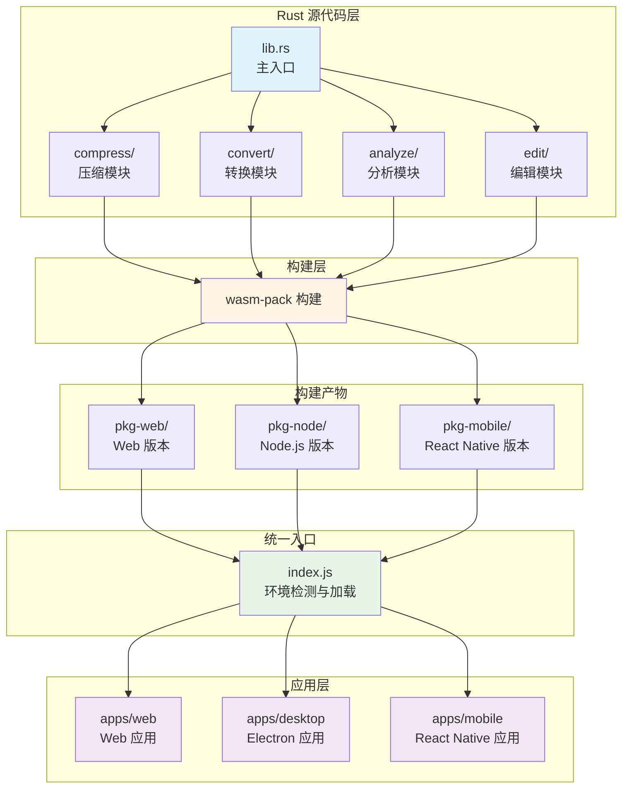
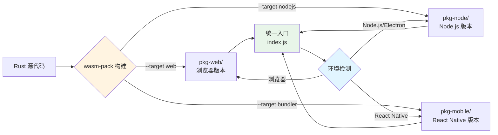
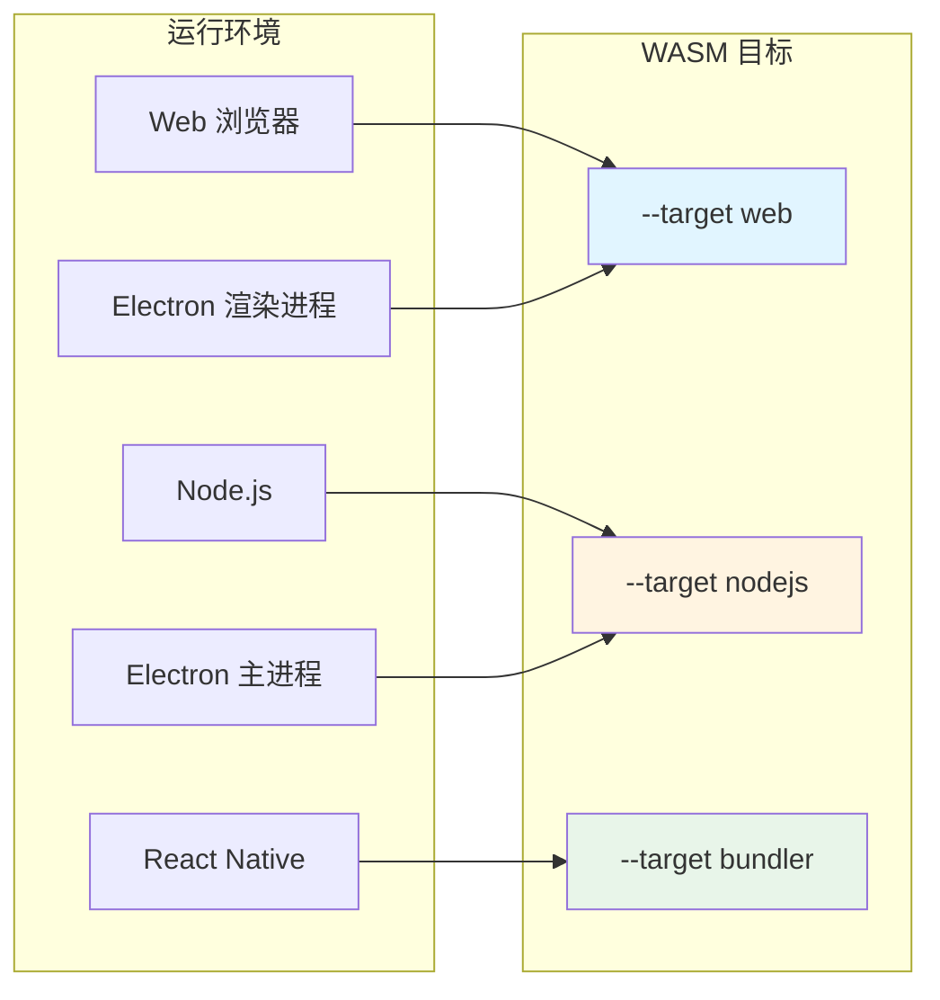
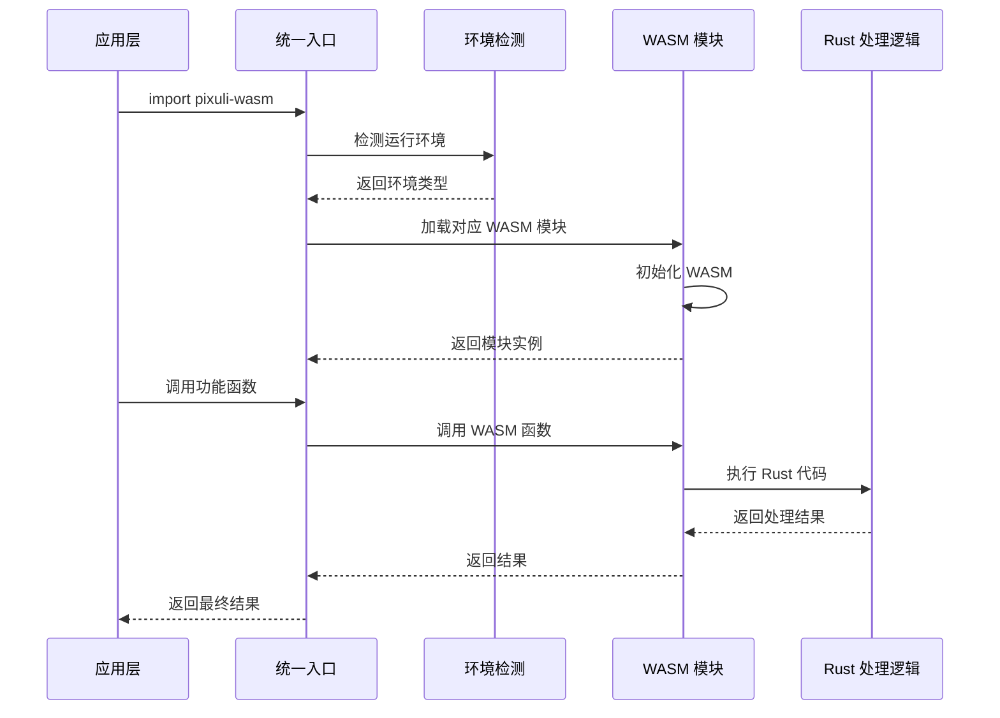

# ⚡ WASM 模块设计方案

本文档详细描述了 Pixuli 项目中 WASM（WebAssembly）模块的设计方案，包括设计目的、负责内容、架构设计、应用场景和注意事项。

---

## 🎯 设计目的

### 核心目标

- **高性能**：使用 Rust 实现图片处理功能，提供接近原生的性能
- **跨平台运行**：支持不同运行环境的部署
  - **Web 端**：编译为 WASM 格式，在浏览器中运行
  - **PC 端**：Electron 应用（主进程和渲染进程）
  - **移动端**：React Native 应用
- **内存安全**：利用 Rust 的内存安全特性，避免内存泄漏和缓冲区溢出
- **类型安全**：通过 TypeScript 类型定义确保接口类型安全
- **可扩展性**：模块化设计，易于添加新功能
- **统一构建**：使用 WASM 统一构建流程，减少维护成本

### 解决的问题

- **性能瓶颈**：JavaScript 处理大量图片时性能不足
- **内存管理**：需要精确控制内存使用，避免内存泄漏
- **并发处理**：支持批量图片处理，提高处理效率
- **格式支持**：支持多种图片格式的转换和处理
- **跨环境运行**：同一套代码在不同环境中运行
- **构建复杂度**：简化多平台编译流程，统一使用 WASM

### 技术选型说明

**推荐方案：统一使用 WASM（支持所有平台）**

项目采用 **WASM 统一构建方案**，只需维护一套代码和构建配置。

- **优势**：
  - ✅ **一套代码，所有平台通用**：Node.js、Electron、浏览器、React Native
  - ✅ **统一构建流程**：只需 `wasm-pack build` 命令，构建简单
  - ✅ **跨平台兼容性好**：WASM 是 Web 标准，所有现代环境都支持
  - ✅ **Node.js 原生支持**：Node.js v8.0.0+ 原生支持 WASM
  - ✅ **Electron 完美支持**：Electron 基于 Node.js，完全支持 WASM
  - ✅ **React Native 支持**：通过 bundler 支持 WASM
  - ✅ **维护成本低**：只需维护一套代码和构建配置

- **性能说明**：
  - 性能约为原生代码的 80-90%（对于大多数场景足够）
  - 启动时间稍长（首次加载需要初始化 WASM 模块）
  - 可以通过预加载和缓存优化启动时间

- **限制**：
  - 某些依赖（如 ONNX Runtime）可能不支持 WASM（需要条件编译）
  - 性能略低于原生模块（但对于图片处理场景，差异可接受）

- **适用场景**：
  - ✅ **需要支持所有平台**（React Native、Web、Electron）
  - ✅ **希望统一构建流程**
  - ✅ **性能要求不是极致**（80-90% 的性能已经足够好）

---

## 📦 负责内容

### 核心功能模块

#### 1. 图片压缩模块 (compress)

- **WebP 压缩**：支持有损和无损 WebP 格式压缩
- **质量控制**：可调节压缩质量（0-100）
- **批量压缩**：支持多张图片批量压缩处理
- **压缩统计**：返回详细的压缩统计信息（压缩率、大小等）

#### 2. 图片格式转换模块 (convert)

- **多格式支持**：支持 JPEG、PNG、WebP、GIF、BMP、TIFF 格式转换
- **智能转换**：自动处理透明度和颜色空间
- **尺寸调整**：支持图片尺寸调整和宽高比保持
- **批量转换**：支持多张图片批量格式转换
- **转换选项**：支持质量、透明度、无损等选项配置

#### 3. 图片分析模块 (analyze)

- **基础信息获取**：
  - 获取图片尺寸、格式、通道数等信息
  - 检测图片文件格式
  - 分析图片主要颜色
- **AI 分析功能**：
  - 对象检测：检测图片中的对象和位置
  - 场景识别：识别图片场景类型
  - 标签生成：自动生成图片标签
  - 描述生成：生成图片描述文本
- **模型支持**：支持 ONNX Runtime 模型（Qwen 等，Node 端）

#### 4. 图片编辑模块 (edit)

- **裁剪功能**：
  - 矩形裁剪：支持指定区域裁剪
  - 宽高比裁剪：支持固定宽高比裁剪
  - 智能裁剪：基于内容识别的智能裁剪
- **旋转功能**：
  - 角度旋转：支持任意角度旋转
  - 90度旋转：快速旋转（90°、180°、270°）
  - 自动旋转：根据 EXIF 信息自动旋转
- **翻转功能**：
  - 水平翻转
  - 垂直翻转
- **滤镜功能**：
  - 亮度调整
  - 对比度调整
  - 饱和度调整
  - 色调调整
  - 模糊效果
  - 锐化效果
  - 灰度转换
  - 复古滤镜
  - 黑白滤镜
- **批量编辑**：支持多张图片批量应用编辑操作

### 技术特性

- **异步支持**：所有函数都支持异步调用
- **错误处理**：完善的错误处理和错误信息返回
- **类型安全**：完整的 TypeScript 类型定义
- **测试覆盖**：完整的单元测试和集成测试

---

## 🏗️ 架构设计

### 整体架构



### 构建流程



### 平台支持



### 模块调用流程



### 技术栈

#### 核心依赖

- **Rust**：主要开发语言，提供高性能和内存安全
- **wasm-bindgen**：生成 WebAssembly 和 JavaScript 之间的绑定
- **image-rs**：Rust 图片处理核心库
- **webp**：WebP 格式支持库
- **serde**：序列化支持
- **ort**：ONNX Runtime 绑定，用于 AI 分析（需要条件编译，仅 Node.js）
- **ndarray**：多维数组处理，用于 AI 计算

#### 构建工具

- **wasm-pack**：构建和发布 WASM 包的工具
- **Cargo**：Rust 包管理器

### 项目结构

```
packages/wasm/
├── src/
│   ├── lib.rs              # 主入口，模块导出
│   ├── compress/           # 压缩模块
│   ├── convert/            # 转换模块
│   ├── analyze/            # 分析模块
│   └── edit/               # 编辑模块
├── Cargo.toml              # Rust 依赖配置
├── pkg-web/                # Web 版本构建产物
├── pkg-node/               # Node.js 版本构建产物
├── pkg-mobile/             # React Native 版本构建产物
└── package.json            # NPM 包配置（包含智能加载配置）
```

---

## 🚀 应用场景

### 1. 图片压缩场景

- **上传前压缩**：在上传到云端前压缩图片，减少上传时间和存储空间
- **批量压缩**：批量处理大量图片，提高处理效率
- **质量优化**：根据需求调整压缩质量，平衡文件大小和图片质量

### 2. 格式转换场景

- **格式统一**：将不同格式的图片转换为统一格式
- **兼容性处理**：转换为更兼容的格式（如 WebP 转 JPEG）
- **尺寸调整**：在转换时同时调整图片尺寸

### 3. 图片分析场景

- **信息获取**：快速获取图片基本信息（尺寸、格式等）
- **自动标签**：自动为图片生成标签，便于分类和搜索
- **内容识别**：识别图片中的对象和场景
- **智能描述**：生成图片描述，提升用户体验

### 4. 图片编辑场景

- **快速裁剪**：在应用中快速裁剪图片
- **旋转调整**：调整图片方向
- **滤镜应用**：应用各种滤镜效果，美化图片
- **批量编辑**：批量应用相同的编辑操作

### 5. 性能优化场景

- **批量处理**：使用批量 API 减少调用次数
- **并发处理**：在 Node.js 主进程或 Electron 主进程中并发处理多张图片
- **内存优化**：流式处理，避免一次性加载大量图片到内存

---

## ⚙️ 性能特点

### 压缩性能

- **压缩率**：WebP 比 JPEG 小 25-35%，比 PNG 小 25-50%
- **处理速度**：单张 2MB 图片压缩时间小于 100ms
- **内存占用**：流式处理，内存占用低
- **批量处理**：支持并发处理，提高吞吐量

### 格式转换性能

- **格式支持**：支持 6 种主流格式无缝转换
- **智能优化**：根据目标格式自动优化参数
- **并发处理**：支持并发处理多张图片

### 图片分析性能

- **基础分析**：图片信息获取速度 < 10ms
- **AI 分析**：支持 ONNX Runtime 模型
- **GPU 加速**：支持 GPU 加速（如果可用）
- **批量分析**：支持批量图片分析

### 图片编辑性能

- **编辑速度**：单张 2MB 图片编辑时间 < 200ms
- **滤镜处理**：实时滤镜预览支持
- **批量编辑**：支持批量应用编辑操作

---

## ⚠️ 注意事项

### 1. 平台支持

#### WASM 统一方案优势

- **统一构建**：只需维护一套 Rust 代码
- **所有平台支持**：React Native、Web、Electron 全部支持
- **智能加载**：通过 package.json 的 exports 字段自动选择正确的模块
- **跨平台兼容**：WASM 是 Web 标准，所有现代环境都支持
- **构建简单**：只需 `wasm-pack build` 命令

#### 平台支持详情

| 运行环境          | WASM 目标          | WASM 支持   | 说明                                |
| ----------------- | ------------------ | ----------- | ----------------------------------- |
| Web 浏览器        | `--target web`     | ✅ 原生支持 | Chrome 57+, Firefox 52+, Safari 11+ |
| Node.js           | `--target nodejs`  | ✅ 原生支持 | Node.js v8.0.0+（推荐 v14+）        |
| Electron 渲染进程 | `--target web`     | ✅ 原生支持 | 基于浏览器环境                      |
| Electron 主进程   | `--target nodejs`  | ✅ 原生支持 | 基于 Node.js 环境                   |
| React Native      | `--target bundler` | ✅ 支持     | 通过打包工具加载                    |

**Node.js WASM 支持说明**：

- Node.js 从 **v8.0.0** 开始原生支持 WebAssembly
- 推荐使用 **Node.js v14+** 以获得更好的性能和稳定性
- Node.js 提供了全局 `WebAssembly` 对象，可以直接加载和运行 WASM 模块
- 支持 `WebAssembly.compile()`、`WebAssembly.instantiate()` 等 API
- 还支持 **WASI**（WebAssembly System Interface），允许访问文件系统等系统资源

**React Native 支持说明**：

- React Native 0.60+（推荐 0.70+）
- 使用 `--target bundler` 构建
- 需要配置 Metro bundler 以支持 `.wasm` 文件
- 可能需要 polyfill（如 `text-encoding-polyfill`）
- Expo SDK 45+ 对 WASM 有更好的支持

### 2. 内存管理

- **大文件处理**：对于超大文件，考虑分块处理或流式处理
- **内存限制**：注意内存使用，避免处理过多大文件导致内存溢出
- **及时释放**：处理完成后及时释放内存

### 3. 错误处理

- **输入验证**：验证输入数据格式和大小
- **错误捕获**：所有函数都应包含错误处理
- **错误信息**：提供清晰的错误信息，便于调试

### 4. 性能优化

- **初始化开销**：WASM 首次加载需要初始化时间（约 50-200ms），建议在应用启动时预加载
- **编译优化**：使用 release 模式编译，启用 LTO
- **算法优化**：选择高效的图片处理算法
- **并发处理**：合理使用并发，避免过度并发导致资源竞争

### 5. 依赖限制

- **ONNX
  Runtime（AI 分析）**：当前可能不支持 WASM，需要条件编译或使用 WASM 版本的 ONNX
  Runtime
- **文件系统访问**：浏览器环境无法直接访问文件系统，需要通过 File API 或拖拽上传

### 6. 构建产物大小

- **WASM 文件**：约 500 KB - 2 MB（取决于功能）
- **JavaScript 绑定**：约 50-100 KB

**优化建议**：

- 使用代码分割，按需加载
- 压缩 WASM 文件（使用 `wasm-opt`）
- 考虑 CDN 分发 WASM 文件

---

## 📈 性能指标

### 压缩性能指标

- **压缩率**：WebP 平均压缩率 30-50%
- **处理速度**：2MB 图片压缩时间 < 100ms
- **内存占用**：单张图片处理内存占用 < 50MB
- **批量处理**：支持 100+ 图片并发处理

### 格式转换性能指标

- **转换速度**：2MB 图片转换时间 < 150ms
- **格式支持**：支持 6 种主流格式
- **质量保持**：转换后质量损失 < 5%

### 图片分析性能指标

- **基础分析速度**：图片信息获取时间 < 10ms
- **AI 分析速度**：单张图片分析时间 < 500ms（CPU）
- **准确率**：基础分析准确率 75%+
- **GPU 加速**：使用 GPU 时速度提升 5-10 倍

### 图片编辑性能指标

- **编辑速度**：2MB 图片编辑时间 < 200ms
- **滤镜处理**：实时滤镜预览延迟 < 50ms
- **批量编辑**：支持 50+ 图片批量编辑

---

## 🔒 安全性考虑

### 1. 输入验证

- **数据格式**：验证输入数据是否为有效的图片格式
- **数据大小**：限制输入数据大小，防止内存溢出
- **参数范围**：验证参数范围（如质量 0-100、角度范围等）

### 2. 内存安全

- **Rust 内存安全**：利用 Rust 的所有权系统确保内存安全
- **边界检查**：所有数组访问都进行边界检查
- **资源管理**：使用 RAII 自动管理资源

### 3. 错误处理

- **错误类型**：使用 Result 类型处理错误
- **错误传播**：WASM 自动将 Rust 错误转换为 JavaScript 错误
- **错误信息**：提供清晰的错误信息

---

## 📋 最佳实践

### 1. 代码组织

- **模块化**：按功能将代码组织到不同模块
- **可复用**：提取公共逻辑为可复用函数
- **文档化**：为公共 API 编写文档注释

### 2. 错误处理

- **统一错误类型**：使用统一的错误类型
- **错误转换**：WASM 自动将 Rust 错误转换为 JavaScript 错误
- **错误信息**：提供有意义的错误信息

### 3. 性能优化

- **算法选择**：选择高效的算法和数据结构
- **内存优化**：避免不必要的内存分配
- **并发优化**：合理使用并发，提高处理效率

### 4. 测试

- **单元测试**：为每个函数编写单元测试
- **集成测试**：测试与不同环境的集成
- **性能测试**：建立性能基准测试

---

## 📈 未来扩展

### 功能扩展

- **更多格式**：支持更多图片格式（AVIF、HEIC 等）
- **更多 AI 模型**：支持更多 AI 模型（YOLO、CLIP 等）
- **更多滤镜**：添加更多滤镜效果
- **视频处理**：支持视频处理和转换

### 性能优化

- **SIMD 优化**：使用 SIMD 指令加速计算
- **GPU 加速**：更多功能支持 GPU 加速
- **并行处理**：优化并行处理能力

### 开发体验

- **类型生成**：自动生成 TypeScript 类型定义
- **文档生成**：自动生成 API 文档
- **测试工具**：提供测试工具和示例

---

## 📝 总结

WASM 模块是 Pixuli 项目的核心性能组件，通过 Rust 实现提供了高性能的图片处理能力。
