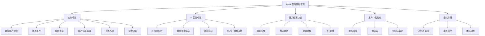
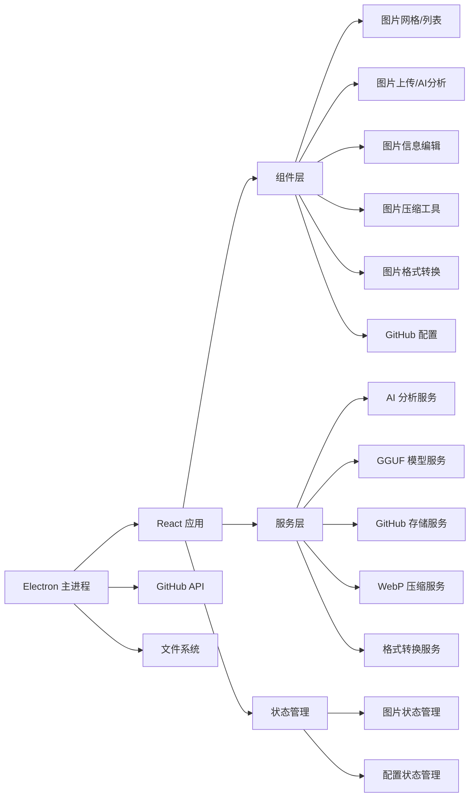

# Pixuli - 智能图片管理应用

[](https://opensource.org/licenses/MIT)
[](https://nodejs.org/about/releases)

## 🖼️ 项目概述

**Pixuli** 是一款现代化的跨平台图片管理桌面应用，基于 Electron + React + TypeScript 构建。它提供了直观的图片浏览、组织、编辑和管理功能，让您的图片库管理变得简单高效。

## 📖 项目由来

### 技术栈探索

基于之前使用 **Vue3 + Composition API + Pinia + Vue-Router** 开发图片管理应用的经验，决定尝试使用 **React** 技术栈重新实现，体验不同框架的设计理念。

**之前项目成果**：
- 虚拟滚动+Web Worker，10万图加载优化至2.8s
- WASM WebP编码，压缩率78%，CDN流量↓62%
- TensorFlow+Llama，图像描述准召率92%+

### 实际需求驱动

在运营博客网站时遇到的图片管理问题：
- 图片存储分散，格式不统一
- 文件过大影响加载速度
- 缺乏元数据，难以搜索管理
- CDN流量消耗大

**解决方案**：统一存储、智能压缩、AI辅助、批量处理

### 技术栈对比

| 方面 | Vue3项目 | React项目 |
|------|----------|-----------|
| 框架 | Vue3 + Composition API | React + Hooks |
| 状态管理 | Pinia | Zustand |
| 路由 | Vue Router | React Router |
| 构建工具 | Vite | Vite |

### 项目目标

- **技术学习**：掌握React组件化思维和Hooks机制
- **技术对比**：验证图像处理、AI集成等技术在不同框架下的实现
- **实际应用**：为博客网站提供专业的图片管理解决方案
- **开源分享**：为前端开发者提供技术参考

## ✨ 主要功能

### 🖼️ 图片管理
- **智能浏览**: 网格/列表视图切换，支持虚拟滚动
- **拖拽上传**: 支持单张/批量图片上传
- **标签系统**: 智能标签分类，快速筛选
- **搜索功能**: 按名称、描述、标签快速搜索
- **元数据编辑**: 编辑图片描述、标签等信息

### 🔧 图片处理
- **智能压缩**: WebP 格式压缩，节省 60-80% 空间
- **格式转换**: 支持 JPEG、PNG、WebP、GIF、BMP、TIFF 互转
- **批量处理**: 一键批量压缩/转换多张图片
- **尺寸调整**: 智能调整图片尺寸，保持宽高比
- **质量控制**: 可调节压缩质量和转换参数

### 🤖 AI 智能分析
- **内容识别**: 自动识别图片中的物体和场景
- **智能标签**: 基于 AI 分析自动生成描述性标签
- **颜色分析**: 提取主要颜色和色彩分布
- **多模型支持**: TensorFlow、ONNX、本地 LLM 等



## 🛠️ 技术架构



## 📚 文档

### AI 模型支持
- 📖 [AI 模型文档总览](./docs/README.md) - 完整的 AI 模型支持指南
- 🚀 [快速开始指南](./docs/QUICK_START.md) - 5分钟上手 AI 图片分析
- 🔧 [模型支持文档](./docs/AI_MODELS.md) - 支持的模型类型和下载地址
- 💻 [模型开发指南](./docs/MODEL_DEVELOPMENT.md) - 自定义模型开发

### 支持的 AI 模型类型
- **TensorFlow Lite** (`.tflite`) - 轻量级，推荐首选 ⭐⭐⭐⭐⭐
- **ONNX** (`.onnx`) - 跨平台兼容，生态丰富 ⭐⭐⭐⭐
- **TensorFlow** (`.pb`, `.json`, `.bin`) - 功能强大 ⭐⭐⭐
- **本地 LLM** - 语义理解，隐私保护 ⭐⭐⭐
- **远程 API** - 高精度，无需本地资源 ⭐⭐

## 🚀 快速开始

### 环境要求
- Node.js >= 22.0.0
- pnpm

### 安装和运行
```bash
# 克隆项目
git clone https://github.com/trueLoving/pixuli.git
cd pixuli

# 安装依赖
pnpm install

# 开发模式
pnpm run dev

# 构建应用
pnpm run build
pnpm run electron:build
```

### 图片处理快速体验
1. **格式转换**: 点击顶部转换按钮(↔️)，选择图片和目标格式
2. **智能压缩**: 点击压缩按钮(⚡)，自动优化图片大小
3. **批量处理**: 选择多张图片进行批量压缩或转换

### AI 功能快速体验
1. 启动应用后点击 "AI 分析" 按钮
2. 点击齿轮图标进入模型管理
3. 下载推荐的 "MobileNet V2 Lite" 模型 (4MB)
4. 上传图片开始 AI 分析

## 🤝 贡献指南

1. Fork 项目
2. 创建功能分支
3. 提交更改
4. 开启 Pull Request

## 📄 许可证

本项目采用 MIT 许可证

## 🙏 致谢

- [Electron](https://electronjs.org/) - 跨平台桌面应用框架
- [React](https://reactjs.org/) - 用户界面库
- [Vite](https://vitejs.dev/) - 快速构建工具
- [Tailwind CSS](https://tailwindcss.com/) - 实用优先的 CSS 框架
- [Rust](https://www.rust-lang.org/) - 高性能系统编程语言
- [NAPI-RS](https://napi.rs/) - Node.js 原生模块绑定
- [image-rs](https://github.com/image-rs/image) - Rust 图片处理库
- [TensorFlow.js](https://www.tensorflow.org/js) - 浏览器端机器学习
- [GGUF](https://github.com/ggerganov/gguf) - 优化的模型格式

## 📞 联系我们

- 项目主页: [https://github.com/trueLoving/pixuli](https://github.com/trueLoving/pixuli)
- 问题反馈: [Issues](https://github.com/trueLoving/pixuli/issues)

---

⭐ 如果这个项目对您有帮助，请给我们一个星标！
