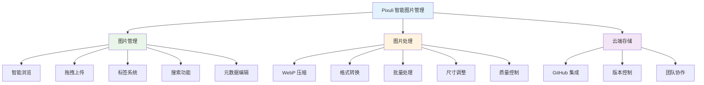
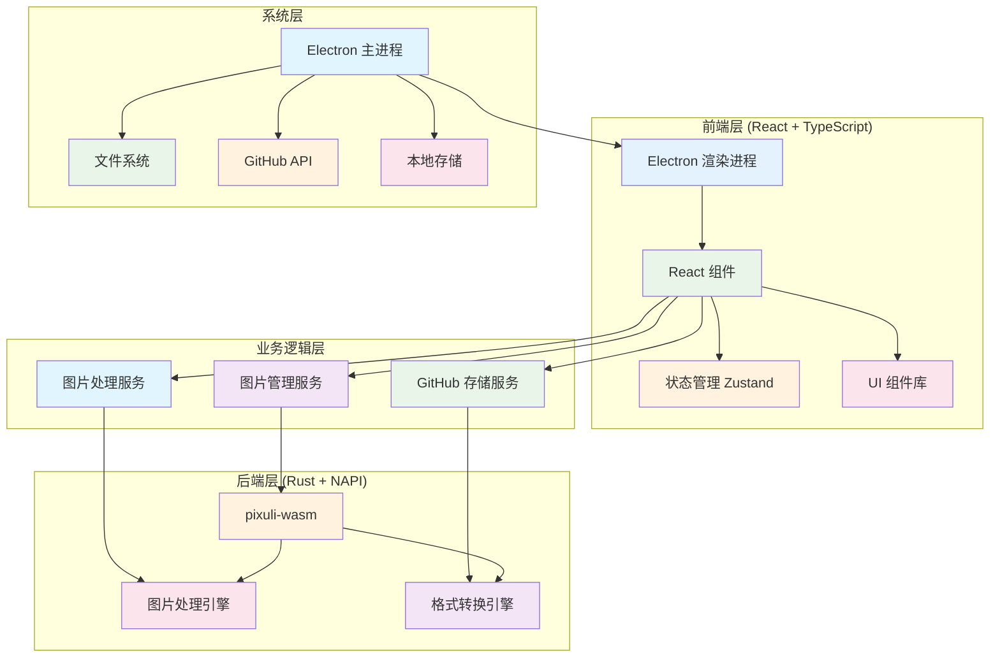

# Pixuli - 智能图片管理应用

[](https://opensource.org/licenses/MIT)
[](https://nodejs.org/about/releases)
[](https://pnpm.io/)
[](https://pixuli-web.vercel.app/)

## 📖 项目初衷

基于之前使用 **Vue3 + Composition API + Pinia + Vue-Router**
开发图片管理应用的经验，决定尝试使用 **React**
技术栈重新实现，体验不同框架的设计理念。

**之前项目成果**：

- 虚拟滚动+Web Worker，10万图加载优化至2.8s
- WASM WebP编码，压缩率78%，CDN流量↓62%
- TensorFlow+Llama，图像描述准召率92%+

**实际需求驱动**：在运营博客网站时遇到的图片管理问题，需要统一存储、智能压缩、批量处理。

**技术栈对比**：

| 方面     | Vue3项目               | React项目     |
| -------- | ---------------------- | ------------- |
| 框架     | Vue3 + Composition API | React + Hooks |
| 状态管理 | Pinia                  | Zustand       |
| 路由     | Vue Router             | 暂无          |
| 构建工具 | Vite                   | Vite          |

## 🖼️ 项目概述

**Pixuli** 是一款现代化的跨平台图片管理应用，提供桌面端和 Web 端两种使用方式。

- **桌面端**：基于 Electron + React + TypeScript + Rust 构建的桌面应用
- **Web 端**：基于 Vite + React + TypeScript 构建的 Web 应用
- **核心功能**：图片管理、格式转换、压缩优化、批量处理

## ✨ 主要功能



## 🛠️ 技术架构



## 🏗️ 项目结构

```
Pixuli/
├── apps/                   # 应用程序
│   ├── desktop/            # 桌面端应用 (Electron + React)
│   └── web/                # Web 端应用 (Vite + React)
├── packages/               # 共享包
│   ├── ui/                 # UI 组件库
│   └── wasm/               # WASM 模块
├── docs/                   # 文档网站
├── benchmark/              # 性能测试
└── pnpm-workspace.yaml    # 工作空间配置
```

## 🚀 快速开始

### 环境要求

- **Node.js** >= 22.0.0
- **pnpm** >= 8.0.0 (必需，项目仅支持 pnpm)
- **Git** >= 2.0.0
- **Rust** >= 1.70.0 (用于构建 WASM 模块)

### 安装和运行

```bash
# 克隆项目
git clone https://github.com/trueLoving/Pixuli.git
cd Pixuli

# 安装依赖 (仅支持 pnpm)
pnpm install

# 构建 WASM 模块
pnpm build:wasm
```

### 开发模式

```bash
# Web 端开发
pnpm dev:web

# 桌面端开发
pnpm dev:desktop

# 文档开发
pnpm docs:dev
```

### 构建应用

```bash
# 构建 Web 端
pnpm build:web

# 构建桌面端
pnpm build:desktop

# 构建文档
pnpm docs:build
```

### 性能测试

```bash
# 运行基准测试
pnpm benchmark
```

## 📋 可用脚本

根目录提供了以下脚本命令：

```bash
# WASM 模块
pnpm build:wasm          # 构建 WASM 模块

# Web 端
pnpm dev:web             # 启动 Web 端开发服务器
pnpm build:web           # 构建 Web 端生产版本

# 桌面端
pnpm dev:desktop         # 启动桌面端开发模式
pnpm build:desktop       # 构建桌面端应用

# 文档
pnpm docs:dev            # 启动文档开发服务器
pnpm docs:build          # 构建文档生产版本

# 性能测试
pnpm benchmark           # 运行性能基准测试
```

## 🎯 核心特性

### 高性能图片处理

- **Rust + WebAssembly**：高性能图片压缩和格式转换
- **虚拟滚动**：支持大量图片的流畅浏览
- **懒加载**：按需加载图片资源

### 跨平台支持

- **桌面端**：Windows、macOS、Linux
- **Web 端**：现代浏览器支持
- **响应式设计**：适配不同屏幕尺寸

### 开发者友好

- **TypeScript**：完整的类型安全
- **组件化**：可复用的 UI 组件库
- **Monorepo**：统一的项目管理

## 📚 文档

- **[贡献指南](./CONTRIBUTING.md)** - 如何参与项目开发
- **[组件文档](./packages/ui/docs/)** - UI 组件库使用说明
- **[性能测试](./benchmark/README.md)** - 性能基准测试结果

## 🤝 贡献

我们欢迎所有形式的贡献！请查看 [贡献指南](./CONTRIBUTING.md)
了解如何参与项目开发。

## 📄 许可证

本项目采用 [MIT 许可证](LICENSE)

## 🙏 致谢

- [Electron](https://electronjs.org/) - 跨平台桌面应用框架
- [React](https://reactjs.org/) - 用户界面库
- [Vite](https://vitejs.dev/) - 快速构建工具
- [Rust](https://www.rust-lang.org/) - 高性能系统编程语言
- [NAPI-RS](https://napi.rs/) - Node.js 原生模块绑定
- [image-rs](https://github.com/image-rs/image) - Rust 图片处理库
- [Tailwind CSS](https://tailwindcss.com/) - 实用优先的 CSS 框架
- [pnpm](https://pnpm.io/) - 快速、节省磁盘空间的包管理器

---

⭐ 如果这个项目对您有帮助，请给我们一个星标！
