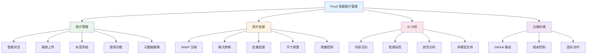
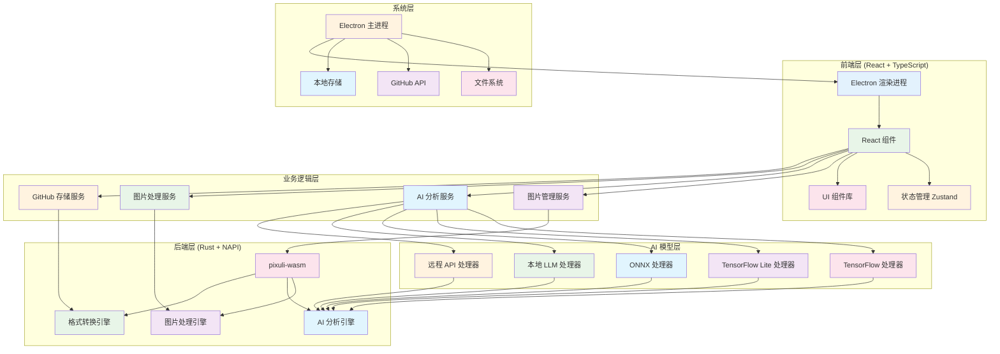

# Pixuli - 智能图片管理应用

[](https://opensource.org/licenses/MIT)
[](https://nodejs.org/about/releases)

## 📖 项目初衷

基于之前使用 **Vue3 + Composition API + Pinia + Vue-Router** 开发图片管理应用的经验，决定尝试使用 **React** 技术栈重新实现，体验不同框架的设计理念。

**之前项目成果**：
- 虚拟滚动+Web Worker，10万图加载优化至2.8s
- WASM WebP编码，压缩率78%，CDN流量↓62%
- TensorFlow+Llama，图像描述准召率92%+

**实际需求驱动**：在运营博客网站时遇到的图片管理问题，需要统一存储、智能压缩、AI辅助、批量处理。

**技术栈对比**：

| 方面 | Vue3项目 | React项目 |
|------|----------|-----------|
| 框架 | Vue3 + Composition API | React + Hooks |
| 状态管理 | Pinia | Zustand |
| 路由 | Vue Router | React Router |
| 构建工具 | Vite | Vite |

## 🖼️ 项目概述

**Pixuli** 是一款现代化的跨平台图片管理桌面应用，基于 Electron + React + TypeScript + Rust 构建。

## ✨ 主要功能



## 🛠️ 技术架构



## 🤖 AI 模型支持

支持 5 种 AI 模型类型：
- **TensorFlow** (`.pb`, `.pbtxt`, `.json`, `.bin`, `.ckpt`, `.h5`)
- **TensorFlow Lite** (`.tflite`)
- **ONNX** (`.onnx`, `.ort`)
- **本地 LLM** (Llama、Mistral 等)
- **远程 API** (OpenAI、Qwen、Claude、Gemini 等)

## 🚀 快速开始

### 环境要求
- Node.js >= 22.0.0
- pnpm

### 安装和运行
```bash
# 克隆项目
git clone https://github.com/trueLoving/pixuli.git
cd pixuli

# 安装依赖
pnpm install

# 开发模式
pnpm run dev

# 构建应用
pnpm run build
pnpm run electron:build
```

## 📄 许可证

本项目采用 [MIT 许可证](LICENSE)

## 🙏 致谢

- [Electron](https://electronjs.org/) - 跨平台桌面应用框架
- [React](https://reactjs.org/) - 用户界面库
- [Rust](https://www.rust-lang.org/) - 高性能系统编程语言
- [NAPI-RS](https://napi.rs/) - Node.js 原生模块绑定
- [image-rs](https://github.com/image-rs/image) - Rust 图片处理库
- [Tailwind CSS](https://tailwindcss.com/) - 实用优先的 CSS 框架

---

⭐ 如果这个项目对您有帮助，请给我们一个星标！
