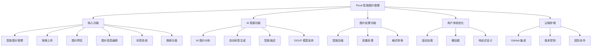
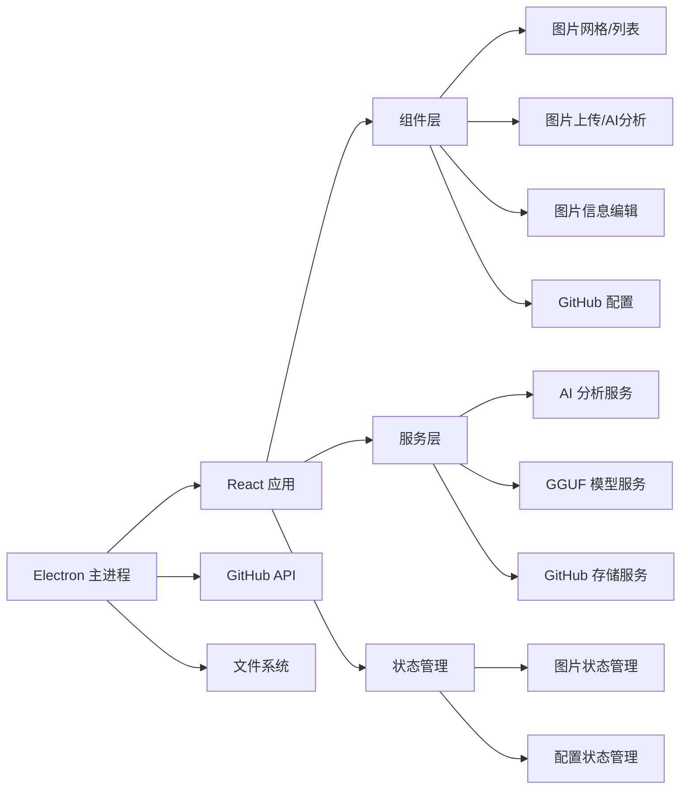

# Pixuli - 智能图片管理应用

[](https://opensource.org/licenses/MIT)
[](https://nodejs.org/about/releases)

## 🖼️ 项目概述

**Pixuli** 是一款现代化的跨平台图片管理桌面应用，基于 Electron + React + TypeScript 构建。它提供了直观的图片浏览、组织、编辑和管理功能，让您的图片库管理变得简单高效。

## ✨ 主要功能



## 🛠️ 技术架构



## 🚀 快速开始

### 环境要求
- Node.js >= 22.0.0
- pnpm

### 安装和运行
```bash
# 克隆项目
git clone https://github.com/trueLoving/pixuli.git
cd pixuli

# 安装依赖
pnpm install

# 开发模式
pnpm run dev

# 构建应用
pnpm run build
pnpm run electron:build
```

## 🤝 贡献指南

1. Fork 项目
2. 创建功能分支
3. 提交更改
4. 开启 Pull Request

## 📄 许可证

本项目采用 MIT 许可证

## 🙏 致谢

- [Electron](https://electronjs.org/) - 跨平台桌面应用框架
- [React](https://reactjs.org/) - 用户界面库
- [Vite](https://vitejs.dev/) - 快速构建工具
- [Tailwind CSS](https://tailwindcss.com/) - 实用优先的 CSS 框架
- [TensorFlow.js](https://www.tensorflow.org/js) - 浏览器端机器学习
- [GGUF](https://github.com/ggerganov/gguf) - 优化的模型格式

## 📞 联系我们

- 项目主页: [https://github.com/trueLoving/pixuli](https://github.com/trueLoving/pixuli)
- 问题反馈: [Issues](https://github.com/trueLoving/pixuli/issues)

---

⭐ 如果这个项目对您有帮助，请给我们一个星标！
