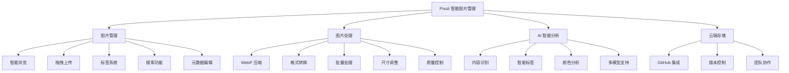
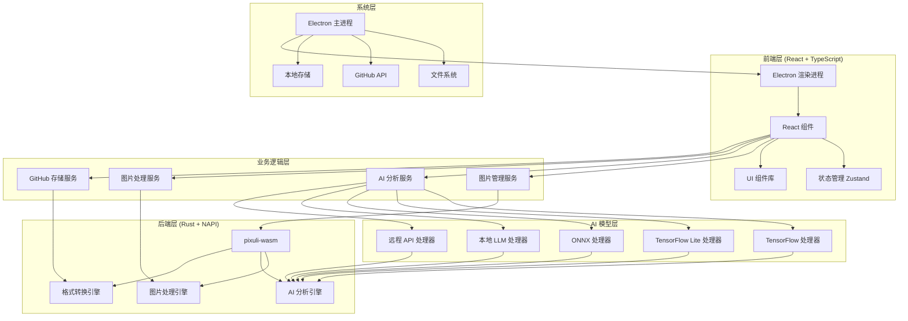
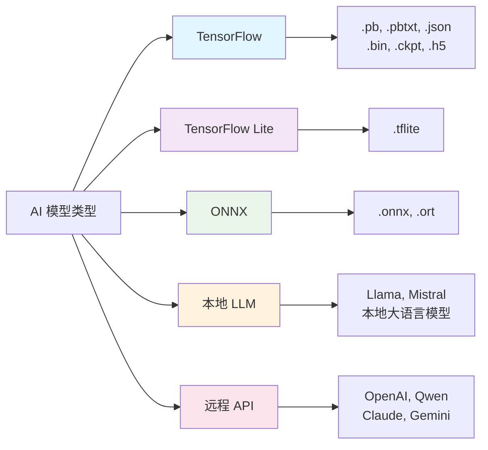
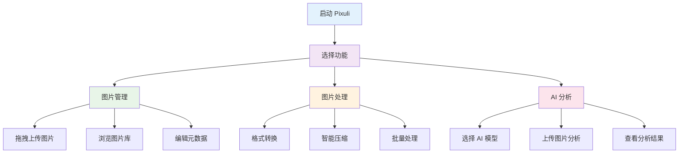
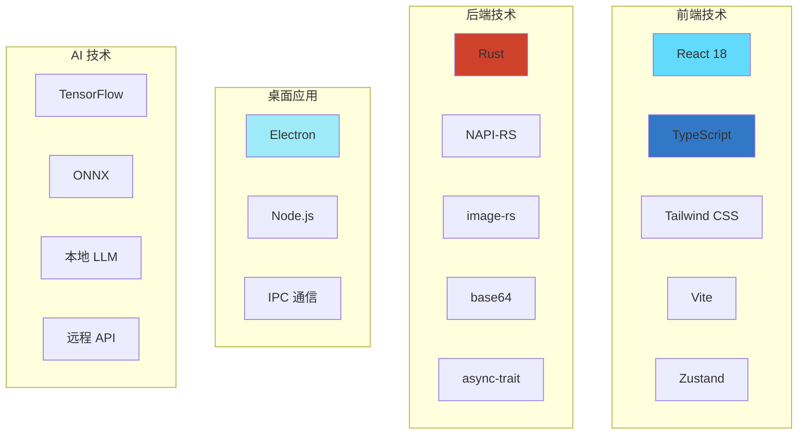

# Pixuli - 智能图片管理应用

[](https://opensource.org/licenses/MIT)
[](https://nodejs.org/about/releases)

## 🖼️ 项目概述

**Pixuli** 是一款现代化的跨平台图片管理桌面应用，基于 Electron + React + TypeScript + Rust 构建。它集成了 AI 智能分析、图片压缩、格式转换等核心功能，为图片管理提供一站式解决方案。

### 🖼️ 图片管理
- **智能浏览**: 网格/列表视图切换，支持虚拟滚动
- **拖拽上传**: 支持单张/批量图片上传
- **标签系统**: 智能标签分类，快速筛选
- **搜索功能**: 按名称、描述、标签快速搜索
- **元数据编辑**: 编辑图片描述、标签等信息

### 🔧 图片处理
- **智能压缩**: WebP 格式压缩，节省 60-80% 空间
- **格式转换**: 支持 JPEG、PNG、WebP、GIF、BMP、TIFF 互转
- **批量处理**: 一键批量压缩/转换多张图片
- **尺寸调整**: 智能调整图片尺寸，保持宽高比
- **质量控制**: 可调节压缩质量和转换参数

### 🤖 AI 智能分析
- **内容识别**: 自动识别图片中的物体和场景
- **智能标签**: 基于 AI 分析自动生成描述性标签
- **颜色分析**: 提取主要颜色和色彩分布
- **多模型支持**: TensorFlow、TensorFlow Lite、ONNX、本地 LLM、远程 API



## 🛠️ 技术架构



### 🏗️ 架构特点

- **前后端分离**: React 前端 + Rust 后端，性能与开发体验并重
- **模块化设计**: 每个功能模块独立，易于维护和扩展
- **AI 模型抽象**: 统一的模型接口，支持多种 AI 框架
- **跨平台支持**: 基于 Electron，支持 Windows、macOS、Linux
- **高性能处理**: Rust 原生模块，图片处理性能优异

### 🤖 AI 模型支持

Pixuli 支持 5 种 AI 模型类型，满足不同场景需求：



| 模型类型 | 文件格式 | 特点 | 推荐场景 |
|---------|---------|------|---------|
| **TensorFlow** | `.pb`, `.pbtxt`, `.json`, `.bin`, `.ckpt`, `.h5` | 功能强大，GPU 加速 | 高精度分析 |
| **TensorFlow Lite** | `.tflite` | 轻量级，运行快速 | 快速分析，移动端 |
| **ONNX** | `.onnx`, `.ort` | 跨平台兼容 | 跨框架部署 |
| **本地 LLM** | 支持 Llama、Mistral 等 | 完全本地化，隐私保护 | 离线环境，隐私敏感 |
| **远程 API** | 支持 OpenAI、Qwen 等 | 无需本地资源 | 最新 AI 能力 |

## 🚀 快速开始

### 环境要求
- Node.js >= 22.0.0
- pnpm

### 安装和运行
```bash
# 克隆项目
git clone https://github.com/trueLoving/pixuli.git
cd pixuli

# 安装依赖
pnpm install

# 开发模式
pnpm run dev

# 构建应用
pnpm run build
pnpm run electron:build
```

### 快速体验



#### 图片处理体验
1. **格式转换**: 点击顶部转换按钮(↔️)，选择图片和目标格式
2. **智能压缩**: 点击压缩按钮(⚡)，自动优化图片大小
3. **批量处理**: 选择多张图片进行批量压缩或转换

#### AI 分析体验
1. 启动应用后点击 "AI 分析" 按钮
2. 点击齿轮图标进入模型管理
3. 添加 AI 模型文件（支持 5 种类型）
4. 上传图片开始 AI 分析

## 🛠️ 技术栈



### 核心技术

- **前端**: React 18 + TypeScript + Tailwind CSS + Vite
- **后端**: Rust + NAPI-RS + image-rs
- **桌面**: Electron + Node.js
- **AI**: 支持 TensorFlow、ONNX、本地 LLM、远程 API
- **状态管理**: Zustand
- **构建工具**: Vite + Cargo

## 🤝 贡献指南

1. Fork 项目
2. 创建功能分支 (`git checkout -b feature/AmazingFeature`)
3. 提交更改 (`git commit -m 'Add some AmazingFeature'`)
4. 推送到分支 (`git push origin feature/AmazingFeature`)
5. 开启 Pull Request

## 📄 许可证

本项目采用 [MIT 许可证](LICENSE)

## 🙏 致谢

感谢以下开源项目的支持：

- [Electron](https://electronjs.org/) - 跨平台桌面应用框架
- [React](https://reactjs.org/) - 用户界面库
- [Rust](https://www.rust-lang.org/) - 高性能系统编程语言
- [NAPI-RS](https://napi.rs/) - Node.js 原生模块绑定
- [image-rs](https://github.com/image-rs/image) - Rust 图片处理库
- [Tailwind CSS](https://tailwindcss.com/) - 实用优先的 CSS 框架

## 📞 联系我们

- 项目主页: [https://github.com/trueLoving/pixuli](https://github.com/trueLoving/pixuli)
- 问题反馈: [Issues](https://github.com/trueLoving/pixuli/issues)
- 讨论交流: [Discussions](https://github.com/trueLoving/pixuli/discussions)

---

⭐ 如果这个项目对您有帮助，请给我们一个星标！
