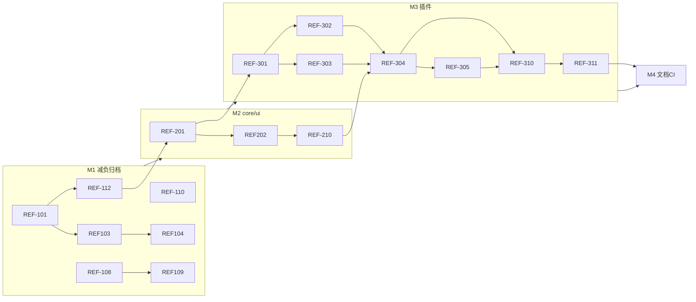

# Pixuli 重构计划

> **版本**：1.5  
> **更新**：2026-05-27（REF-410 TS/JS 统一策略；REF-511 拍照元数据、REF-606 回收站规划）  
> **状态**：规划中

本文档是仓库级重构的**总览与 Issue 追踪表**。详细设计见 `.local/`
目录（本地，不提交）或后续迁入 `docs/` 的正式文档。

---

## 一、目标与原则

### 1.1 产品底线（不变）

- 交付形态：**Web（含 PWA）**、**PC（Electron）**、**Mobile（Expo）**
  三端继续维护。
- 定位：以 Git 仓库为后端的**图床客户端**；**官方不提供** NestJS Server。
- 产品主张（对外一致）：**🖼️ Pixuli — AI-based image analysis, automatic tag
  generation, and batch
  processing**（AI 分析、自动标签、批处理与图床管理一体，见 §十）。

### 1.2 架构方向

| 方向     | 说明                                                                                        |
| -------- | ------------------------------------------------------------------------------------------- |
| 归档     | `packages/wasm`、`benchmark/`、`server/` 移出主构建路径                                     |
| 拆分     | `packages/common` → `@pixuli/core` + `@pixuli/ui`（M3 末 REF-311 整包删除 common）          |
| 插件     | `StorageProvider` + `provider-github` / `provider-gitee`                                    |
| 功能分层 | **L1** 基础业务 · **L2** 仅网格/列表 · **L3** 各端平台能力                                  |
| 展示裁剪 | 移除幻灯片、时间线、照片墙、3D 画廊及浏览模式路由                                           |
| 三端共享 | **逻辑层最大化复用**；UI 层 Web/Desktop 已合一，Mobile 目标与 PC 一样复用 Web 栈（见 §1.4） |

### 1.3 里程碑

| 里程碑 | 名称                | 目标日期（可填） | 说明                                                                                                                          |
| ------ | ------------------- | ---------------- | ----------------------------------------------------------------------------------------------------------------------------- |
| M1     | 减负与归档          |                  | 展示裁剪、wasm/server 归档、死代码删除                                                                                        |
| M2     | core / ui 拆分      |                  | 新建包、迁移 import、兼容层                                                                                                   |
| M3     | 存储插件 P0         |                  | Provider 接口、双端 imageStore、pluginId 配置、删除 `packages/common`                                                         |
| M4     | 文档与 CI           |                  | PRD/README/CI、docs/Wiki 梳理、**文档国际化（中/英）**；历史版本盘点与后续发布策略                                            |
| M5     | 平台能力 L3（持续） |                  | PWA、Desktop L3；**三端代码共享**（Capacitor / 逻辑层抽取，见 §1.4）；移动端拍照元数据（REF-511）                             |
| M6     | 产品体验与能力边界  |                  | 三端交互、UI 优化、性能边界、标签/AI、批处理、回收站（见 §十）；里程碑 [M6](https://github.com/trueLoving/Pixuli/milestone/6) |

### 1.4 三端代码最大化共享

**目标**：在保持 Web / Desktop /
Mobile 三端产品底线的前提下，**尽量少维护多套实现**——与 Desktop 复用 Web 一样，让 Mobile 尽可能复用
`apps/pixuli` + `@pixuli/ui` 的 Web 实现，而不是长期并行两套 UI 工程。

#### 1.4.1 现状（M3 进行中）

```text
┌─────────────────────────────────────────────────────────────────┐
│  apps/pixuli（Vite + React + DOM）     ← Web + Desktop 共用 UI   │
│    └── @pixuli/ui（exports "."）       图床 L1/L2 主界面          │
├─────────────────────────────────────────────────────────────────┤
│  apps/mobile（Expo + React Native）    ← 独立 UI 工程              │
│    └── @pixuli/ui/native               少量 RN 组件（EmptyState 等）│
├─────────────────────────────────────────────────────────────────┤
│  已共享：@pixuli/core、@pixuli/provider-*、i18n 文案模式、存储插件   │
│  仍分叉：imageStore / sourceStore、页面与导航、RN 专用组件与样式   │
└─────────────────────────────────────────────────────────────────┘
```

| 层级         | Web + Desktop                 | Mobile（当前）                                    | 共享程度                                  |
| ------------ | ----------------------------- | ------------------------------------------------- | ----------------------------------------- |
| **L3 平台**  | Electron 主进程、PWA          | Expo、原生模块、AsyncStorage                      | 各端独立（预期）                          |
| **L2 UI**    | `@pixuli/ui` web              | `apps/mobile/components/`\* + `@pixuli/ui/native` | **低**（两套界面）                        |
| **L1 业务**  | `apps/pixuli` hooks/stores    | `apps/mobile/stores/`\*                           | **中**（契约已对齐 Registry，实现仍双份） |
| **基础设施** | `@pixuli/core`、`provider-`\* | 同上                                              | **高**                                    |

结论：**Desktop 与 Web 已做到 UI 一套代码**；Mobile 与 Web
**不能**直接共用同一份 JSX（DOM ≠ RN 控件），除非改走 **Web 进壳** 或
**RN 统一 UI（RNW）**。

#### 1.4.2 可选路径（详述见设计文档）

正式技术分析：[02-Three-Platform-Design.md](docs/02-system-design/02-Three-Platform-Design.md)。

| 方案                     | 思路                                             | Mobile 与 Web 关系            | 维护成本                   | 体验                 |
| ------------------------ | ------------------------------------------------ | ----------------------------- | -------------------------- | -------------------- |
| **A：Capacitor**         | `apps/pixuli` 的 `dist` + 原生壳（WebView）      | **同一套 Web UI**，与 PC 一致 | **最低**（单 UI 代码库）   | WebView，偏 Web 手感 |
| **B：RNW**               | 以 RN 为唯一 UI，Web/Desktop 用 react-native-web | 一套 RN UI                    | 高（需重写现有 Vite 界面） | 移动端原生最好       |
| **C：双应用 + 加深共享** | 保留 `apps/mobile`，逻辑迁入 core/共享包         | 两套 UI，**L1 尽量一份**      | 中（长期仍双 UI）          | 原生体验最好         |

**计划倾向（与 06 文档决策一致）**：

1. **主路线（A）**：M3/M4 收尾后，在 M5 做 **Capacitor PoC
   → 试点 → 替代或并行下线 RN 工程**，使 Mobile 与 Desktop 一样直接消费
   `apps/pixuli`。
2. **过渡路线（C）**：在 A 未落地前，继续
   **抽取共享逻辑**（store 工厂、源管理、上传流程、筛选排序），避免 Mobile/Web 各改一遍；`@pixuli/ui/native`
   仅保留 RN 无法由 Web 覆盖的少量组件。
3. **不默认（B）**：除非产品明确要求「原生 UI + 单代码库」且接受重写 Web 端，否则不将 RNW 列为 M5 默认项。

#### 1.4.3 分阶段目标

| 阶段                   | 时机       | 交付物                                                                                                                                   |
| ---------------------- | ---------- | ---------------------------------------------------------------------------------------------------------------------------------------- |
| **P0 逻辑对齐**        | M3 末～M4  | `imageStore` / `sourceStore` 与 `StoragePluginRegistry`、`StoredSourceEntry` 行为一致；差异仅持久化适配器（localStorage / AsyncStorage） |
| **P1 共享包评估**      | M4         | 文档：哪些 hooks/流程可迁入 `@pixuli/core` 或新建 `packages/app-shared`（仅类型+无 UI 的 store 工厂）                                    |
| **P2 Capacitor PoC**   | M5         | `apps/pixuli` 增加 Capacitor 配置；真机验证相机/相册/文件；`Capacitor.isNativePlatform()` 分支                                           |
| **P3 三端单工程发布**  | M5+        | CI 产出 Web / Desktop / iOS / Android；Wiki「三端说明」与 REF-501 能力矩阵对齐                                                           |
| **P4 RN 退场（可选）** | PoC 通过后 | `apps/mobile` 标记 deprecated，版本冻结；或仅保留极简壳调试用                                                                            |

#### 1.4.4 原则与边界

- **优先共享**：类型、Registry、Provider、配置导入导出、列表/上传/删除**业务流程**；UI 仅在 A 落地前按平台拆分。
- **禁止**：为「共享」而把 `@pixuli/ui`
  web 组件直接 import 进 RN（无 DOM 会失败）；应走 **子路径**（`./native`）或
  **Capacitor**。
- **L3 仍各端实现**：PWA、Electron 离线/更新、Capacitor 插件、Expo 原生能力——不强行塞进 core。
- **验收口径**：同一用户故事（配置源 → 列表 → 上传 → 删除）在三端**行为一致**；代码层面以「UI 源码是否只有
  `apps/pixuli` 一份」为长期 KPI。

### 1.5 工程基线（跨里程碑）

以下专项见 **§九**，并已登记 Issue **REF-410～414**：

| 主题               | 要点                                                                                 |
| ------------------ | ------------------------------------------------------------------------------------ |
| **TS / JS 一致**   | 禁止同一能力域 TS+JS 混用；**默认 TypeScript**，极少数 Node/Vercel 薄 `.js` 需文档化 |
| **插件 Host 集成** | Provider 除运行时外，可能需改 Vite/Electron/Serverless 环境（Gitee 代理为先例）      |
| **测试金字塔**     | 现状以单元测试为主；**集成 / 冒烟**在基线版本稳定后设计（REF-409 后）                |
| **AI 编程辅助**    | 补充 Agent 规则与 Skill，降低重构期上下文成本                                        |

### 1.6 产品体验与能力边界（M6）

三端融合后交互需统一设计；图床主界面（侧栏 + 主内容 + 图片操作）待优化；大规模图片需明确**性能边界**（分页、懒加载、降级）；标签/描述与
**AI 自动分析**、**批处理**、**回收站（软删除）**需与产品 tagline 对齐。详见
**§十**，Issue **REF-601～606**。

### 1.7 文档国际化（中 / 英）

**现状**：`docs/`
内 PRD、系统设计、业务设计等**正文以中文为主**；仓库根 README、CHANGELOG、CONTRIBUTING 等为**英文**，语言分裂；GitHub
Wiki 尚未统一双语策略。

**目标**：支持中文与英文两套可读文档，**不**追求逐句镜像的全量同步；优先让用户向与协作者入门文档英文化，控制维护成本。专项 Issue：**REF-415**（M4，P2）。

**设计原则（低维护）**

| 原则                     | 说明                                                                                                               |
| ------------------------ | ------------------------------------------------------------------------------------------------------------------ |
| **单一事实源（SSOT）**   | 每种文档**只选一个 canonical 语言**撰写与评审；另一语言为**派生/翻译副本**，文首互链                               |
| **镜像目录、不搬动中文** | 现行中文路径保持不变（`docs/01-product/…`）；英文增量放入 **`docs/en/`** 同级镜像，避免大规模 rename               |
| **分层翻译**             | P0 用户向（教程、Wiki 源稿、快速开始）→ P1 产品向（PRD 摘要、裁剪清单）→ P2 技术向（系统设计，按需、可长期仅中文） |
| **不翻译稳定标识**       | 包名、`REF-*`、Issue 号、路由、代码块、API 路径保持英文原文                                                        |
| **变更联动而非实时双写** | 改中文 SSOT 后，在同一 PR 或跟进 Issue 更新英文副本；可选 CI 脚本对比 `mtime`/frontmatter 提示陈旧                 |

**目录与互链（目标态）**

```text
docs/
├── README.md                 # 语言枢纽：中/英索引、阅读路径
├── 01-product/               # 中文 SSOT（现状）
├── 02-system-design/
├── 03-business-design/
├── backlog.md
└── en/                       # 英文镜像（逐步补齐，路径与上层对应）
    ├── README.md
    ├── 01-product/
    ├── 02-system-design/     # 可选；P2 再补
    └── …
```

文首 frontmatter（建议）：

```yaml
---
lang: zh-CN # 或 en
title: …
translation_of: docs/en/01-product/01-Product-Requirements-Specification.md # 可选，指向对照稿
---
```

**交互与发现**

| 触点               | 做法                                                                                                                                         |
| ------------------ | -------------------------------------------------------------------------------------------------------------------------------------------- |
| `docs/README.md`   | 顶部语言切换说明 + 索引表分「中文 \| English」列                                                                                             |
| 各文档文首         | `> **English**：[…](../en/…)` 或 `> **中文**：[…](../01-product/…)`                                                                          |
| 根 `README.md`     | 已有英文；增加「[中文文档](docs/README.md)」链回枢纽                                                                                         |
| GitHub Wiki        | 中文页树为主；英文并列首页（如 `Home` / `Usage-Guide`），源稿来自 `docs/en/01-product/`，**禁止** Wiki 与 `docs/` 第三份分叉（REF-408 约束） |
| `REFACTOR_PLAN.md` | 维持中文（内部追踪）；可选文首英文摘要一段                                                                                                   |

**不推荐方案**

- 全仓库「每个 md 拆成 `foo.zh.md` + `foo.en.md`」并排维护——PR 体积翻倍、易漏改
- 无 SSOT 的机器翻译覆盖 PRD/系统设计——术语与架构表述不可控
- 将中文整体迁入 `docs/zh-CN/` 再建 `en/`——rename 成本高，与 REF-407 纠错冲突

**分阶段（REF-415 验收范围）**

1. **策略文档**：`docs/02-system-design/13-documentation-i18n.md`（或
   `docs/meta/i18n-policy.md`）固化上述约定
2. **枢纽**：更新 `docs/README.md` 双语索引；`docs/en/README.md` 英文导航
3. **首批英文**：`02-Product-User-Manual.md`、`01-Product-Requirements-Specification.md`
   摘要摘要版（用户/协作者优先）
4. **可选工具**：`scripts/check-docs-i18n.ts` — 配置了 `translation_of`
   的文件对在 zh 变更时 warn

**依赖与顺序**：在
**REF-407**（中文纠错）、**REF-408**（Wiki 基线）之后推进；英文内容基于已纠错的中文 SSOT 翻译，避免翻旧稿。

---

## 二、GitHub Issue 操作步骤

按顺序执行一次即可；之后每个重构任务对应一条 Issue，用第三节表格驱动。

### 步骤 0：前置准备

1. 确认对仓库有 **Issue / Milestone / Label** 权限（Owner 或 Maintainer）。
2. 安装并登录 [GitHub CLI](https://cli.github.com/)（可选，推荐）：

```bash
gh auth login
gh auth status
cd /path/to/Pixuli
gh repo view   # 确认当前仓库正确
```

1. 浏览器方式：打开 `https://github.com/<owner>/Pixuli/issues`。

---

### 步骤 1：创建 Milestones（里程碑）

**Web UI**

1. 仓库 → **Issues** → 右侧 **Milestones** → **New milestone**。
2. 依次创建（Due date 可留空或按排期填写）：

| Title            | 说明                        |
| ---------------- | --------------------------- |
| `M1-减负与归档`  | 展示裁剪、wasm/server 归档  |
| `M2-core-ui拆分` | @pixuli/core + @pixuli/ui   |
| `M3-存储插件P0`  | StorageProvider + providers |
| `M4-文档与CI`    | PRD/README/CI               |
| `M5-平台能力L3`  | PWA/桌面离线等（持续）      |

**CLI**

```bash
gh api repos/{owner}/{repo}/milestones -f title="M1-减负与归档" -f description="展示裁剪、wasm/server 归档"
# 将 {owner}/{repo} 换成实际值，或：
gh milestone create "M1-减负与归档" --description "展示裁剪、wasm/server 归档"
gh milestone create "M2-core-ui拆分" --description "core + ui 包拆分"
gh milestone create "M3-存储插件P0" --description "StorageProvider 插件体系"
gh milestone create "M4-文档与CI" --description "文档与 CI 对齐"
gh milestone create "M5-平台能力L3" --description "L3 平台能力"
```

---

### 步骤 2：创建 Labels（标签）

**Web UI**：Issues → 任意 Issue → 右侧 **Labels** → 齿轮 **Edit labels** → **New
label**。

**CLI（批量示例）**

```bash
# 通用
gh label create "refactor" --color "1D76DB" --description "仓库重构"
for m in m1 m2 m3 m4 m5; do gh label create "$m" --color "EDEDED" --description "里程碑 $m"; done
gh label create "priority:P0" --color "B60205" --description "必须优先"
gh label create "priority:P1" --color "D93F0B" --description "重要"
gh label create "priority:P2" --color "FBCA04" --description "可延后"
# 范围
for a in web desktop mobile core ui plugin; do
  gh label create "area:$a" --color "C5DEF5" --description "影响范围: $a"
done
# 类型
gh label create "type:removal" --color "FFFFFF" --description "删除代码/功能"
gh label create "type:docs" --color "0075CA" --description "文档"
```

已存在同名 label 时会报错，可忽略。

| Label                                       | 含义          |
| ------------------------------------------- | ------------- |
| `refactor`                                  | 重构总类      |
| `m1` … `m5`                                 | 对应里程碑    |
| `priority:P0` / `P1` / `P2`                 | 优先级        |
| `area:web` / `area:desktop` / `area:mobile` | 影响端        |
| `area:core` / `area:ui` / `area:plugin`     | 影响包        |
| `type:removal`                              | 删除功能/代码 |
| `type:docs`                                 | 仅文档        |

---

### 步骤 3：按 REFACTOR_PLAN 创建 Issues

对第三节表格 **每一行** 创建一条 Issue（共 44 条，建议
**先 M1 再 M2…**，同里程碑内按 Depends on 顺序）。

#### 方式 A：Web UI（适合少量或首次熟悉）

1. **Issues** → **New issue**。
2. **Title**：复制表格「建议标题」列（如 `[M1] 移除 Web 幻灯片与时间线路由`）。
3. **Description**：

- 展开该里程碑下方的 `<details>` → 找到对应 **REF-xxx** 正文模板，粘贴；
- 文首可加：`计划编号: REF-101`、`**Depends on**: REF-108`（创建后再改为
  `#12`）。

4. 右侧设置：

- **Assignees**：负责人（可选）
- **Labels**：按表格 Labels 列勾选（如
  `refactor`、`m1`、`area:web`、`priority:P0`）
- **Projects**：若已建看板，加入对应列（见步骤 5）
- **Milestone**：选 `M1-减负与归档` 等

5. **Submit new issue**。
6. 记下生成的编号（如 `#42`），填回本文档第三节该行的 **GitHub #** 列。

#### 方式 B：GitHub CLI（适合批量）

1. （可选）为每条 Issue 建正文文件：

```bash
mkdir -p .local/issue-bodies
# 将 REFACTOR_PLAN 中 REF-101 模板保存为 .local/issue-bodies/ref-101.md
```

1. 创建单条 Issue：

```bash
gh issue create \
  --title "[M1] 移除 Web 幻灯片与时间线路由" \
  --label "refactor,m1,area:web,type:removal,priority:P0" \
  --milestone "M1-减负与归档" \
  --body-file .local/issue-bodies/ref-101.md
```

1. 终端会输出 `https://github.com/.../issues/42`，将 `42` 填入 **GitHub #** 列。

#### 创建顺序建议（M1 示例）

| 顺序 | ID                        | 说明                    |
| ---- | ------------------------- | ----------------------- |
| 1    | REF-108、REF-110、REF-111 | 无依赖，可并行          |
| 2    | REF-101、REF-102          | 无依赖                  |
| 3    | REF-103                   | 依赖 REF-101            |
| 4    | REF-104、REF-105、REF-106 | 依赖 REF-103 等         |
| 5    | REF-107、REF-109          | 依赖前置项              |
| 6    | REF-112                   | M1 回归，最后开或最后关 |

---

### 步骤 4：填写 Issue 依赖关系

GitHub 免费版无原生「Blocked by」字段时，用以下任一方式：

**方式 1：Description 里写（推荐）**

```markdown
## 依赖

- Blocked by: #38, #40
- 计划编号: REF-103
```

**方式 2：Tasklist 关联**

在父 Issue 正文中：

```markdown
- [ ] #42 REF-101 移除路由
- [ ] #43 REF-103 删除 common 组件
```

**方式 3：Projects 自定义字段**

若使用 Projects v2，增加 **Blocked by** 关系字段（需仓库启用 Projects）。

创建完所有 Issue 后，把表格 **Depends on** 列的 `REF-xxx` 全部替换为 `#数字`。

---

### 步骤 5：创建 Project 看板（可选）

1. 仓库顶部 **Projects** → **Link a project** → **New project**。
2. 模板选 **Board**。
3. 建议列：

| 列名        | 说明               |
| ----------- | ------------------ |
| Backlog     | 未开始             |
| Ready       | 依赖已满足，可开工 |
| In Progress | 开发中             |
| In Review   | PR 已提交          |
| Done        | 已合并             |

1. **Add item** → 从 Issues 批量加入 M1 的 12 条；或设置自动包含带 `refactor`
   标签的 Issue。
2. 拖拽卡片随进度移动；与 Milestone 筛选配合使用。

---

### 步骤 6：日常开发时更新 Issue

| 动作       | 操作                                                         |
| ---------- | ------------------------------------------------------------ |
| 开始任务   | 指派 Assignee；Project 拖到 **In Progress**；评论 `开始处理` |
| 提交代码   | PR 标题含 `REF-101` 或 `Fixes #42`                           |
| PR 合并后  | Issue 自动关闭（若 PR 含 `Fixes #42` / `Closes #42`）        |
| 仅部分完成 | 在 Issue 勾选 Tasklist `- [ ]` → `- [x]`，勿关闭 Issue       |
| 阻塞       | 评论说明阻塞原因，@ 相关人                                   |

**PR 关联示例**

```markdown
## Summary

移除 slideshow/timeline 路由

## Issues

Closes #42 Related: REF-101
```

---

### 步骤 7：回填 REFACTOR_PLAN.md

每创建一条 Issue 后更新第三节表格：

```markdown
| REF-101 | ... | #42 | ✅ |
```

里程碑结束时更新 **第六节 进度汇总** 的「已完成」数量。

---

### 步骤 8：关闭与验收

1. 对照 Issue 正文 **验收标准** 逐项确认。
2. 全部勾选后：

- 若 PR 已用 `Closes #n`，合并即关闭；
- 否则 Issue 页 **Close issue** → 选 **Completed**。

3. M1 回归 Issue（REF-112）应在 REF-101–111 均关闭后再关。
4. Milestone 页查看进度；全部 Issue 关闭后可 **Close milestone**。

---

### 步骤 9：筛选与视图（日常查看）

| 需求       | 操作                                    |
| ---------- | --------------------------------------- |
| 只看 M1    | Issues 搜索 `milestone:"M1-减负与归档"` |
| 只看 P0    | `label:priority:P0 label:refactor`      |
| 只看未关闭 | `is:open label:refactor`                |
| 我负责的   | `assignee:@me is:open`                  |

保存搜索：Issues 搜索框输入条件 → **Save**。

---

### 快速对照：表格列 → GitHub 字段

| REFACTOR_PLAN 列 | GitHub 字段                 |
| ---------------- | --------------------------- |
| 建议标题         | Issue title                 |
| Labels           | Labels（多选）              |
| 优先级           | Label `priority:P0` 等      |
| Depends on       | Description / Projects 阻塞 |
| GitHub #         | 创建后 Issue 编号           |
| 状态             | ⬜/✅ 或 Issue open/closed  |

---

## 三、Issue 追踪总表

**列说明**：`ID` 为计划内编号；`GitHub #` 创建 Issue 后手工填写便于互链。

### 里程碑 M1 — 减负与归档

| ID      | 建议标题                                                                                       | Labels                                               | 优先级 | Depends on | GitHub #                                              | 状态 |
| ------- | ---------------------------------------------------------------------------------------------- | ---------------------------------------------------- | ------ | ---------- | ----------------------------------------------------- | ---- |
| REF-101 | [M1] 移除 Web 幻灯片与时间线路由及页面                                                         | refactor, m1, area:web, type:removal, priority:P0    | P0     | —          | [#46](https://github.com/trueLoving/Pixuli/issues/46) | ✅   |
| REF-102 | [M1] 移除 Web 占位页 analyze / edit / generate                                                 | refactor, m1, area:web, type:removal, priority:P0    | P0     | —          | [#47](https://github.com/trueLoving/Pixuli/issues/47) | ✅   |
| REF-103 | [M1] 删除 common 增强展示组件（slideshow/timeline/photo-wall/gallery-3d/browse-mode-switcher） | refactor, m1, area:ui, type:removal, priority:P0     | P0     | #46        | [#48](https://github.com/trueLoving/Pixuli/issues/48) | ✅   |
| REF-104 | [M1] 移除 pptxgenjs 与幻灯片相关依赖                                                           | refactor, m1, type:removal, priority:P0              | P0     | #48        | [#49](https://github.com/trueLoving/Pixuli/issues/49) | ✅   |
| REF-105 | [M1] 清理 browseMode 状态与路由同步逻辑                                                        | refactor, m1, area:web, priority:P0                  | P0     | #46        | [#50](https://github.com/trueLoving/Pixuli/issues/50) | ✅   |
| REF-106 | [M1] 移动端移除浏览模式 Tab 与 SlideShowPlayer                                                 | refactor, m1, area:mobile, type:removal, priority:P0 | P0     | #48        | [#51](https://github.com/trueLoving/Pixuli/issues/51) | ✅   |
| REF-107 | [M1] 更新 Web 侧栏/菜单为「图床 + 工具 + 设置」结构                                            | refactor, m1, area:web, priority:P1                  | P1     | #46, #47   | [#52](https://github.com/trueLoving/Pixuli/issues/52) | ✅   |
| REF-108 | [M1] 归档 packages/wasm 与 benchmark                                                           | refactor, m1, type:removal, priority:P0              | P0     | —          | [#54](https://github.com/trueLoving/Pixuli/issues/54) | ✅   |
| REF-109 | [M1] 移除 Electron WASM IPC 与 pixuli-wasm 依赖                                                | refactor, m1, area:desktop, priority:P0              | P0     | #54        | [#55](https://github.com/trueLoving/Pixuli/issues/55) | ✅   |
| REF-110 | [M1] 归档 server/ 并移出 pnpm workspace                                                        | refactor, m1, type:removal, priority:P0              | P0     | —          | [#56](https://github.com/trueLoving/Pixuli/issues/56) | ✅   |
| REF-111 | [M1] 删除 performance 与 devtools 未接入模块                                                   | refactor, m1, area:ui, type:removal, priority:P0     | P0     | —          | [#57](https://github.com/trueLoving/Pixuli/issues/57) | ✅   |
| REF-112 | [M1] M1 回归：web / desktop / mobile 冒烟 + vitest                                             | refactor, m1, priority:P0                            | P0     | #46–#57    | [#58](https://github.com/trueLoving/Pixuli/issues/58) | ✅   |

**M1 已关联 GitHub Issue（计划编号 ↔ Issue）**

| 计划 ID | GitHub Issue                                            |
| ------- | ------------------------------------------------------- |
| REF-101 | [#46](https://github.com/trueLoving/Pixuli/issues/46)   |
| REF-102 | [#47](https://github.com/trueLoving/Pixuli/issues/47)   |
| REF-103 | [#48](https://github.com/trueLoving/Pixuli/issues/48)   |
| REF-104 | [#49](https://github.com/trueLoving/Pixuli/issues/49)   |
| REF-105 | [#50](https://github.com/trueLoving/Pixuli/issues/50)   |
| REF-106 | [#51](https://github.com/trueLoving/Pixuli/issues/51)   |
| REF-107 | [#52](https://github.com/trueLoving/Pixuli/issues/52)   |
| REF-108 | [#54](https://github.com/trueLoving/Pixuli/issues/54)   |
| REF-109 | [#55](https://github.com/trueLoving/Pixuli/issues/55)   |
| REF-110 | [#56](https://github.com/trueLoving/Pixuli/issues/56)   |
| REF-111 | [#57](https://github.com/trueLoving/Pixuli/issues/57)   |
| REF-112 | [#58](https://github.com/trueLoving/Pixuli/issues/58)   |
| REF-201 | [#60](https://github.com/trueLoving/Pixuli/issues/60)   |
| REF-202 | [#61](https://github.com/trueLoving/Pixuli/issues/61)   |
| REF-203 | [#62](https://github.com/trueLoving/Pixuli/issues/62)   |
| REF-204 | [#69](https://github.com/trueLoving/Pixuli/issues/69)   |
| REF-205 | [#63](https://github.com/trueLoving/Pixuli/issues/63)   |
| REF-206 | [#64](https://github.com/trueLoving/Pixuli/issues/64)   |
| REF-207 | [#65](https://github.com/trueLoving/Pixuli/issues/65)   |
| REF-208 | [#66](https://github.com/trueLoving/Pixuli/issues/66)   |
| REF-209 | [#67](https://github.com/trueLoving/Pixuli/issues/67)   |
| REF-210 | [#68](https://github.com/trueLoving/Pixuli/issues/68)   |
| REF-301 | [#70](https://github.com/trueLoving/Pixuli/issues/70)   |
| REF-302 | [#71](https://github.com/trueLoving/Pixuli/issues/71)   |
| REF-303 | [#72](https://github.com/trueLoving/Pixuli/issues/72)   |
| REF-304 | [#73](https://github.com/trueLoving/Pixuli/issues/73)   |
| REF-305 | [#74](https://github.com/trueLoving/Pixuli/issues/74)   |
| REF-306 | [#75](https://github.com/trueLoving/Pixuli/issues/75)   |
| REF-307 | [#76](https://github.com/trueLoving/Pixuli/issues/76)   |
| REF-308 | [#77](https://github.com/trueLoving/Pixuli/issues/77)   |
| REF-309 | [#78](https://github.com/trueLoving/Pixuli/issues/78)   |
| REF-310 | [#79](https://github.com/trueLoving/Pixuli/issues/79)   |
| REF-311 | [#100](https://github.com/trueLoving/Pixuli/issues/100) |
| REF-312 | [#109](https://github.com/trueLoving/Pixuli/issues/109) |
| REF-313 | [#123](https://github.com/trueLoving/Pixuli/issues/123) |
| REF-401 | [#80](https://github.com/trueLoving/Pixuli/issues/80)   |
| REF-402 | [#81](https://github.com/trueLoving/Pixuli/issues/81)   |
| REF-403 | [#82](https://github.com/trueLoving/Pixuli/issues/82)   |
| REF-404 | [#83](https://github.com/trueLoving/Pixuli/issues/83)   |
| REF-405 | [#84](https://github.com/trueLoving/Pixuli/issues/84)   |
| REF-406 | [#85](https://github.com/trueLoving/Pixuli/issues/85)   |
| REF-407 | [#111](https://github.com/trueLoving/Pixuli/issues/111) |
| REF-408 | [#112](https://github.com/trueLoving/Pixuli/issues/112) |
| REF-409 | [#113](https://github.com/trueLoving/Pixuli/issues/113) |
| REF-501 | [#86](https://github.com/trueLoving/Pixuli/issues/86)   |
| REF-502 | [#87](https://github.com/trueLoving/Pixuli/issues/87)   |
| REF-503 | [#88](https://github.com/trueLoving/Pixuli/issues/88)   |
| REF-504 | [#89](https://github.com/trueLoving/Pixuli/issues/89)   |
| REF-505 | [#90](https://github.com/trueLoving/Pixuli/issues/90)   |
| REF-506 | [#116](https://github.com/trueLoving/Pixuli/issues/116) |
| REF-507 | [#117](https://github.com/trueLoving/Pixuli/issues/117) |
| REF-508 | [#119](https://github.com/trueLoving/Pixuli/issues/119) |
| REF-509 | [#118](https://github.com/trueLoving/Pixuli/issues/118) |
| REF-510 | [#120](https://github.com/trueLoving/Pixuli/issues/120) |
| REF-410 | [#125](https://github.com/trueLoving/Pixuli/issues/125) |
| REF-411 | [#126](https://github.com/trueLoving/Pixuli/issues/126) |
| REF-412 | [#127](https://github.com/trueLoving/Pixuli/issues/127) |
| REF-413 | [#128](https://github.com/trueLoving/Pixuli/issues/128) |
| REF-414 | [#129](https://github.com/trueLoving/Pixuli/issues/129) |
| REF-415 | [#138](https://github.com/trueLoving/Pixuli/issues/138) |
| REF-601 | [#130](https://github.com/trueLoving/Pixuli/issues/130) |
| REF-602 | [#131](https://github.com/trueLoving/Pixuli/issues/131) |
| REF-603 | [#132](https://github.com/trueLoving/Pixuli/issues/132) |
| REF-604 | [#133](https://github.com/trueLoving/Pixuli/issues/133) |
| REF-605 | [#134](https://github.com/trueLoving/Pixuli/issues/134) |
| REF-511 | [#141](https://github.com/trueLoving/Pixuli/issues/141) |
| REF-606 | [#140](https://github.com/trueLoving/Pixuli/issues/140) |

> **说明**：#53 为已合并 PR（REF-101～103 批次），非独立计划 Issue。

REF-101 ~ REF-112 Issue 正文模板（点击展开）

**REF-101**

```markdown
## 背景

产品仅保留网格+列表浏览，幻灯片与时间线独立路由不再维护。

## 任务

- [ ] 删除 `apps/pixuli/src/pages/slideshow`、`pages/timeline`
- [ ] 从 `router/routes.tsx`、`router/config.ts` 移除 SLIDESHOW、TIMELINE
- [ ] 旧路径重定向到 `/photos`（可选）
- [ ] 删除 `utils/navigation.ts` 中 timeline 导航辅助

## 验收

- [ ] `/photos`、`/compress`、`/convert` 可访问
- [ ] 无对已删页面的引用
```

**REF-102**

```markdown
## 任务

- [ ] 删除 `pages/analyze`、`edit`、`generate`
- [ ] 移除 ROUTES 与侧栏项

## 验收

- [ ] 构建无报错；菜单无 Coming Soon 入口
```

**REF-103**

```markdown
## 任务

- [ ] 删除 `packages/common/src/components/image/gallery-3d`
- [ ] 删除 `photo-wall`、`timeline`
- [ ] 删除 `components/features/slide-show`、`browse-mode-switcher`
- [ ] 更新 `index.ts`、`locales/index.ts`、Sidebar

## 验收

- [ ] 全仓库无上述模块引用
```

**REF-104** — 移除 `pptxgenjs`；`pnpm why pptxgenjs` 无结果。

**REF-105** — 清理 `useUIStore.browseMode`、`useRouteSync` 与 browse 相关字段。

**REF-106** — 删 `app/(tabs)/browse-mode.tsx`、mobile `SlideShowPlayer`；更新
`_layout` tabs、DrawerMenu、SearchAndFilter。

**REF-107** — 侧栏仅：图片、压缩、转换、设置。

**REF-108** — `archive/wasm/` +
workspace 移除 wasm/benchmark；更新 README 去掉 Rust。

**REF-109** — 删 `wasmService.ts`、preload 注释；`apps/pixuli` 去掉
`pixuli-wasm`。

**REF-110** — `archive/server/`；workspace 移除 server；清空 `pixuliService`
空壳。

**REF-111** — 删 `performance/`、`components/dev/devtools/`。

**REF-112** — `pnpm test`；`dev:web` / `dev:desktop` / `dev:mobile`
主流程冒烟。已固化 `pnpm run ci` 与
`.github/workflows/ci.yml`（手动触发；Vitest + Web/Desktop 构建 + Mobile tsc）。

---

### 里程碑 M2 — core / ui 拆分

| ID      | 建议标题                                                       | Labels                                            | 优先级 | Depends on   | GitHub #                                              | 状态 |
| ------- | -------------------------------------------------------------- | ------------------------------------------------- | ------ | ------------ | ----------------------------------------------------- | ---- |
| REF-201 | [M2] 新建 @pixuli/core 包（types/utils/platform/operationLog） | refactor, m2, area:core, priority:P0              | P0     | #58          | [#60](https://github.com/trueLoving/Pixuli/issues/60) | ✅   |
| REF-202 | [M2] 新建 @pixuli/ui 包（web 入口 + native 子路径）            | refactor, m2, area:ui, priority:P0                | P0     | #60          | [#61](https://github.com/trueLoving/Pixuli/issues/61) | ✅   |
| REF-203 | [M2] 迁移 L1/L2 组件至 ui（不含已删展示组件）                  | refactor, m2, area:ui, priority:P0                | P0     | #61, #48     | [#62](https://github.com/trueLoving/Pixuli/issues/62) | ✅   |
| REF-204 | [M2] webImageProcessor 与 toast 迁入 ui                        | refactor, m2, area:ui, priority:P1                | P1     | #61          | [#69](https://github.com/trueLoving/Pixuli/issues/69) | ✅   |
| REF-205 | [M2] index.native 停止导出 webImageProcessor                   | refactor, m2, area:core, priority:P0              | P0     | #60          | [#63](https://github.com/trueLoving/Pixuli/issues/63) | ✅   |
| REF-206 | [M2] apps/pixuli 切换为 @pixuli/core + @pixuli/ui              | refactor, m2, area:web, area:desktop, priority:P0 | P0     | #62          | [#64](https://github.com/trueLoving/Pixuli/issues/64) | ✅   |
| REF-207 | [M2] apps/mobile 切换 import（core + ui/native）               | refactor, m2, area:mobile, priority:P0            | P0     | #60, #61     | [#65](https://github.com/trueLoving/Pixuli/issues/65) | ✅   |
| REF-208 | [M2] 保留 pixuli-common 兼容 re-export（deprecated）           | refactor, m2, priority:P1                         | P1     | #64, #65     | [#66](https://github.com/trueLoving/Pixuli/issues/66) | ✅   |
| REF-209 | [M2] ESLint 边界：禁止 core→ui、provider→ui                    | refactor, m2, priority:P2                         | P2     | #60          | [#67](https://github.com/trueLoving/Pixuli/issues/67) | ✅   |
| REF-210 | [M2] M2 回归与删除空壳 packages/common                         | refactor, m2, priority:P0                         | P0     | #64–#67, #69 | [#68](https://github.com/trueLoving/Pixuli/issues/68) | ✅   |

REF-201 ~ REF-210 Issue 正文模板

**REF-201** — 创建
`packages/core`，exports：`types`、`plugins`（类型占位）、`platform`、`utils`、`locales`。

**REF-202** — 创建 `packages/ui`，`exports["."]` web，`exports["./native"]`
native。

**REF-203** — ImageBrowser/Upload/Preview/Config/Layout 等迁入 ui。

**REF-204** — `services/imageProcessor`、`utils/toast` → ui。

**REF-205** — mobile 仅 `@pixuli/core` + `@pixuli/ui/native`。

**REF-206** — 替换 `@packages/common/src` 路径；更新 tsconfig paths。

**REF-207** — mobile stores/i18n 改 import。

**REF-208** — common 仅 re-export 并 JSDoc `@deprecated`。

**REF-209** — `import/no-restricted-paths` 规则。

**REF-210** — 全量 test + 删除 common（或留空壳一版）。

---

### 里程碑 M3 — 存储插件体系 P0

| ID      | 建议标题                                                     | Labels                                                 | 优先级 | Depends on         | GitHub #                                                | 状态 |
| ------- | ------------------------------------------------------------ | ------------------------------------------------------ | ------ | ------------------ | ------------------------------------------------------- | ---- |
| REF-301 | [M3] 在 core 定义 StorageProvider 与 Registry                | refactor, m3, area:core, area:plugin, priority:P0      | P0     | #60                | [#70](https://github.com/trueLoving/Pixuli/issues/70)   | ✅   |
| REF-302 | [M3] 实现 @pixuli/provider-github                            | refactor, m3, area:plugin, priority:P0                 | P0     | #70                | [#71](https://github.com/trueLoving/Pixuli/issues/71)   | ✅   |
| REF-303 | [M3] 实现 @pixuli/provider-gitee                             | refactor, m3, area:plugin, priority:P0                 | P0     | #70                | [#72](https://github.com/trueLoving/Pixuli/issues/72)   | ✅   |
| REF-304 | [M3] 重构 apps/pixuli imageStore 使用 Registry               | refactor, m3, area:web, area:desktop, priority:P0      | P0     | #71, #72, #64      | [#73](https://github.com/trueLoving/Pixuli/issues/73)   | ✅   |
| REF-305 | [M3] 重构 apps/mobile imageStore 使用 Registry               | refactor, m3, area:mobile, priority:P0                 | P0     | #71, #72, #65      | [#74](https://github.com/trueLoving/Pixuli/issues/74)   | ✅   |
| REF-306 | [M3] 配置持久化增加 pluginId（导入/导出）                    | refactor, m3, priority:P1                              | P1     | #73, #74           | [#75](https://github.com/trueLoving/Pixuli/issues/75)   | ✅   |
| REF-307 | [M3] 设置页源列表对接 registry.listManifests                 | refactor, m3, area:ui, priority:P1                     | P1     | #75                | [#76](https://github.com/trueLoving/Pixuli/issues/76)   | ✅   |
| REF-308 | [M3] 编写插件开发文档（现合并于 04-Plugin-System §第二部分） | refactor, m3, type:docs, priority:P1                   | P1     | #70                | [#77](https://github.com/trueLoving/Pixuli/issues/77)   | ✅   |
| REF-309 | [M3] provider 包单元测试迁移                                 | refactor, m3, priority:P1                              | P1     | #71, #72           | [#78](https://github.com/trueLoving/Pixuli/issues/78)   | ✅   |
| REF-310 | [M3] M3 回归：GitHub/Gitee 全流程                            | refactor, m3, priority:P0                              | P0     | #73–#78, #109      | [#79](https://github.com/trueLoving/Pixuli/issues/79)   | ✅   |
| REF-311 | [M3] 删除 `packages/common` 整包                             | refactor, m3, type:removal, priority:P0                | P0     | #73, #74, #78, #79 | [#100](https://github.com/trueLoving/Pixuli/issues/100) | ✅   |
| REF-312 | [Bug] 编辑仓库源时配置表单未回显                             | bug, refactor, m3, area:web, area:desktop, priority:P1 | P1     | #75, #76           | [#109](https://github.com/trueLoving/Pixuli/issues/109) | ✅   |
| REF-313 | [Bug] Gitee 源图片 CORS / 代理导致无法加载                   | bug, refactor, m3, area:web, area:desktop, priority:P0 | P0     | #72, #79           | [#123](https://github.com/trueLoving/Pixuli/issues/123) | ✅   |

REF-301 ~ REF-313 Issue 正文模板

**REF-301**
— 接口：`StorageProvider`、`StoragePluginManifest`、`StoragePluginRegistry`、`ProviderContext`（含 PlatformAdapter）。

**REF-302/303** — 自 `githubStorageService` / `giteeStorageService` 迁移；导出
`registerXxxProvider(registry)`。

**REF-304/305** —
`storageService: StorageProvider | null`；`registry.create(pluginId, ctx)`。

**REF-306** — `StoredSourceEntry { pluginId, label, config }`。

**REF-307** — 添加源 UI 按 manifest 列表渲染。

**REF-308** —
[04-Plugin-System.md §第二部分](docs/02-system-design/04-Plugin-System.md#第二部分-存储插件开发指南)：内置/热加载模式、命名与安全、最小 example 骨架 + 检查清单。

**REF-309** — 存储单测已在 REF-302/303 迁入 provider 包；本项对齐
`StorageProvider` 契约（`configure` + `listImages`/`updateImageMetadata`）、共用
`helpers.ts`、兼容层冒烟测，并更新 `04-Plugin-System.md` §第二部分 §9.1。
`pixuli-common` 仅余 `logInterceptorService`
单测（REF-311 随包删除或迁入 app）。

**REF-310** —
[04-Plugin-System.md §第三部分](docs/02-system-design/04-Plugin-System.md#第三部分-m3-存储插件回归清单)：配置源、列表、切换源、导入导出、编辑回显等自动化单测 +
`pnpm test`
全绿（540+）；上传/删除等依赖真实 Token 的用例在清单中标注为手工签收。REF-312（#109）已合入本分支。

**REF-312** — 编辑源时配置弹窗从 `sourceStore` 回显
`StoredSourceEntry.config`（见
[#109](https://github.com/trueLoving/Pixuli/issues/109)）：`uiStore.openConfigModalForEdit`
快照 + `resolveModalRepoConfig` 按 `editingSourceId`
解析；`configModalStorageType` 按正在编辑的 `pluginId`
打开对应 Modal；Demo 模式不屏蔽编辑回显；`GiteeConfigModal` `useLayoutEffect`
同步表单；`useSelectedSourceSync` 编辑态暂停覆盖 `imageStore`。

**REF-311** — 已删除
`packages/common`（`pixuli-common`）整包：应用无 workspace 依赖；`vitest.workspace`
移除 common；未使用的 `logInterceptorService` 随包删除；操作日志与存储契约在
`@pixuli/core` /
`@pixuli/provider-*`；核心 README 与回归清单已更新。`grep pixuli-common` 在
`apps/`、`packages/` 源码为0（`archive/` 与历史设计文档除外）。

**REF-313** —
Gitee 图片代理（[#123](https://github.com/trueLoving/Pixuli/issues/123)）✅：

- **根因**：`gitee.com/.../raw/...` 返回 **302**
  到 CDN（`raw.giteeusercontent.com` / `assets.gitee.com`）；Vite 旧
  `server.proxy` 把重定向交给浏览器 → 跨域 **403**；Vercel `api/gitee-proxy`
  服务端 `fetch` 跟随重定向故生产正常。
- **修复**：逻辑迁入
  `@pixuli/provider-gitee/proxy`（`giteeImageProxy`、`proxy/client|url|node|server`
  子路径）；应用层保留 Vercel API 与 `apps/pixuli/plugins/viteGiteeProxyPlugin`
  薄封装。
- **Web dev**：Vite 中间件服务端跟随 302；**桌面**：`useProxy` + 打包版主进程
  `127.0.0.1` 本地 HTTP 代理；preload 注入 `giteeProxyBase`。

**范围外（Backlog）**
— 插件热加载、远程安装第三方 provider：Registry/Manifest 在 REF-301 预留扩展点；Loader 与安装 UI 不在 M3
P0，见 [#102](https://github.com/trueLoving/Pixuli/issues/102)（#70 / #76 /
#77 已补充说明）。

---

### 里程碑 M4 — 文档与 CI

| ID      | 建议标题                                                        | Labels                                 | 优先级 | Depends on | GitHub #                                                | 状态 |
| ------- | --------------------------------------------------------------- | -------------------------------------- | ------ | ---------- | ------------------------------------------------------- | ---- |
| REF-401 | [M4] 更新 PRD：三端底线、展示裁剪、无官方 Server                | refactor, m4, type:docs, priority:P1   | P1     | #46, #56   | [#80](https://github.com/trueLoving/Pixuli/issues/80)   | ✅   |
| REF-402 | [M4] 新增 docs/backlog.md 承接已移除/未做需求                   | refactor, m4, type:docs, priority:P1   | P1     | #80        | [#81](https://github.com/trueLoving/Pixuli/issues/81)   | ✅   |
| REF-403 | [M4] 更新 README 结构、环境要求、维护范围                       | refactor, m4, type:docs, priority:P1   | P1     | #54, #56   | [#82](https://github.com/trueLoving/Pixuli/issues/82)   | ✅   |
| REF-404 | [M4] 更新 CHANGELOG 记录 Breaking Changes                       | refactor, m4, type:docs, priority:P1   | P1     | #58        | [#83](https://github.com/trueLoving/Pixuli/issues/83)   | ✅   |
| REF-405 | [M4] CI：移除 benchmark workflow；desktop 构建去掉 wasm         | refactor, m4, priority:P1              | P1     | #54, #55   | [#84](https://github.com/trueLoving/Pixuli/issues/84)   | ✅   |
| REF-406 | [M4] archive/README 说明 wasm/server 归档策略                   | refactor, m4, type:docs, priority:P2   | P2     | #54, #56   | [#85](https://github.com/trueLoving/Pixuli/issues/85)   | ✅   |
| REF-407 | [M4] 梳理整理 `docs/` 目录（纠错、去重、与现架构对齐）          | refactor, m4, type:docs, priority:P1   | P1     | #80, #82   | [#111](https://github.com/trueLoving/Pixuli/issues/111) | ✅   |
| REF-408 | [M4] 梳理 GitHub Wiki 产品使用手册（新人从零上手）              | refactor, m4, type:docs, priority:P1   | P1     | #80, #111  | [#112](https://github.com/trueLoving/Pixuli/issues/112) | ✅   |
| REF-409 | [M4] 历史发布版本梳理与后续版本发布策略                         | refactor, m4, type:docs, priority:P1   | P1     | #58, #83   | [#113](https://github.com/trueLoving/Pixuli/issues/113) | ⬜   |
| REF-410 | [M4] 技术栈梳理：TypeScript / JavaScript 统一策略               | refactor, m4, type:docs, priority:P1   | P1     | #123       | [#125](https://github.com/trueLoving/Pixuli/issues/125) | ✅   |
| REF-411 | [M4] 插件体系：Host 运行时集成层设计（dev / 打包 / Serverless） | refactor, m4, area:plugin, priority:P1 | P1     | #70, #123  | [#126](https://github.com/trueLoving/Pixuli/issues/126) | ⬜   |
| REF-412 | [M4] 集成测试体系设计与落地（基线版本稳定后）                   | refactor, m4, priority:P2              | P2     | #113, #79  | [#127](https://github.com/trueLoving/Pixuli/issues/127) | ⬜   |
| REF-413 | [M4] 冒烟测试矩阵与 CI 门禁（基线版本稳定后）                   | refactor, m4, priority:P2              | P2     | #113, #125 | [#128](https://github.com/trueLoving/Pixuli/issues/128) | ⬜   |
| REF-414 | [M4] AI 编程辅助：Agent 规则与 Skill 文件体系                   | refactor, m4, type:docs, priority:P2   | P2     | #111       | [#129](https://github.com/trueLoving/Pixuli/issues/129) | ⬜   |
| REF-415 | [M4] 文档国际化（中/英）策略与目录设计                          | refactor, m4, type:docs, priority:P2   | P2     | #111, #112 | [#138](https://github.com/trueLoving/Pixuli/issues/138) | ⬜   |

REF-407 / REF-408 / REF-409 / REF-415 范围说明（点击展开）

**文档分层（目标态）**

| 载体                                                         | 读者             | 内容定位                                                                |
| ------------------------------------------------------------ | ---------------- | ----------------------------------------------------------------------- |
| `**docs/`\*\*（仓库内）                                      | 开发、产品、协作 | PRD、系统设计、业务设计、插件开发；随代码版本演进，以 PR 评审           |
| **[GitHub Wiki](https://github.com/trueLoving/Pixuli/wiki)** | 终端用户、新人   | **产品使用手册**：安装、首次配置、日常操作、三端差异、FAQ；少讲实现细节 |
| `**docs/01-product/02-Product-User-Manual.md`\*\*            | 同上（源稿）     | Wiki 同步源；附录含目录与同步策略                                       |

**REF-407 — `docs/` 梳理整理**

背景：M1～M3 重构后，部分文档仍引用
`packages/common`、已移除浏览模式、wasm/server 主路径等，存在**过时、重复、职责不清**问题。

- 全量审计 `docs/`（含 `docs/README.md` 索引）：标注与当前代码不一致处
- **纠错**：模块职责（`@pixuli/core` / `@pixuli/ui` /
  `provider-`\*）、三端底线、已裁剪功能（幻灯片/时间线等）
- **去重**：合并重复叙述；系统设计与业务设计边界清晰；过时教程段落删除或迁
  `docs/backlog.md`（REF-402）
- **索引**：更新 `docs/README.md` 与各文档头部「相关文档」互链
- 与 REF-401（PRD）、REF-403（README）结论一致，必要时在文首增加「最后核对版本 / 适用分支」说明

验收：新人读 `docs/README`
可按角色找到正确文档；`grep packages/common`（docs 内）仅出现在历史/迁移说明或 backlog。

**REF-408 — GitHub Wiki 使用手册**

目标：Wiki 作为**对外产品手册**，让新人**从零开始**完成：了解 Pixuli
→ 选端（Web/Desktop/Mobile）→ 配置 GitHub/Gitee 源 → 上传与管理图片。

- 规划 Wiki 目录结构（建议）：首页 / 快速开始 / 仓库源配置 / 图片管理 / 实用工具 / 三端说明 / 常见问题 / 更新日志链接
- 对照当前产品 UI 与 REF-401 后 PRD 修订正文（不写已移除能力）
- Web / Desktop / Mobile 分节说明安装或访问方式、界面差异
- 配置步骤配图或分步说明（Token 获取、owner/repo/path）；强调 Token 仅存本地
- 在仓库 README 与 Wiki 首页互相链接；`docs/01-product`
  中注明 Wiki 为面向用户的发布副本

验收：非技术用户仅读 Wiki 即可完成首次配置并上传一张图；Wiki 与 REF-407 后的
`docs/` 无矛盾表述。

**REF-401**（✅）— PRD
v2.1：[01-Product-Requirements-Specification.md](docs/01-product/01-Product-Requirements-Specification.md)（基线 PRS，含范围与裁剪 §二）。

**REF-402**（✅）— [docs/backlog.md](docs/backlog.md)：M1 已移除、Won't
Do、Server/WASM 归档、M5/M6 延后项与 PRD ⏳ 索引。

**REF-403**（✅）—
[README.md](README.md)：维护范围表、当前包结构、环境要求（无需Rust）、文档索引与升级说明。

**REF-404**（✅）— [CHANGELOG.md](CHANGELOG.md)
`[Unreleased]`：M1 破坏性变更（展示裁剪、wasm/server 归档、导航变更）与迁移说明。

**REF-405**（✅）— 删除 `.github/workflows/benchmark.yml`；`release-desktop.yml`
对齐 `apps/pixuli`，移除 Rust/WASM 构建步骤。

**REF-406**（✅）—
[archive/README.md](archive/README.md)：wasm/benchmark/server 归档原则、独立构建说明与主仓 CI 关系。

**REF-407**（✅）— [docs/README.md](docs/README.md) 角色索引；纠错
[00-System-Design](docs/02-system-design/00-System-Design.md)
等核心文档（core/ui/provider、无官方 Server、图床 L2）；业务/跨端文首标注与实现参考更新。

**REF-408**（✅）— 扩充
[02-Product-User-Manual.md](docs/01-product/02-Product-User-Manual.md)（产品使用手册 + 附录 Wiki 同步）。Wiki 发布面需维护者按附录 A 同步至 GitHub
Wiki。

**建议顺序**：REF-401 → REF-402 → REF-407 ∥ REF-403 →
REF-408（Wiki 依赖 docs/ 纠错结果，避免把过时内容同步到 Wiki）→
**REF-415**（双语策略与英文镜像，依赖 407/408 后的中文 SSOT）。

**REF-415 — 文档国际化（中 / 英）**

背景：见
**§1.7**。当前协作者与海外用户需在中英文档间跳转，缺乏统一目录与 SSOT 约定。

- 产出《文档国际化策略》——目录（`docs/en/`
  镜像）、frontmatter 互链、分层翻译范围、Wiki 与 `docs/` 关系
- 更新 `docs/README.md` 为**语言枢纽**；新增 `docs/en/README.md`
  与首批 P0 英文页（使用教程、范围摘要）
- 明确**不翻译**清单：backlog 历史项、REFACTOR_PLAN、archive 说明可保持单语或仅摘要英文化
- （可选）`translation_of` 文件对 + CI warn，防止英文副本长期陈旧
- 与 REF-408 分工：Wiki **英文发布面**同步自 `docs/en/`，不单独维护第三份正文

验收：新协作者从 `docs/README.md`
可选中文或英文路径完成入门；策略文档写明「改中文后如何更新英文」；M4 不要求系统设计全文英译。

**REF-409 — 历史发布版本梳理与后续发布策略**

背景：仓库已有 [CHANGELOG.md](CHANGELOG.md) 与 GitHub Releases（如
`v1.3.0-desktop`、`v1.0.0-mobile`），但**三端版本号不统一**、标签命名无书面约定；M1～M3 重构将产生 Breaking
Changes，需明确「下一版」如何发。

**Part A — 历史版本梳理**

- 盘点 GitHub [Releases](https://github.com/trueLoving/Pixuli/releases)
  与 tags（desktop / mobile / 历史命名）
- 对照
  `CHANGELOG.md`：补缺、纠错、标注已过时条目（如 Upyun、幻灯片等已移除能力）
- 整理**版本—能力矩阵**表：各版本三端交付物、下载入口、是否仍建议升级
- 明确 Web/PWA 是否曾有独立版本号；若无，在文档中说明「随 main 部署、无安装包」

**Part B — 后续发布策略（目标态文档）**

建议产出 `docs/01-product/03-release-versioning.md`（或
`docs/02-system-design/09-release-versioning.md`）：

- **版本号规则**：SemVer
  2.0；是否 monorepo 统一版本 vs 分端独立（`1.4.0-desktop` / `1.1.0-mobile`）
- **标签与 Release 命名**：如
  `v{semver}-desktop`、`v{semver}-mobile`；Web 是否打 tag
- **发布节奏**：重构里程碑（M1/M2/M3）与对外版本的对应关系；何时发 major
- **CHANGELOG 维护**：与 #83（REF-404）分工——#83 记本次 Breaking；本 Issue 定**长期流程**（谁写、何时写、Keep
  a Changelog 分类）
- **CI/CD 衔接**：`release-desktop.yml`、Mobile 发版流程、GitHub
  Release 自动生成说明
- **用户沟通**：Wiki /
  README 如何展示「当前稳定版」与「升级说明」；重构后首个推荐版本号建议

验收：

- 存在一份可执行的《版本发布策略》文档，维护者按文档即可发下一版 Desktop/Mobile
- 历史 Releases 有对照表，用户能判断自己安装的版本是否过旧、是否含已下线功能
- 与 #83 不重复：#83 完成**本轮**
  CHANGELOG 条目；本 Issue 完成**制度与历史盘点**

**建议顺序**：#58（M1 回归）后启动 ∥ #83；#112（Wiki）可链到 Releases
/ 升级说明章节。

---

### 里程碑 M5 — 平台能力 L3（持续）

| ID      | 建议标题                                                   | Labels                                            | 优先级 | Depends on | GitHub #                                                | 状态 |
| ------- | ---------------------------------------------------------- | ------------------------------------------------- | ------ | ---------- | ------------------------------------------------------- | ---- |
| REF-501 | [M5] 文档化 L3 能力矩阵（Web PWA / Desktop / Mobile）      | refactor, m5, type:docs, priority:P2              | P2     | #80        | [#86](https://github.com/trueLoving/Pixuli/issues/86)   | ⬜   |
| REF-502 | [M5] 建立 apps/pixuli/src/platforms/desktop 目录约定       | refactor, m5, area:desktop, priority:P2           | P2     | #64        | [#87](https://github.com/trueLoving/Pixuli/issues/87)   | ⬜   |
| REF-503 | [M5] Desktop 离线浏览与上传队列（设计+实现）               | refactor, m5, area:desktop, priority:P2           | P2     | #87        | [#88](https://github.com/trueLoving/Pixuli/issues/88)   | ⬜   |
| REF-504 | [M5] Desktop 自动更新 electron-updater（设计+实现）        | refactor, m5, area:desktop, priority:P2           | P2     | #87        | [#89](https://github.com/trueLoving/Pixuli/issues/89)   | ⬜   |
| REF-505 | [M5] Desktop 系统托盘（设计+实现）                         | refactor, m5, area:desktop, priority:P2           | P2     | #87        | [#90](https://github.com/trueLoving/Pixuli/issues/90)   | ⬜   |
| REF-506 | [M5] 三端代码共享：现状盘点与分层差距文档                  | refactor, m5, type:docs, area:mobile, priority:P1 | P1     | #79, #86   | [#116](https://github.com/trueLoving/Pixuli/issues/116) | ⬜   |
| REF-507 | [M5] 抽取 imageStore/sourceStore 共享逻辑（无 UI）         | refactor, m5, area:core, area:mobile, priority:P1 | P1     | #100, #116 | [#117](https://github.com/trueLoving/Pixuli/issues/117) | ⬜   |
| REF-508 | [M5] @pixuli/ui：L1/L2 组件 native 迁入评估清单            | refactor, m5, area:ui, area:mobile, priority:P2   | P2     | #116       | [#119](https://github.com/trueLoving/Pixuli/issues/119) | ⬜   |
| REF-509 | [M5] Capacitor PoC：apps/pixuli 打 iOS/Android 壳          | refactor, m5, area:mobile, area:web, priority:P1  | P1     | #116, #84  | [#118](https://github.com/trueLoving/Pixuli/issues/118) | ⬜   |
| REF-510 | [M5] Capacitor 原生能力插件与 Web 运行时分支               | refactor, m5, area:mobile, priority:P2            | P2     | #118       | [#120](https://github.com/trueLoving/Pixuli/issues/120) | ⬜   |
| REF-511 | [M5] 移动端拍照采集元数据（时间/文件/EXIF/位置/localPath） | refactor, m5, area:mobile, priority:P1            | P1     | #118, #120 | [#141](https://github.com/trueLoving/Pixuli/issues/141) | ⬜   |

REF-506 ~ REF-511 说明（三端共享）

**REF-506** — 对照 §1.4.1 输出「共享矩阵」：文件/模块级标注 Web+Desktop / Mobile
/ 可合并；链接
[02-Three-Platform-Design.md](docs/02-system-design/02-Three-Platform-Design.md)。

**REF-507** — 在 M3 Registry 与 `StoredSourceEntry`
稳定后，将双端 store 中**与 UI 无关**的状态机、插件创建、列表刷新逻辑抽到
`@pixuli/core` 或 `packages/app-shared`；两端仅保留持久化与导航适配。

**REF-508** — 盘点 `apps/mobile` 与 `@pixuli/ui/web`
功能重叠度；明确 Capacitor 落地后 **不必** 再迁 RN 的组件列表（避免重复劳动）。

**REF-509** — 按 06 文档 §六～§七：Capacitor 接入、`webDir` 指向现有 `build:web`
产物；真机冒烟（启动、登录配置、列表、上传一张图）。

**REF-510** — 相机/相册/文件/安全区等插件选型；在 `apps/pixuli` 内用
`Capacitor.isNativePlatform()` 收敛分支，替代 RN 侧重复实现。

**REF-511**
— 移动端拍照上传时采集并持久化**拍摄上下文**：时间戳、文件信息（名/MIME/大小/尺寸）、可解析
**EXIF**、**GPS 位置**（需权限）、设备 **localPath**（或 content URI）。类型对齐
`@pixuli/core`
上传/元数据 DTO；RN（Expo）与 Capacitor 路线均需验证；敏感字段遵循权限与隐私降级。

**建议顺序**：M3 **REF-310/311** 完成 → **#116** → **#117** ∥ **#118**（PoC）→
PoC 通过则优先 **#118/#120**，否则继续 **#117/#119**（方案 C 过渡）。

---

### 里程碑 M6 — 产品体验与能力边界

| ID      | 建议标题                                          | Labels                                            | 优先级 | Depends on | GitHub #                                                | 状态 |
| ------- | ------------------------------------------------- | ------------------------------------------------- | ------ | ---------- | ------------------------------------------------------- | ---- |
| REF-601 | [M6] 三端融合交互设计（统一体验与差异适配）       | m6, area:product, area:ui, priority:P1            | P1     | #116, #80  | [#130](https://github.com/trueLoving/Pixuli/issues/130) | ⬜   |
| REF-602 | [M6] UI 优化：侧栏、主内容区与图片操作            | m6, area:product, area:ui, priority:P1            | P1     | #130       | [#131](https://github.com/trueLoving/Pixuli/issues/131) | ⬜   |
| REF-603 | [M6] 大数据场景与产品性能边界（分页/懒加载/降级） | m6, area:product, area:core, area:ui, priority:P1 | P1     | #79, #117  | [#132](https://github.com/trueLoving/Pixuli/issues/132) | ⬜   |
| REF-604 | [M6] 标签与描述管理 + AI 自动分析                 | m6, area:product, area:ui, priority:P1            | P1     | #131, #72  | [#133](https://github.com/trueLoving/Pixuli/issues/133) | ⬜   |
| REF-605 | [M6] 图片批处理：上传、删除、更新、查看           | m6, area:product, area:ui, priority:P1            | P1     | #131, #133 | [#134](https://github.com/trueLoving/Pixuli/issues/134) | ⬜   |
| REF-606 | [M6] 回收站机制：软删除与 30 天自动永久清理       | m6, area:product, area:core, priority:P1          | P1     | #79, #131  | [#140](https://github.com/trueLoving/Pixuli/issues/140) | ⬜   |

**建议顺序**：M3/M4 基线稳定 → **#130**（交互规范）→ **#131** ∥
**#132**（UI 与性能可并行）→ **#140**（回收站，宜早于批量硬删）→ **#133** →
**#134**（批处理依赖多选与元数据）。

---

## 九、工程基线与专项规划

本节对应 §1.5，Issue 追踪见 M4 表 **REF-410～414**。

### 9.1 技术栈梳理：TypeScript 与 JavaScript

**现状（REF-410 已落地）**：业务与包源码**默认 TypeScript**；`constants.js`
已迁为 `constants.ts`；Vercel `api/gitee-proxy.js` 保留为登记例外。详见
[05-TypeScript-JavaScript-Policy.md](docs/02-system-design/05-TypeScript-JavaScript-Policy.md)。

- 各包 `src/**/*.ts`，测试与构建工具链统一走 Vitest / Vite / `tsc`
- 仅登记例外：`eslint.config.mjs`、`postcss.config.cjs`、`tailwind.config.js`、`archive/**`

**原则**：

1. **一致性优先**：同一包、同一功能域内**不得**
   TS 与 JS 各实现一份逻辑；避免「运行时 .js + 类型 .ts」长期并存而无文档。
2. **默认保留 TypeScript**：新业务、新包、Provider 与 UI 代码**一律
   `.ts`/`.tsx`**。
3. **允许的 JS 例外**（已登记于
   [05-TypeScript-JavaScript-Policy.md](docs/02-system-design/05-TypeScript-JavaScript-Policy.md)
   §2.2）：
   - 工具链配置（ESLint / PostCSS / Tailwind）；
   - `archive/**` 归档代码。

**REF-410 交付**：全仓审计 ✅ → 策略文档 ✅ → 业务 JS 迁移 ✅；CI 扫描未登记
`.js` 留 REF-413。

### 9.2 插件体系：运行时与 Host 环境集成

**现状**：`StorageProvider` + `registerXxxProvider`
覆盖**应用运行时**（list/upload/delete、URL 构建）。Gitee 图片还需：

| 宿主环境     | 集成方式（当前）                                                                                        |
| ------------ | ------------------------------------------------------------------------------------------------------- |
| Web dev      | `apps/pixuli/plugins/viteGiteeProxyPlugin` → `@pixuli/provider-gitee/proxy/server`                      |
| Web 生产     | `api/gitee-proxy.entry.ts` → esbuild → `api/gitee-proxy.js`（见策略文档 §2.2 / §三.4）                  |
| Desktop 打包 | Electron `startGiteeProxyServer` + preload `giteeProxyBase`                                             |
| Renderer     | 仅 `@pixuli/provider-gitee/proxy/client`、`/url`（**禁止** import `/proxy` 聚合入口，避免 `node:http`） |

**问题**：插件能力散落在
`apps/pixuli`，新插件若需改 Vite/Electron 需复制胶水代码；Manifest 仅有
`needsProxy` 布尔位，不足以描述 Host 集成点。

**目标态（REF-411）**：

- 扩展 `StoragePluginManifest` / Registry：声明
  `hostIntegrations`（`viteDevServer` | `electronMain` | `serverless` |
  `preload` 等）。
- 应用启动时 **Host Bootstrap**
  扫描已注册插件并挂载中间件/子进程服务，而非按插件 ID 硬编码。
- Gitee 作为首个落地样例，收敛 REF-313 后的分散文件。

### 9.3 测试体系

```text
        ┌─────────────┐
        │  冒烟测试    │  build:web/desktop、启动健康检查（快）
        └──────┬──────┘
               │
        ┌──────▼──────┐
        │  集成测试    │  Registry + Provider + 关键 UI 路径（中）
        └──────┬──────┘
               │
        ┌──────▼──────┐
        │  单元测试    │  Vitest，packages/*（现状，已覆盖）
        └─────────────┘
```

| 层级         | 现状                      | 计划                                                                           |
| ------------ | ------------------------- | ------------------------------------------------------------------------------ |
| **单元测试** | `pnpm test` / 各包 Vitest | 维持；Provider、core utils、proxy 单测随功能增长                               |
| **集成测试** | 无专门目录/CI             | **REF-412**：基线稳定后设计；mock GitHub/Gitee API，验证 store + Registry 链路 |
| **冒烟测试** | M1 REF-112 已做过一轮     | **REF-413**：重构后重建矩阵（三端 build + 可选 Gitee 代理探测）                |

**启动时机**：与
**REF-409**（历史版本与发布策略）对齐——明确「重构后交付用户的基线版本」后再全面实施集成/冒烟，避免需求频繁变动导致测试重复建设。M4 可先完成**方案文档**与 1～2 条试点用例。

### 9.4 AI 编程辅助（Agent / Skill）

**目标**：让 AI 助手快速理解 Monorepo 约束，减少重复踩坑（preload
`index.mjs`、Gitee `proxy/client|url|node`
子路径、禁止 Renderer 引入 Node 模块等）。

**REF-414 交付物（建议）**：

| 资产       | 路径（建议）                       | 内容要点                                           |
| ---------- | ---------------------------------- | -------------------------------------------------- |
| Agent 总览 | `AGENTS.md` 或 `.cursor/AGENTS.md` | 三端底线、目录结构、开 PR 流程、REFACTOR_PLAN 同步 |
| Rules      | `.cursor/rules/*.mdc`              | monorepo、storage-plugin、electron-desktop         |
| Skills     | `.cursor/skills/*/SKILL.md`        | 实现 provider、Gitee Host 集成、REF Issue→PR       |

与 **REF-407**（`docs/` 梳理）协同：用户向文档、协作者向 Agent/Skill，职责分离。

---

## 十、产品体验专项规划

本节对应 §1.6，Issue 追踪见 M6 表
**REF-601～606**。与产品 tagline 一致：**AI 分析、自动标签、批处理**
建立在稳定图床能力（M3）与清晰性能边界之上。

### 10.1 三端融合交互（REF-601）

**背景**：Capacitor
/ 逻辑共享（M5）后，Web、Desktop、Mobile 将共用或高度相似界面。需在交互层回答：

- 哪些流程**必须一致**（配置源、浏览、上传、删除）？
- 哪些因**屏宽、输入方式、原生能力**做适配（侧栏 vs 底栏、右键 vs 长按、快捷键）？
- AI 与批处理入口在三端如何**同等可发现**？

**交付**：《三端交互规范》+ 用户旅程（配置源 → 浏览 → 单张/批量 →
AI 元数据），供 REF-602 实现引用。

### 10.2 UI 优化（REF-602）

| 区域           | 方向                                                                                   |
| -------------- | -------------------------------------------------------------------------------------- |
| **左侧菜单**   | 图床 / 工具 / 设置层级；当前源状态；窄屏折叠；与 REF-601 导航决策一致                  |
| **右侧主内容** | 工具栏（筛选、排序、网格/列表、批量模式）；空/加载/错误态；对接 REF-603 分页与虚拟列表 |
| **图片操作**   | 预览、复制 URL、元数据、删除（进回收站）；多选条；收敛到 `@pixuli/ui` 可复用组件       |

### 10.3 大数据场景与性能边界（REF-603）

**原则**：事先定义**产品性能边界**，超阈值主动降级，而非无限加载导致崩溃。

| 策略                  | 适用场景                                     |
| --------------------- | -------------------------------------------- |
| **分页**              | Provider `listImages` 分页；默认页大小可配置 |
| **虚拟滚动 / 懒加载** | 网格/列表仅渲染视口；缩略图延迟加载          |
| **元数据懒加载**      | sidecar 后台批量拉取，不阻塞首屏             |
| **用户提示**          | 超大规模时提示缩小目录或启用「轻量浏览模式」 |
| **API 退避**          | 限流时队列与可见进度                         |

产出《性能边界文档》含**建议阈值**（需实测校准，如 500/5000 张分级）与
`imageStore` 改造要点。

### 10.4 标签、描述与 AI 分析（REF-604）

- **手动**：查看/编辑 `tags`、`description`，经 Provider `updateImageMetadata`
  写回 sidecar。
- **AI**：借助现有 Desktop
  AI 能力（Qwen/Ollama 等）分析图片 → 生成建议标签与描述 → 用户确认后保存。
- **约束**：AI 端点由用户配置；Token 与仓库凭证不上传第三方。

### 10.5 图片批处理（REF-605）

与 tagline **batch processing** 对齐：

| 能力     | 说明                                          |
| -------- | --------------------------------------------- |
| 批量查看 | 多选、计数、筛选结果内全选策略（与分页联动）  |
| 批量上传 | 队列、并发、失败重试                          |
| 批量删除 | 二次确认、移入回收站（REF-606）、部分失败报告 |
| 批量更新 | 批量标签/描述；可链 REF-604 批量 AI           |

**依赖关系**：批处理 UI 依赖 REF-602 多选态；大规模场景依赖 REF-603；批量元数据依赖 REF-604；删除流依赖 REF-606 软删除语义。

### 10.6 回收站机制（REF-606）

**原则**：删除默认**软删除**——图片移入回收站，主列表不可见；用户可恢复或立即永久删除；**30 天**内无任何操作的条目自动永久清理。

| 能力           | 说明                                                                               |
| -------------- | ---------------------------------------------------------------------------------- |
| **移入回收站** | 用户点删除 → 远端标记/搬迁（如 `.pixuli/trash/` 或 sidecar `deletedAt`）+ 本地索引 |
| **回收站列表** | 独立入口；展示剩余保留天数、缩略图、原路径                                         |
| **恢复**       | 还原远端路径与列表展示                                                             |
| **永久删除**   | 用户主动清空；或到期自动执行                                                       |
| **保留期**     | 默认 **30 天**；`expiresAt = deletedAt + 30d`；后台任务扫描清理                    |

**技术注意**：GitHub/Gitee Contents
API 无原生回收站，需在 Provider 或应用层约定实现；三端清理任务与 Web 会话/PWA 触发策略需单独设计。与 REF-605 批量删除、操作日志（F-LOG）联动。

---

## 四、依赖关系简图



---

## 五、不在范围内（Won't Do）

| 项                                                 | 说明                                    |
| -------------------------------------------------- | --------------------------------------- |
| 恢复 Slideshow / Timeline / PhotoWall / 3D Gallery | 已从产品移除                            |
| 删除 Mobile 或 Desktop 端                          | 三端为底线                              |
| 主仓库恢复 Server 为一等公民                       | 仅社区插件对接自建 API                  |
| 主仓库恢复 WASM 为必需构建                         | 已归档；高性能处理走远期 Processor 插件 |

---

## 六、进度汇总（手工更新）

| 里程碑   | Issue 数 | 已完成 | 进度    |
| -------- | -------- | ------ | ------- |
| M1       | 12       | 7      | 58%     |
| M2       | 10       | 0      | 0%      |
| M3       | 12       | 9      | 75%     |
| M4       | 15       | 9      | 60%     |
| M5       | 11       | 0      | 0%      |
| M6       | 6        | 0      | 0%      |
| **合计** | **66**   | **19** | **29%** |

---

## 七、相关文档

| 文档                          | 位置                                                                                                      |
| ----------------------------- | --------------------------------------------------------------------------------------------------------- |
| 仓库简化方案（修订）          | `.local/仓库简化方案.md`                                                                                  |
| 功能分层与裁剪                | `.local/功能分层与裁剪清单.md`                                                                            |
| core / ui 拆分                | `.local/common拆分方案-core与ui.md`                                                                       |
| 插件体系设计                  | `.local/插件体系设计.md`                                                                                  |
| 执行 Checklist                | `.local/简化执行-checklist.md`                                                                            |
| 三端统一 / Mobile 融入 pixuli | [02-Three-Platform-Design.md](docs/02-system-design/02-Three-Platform-Design.md)                          |
| TS/JS 策略                    | [05-TypeScript-JavaScript-Policy.md](docs/02-system-design/05-TypeScript-JavaScript-Policy.md)（REF-410） |
| 插件 Host 集成（计划）        | REF-411 → 扩展 [04-Plugin-System.md](docs/02-system-design/04-Plugin-System.md) §第二部分                 |
| M3 存储回归清单               | [04-Plugin-System.md §第三部分](docs/02-system-design/04-Plugin-System.md#第三部分-m3-存储插件回归清单)   |
| AI Agent / Skill（计划）      | REF-414 → `AGENTS.md`、`.cursor/rules/`、`.cursor/skills/`                                                |
| 产品 Backlog（已移除/延后）   | [docs/backlog.md](docs/backlog.md)（REF-402）                                                             |
| 文档国际化策略（计划）        | REF-415 → §1.7、`docs/en/` 镜像与 `13-documentation-i18n.md`                                              |
| 三端交互规范（计划）          | REF-601 → `docs/01-product/`                                                                              |
| 性能边界（计划）              | REF-603 → `docs/02-system-design/12-performance-boundaries.md`                                            |
| 回收站机制（计划）            | REF-606 → [#140](https://github.com/trueLoving/Pixuli/issues/140)                                         |
| 移动端拍照元数据（计划）      | REF-511 → [#141](https://github.com/trueLoving/Pixuli/issues/141)                                         |

> 建议：M4 中将 `.local` 核心内容迁入
> `docs/architecture/`，便于协作者不依赖本地文件（可纳入 REF-407）。
>
> **对外用户文档**：仓库内 `docs/01-product/` 面向协作者与版本管理；**GitHub
> Wiki**
> 作为终端用户使用手册（REF-408），二者避免长期双份维护，以 Wiki 为发布面、
> `docs/` 为源稿或定期同步。
>
> **文档国际化（REF-415）**：中文 SSOT 保持现有 `docs/` 路径；英文增量置于
> `docs/en/` 镜像；用户向文档优先双语，技术向文档可长期仅中文。详见 **§1.7**。

---

## 八、GitHub Project 看板列建议

| 列名        | 用途       |
| ----------- | ---------- |
| Backlog     | 未开工     |
| M1 Ready    | 依赖已满足 |
| In Progress | 进行中     |
| Review      | PR 已开    |
| Done        | 已合并     |

将 Issue 的 **Milestone** 设为 M1–M6，**Status** 用 Project 字段或 label
`status:in-progress` 等维护。
