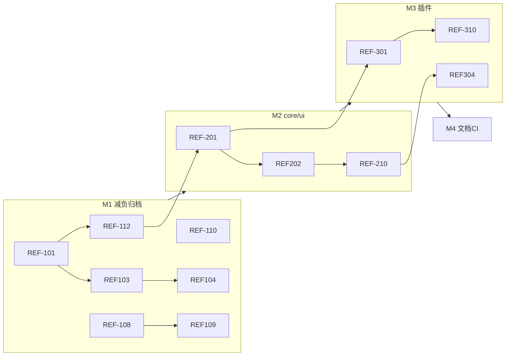

# Pixuli 重构计划

> **版本**：1.0  
> **更新**：2026-05-26  
> **状态**：规划中

本文档是仓库级重构的**总览与 Issue 追踪表**。详细设计见 `.local/`
目录（本地，不提交）或后续迁入 `docs/` 的正式文档。

---

## 一、目标与原则

### 1.1 产品底线（不变）

- 交付形态：**Web（含 PWA）**、**PC（Electron）**、**Mobile（Expo）**
  三端继续维护。
- 定位：以 Git 仓库为后端的**图床客户端**；**官方不提供** NestJS Server。

### 1.2 架构方向

| 方向     | 说明                                                       |
| -------- | ---------------------------------------------------------- |
| 归档     | `packages/wasm`、`benchmark/`、`server/` 移出主构建路径    |
| 拆分     | `packages/common` → `@pixuli/core` + `@pixuli/ui`          |
| 插件     | `StorageProvider` + `provider-github` / `provider-gitee`   |
| 功能分层 | **L1** 基础业务 · **L2** 仅网格/列表 · **L3** 各端平台能力 |
| 展示裁剪 | 移除幻灯片、时间线、照片墙、3D 画廊及浏览模式路由          |

### 1.3 里程碑

| 里程碑 | 名称                | 目标日期（可填） | 说明                                          |
| ------ | ------------------- | ---------------- | --------------------------------------------- |
| M1     | 减负与归档          |                  | 展示裁剪、wasm/server 归档、死代码删除        |
| M2     | core / ui 拆分      |                  | 新建包、迁移 import、兼容层                   |
| M3     | 存储插件 P0         |                  | Provider 接口、双端 imageStore、pluginId 配置 |
| M4     | 文档与 CI           |                  | PRD/README/CI 与架构一致                      |
| M5     | 平台能力 L3（持续） |                  | PWA 归位、Desktop 离线/更新规划               |

---

## 二、GitHub Issue 操作步骤

按顺序执行一次即可；之后每个重构任务对应一条 Issue，用第三节表格驱动。

### 步骤 0：前置准备

1. 确认对仓库有 **Issue / Milestone / Label** 权限（Owner 或 Maintainer）。
2. 安装并登录 [GitHub CLI](https://cli.github.com/)（可选，推荐）：

```bash
gh auth login
gh auth status
cd /path/to/Pixuli
gh repo view   # 确认当前仓库正确
```

3. 浏览器方式：打开 `https://github.com/<owner>/Pixuli/issues`。

---

### 步骤 1：创建 Milestones（里程碑）

**Web UI**

1. 仓库 → **Issues** → 右侧 **Milestones** → **New milestone**。
2. 依次创建（Due date 可留空或按排期填写）：

| Title            | 说明                        |
| ---------------- | --------------------------- |
| `M1-减负与归档`  | 展示裁剪、wasm/server 归档  |
| `M2-core-ui拆分` | @pixuli/core + @pixuli/ui   |
| `M3-存储插件P0`  | StorageProvider + providers |
| `M4-文档与CI`    | PRD/README/CI               |
| `M5-平台能力L3`  | PWA/桌面离线等（持续）      |

**CLI**

```bash
gh api repos/{owner}/{repo}/milestones -f title="M1-减负与归档" -f description="展示裁剪、wasm/server 归档"
# 将 {owner}/{repo} 换成实际值，或：
gh milestone create "M1-减负与归档" --description "展示裁剪、wasm/server 归档"
gh milestone create "M2-core-ui拆分" --description "core + ui 包拆分"
gh milestone create "M3-存储插件P0" --description "StorageProvider 插件体系"
gh milestone create "M4-文档与CI" --description "文档与 CI 对齐"
gh milestone create "M5-平台能力L3" --description "L3 平台能力"
```

---

### 步骤 2：创建 Labels（标签）

**Web UI**：Issues → 任意 Issue → 右侧 **Labels** → 齿轮 **Edit labels** → **New
label**。

**CLI（批量示例）**

```bash
# 通用
gh label create "refactor" --color "1D76DB" --description "仓库重构"
for m in m1 m2 m3 m4 m5; do gh label create "$m" --color "EDEDED" --description "里程碑 $m"; done
gh label create "priority:P0" --color "B60205" --description "必须优先"
gh label create "priority:P1" --color "D93F0B" --description "重要"
gh label create "priority:P2" --color "FBCA04" --description "可延后"
# 范围
for a in web desktop mobile core ui plugin; do
  gh label create "area:$a" --color "C5DEF5" --description "影响范围: $a"
done
# 类型
gh label create "type:removal" --color "FFFFFF" --description "删除代码/功能"
gh label create "type:docs" --color "0075CA" --description "文档"
```

已存在同名 label 时会报错，可忽略。

| Label                                       | 含义          |
| ------------------------------------------- | ------------- |
| `refactor`                                  | 重构总类      |
| `m1` … `m5`                                 | 对应里程碑    |
| `priority:P0` / `P1` / `P2`                 | 优先级        |
| `area:web` / `area:desktop` / `area:mobile` | 影响端        |
| `area:core` / `area:ui` / `area:plugin`     | 影响包        |
| `type:removal`                              | 删除功能/代码 |
| `type:docs`                                 | 仅文档        |

---

### 步骤 3：按 REFACTOR_PLAN 创建 Issues

对第三节表格 **每一行** 创建一条 Issue（共 43 条，建议
**先 M1 再 M2…**，同里程碑内按 Depends on 顺序）。

#### 方式 A：Web UI（适合少量或首次熟悉）

1. **Issues** → **New issue**。
2. **Title**：复制表格「建议标题」列（如 `[M1] 移除 Web 幻灯片与时间线路由`）。
3. **Description**：
   - 展开该里程碑下方的 `<details>` → 找到对应 **REF-xxx** 正文模板，粘贴；
   - 文首可加：`计划编号: REF-101`、`**Depends on**: REF-108`（创建后再改为
     `#12`）。
4. 右侧设置：
   - **Assignees**：负责人（可选）
   - **Labels**：按表格 Labels 列勾选（如
     `refactor`、`m1`、`area:web`、`priority:P0`）
   - **Projects**：若已建看板，加入对应列（见步骤 5）
   - **Milestone**：选 `M1-减负与归档` 等
5. **Submit new issue**。
6. 记下生成的编号（如 `#42`），填回本文档第三节该行的 **GitHub #** 列。

#### 方式 B：GitHub CLI（适合批量）

1. （可选）为每条 Issue 建正文文件：

```bash
mkdir -p .github/issue-bodies
# 将 REFACTOR_PLAN 中 REF-101 模板保存为 .github/issue-bodies/ref-101.md
```

2. 创建单条 Issue：

```bash
gh issue create \
  --title "[M1] 移除 Web 幻灯片与时间线路由" \
  --label "refactor,m1,area:web,type:removal,priority:P0" \
  --milestone "M1-减负与归档" \
  --body-file .github/issue-bodies/ref-101.md
```

3. 终端会输出 `https://github.com/.../issues/42`，将 `42` 填入 **GitHub #** 列。

#### 创建顺序建议（M1 示例）

| 顺序 | ID                        | 说明                    |
| ---- | ------------------------- | ----------------------- |
| 1    | REF-108、REF-110、REF-111 | 无依赖，可并行          |
| 2    | REF-101、REF-102          | 无依赖                  |
| 3    | REF-103                   | 依赖 REF-101            |
| 4    | REF-104、REF-105、REF-106 | 依赖 REF-103 等         |
| 5    | REF-107、REF-109          | 依赖前置项              |
| 6    | REF-112                   | M1 回归，最后开或最后关 |

---

### 步骤 4：填写 Issue 依赖关系

GitHub 免费版无原生「Blocked by」字段时，用以下任一方式：

**方式 1：Description 里写（推荐）**

```markdown
## 依赖

- Blocked by: #38, #40
- 计划编号: REF-103
```

**方式 2：Tasklist 关联**

在父 Issue 正文中：

```markdown
- [ ] #42 REF-101 移除路由
- [ ] #43 REF-103 删除 common 组件
```

**方式 3：Projects 自定义字段**

若使用 Projects v2，增加 **Blocked by** 关系字段（需仓库启用 Projects）。

创建完所有 Issue 后，把表格 **Depends on** 列的 `REF-xxx` 全部替换为 `#数字`。

---

### 步骤 5：创建 Project 看板（可选）

1. 仓库顶部 **Projects** → **Link a project** → **New project**。
2. 模板选 **Board**。
3. 建议列：

| 列名        | 说明               |
| ----------- | ------------------ |
| Backlog     | 未开始             |
| Ready       | 依赖已满足，可开工 |
| In Progress | 开发中             |
| In Review   | PR 已提交          |
| Done        | 已合并             |

4. **Add item** → 从 Issues 批量加入 M1 的 12 条；或设置自动包含带 `refactor`
   标签的 Issue。
5. 拖拽卡片随进度移动；与 Milestone 筛选配合使用。

---

### 步骤 6：日常开发时更新 Issue

| 动作       | 操作                                                         |
| ---------- | ------------------------------------------------------------ |
| 开始任务   | 指派 Assignee；Project 拖到 **In Progress**；评论 `开始处理` |
| 提交代码   | PR 标题含 `REF-101` 或 `Fixes #42`                           |
| PR 合并后  | Issue 自动关闭（若 PR 含 `Fixes #42` / `Closes #42`）        |
| 仅部分完成 | 在 Issue 勾选 Tasklist `- [ ]` → `- [x]`，勿关闭 Issue       |
| 阻塞       | 评论说明阻塞原因，@ 相关人                                   |

**PR 关联示例**

```markdown
## Summary

移除 slideshow/timeline 路由

## Issues

Closes #42 Related: REF-101
```

---

### 步骤 7：回填 REFACTOR_PLAN.md

每创建一条 Issue 后更新第三节表格：

```markdown
| REF-101 | ... | #42 | ✅ |
```

里程碑结束时更新 **第六节 进度汇总** 的「已完成」数量。

---

### 步骤 8：关闭与验收

1. 对照 Issue 正文 **验收标准** 逐项确认。
2. 全部勾选后：
   - 若 PR 已用 `Closes #n`，合并即关闭；
   - 否则 Issue 页 **Close issue** → 选 **Completed**。
3. M1 回归 Issue（REF-112）应在 REF-101–111 均关闭后再关。
4. Milestone 页查看进度；全部 Issue 关闭后可 **Close milestone**。

---

### 步骤 9：筛选与视图（日常查看）

| 需求       | 操作                                    |
| ---------- | --------------------------------------- |
| 只看 M1    | Issues 搜索 `milestone:"M1-减负与归档"` |
| 只看 P0    | `label:priority:P0 label:refactor`      |
| 只看未关闭 | `is:open label:refactor`                |
| 我负责的   | `assignee:@me is:open`                  |

保存搜索：Issues 搜索框输入条件 → **Save**。

---

### 快速对照：表格列 → GitHub 字段

| REFACTOR_PLAN 列 | GitHub 字段                 |
| ---------------- | --------------------------- |
| 建议标题         | Issue title                 |
| Labels           | Labels（多选）              |
| 优先级           | Label `priority:P0` 等      |
| Depends on       | Description / Projects 阻塞 |
| GitHub #         | 创建后 Issue 编号           |
| 状态             | ⬜/✅ 或 Issue open/closed  |

---

## 三、Issue 追踪总表

**列说明**：`ID` 为计划内编号；`GitHub #` 创建 Issue 后手工填写便于互链。

### 里程碑 M1 — 减负与归档

| ID      | 建议标题                                                                                       | Labels                                               | 优先级 | Depends on | GitHub #                                              | 状态 |
| ------- | ---------------------------------------------------------------------------------------------- | ---------------------------------------------------- | ------ | ---------- | ----------------------------------------------------- | ---- |
| REF-101 | [M1] 移除 Web 幻灯片与时间线路由及页面                                                         | refactor, m1, area:web, type:removal, priority:P0    | P0     | —          | [#46](https://github.com/trueLoving/Pixuli/issues/46) | ✅   |
| REF-102 | [M1] 移除 Web 占位页 analyze / edit / generate                                                 | refactor, m1, area:web, type:removal, priority:P0    | P0     | —          | [#47](https://github.com/trueLoving/Pixuli/issues/47) | ✅   |
| REF-103 | [M1] 删除 common 增强展示组件（slideshow/timeline/photo-wall/gallery-3d/browse-mode-switcher） | refactor, m1, area:ui, type:removal, priority:P0     | P0     | #46        | [#48](https://github.com/trueLoving/Pixuli/issues/48) | ✅   |
| REF-104 | [M1] 移除 pptxgenjs 与幻灯片相关依赖                                                           | refactor, m1, type:removal, priority:P0              | P0     | #48        | [#49](https://github.com/trueLoving/Pixuli/issues/49) | ✅   |
| REF-105 | [M1] 清理 browseMode 状态与路由同步逻辑                                                        | refactor, m1, area:web, priority:P0                  | P0     | #46        | [#50](https://github.com/trueLoving/Pixuli/issues/50) | ✅   |
| REF-106 | [M1] 移动端移除浏览模式 Tab 与 SlideShowPlayer                                                 | refactor, m1, area:mobile, type:removal, priority:P0 | P0     | #48        | [#51](https://github.com/trueLoving/Pixuli/issues/51) | ✅   |
| REF-107 | [M1] 更新 Web 侧栏/菜单为「图床 + 工具 + 设置」结构                                            | refactor, m1, area:web, priority:P1                  | P1     | #46, #47   | [#52](https://github.com/trueLoving/Pixuli/issues/52) | ✅   |
| REF-108 | [M1] 归档 packages/wasm 与 benchmark                                                           | refactor, m1, type:removal, priority:P0              | P0     | —          | [#54](https://github.com/trueLoving/Pixuli/issues/54) | ⬜   |
| REF-109 | [M1] 移除 Electron WASM IPC 与 pixuli-wasm 依赖                                                | refactor, m1, area:desktop, priority:P0              | P0     | #54        | [#55](https://github.com/trueLoving/Pixuli/issues/55) | ⬜   |
| REF-110 | [M1] 归档 server/ 并移出 pnpm workspace                                                        | refactor, m1, type:removal, priority:P0              | P0     | —          | [#56](https://github.com/trueLoving/Pixuli/issues/56) | ⬜   |
| REF-111 | [M1] 删除 performance 与 devtools 未接入模块                                                   | refactor, m1, area:ui, type:removal, priority:P0     | P0     | —          | [#57](https://github.com/trueLoving/Pixuli/issues/57) | ⬜   |
| REF-112 | [M1] M1 回归：web / desktop / mobile 冒烟 + vitest                                             | refactor, m1, priority:P0                            | P0     | #46–#57    | [#58](https://github.com/trueLoving/Pixuli/issues/58) | ⬜   |

**M1 已关联 GitHub Issue（计划编号 ↔ Issue）**

| 计划 ID | GitHub Issue                                          |
| ------- | ----------------------------------------------------- |
| REF-101 | [#46](https://github.com/trueLoving/Pixuli/issues/46) |
| REF-102 | [#47](https://github.com/trueLoving/Pixuli/issues/47) |
| REF-103 | [#48](https://github.com/trueLoving/Pixuli/issues/48) |
| REF-104 | [#49](https://github.com/trueLoving/Pixuli/issues/49) |
| REF-105 | [#50](https://github.com/trueLoving/Pixuli/issues/50) |
| REF-106 | [#51](https://github.com/trueLoving/Pixuli/issues/51) |
| REF-107 | [#52](https://github.com/trueLoving/Pixuli/issues/52) |
| REF-108 | [#54](https://github.com/trueLoving/Pixuli/issues/54) |
| REF-109 | [#55](https://github.com/trueLoving/Pixuli/issues/55) |
| REF-110 | [#56](https://github.com/trueLoving/Pixuli/issues/56) |
| REF-111 | [#57](https://github.com/trueLoving/Pixuli/issues/57) |
| REF-112 | [#58](https://github.com/trueLoving/Pixuli/issues/58) |
| REF-201 | [#60](https://github.com/trueLoving/Pixuli/issues/60) |
| REF-202 | [#61](https://github.com/trueLoving/Pixuli/issues/61) |
| REF-203 | [#62](https://github.com/trueLoving/Pixuli/issues/62) |
| REF-204 | [#69](https://github.com/trueLoving/Pixuli/issues/69) |
| REF-205 | [#63](https://github.com/trueLoving/Pixuli/issues/63) |
| REF-206 | [#64](https://github.com/trueLoving/Pixuli/issues/64) |
| REF-207 | [#65](https://github.com/trueLoving/Pixuli/issues/65) |
| REF-208 | [#66](https://github.com/trueLoving/Pixuli/issues/66) |
| REF-209 | [#67](https://github.com/trueLoving/Pixuli/issues/67) |
| REF-210 | [#68](https://github.com/trueLoving/Pixuli/issues/68) |
| REF-301 | [#70](https://github.com/trueLoving/Pixuli/issues/70) |
| REF-302 | [#71](https://github.com/trueLoving/Pixuli/issues/71) |
| REF-303 | [#72](https://github.com/trueLoving/Pixuli/issues/72) |
| REF-304 | [#73](https://github.com/trueLoving/Pixuli/issues/73) |
| REF-305 | [#74](https://github.com/trueLoving/Pixuli/issues/74) |
| REF-306 | [#75](https://github.com/trueLoving/Pixuli/issues/75) |
| REF-307 | [#76](https://github.com/trueLoving/Pixuli/issues/76) |
| REF-308 | [#77](https://github.com/trueLoving/Pixuli/issues/77) |
| REF-309 | [#78](https://github.com/trueLoving/Pixuli/issues/78) |
| REF-310 | [#79](https://github.com/trueLoving/Pixuli/issues/79) |
| REF-401 | [#80](https://github.com/trueLoving/Pixuli/issues/80) |
| REF-402 | [#81](https://github.com/trueLoving/Pixuli/issues/81) |
| REF-403 | [#82](https://github.com/trueLoving/Pixuli/issues/82) |
| REF-404 | [#83](https://github.com/trueLoving/Pixuli/issues/83) |
| REF-405 | [#84](https://github.com/trueLoving/Pixuli/issues/84) |
| REF-406 | [#85](https://github.com/trueLoving/Pixuli/issues/85) |
| REF-501 | [#86](https://github.com/trueLoving/Pixuli/issues/86) |
| REF-502 | [#87](https://github.com/trueLoving/Pixuli/issues/87) |
| REF-503 | [#88](https://github.com/trueLoving/Pixuli/issues/88) |
| REF-504 | [#89](https://github.com/trueLoving/Pixuli/issues/89) |
| REF-505 | [#90](https://github.com/trueLoving/Pixuli/issues/90) |

> **说明**：#53 为已合并 PR（REF-101～103 批次），非独立计划 Issue。

<details>
<summary>REF-101 ~ REF-112 Issue 正文模板（点击展开）</summary>

**REF-101**

```markdown
## 背景

产品仅保留网格+列表浏览，幻灯片与时间线独立路由不再维护。

## 任务

- [ ] 删除 `apps/pixuli/src/pages/slideshow`、`pages/timeline`
- [ ] 从 `router/routes.tsx`、`router/config.ts` 移除 SLIDESHOW、TIMELINE
- [ ] 旧路径重定向到 `/photos`（可选）
- [ ] 删除 `utils/navigation.ts` 中 timeline 导航辅助

## 验收

- [ ] `/photos`、`/compress`、`/convert` 可访问
- [ ] 无对已删页面的引用
```

**REF-102**

```markdown
## 任务

- [ ] 删除 `pages/analyze`、`edit`、`generate`
- [ ] 移除 ROUTES 与侧栏项

## 验收

- [ ] 构建无报错；菜单无 Coming Soon 入口
```

**REF-103**

```markdown
## 任务

- [ ] 删除 `packages/common/src/components/image/gallery-3d`
- [ ] 删除 `photo-wall`、`timeline`
- [ ] 删除 `components/features/slide-show`、`browse-mode-switcher`
- [ ] 更新 `index.ts`、`locales/index.ts`、Sidebar

## 验收

- [ ] 全仓库无上述模块引用
```

**REF-104** — 移除 `pptxgenjs`；`pnpm why pptxgenjs` 无结果。

**REF-105** — 清理 `useUIStore.browseMode`、`useRouteSync` 与 browse 相关字段。

**REF-106** — 删 `app/(tabs)/browse-mode.tsx`、mobile `SlideShowPlayer`；更新
`_layout` tabs、DrawerMenu、SearchAndFilter。

**REF-107** — 侧栏仅：图片、压缩、转换、设置。

**REF-108** — `archive/wasm/` +
workspace 移除 wasm/benchmark；更新 README 去掉 Rust。

**REF-109** — 删 `wasmService.ts`、preload 注释；`apps/pixuli` 去掉
`pixuli-wasm`。

**REF-110** — `archive/server/`；workspace 移除 server；清空 `pixuliService`
空壳。

**REF-111** — 删 `performance/`、`components/dev/devtools/`。

**REF-112** — `pnpm test`；`dev:web` / `dev:desktop` / `dev:mobile` 主流程冒烟。

</details>

---

### 里程碑 M2 — core / ui 拆分

| ID      | 建议标题                                                       | Labels                                            | 优先级 | Depends on   | GitHub #                                              | 状态 |
| ------- | -------------------------------------------------------------- | ------------------------------------------------- | ------ | ------------ | ----------------------------------------------------- | ---- |
| REF-201 | [M2] 新建 @pixuli/core 包（types/utils/platform/operationLog） | refactor, m2, area:core, priority:P0              | P0     | #58          | [#60](https://github.com/trueLoving/Pixuli/issues/60) | ⬜   |
| REF-202 | [M2] 新建 @pixuli/ui 包（web 入口 + native 子路径）            | refactor, m2, area:ui, priority:P0                | P0     | #60          | [#61](https://github.com/trueLoving/Pixuli/issues/61) | ⬜   |
| REF-203 | [M2] 迁移 L1/L2 组件至 ui（不含已删展示组件）                  | refactor, m2, area:ui, priority:P0                | P0     | #61, #48     | [#62](https://github.com/trueLoving/Pixuli/issues/62) | ⬜   |
| REF-204 | [M2] webImageProcessor 与 toast 迁入 ui                        | refactor, m2, area:ui, priority:P1                | P1     | #61          | [#69](https://github.com/trueLoving/Pixuli/issues/69) | ⬜   |
| REF-205 | [M2] index.native 停止导出 webImageProcessor                   | refactor, m2, area:core, priority:P0              | P0     | #60          | [#63](https://github.com/trueLoving/Pixuli/issues/63) | ⬜   |
| REF-206 | [M2] apps/pixuli 切换为 @pixuli/core + @pixuli/ui              | refactor, m2, area:web, area:desktop, priority:P0 | P0     | #62          | [#64](https://github.com/trueLoving/Pixuli/issues/64) | ⬜   |
| REF-207 | [M2] apps/mobile 切换 import（core + ui/native）               | refactor, m2, area:mobile, priority:P0            | P0     | #60, #61     | [#65](https://github.com/trueLoving/Pixuli/issues/65) | ⬜   |
| REF-208 | [M2] 保留 pixuli-common 兼容 re-export（deprecated）           | refactor, m2, priority:P1                         | P1     | #64, #65     | [#66](https://github.com/trueLoving/Pixuli/issues/66) | ⬜   |
| REF-209 | [M2] ESLint 边界：禁止 core→ui、provider→ui                    | refactor, m2, priority:P2                         | P2     | #60          | [#67](https://github.com/trueLoving/Pixuli/issues/67) | ⬜   |
| REF-210 | [M2] M2 回归与删除空壳 packages/common                         | refactor, m2, priority:P0                         | P0     | #64–#67, #69 | [#68](https://github.com/trueLoving/Pixuli/issues/68) | ⬜   |

<details>
<summary>REF-201 ~ REF-210 Issue 正文模板</summary>

**REF-201** — 创建
`packages/core`，exports：`types`、`plugins`（类型占位）、`platform`、`utils`、`locales`。

**REF-202** — 创建 `packages/ui`，`exports["."]` web，`exports["./native"]`
native。

**REF-203** — ImageBrowser/Upload/Preview/Config/Layout 等迁入 ui。

**REF-204** — `services/imageProcessor`、`utils/toast` → ui。

**REF-205** — mobile 仅 `@pixuli/core` + `@pixuli/ui/native`。

**REF-206** — 替换 `@packages/common/src` 路径；更新 tsconfig paths。

**REF-207** — mobile stores/i18n 改 import。

**REF-208** — common 仅 re-export 并 JSDoc `@deprecated`。

**REF-209** — `import/no-restricted-paths` 规则。

**REF-210** — 全量 test + 删除 common（或留空壳一版）。

</details>

---

### 里程碑 M3 — 存储插件体系 P0

| ID      | 建议标题                                        | Labels                                            | 优先级 | Depends on    | GitHub #                                              | 状态 |
| ------- | ----------------------------------------------- | ------------------------------------------------- | ------ | ------------- | ----------------------------------------------------- | ---- |
| REF-301 | [M3] 在 core 定义 StorageProvider 与 Registry   | refactor, m3, area:core, area:plugin, priority:P0 | P0     | #60           | [#70](https://github.com/trueLoving/Pixuli/issues/70) | ⬜   |
| REF-302 | [M3] 实现 @pixuli/provider-github               | refactor, m3, area:plugin, priority:P0            | P0     | #70           | [#71](https://github.com/trueLoving/Pixuli/issues/71) | ⬜   |
| REF-303 | [M3] 实现 @pixuli/provider-gitee                | refactor, m3, area:plugin, priority:P0            | P0     | #70           | [#72](https://github.com/trueLoving/Pixuli/issues/72) | ⬜   |
| REF-304 | [M3] 重构 apps/pixuli imageStore 使用 Registry  | refactor, m3, area:web, area:desktop, priority:P0 | P0     | #71, #72, #64 | [#73](https://github.com/trueLoving/Pixuli/issues/73) | ⬜   |
| REF-305 | [M3] 重构 apps/mobile imageStore 使用 Registry  | refactor, m3, area:mobile, priority:P0            | P0     | #71, #72, #65 | [#74](https://github.com/trueLoving/Pixuli/issues/74) | ⬜   |
| REF-306 | [M3] 配置持久化增加 pluginId（导入/导出）       | refactor, m3, priority:P1                         | P1     | #73, #74      | [#75](https://github.com/trueLoving/Pixuli/issues/75) | ⬜   |
| REF-307 | [M3] 设置页源列表对接 registry.listManifests    | refactor, m3, area:ui, priority:P1                | P1     | #75           | [#76](https://github.com/trueLoving/Pixuli/issues/76) | ⬜   |
| REF-308 | [M3] 编写插件开发文档 docs/plugins/authoring.md | refactor, m3, type:docs, priority:P1              | P1     | #70           | [#77](https://github.com/trueLoving/Pixuli/issues/77) | ⬜   |
| REF-309 | [M3] provider 包单元测试迁移                    | refactor, m3, priority:P1                         | P1     | #71, #72      | [#78](https://github.com/trueLoving/Pixuli/issues/78) | ⬜   |
| REF-310 | [M3] M3 回归：GitHub/Gitee 全流程               | refactor, m3, priority:P0                         | P0     | #73–#78       | [#79](https://github.com/trueLoving/Pixuli/issues/79) | ⬜   |

<details>
<summary>REF-301 ~ REF-310 Issue 正文模板</summary>

**REF-301**
— 接口：`StorageProvider`、`StoragePluginManifest`、`StoragePluginRegistry`、`ProviderContext`（含 PlatformAdapter）。

**REF-302/303** — 自 `githubStorageService` / `giteeStorageService` 迁移；导出
`registerXxxProvider(registry)`。

**REF-304/305** —
`storageService: StorageProvider | null`；`registry.create(pluginId, ctx)`。

**REF-306** — `StoredSourceEntry { pluginId, label, config }`。

**REF-307** — 添加源 UI 按 manifest 列表渲染。

**REF-308** — 最小 provider-example 骨架 + 安全说明（Token 本地存储）。

**REF-309** — 迁移 `services/__tests__/*` 到 provider 包。

**REF-310** — 配置源、列表、上传、删除、切换源 E2E/手工清单。

</details>

---

### 里程碑 M4 — 文档与 CI

| ID      | 建议标题                                                | Labels                               | 优先级 | Depends on | GitHub #                                              | 状态 |
| ------- | ------------------------------------------------------- | ------------------------------------ | ------ | ---------- | ----------------------------------------------------- | ---- |
| REF-401 | [M4] 更新 PRD：三端底线、展示裁剪、无官方 Server        | refactor, m4, type:docs, priority:P1 | P1     | #46, #56   | [#80](https://github.com/trueLoving/Pixuli/issues/80) | ⬜   |
| REF-402 | [M4] 新增 docs/backlog.md 承接已移除/未做需求           | refactor, m4, type:docs, priority:P1 | P1     | #80        | [#81](https://github.com/trueLoving/Pixuli/issues/81) | ⬜   |
| REF-403 | [M4] 更新 README 结构、环境要求、维护范围               | refactor, m4, type:docs, priority:P1 | P1     | #54, #56   | [#82](https://github.com/trueLoving/Pixuli/issues/82) | ⬜   |
| REF-404 | [M4] 更新 CHANGELOG 记录 Breaking Changes               | refactor, m4, type:docs, priority:P1 | P1     | #58        | [#83](https://github.com/trueLoving/Pixuli/issues/83) | ⬜   |
| REF-405 | [M4] CI：移除 benchmark workflow；desktop 构建去掉 wasm | refactor, m4, priority:P1            | P1     | #54, #55   | [#84](https://github.com/trueLoving/Pixuli/issues/84) | ⬜   |
| REF-406 | [M4] archive/README 说明 wasm/server 归档策略           | refactor, m4, type:docs, priority:P2 | P2     | #54, #56   | [#85](https://github.com/trueLoving/Pixuli/issues/85) | ⬜   |

---

### 里程碑 M5 — 平台能力 L3（持续）

| ID      | 建议标题                                              | Labels                                  | 优先级 | Depends on | GitHub #                                              | 状态 |
| ------- | ----------------------------------------------------- | --------------------------------------- | ------ | ---------- | ----------------------------------------------------- | ---- |
| REF-501 | [M5] 文档化 L3 能力矩阵（Web PWA / Desktop / Mobile） | refactor, m5, type:docs, priority:P2    | P2     | #80        | [#86](https://github.com/trueLoving/Pixuli/issues/86) | ⬜   |
| REF-502 | [M5] 建立 apps/pixuli/src/platforms/desktop 目录约定  | refactor, m5, area:desktop, priority:P2 | P2     | #64        | [#87](https://github.com/trueLoving/Pixuli/issues/87) | ⬜   |
| REF-503 | [M5] Desktop 离线浏览与上传队列（设计+实现）          | refactor, m5, area:desktop, priority:P2 | P2     | #87        | [#88](https://github.com/trueLoving/Pixuli/issues/88) | ⬜   |
| REF-504 | [M5] Desktop 自动更新 electron-updater（设计+实现）   | refactor, m5, area:desktop, priority:P2 | P2     | #87        | [#89](https://github.com/trueLoving/Pixuli/issues/89) | ⬜   |
| REF-505 | [M5] Desktop 系统托盘（设计+实现）                    | refactor, m5, area:desktop, priority:P2 | P2     | #87        | [#90](https://github.com/trueLoving/Pixuli/issues/90) | ⬜   |

---

## 四、依赖关系简图



---

## 五、不在范围内（Won't Do）

| 项                                                 | 说明                                    |
| -------------------------------------------------- | --------------------------------------- |
| 恢复 Slideshow / Timeline / PhotoWall / 3D Gallery | 已从产品移除                            |
| 删除 Mobile 或 Desktop 端                          | 三端为底线                              |
| 主仓库恢复 Server 为一等公民                       | 仅社区插件对接自建 API                  |
| 主仓库恢复 WASM 为必需构建                         | 已归档；高性能处理走远期 Processor 插件 |

---

## 六、进度汇总（手工更新）

| 里程碑   | Issue 数 | 已完成 | 进度    |
| -------- | -------- | ------ | ------- |
| M1       | 12       | 7      | 58%     |
| M2       | 10       | 0      | 0%      |
| M3       | 10       | 0      | 0%      |
| M4       | 6        | 0      | 0%      |
| M5       | 5        | 0      | 0%      |
| **合计** | **43**   | **7**  | **16%** |

---

## 七、相关文档

| 文档                 | 位置                                |
| -------------------- | ----------------------------------- |
| 仓库简化方案（修订） | `.local/仓库简化方案.md`            |
| 功能分层与裁剪       | `.local/功能分层与裁剪清单.md`      |
| core / ui 拆分       | `.local/common拆分方案-core与ui.md` |
| 插件体系设计         | `.local/插件体系设计.md`            |
| 执行 Checklist       | `.local/简化执行-checklist.md`      |

> 建议：M4 中将 `.local` 核心内容迁入
> `docs/architecture/`，便于协作者不依赖本地文件。

---

## 八、GitHub Project 看板列建议

| 列名        | 用途       |
| ----------- | ---------- |
| Backlog     | 未开工     |
| M1 Ready    | 依赖已满足 |
| In Progress | 进行中     |
| Review      | PR 已开    |
| Done        | 已合并     |

将 Issue 的 **Milestone** 设为 M1–M5，**Status** 用 Project 字段或 label
`status:in-progress` 等维护。
