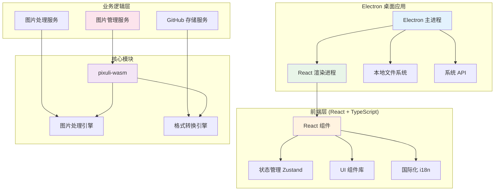

# 贡献指南

感谢您对 Pixuli Desktop 项目的关注！本文档将帮助您了解如何参与项目开发。

## 📋 目录

- [环境要求](#环境要求)
- [项目设置](#项目设置)
- [开发流程](#开发流程)
- [项目结构](#项目结构)
- [开发指南](#开发指南)
- [代码规范](#代码规范)
- [提交规范](#提交规范)
- [问题反馈](#问题反馈)

## 🔧 环境要求

### 必需工具

- **Node.js** >= 22.0.0
- **pnpm** - 包管理器
- **Rust** - 用于构建 WASM 模块
- **Git** - 版本控制

### 平台支持

- 🍎 macOS (x64, ARM64)
- 🪟 Windows (x64)

## 🚀 项目设置

### 1. 克隆仓库

```bash
git clone https://github.com/trueLoving/Pixuli.git
cd Pixuli
```

### 2. 安装依赖

```bash
# 从项目根目录安装所有依赖
pnpm install
```

### 3. 构建 WASM 模块

```bash
# 构建 wasm 模块
pnpm run build:wasm
```

## 💻 开发流程

### 运行应用

```bash
# 桌面端：开发模式
pnpm run dev:desktop
```

### 构建应用

```bash
# 桌面端：应用构建
pnpm run build:desktop
```

## 📦 项目结构

```
apps/desktop/
├── src/                           # 源代码
│   ├── components/                # React 组件
│   │   └── LanguageSwitcher.tsx   # 语言切换器
│   ├── config/                    # 配置文件
│   │   ├── github.ts              # GitHub 配置管理
│   │   └── gitee.ts               # Gitee 配置管理
│   ├── features/                  # 功能模块
│   │   ├── image-compression/    # 图片压缩功能
│   │   ├── image-converter/      # 图片格式转换功能
│   │   ├── operation-log/        # 操作日志功能
│   │   ├── version-info/         # 版本信息功能
│   │   └── full-screen-loading/  # 全屏加载组件
│   ├── i18n/                      # 国际化配置
│   │   ├── index.ts               # i18n 初始化
│   │   ├── locales.ts             # 桌面端语言包
│   │   └── useI18n.ts            # i18n hooks
│   ├── layouts/                   # 布局组件
│   │   ├── Header/                # 头部组件
│   │   ├── Main/                  # 主内容组件
│   │   └── SourceManager/         # 源管理组件
│   ├── pages/                     # 页面组件
│   │   ├── HomePage/              # 首页（源管理）
│   │   ├── ProjectPage/           # 项目页（图片浏览）
│   │   ├── CompressionWindowPage/ # 压缩窗口页
│   │   └── ConversionWindowPage/  # 转换窗口页
│   ├── services/                  # 业务服务
│   │   ├── githubStorageService.ts  # GitHub 存储服务
│   │   └── giteeStorageService.ts  # Gitee 存储服务
│   ├── stores/                    # 状态管理
│   │   ├── imageStore.ts          # 图片状态管理
│   │   └── logStore.ts            # 操作日志状态管理
│   ├── App.tsx                    # 主应用组件
│   ├── App.css                    # 应用样式
│   ├── main.tsx                   # 应用入口
│   └── index.css                  # 全局样式
├── electron/                      # Electron 主进程
│   ├── main/                      # 主进程代码
│   │   ├── services/             # 主进程服务
│   │   ├── index.ts              # 主进程入口
│   │   └── update.ts             # 自动更新
│   └── preload/                   # 预加载脚本
├── build/                         # 构建资源
├── dist/                          # 构建输出
├── dist-electron/                 # Electron 构建输出
├── release/                       # 分发文件
├── electron-builder.json         # Electron 构建配置
├── vite.config.ts                # Vite 配置
├── tailwind.config.js            # Tailwind CSS 配置
├── FEATURE_ROADMAP.md            # 功能路线图
└── README.md                      # 项目说明
```

## 🛠️ 技术架构



## 🛠️ 开发指南

### 脚本命令

- `pnpm run dev` - 启动开发服务器
- `pnpm run build` - 构建应用并打包 Electron 应用

### 配置文件

- **electron-builder.json** - Electron 应用构建配置
- **vite.config.ts** - Vite 构建配置
- **tailwind.config.js** - Tailwind CSS 配置
- **tsconfig.json** - TypeScript 配置

### 核心依赖

- **Electron** - 桌面应用框架
- **React** - 用户界面库
- **TypeScript** - 类型安全的 JavaScript
- **Vite** - 构建工具
- **Tailwind CSS** - CSS 框架
- **Zustand** - 状态管理
- **pixuli-wasm** - 核心 WASM 模块（图片处理引擎）
- **i18next** - 国际化框架
- **pixuli-common** - 三端共享模块

## 📝 代码规范

### TypeScript

- 使用 TypeScript 进行开发
- 所有文件使用 `.ts` 或 `.tsx` 扩展名
- 避免使用 `any` 类型，优先使用具体类型
- 使用接口（interface）定义对象类型

### 组件规范

- 使用函数式组件和 Hooks
- 组件文件使用 PascalCase 命名
- 组件应该导出为命名导出（named export）
- 使用 TypeScript 定义 Props 类型

### 文件命名

- 组件文件：`PascalCase.tsx`
- 工具文件：`camelCase.ts`
- 常量文件：`camelCase.ts`

### 代码风格

- 使用 2 个空格缩进
- 使用单引号（'）而不是双引号（"）
- 在语句末尾使用分号
- 使用 ESLint 和 Prettier 保持代码风格一致

## 📤 提交规范

### Git 提交信息格式

使用 [Conventional Commits](https://www.conventionalcommits.org/) 规范：

```
<type>(<scope>): <subject>

<body>

<footer>
```

### 提交类型

- `feat`: 新功能
- `fix`: 修复 bug
- `docs`: 文档更新
- `style`: 代码格式调整（不影响功能）
- `refactor`: 代码重构
- `perf`: 性能优化
- `test`: 测试相关
- `chore`: 构建过程或辅助工具的变动

### 提交示例

```bash
feat(desktop): 添加图片压缩功能

- 支持 WebP 格式压缩
- 可调节压缩质量
- 实时预览压缩效果

Closes #123
```

## 🔄 工作流程

### 1. Fork 仓库

在 GitHub 上 Fork 本项目到您的账户。

### 2. 创建分支

```bash
git checkout -b feat/your-feature-name
```

### 3. 进行开发

- 编写代码
- 添加测试
- 更新文档

### 4. 提交更改

```bash
git add .
git commit -m "feat: 添加新功能"
```

### 5. 推送分支

```bash
git push origin feat/your-feature-name
```

### 6. 创建 Pull Request

在 GitHub 上创建 Pull Request，详细描述您的更改。

### 7. 代码审查

等待维护者审查代码，根据反馈进行修改。

## 📚 相关资源

- [Electron 文档](https://electronjs.org/)
- [React 文档](https://reactjs.org/)
- [TypeScript 文档](https://www.typescriptlang.org/)
- [Vite 文档](https://vitejs.dev/)
- [Tailwind CSS 文档](https://tailwindcss.com/)
- [Zustand 文档](https://zustand-demo.pmnd.rs/)
- [i18next 文档](https://www.i18next.com/)

## 🙏 致谢

感谢所有为 Pixuli Desktop 项目做出贡献的开发者！

---

如有任何问题，请通过 [Issues](https://github.com/trueLoving/Pixuli/issues)
联系我们。
