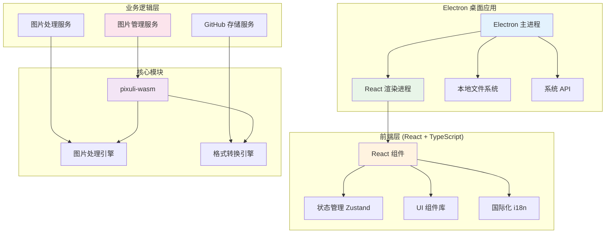

# Pixuli Desktop - 智能图片管理桌面应用

[](https://opensource.org/licenses/MIT)
[](https://nodejs.org/about/releases)

## 📖 项目概述

**Pixuli Desktop** 是 Pixuli Monorepo 中的桌面应用部分，基于 Electron + React +
TypeScript + Rust 构建的跨平台智能图片管理桌面应用。

## ✨ 主要功能

```mermaid
graph TB
    A[Pixuli Desktop] --> B[图片管理]
    A --> C[图片处理]
    A --> D[云端存储]
    A --> E[多窗口模式]

    B --> B1[智能浏览]
    B --> B2[拖拽上传]
    B --> B3[批量上传]
    B --> B4[批量删除]
    B --> B5[标签系统]
    B --> B6[搜索功能]
    B --> B7[元数据编辑]
    B --> B8[全屏预览]

    C --> C1[WebP 压缩]
    C --> C2[格式转换]
    C --> C3[批量处理]
    C --> C4[尺寸调整]
    C --> C5[质量控制]
    C --> C6[压缩预览]
    C --> C7[转换预览]

    D --> D1[GitHub 集成]
    D --> D2[Gitee 集成]
    D --> D3[存储源切换]
    D --> D4[版本控制]
    D --> D5[配置管理]

    E --> E1[主窗口]
    E --> E2[压缩窗口]
    E --> E3[转换窗口]
    E --> E4[项目窗口]

    style A fill:#e3f2fd
    style B fill:#e8f5e8
    style C fill:#fff3e0
    style D fill:#f3e5f5
    style E fill:#fce4ec
```



## 🛠️ 技术架构



## 🚀 快速开始

### 环境要求

- Node.js >= 22.0.0
- pnpm
- Rust (用于构建 WASM 模块)

### 安装和运行

```bash
# 从项目根目录
cd pixuli

# 安装所有依赖
pnpm install

# 构建 wasm 模块
pnpm run build:wasm

# 桌面端：开发模式
pnpm run dev:desktop

# 桌面端：应用构建
pnpm run build:desktop
```

### 桌面应用特性

**核心功能**：

- ✅ **图片管理**：智能浏览、拖拽上传、批量上传、批量删除
- ✅ **图片处理**：WebP 压缩、格式转换、尺寸调整、质量控制
- ✅ **云端存储**：GitHub 和 Gitee 双存储支持，存储源切换
- ✅ **多窗口模式**：主窗口、压缩窗口、转换窗口、项目窗口
- ✅ **操作日志**：记录所有操作历史，支持查看和导出
- ✅ **键盘快捷键**：支持常用操作的快捷键
- ✅ **国际化支持**：中文和英文界面切换
- ✅ **主题切换**：支持浅色/深色主题

**优势**：

- ✅ 完整的本地文件系统访问
- ✅ 原生性能优化（基于 Rust WASM）
- ✅ 系统集成和通知
- ✅ 离线功能支持
- ✅ 多窗口管理
- ✅ 键盘快捷键
- ✅ 独立功能窗口（压缩、转换）

**支持平台**：

- 🍎 macOS (x64, ARM64)
- 🪟 Windows (x64)

## 📦 项目结构

```
apps/desktop/
├── src/                           # 源代码
│   ├── components/                # React 组件
│   │   └── LanguageSwitcher.tsx   # 语言切换器
│   ├── config/                    # 配置文件
│   │   ├── github.ts              # GitHub 配置管理
│   │   └── gitee.ts               # Gitee 配置管理
│   ├── features/                  # 功能模块
│   │   ├── image-compression/    # 图片压缩功能
│   │   ├── image-converter/      # 图片格式转换功能
│   │   ├── operation-log/        # 操作日志功能
│   │   ├── version-info/         # 版本信息功能
│   │   └── full-screen-loading/  # 全屏加载组件
│   ├── i18n/                      # 国际化配置
│   │   ├── index.ts               # i18n 初始化
│   │   ├── locales.ts             # 桌面端语言包
│   │   └── useI18n.ts            # i18n hooks
│   ├── layouts/                   # 布局组件
│   │   ├── Header/                # 头部组件
│   │   ├── Main/                  # 主内容组件
│   │   └── SourceManager/         # 源管理组件
│   ├── pages/                     # 页面组件
│   │   ├── HomePage/              # 首页（源管理）
│   │   ├── ProjectPage/           # 项目页（图片浏览）
│   │   ├── CompressionWindowPage/ # 压缩窗口页
│   │   └── ConversionWindowPage/  # 转换窗口页
│   ├── services/                  # 业务服务
│   │   ├── githubStorageService.ts  # GitHub 存储服务
│   │   └── giteeStorageService.ts  # Gitee 存储服务
│   ├── stores/                    # 状态管理
│   │   ├── imageStore.ts          # 图片状态管理
│   │   └── logStore.ts            # 操作日志状态管理
│   ├── App.tsx                    # 主应用组件
│   ├── App.css                    # 应用样式
│   ├── main.tsx                   # 应用入口
│   └── index.css                  # 全局样式
├── electron/                      # Electron 主进程
│   ├── main/                      # 主进程代码
│   │   ├── services/             # 主进程服务
│   │   ├── index.ts              # 主进程入口
│   │   └── update.ts             # 自动更新
│   └── preload/                   # 预加载脚本
├── build/                         # 构建资源
├── dist/                          # 构建输出
├── dist-electron/                 # Electron 构建输出
├── release/                       # 分发文件
├── electron-builder.json         # Electron 构建配置
├── vite.config.ts                # Vite 配置
├── tailwind.config.js            # Tailwind CSS 配置
├── FEATURE_ROADMAP.md            # 功能路线图
└── README.md                      # 项目说明
```

## 🔧 开发指南

### 脚本命令

- `pnpm run dev` - 启动开发服务器
- `pnpm run build` - 构建应用并打包 Electron 应用

### 配置文件

- **electron-builder.json** - Electron 应用构建配置
- **vite.config.ts** - Vite 构建配置
- **tailwind.config.js** - Tailwind CSS 配置
- **tsconfig.json** - TypeScript 配置

### 核心依赖

- **Electron** - 桌面应用框架
- **React** - 用户界面库
- **TypeScript** - 类型安全的 JavaScript
- **Vite** - 构建工具
- **Tailwind CSS** - CSS 框架
- **Zustand** - 状态管理
- **pixuli-wasm** - 核心 WASM 模块（图片处理引擎）
- **i18next** - 国际化框架
- **@packages/ui** - 共享 UI 组件库

### 主要功能模块

#### 📸 图片管理

- 智能浏览：网格布局展示图片，支持懒加载
- 拖拽上传：支持单张和批量图片上传
- 批量操作：批量上传、批量删除，支持进度展示
- 标签系统：为图片添加标签，支持标签过滤
- 搜索功能：按名称、描述、标签搜索图片
- 元数据编辑：编辑图片名称、描述和标签
- 全屏预览：支持缩放和旋转

#### 🔧 图片处理

- **图片压缩**：WebP 压缩，可调节压缩质量（10%-100%）
- **格式转换**：支持 JPEG、PNG、WebP 格式转换
- **尺寸调整**：可自定义宽度和高度，支持保持宽高比
- **批量处理**：支持批量压缩和转换
- **处理预览**：实时预览处理效果，显示压缩前后对比

#### ☁️ 云端存储

- **GitHub 存储**：使用 GitHub 仓库作为图片存储
- **Gitee 存储**：支持 Gitee 仓库作为存储后端
- **存储源切换**：支持在 GitHub 和 Gitee 之间切换
- **配置管理**：支持配置的导入、导出和清除
- **版本控制**：利用 Git 的版本控制功能

#### 🪟 多窗口模式

- **主窗口**：源管理和项目列表
- **项目窗口**：图片浏览和管理
- **压缩窗口**：独立图片压缩功能
- **转换窗口**：独立格式转换功能

#### 📋 操作日志

- **操作记录**：记录所有上传、删除、编辑等操作
- **日志查看**：支持查看操作历史
- **日志导出**：支持导出操作日志

## 🙏 致谢

- [Electron](https://electronjs.org/) - 跨平台桌面应用框架
- [React](https://reactjs.org/) - 用户界面库
- [Rust](https://www.rust-lang.org/) - 高性能系统编程语言
- [NAPI-RS](https://napi.rs/) - Node.js 原生模块绑定
- [image-rs](https://github.com/image-rs/image) - Rust 图片处理库
- [Tailwind CSS](https://tailwindcss.com/) - 实用优先的 CSS 框架

---

⭐ 如果这个项目对您有帮助，请给我们一个星标！
