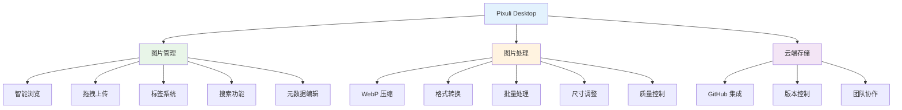
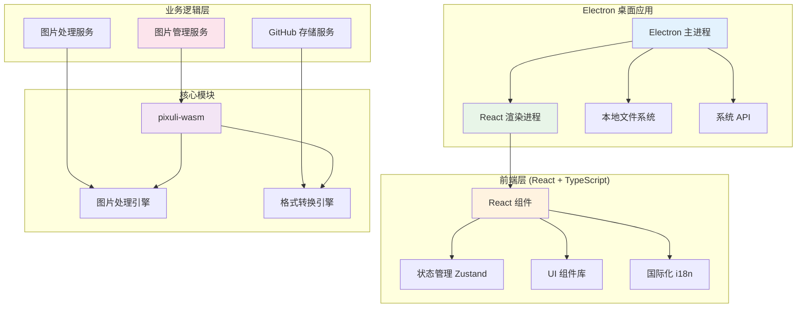

# Pixuli Desktop - 智能图片管理桌面应用

[](https://opensource.org/licenses/MIT)
[](https://nodejs.org/about/releases)

## 📖 项目概述

**Pixuli Desktop** 是 Pixuli Monorepo 中的桌面应用部分，基于 Electron + React + TypeScript + Rust 构建的跨平台智能图片管理桌面应用。

## ✨ 主要功能



## 🛠️ 技术架构



## 🚀 快速开始

### 环境要求
- Node.js >= 22.0.0
- pnpm
- Rust (用于构建 WASM 模块)

### 安装和运行

```bash
# 从项目根目录
cd pixuli

# 安装所有依赖
pnpm install

# 构建 wasm 模块
pnpm run build:wasm

# 桌面端：开发模式
pnpm run dev:desktop

# 桌面端：应用构建
pnpm run build:desktop
```

### 桌面应用特性

**优势**：
- ✅ 完整的本地文件系统访问
- ✅ 原生性能优化
- ✅ 系统集成和通知
- ✅ 离线功能支持
- ✅ 多窗口管理
- ✅ 键盘快捷键

**支持平台**：
- 🍎 macOS (x64, ARM64)
- 🪟 Windows (x64)

## 📦 项目结构

```
apps/desktop/
├── src/                           # 源代码
│   ├── components/                # React 组件
│   │   ├── image-compression/    # 图片压缩组件
│   │   ├── image-format-conversion/ # 格式转换组件
│   │   └── LanguageSwitcher.tsx   # 语言切换器
│   ├── config/                    # 配置文件
│   ├── hooks/                     # 自定义 Hooks
│   ├── i18n/                      # 国际化配置
│   ├── services/                  # 业务服务
│   ├── stores/                    # 状态管理
│   ├── types/                     # 类型定义
│   └── utils/                     # 工具函数
├── electron/                      # Electron 主进程
│   ├── main/                      # 主进程代码
│   │   ├── services/             # 主进程服务
│   │   ├── index.ts              # 主进程入口
│   │   └── update.ts             # 自动更新
│   └── preload/                   # 预加载脚本
├── build/                         # 构建资源
├── dist/                          # 构建输出
├── dist-electron/                 # Electron 构建输出
├── release/                       # 分发文件
├── electron-builder.json         # Electron 构建配置
├── vite.config.ts                # Vite 配置
└── tailwind.config.js            # Tailwind CSS 配置
```

## 🔧 开发指南

### 脚本命令

- `pnpm run dev` - 启动开发服务器
- `pnpm run build` - 构建应用并打包 Electron 应用

### 配置文件

- **electron-builder.json** - Electron 应用构建配置
- **vite.config.ts** - Vite 构建配置
- **tailwind.config.js** - Tailwind CSS 配置
- **tsconfig.json** - TypeScript 配置

### 核心依赖

- **Electron** - 桌面应用框架
- **React** - 用户界面库
- **TypeScript** - 类型安全的 JavaScript
- **Vite** - 构建工具
- **Tailwind CSS** - CSS 框架
- **Zustand** - 状态管理
- **pixuli-wasm** - 核心 WASM 模块

## 📄 许可证

本项目采用 [MIT 许可证](LICENSE)

## 🙏 致谢

- [Electron](https://electronjs.org/) - 跨平台桌面应用框架
- [React](https://reactjs.org/) - 用户界面库
- [Rust](https://www.rust-lang.org/) - 高性能系统编程语言
- [NAPI-RS](https://napi.rs/) - Node.js 原生模块绑定
- [image-rs](https://github.com/image-rs/image) - Rust 图片处理库
- [Tailwind CSS](https://tailwindcss.com/) - 实用优先的 CSS 框架

---

⭐ 如果这个项目对您有帮助，请给我们一个星标！