```mermaid
graph TB
    A[Pixuli Desktop] --> B[图片管理]
    A --> C[图片处理]
    A --> D[AI 分析]
    A --> E[云端存储]
    
    B --> B1[智能浏览]
    B --> B2[拖拽上传]
    B --> B3[标签系统]
    B --> B4[搜索功能]
    B --> B5[元数据编辑]
    
    C --> C1[WebP 压缩]
    C --> C2[格式转换]
    C --> C3[批量处理]
    C --> C4[尺寸调整]
    C --> C5[质量控制]
    
    D --> D1[内容识别]
    D --> D2[智能标签]
    D --> D3[颜色分析]
    D --> D4[多模型支持]
    
    E --> E1[GitHub 集成]
    E --> E2[版本控制]
    E --> E3[团队协作]
    
    style A fill:#e3f2fd
    style B fill:#e8f5e8
    style C fill:#fff3e0
    style D fill:#fce4ec
    style E fill:#f3e5f5
```

# Pixuli Desktop - 智能图片管理桌面应用

[](https://opensource.org/licenses/MIT)
[](https://nodejs.org/about/releases)

## 📖 项目概述

**Pixuli Desktop** 是 Pixuli Monorepo 中的桌面应用部分，基于 Electron + React + TypeScript + Rust 构建的跨平台智能图片管理桌面应用。

## ✨ 主要功能



## ✨ 主要功能



```mermaid
graph TB
    A[Pixuli 智能图片管理] --> B[图片管理]
    A --> C[图片处理]
    A --> D[AI 分析]
    A --> E[云端存储]
    
    B --> B1[智能浏览]
    B --> B2[拖拽上传]
    B --> B3[标签系统]
    B --> B4[搜索功能]
    B --> B5[元数据编辑]
    
    C --> C1[WebP 压缩]
    C --> C2[格式转换]
    C --> C3[批量处理]
    C --> C4[尺寸调整]
    C --> C5[质量控制]
    
    D --> D1[内容识别]
    D --> D2[智能标签]
    D --> D3[颜色分析]
    D --> D4[多模型支持]
    
    E --> E1[GitHub 集成]
    E --> E2[版本控制]
    E --> E3[团队协作]
    
    style A fill:#e3f2fd
    style B fill:#e8f5e8
    style C fill:#fff3e0
    style D fill:#fce4ec
    style E fill:#f3e5f5
```

## 🛠️ 技术架构

```mermaid
graph TB
    subgraph "Electron 桌面应用"
        A[Electron 主进程]
        B[React 渲染进程]
        C[本地文件系统]
        D[系统 API]
    end
    
    subgraph "前端层 (React + TypeScript)"
        E[React 组件]
        F[状态管理 Zustand]
        G[UI 组件库]
        H[路由管理]
    end
    
    subgraph "业务逻辑层"
        I[图片管理服务]
        J[AI 分析服务]
        K[图片处理服务]
        L[GitHub 存储服务]
    end
    
    subgraph "AI 模型层"
        M[TensorFlow 处理器]
        N[TensorFlow Lite 处理器]
        O[ONNX 处理器]
        P[本地 LLM 处理器]
        Q[远程 API 处理器]
    end
    
    subgraph "核心模块"
        R[pixuli-wasm]
        S[图片处理引擎]
        T[AI 分析引擎]
        U[格式转换引擎]
    end
    
    A --> B
    B --> E
    E --> F
    E --> G
    E --> H
    
    I --> R
    J --> M
    J --> N
    J --> O
    J --> P
    J --> Q
    K --> S
    L --> U
    
    M --> T
    N --> T
    O --> T
    P --> T
    Q --> T
    
    R --> S
    R --> T
    R --> U
    
    A --> C
    A --> D
    
    style A fill:#e3f2fd
    style B fill:#e8f5e8
    style E fill:#fff3e0
    style I fill:#fce4ec
    style R fill:#f3e5f5
```



## 🤖 AI 模型支持

支持 5 种 AI 模型类型：
- **TensorFlow** (`.pb`, `.pbtxt`, `.json`, `.bin`, `.ckpt`, `.h5`)
- **TensorFlow Lite** (`.tflite`)
- **ONNX** (`.onnx`, `.ort`)
- **本地 LLM** (Llama、Mistral 等)
- **远程 API** (OpenAI、Qwen、Claude、Gemini 等)

## 🚀 快速开始

### 环境要求
- Node.js >= 22.0.0
- pnpm
- Rust (用于构建 WASM 模块)

### 安装和运行

```bash
# 从项目根目录
cd pixuli

# 安装所有依赖
pnpm install

# 开发模式
pnpm run dev

# 构建应用
pnpm run build

# Electron 开发模式
pnpm run electron:dev

# 构建 Electron 应用
pnpm run electron:build

# 分发应用
pnpm run dist
pnpm run dist:mac
pnpm run dist:win
```

### 桌面应用特性

**优势**：
- ✅ 完整的本地文件系统访问
- ✅ 原生性能优化
- ✅ 系统集成和通知
- ✅ 离线功能支持
- ✅ 多窗口管理
- ✅ 键盘快捷键

**支持平台**：
- 🍎 macOS (x64, ARM64)
- 🪟 Windows (x64)
- 🐧 Linux (x64)

## 📦 项目结构

```
apps/desktop/
├── src/                    # 源代码
│   ├── components/         # React 组件
│   ├── hooks/             # 自定义 Hooks
│   ├── services/          # 业务服务
│   ├── stores/            # 状态管理
│   ├── types/             # 类型定义
│   └── utils/             # 工具函数
├── electron/              # Electron 主进程
│   ├── main/              # 主进程代码
│   └── preload/           # 预加载脚本
├── dist/                  # 构建输出
├── dist-electron/         # Electron 构建输出
└── release/               # 分发文件
```

## 📄 许可证

本项目采用 [MIT 许可证](LICENSE)

## 🙏 致谢

- [Electron](https://electronjs.org/) - 跨平台桌面应用框架
- [React](https://reactjs.org/) - 用户界面库
- [Rust](https://www.rust-lang.org/) - 高性能系统编程语言
- [NAPI-RS](https://napi.rs/) - Node.js 原生模块绑定
- [image-rs](https://github.com/image-rs/image) - Rust 图片处理库
- [Tailwind CSS](https://tailwindcss.com/) - 实用优先的 CSS 框架

---

⭐ 如果这个项目对您有帮助，请给我们一个星标！
