# Pixuli Mobile - 智能图片管理移动应用

[](https://opensource.org/licenses/MIT)
[](https://reactnative.dev/)
[](https://www.typescriptlang.org/)

## 📖 项目概述

**Pixuli Mobile** 是 Pixuli Monorepo 中的移动应用部分，基于 React Native +
TypeScript 构建的跨平台智能图片管理移动应用。

## ✨ 主要功能

```mermaid
graph TB
    A[Pixuli Mobile] --> B[图片管理]
    A --> C[图片处理]
    A --> D[云端存储]
    A --> E[搜索筛选]
    A --> F[相机集成]

    B --> B1[智能浏览]
    B --> B2[单张上传]
    B --> B3[批量删除]
    B --> B4[全屏预览]
    B --> B5[元数据编辑]
    B --> B6[下拉刷新]

    C --> C1[图片压缩]
    C --> C2[格式转换]
    C --> C3[尺寸调整]
    C --> C4[图片裁剪]
    C --> C5[处理预览]

    D --> D1[GitHub 集成]
    D --> D2[Gitee 集成]
    D --> D3[配置管理]
    D --> D4[版本控制]
    D --> D5[元数据缓存]

    E --> E1[搜索功能]
    E --> E2[标签筛选]
    E --> E3[尺寸筛选]
    E --> E4[日期筛选]
    E --> E5[排序功能]

    F --> F1[直接拍照]
    F --> F2[拍照后编辑]
    F --> F3[权限管理]

    style A fill:#e3f2fd
    style B fill:#e8f5e8
    style C fill:#fff3e0
    style D fill:#f3e5f5
    style E fill:#fce4ec
    style F fill:#e1f5fe
```



## 🎯 主要功能模块

### 🖼️ 图片管理

- **智能浏览** - 2列网格布局展示图片，支持懒加载
- **单张上传** - 支持相机拍照和相册选择上传
- **批量删除** - 支持批量删除图片，批量删除确认
- **格式支持** - JPEG, PNG, WebP, GIF, SVG, BMP
- **全屏预览** - 支持左右滑动浏览，底部缩略图导航
- **下拉刷新** - 支持下拉刷新图片列表
- **元数据查看** - 查看图片名称、尺寸、描述、标签等完整信息
- **元数据编辑** - 编辑图片名称、描述和标签
- **删除功能** - 支持单张和批量删除

### 🔧 图片处理

- **图片压缩** - 上传前可调节压缩质量（10%-100%），节省存储空间
- **格式转换** - 支持 JPEG、PNG、WebP 格式转换
- **尺寸调整** - 可自定义宽度和高度，支持保持宽高比
- **图片裁剪** - 支持拖动裁剪框选择区域，可调整裁剪框大小
- **处理预览** - 实时预览处理效果，显示处理前后的图片对比、文件大小、压缩率等统计信息

### 📋 图片详情

- **详细信息面板** - 显示文件大小、上传时间、URL、ID、创建时间、更新时间、图片类型等完整信息
- **分享功能** - 支持分享图片链接（先下载到本地再分享，支持超时控制）
- **复制链接** - 一键复制图片 URL 到剪贴板
- **快捷操作** - 分享按钮集成到顶部工具栏，与删除按钮同级，操作更便捷
- **元数据刷新** - 支持刷新单个图片的元数据

### 🔍 搜索和筛选

- **搜索功能** - 按名称、描述、标签搜索图片
- **标签筛选** - 支持按标签筛选图片
- **尺寸筛选** - 支持按最小/最大宽度和高度筛选
- **日期筛选** - 支持按创建时间范围筛选
- **排序功能** - 支持按日期、名称、大小排序

### ☁️ 云端同步

- **GitHub 集成** - 使用 GitHub 仓库存储
- **Gitee 集成** - 支持 Gitee 仓库存储
- **配置管理** - 支持 GitHub 和 Gitee 配置的导入、导出和清除
- **配置共存** - GitHub 和 Gitee 配置可共存，互不影响
- **自动切换** - 清除一个配置时自动切换到另一个配置（如果存在）
- **版本控制** - 利用 Git 版本管理
- **元数据缓存** - 优化元数据加载，支持缓存机制

### 📷 相机集成

- **直接拍照** - 支持相机直接拍照上传
- **拍照后编辑** - 拍照后即时编辑（描述、标签）
- **图片来源选择** - 支持选择拍照或相册
- **权限管理** - 相机权限自动请求

### 🎨 主题和国际化

- **主题切换** - 支持浅色/深色/自动主题切换
- **多语言支持** - 支持中文和英文界面
- **语言切换** - 实时切换界面语言

## 🛠️ 技术架构


## 🚀 快速开始

### 环境要求

- Node.js >= 22.0.0
- Android Studio (Android 开发)
- Xcode (iOS 开发，仅 macOS)
- CocoaPods (iOS 依赖管理)

### 安装和运行

```bash
# 从项目根目录
cd pixuli

# 安装所有依赖
pnpm install

# 进入 mobile 应用目录
cd apps/mobile

# 开发模式 Android
pnpm start --android

# 开发模式 iOS (仅 macOS)
pnpm start --ios
```

### 移动应用特性

**核心功能**：

- ✅ **图片管理**：智能浏览、单张上传、批量删除、全屏预览
- ✅ **图片处理**：压缩、格式转换、尺寸调整、图片裁剪
- ✅ **云端存储**：GitHub 和 Gitee 双存储支持
- ✅ **搜索筛选**：按名称、描述、标签搜索，支持多维度筛选
- ✅ **相机集成**：直接拍照上传，拍照后即时编辑
- ✅ **主题切换**：支持浅色/深色/自动主题切换
- ✅ **国际化支持**：中文和英文界面切换
- ✅ **元数据缓存**：优化元数据加载，支持缓存机制

**优势**：

- ✅ 跨平台支持（iOS 和 Android）
- ✅ 原生性能体验
- ✅ 相机直接集成
- ✅ 离线元数据缓存
- ✅ 响应式设计

**支持平台**：

- 📱 iOS (需要 macOS 开发环境)
- 🤖 Android

## 📦 项目结构

```
apps/mobile/
├── app/                     # Expo Router 路由（页面）
│   ├── _layout.tsx         # 根布局
│   └── (tabs)/             # Tab 导航组
│       ├── _layout.tsx     # Tab 布局
│       ├── index.tsx       # 首页（图片列表）
│       ├── settings.tsx    # 设置页面
│       └── settings/       # 设置子页面
│           ├── github.tsx  # GitHub 配置页面
│           └── gitee.tsx   # Gitee 配置页面
├── components/             # 可复用组件
│   ├── ImageBrowser.tsx    # 图片浏览器（全屏预览）
│   ├── ImageGrid.tsx       # 图片网格组件
│   ├── ImageUploadButton.tsx  # 图片上传按钮
│   ├── ImageUploadEditModal.tsx  # 上传前编辑模态框
│   ├── ImageEditModal.tsx  # 图片编辑模态框
│   ├── ImageCropModal.tsx  # 图片裁剪模态框
│   ├── SearchAndFilter.tsx # 搜索和筛选组件
│   ├── ThemedText.tsx      # 主题文本组件
│   ├── ThemedView.tsx      # 主题视图组件
│   └── ui/                 # UI 组件
│       ├── IconSymbol.tsx  # 图标组件
│       └── IconSymbol.ios.tsx  # iOS 图标组件
├── services/               # 业务服务
│   ├── githubStorageService.ts  # GitHub 存储服务
│   └── giteeStorageService.ts   # Gitee 存储服务
├── stores/                 # 状态管理（Zustand）
│   └── imageStore.ts       # 图片状态管理
├── hooks/                 # 自定义 Hooks
│   ├── useColorScheme.ts  # 颜色方案 Hook
│   └── useThemeColor.ts   # 主题颜色 Hook
├── utils/                 # 工具函数
│   ├── imageUtils.ts      # 图片处理工具
│   ├── metadataCache.ts   # 元数据缓存
│   └── toast.ts           # 提示消息工具
├── config/                # 配置文件
│   ├── github.ts          # GitHub 配置
│   ├── gitee.ts           # Gitee 配置
│   └── theme.ts           # 主题配置
├── constants/             # 常量定义
│   └── theme.ts           # 主题常量
├── i18n/                  # 国际化
│   ├── index.ts           # i18n 初始化
│   ├── locales.ts         # 翻译文本
│   └── useI18n.ts         # i18n Hook
├── assets/                # 静态资源
│   └── images/            # 图片资源
├── android/               # Android 原生代码
├── ios/                   # iOS 原生代码
├── scripts/               # 脚本文件
│   └── generate-icons.js  # 图标生成脚本
├── app.json              # Expo 配置
├── package.json           # 项目依赖
├── tsconfig.json          # TypeScript 配置
├── FEATURE_ROADMAP.md     # 功能路线图
└── README.md              # 项目说明
```

## 🔧 开发指南

### 脚本命令

- `pnpm start` - 启动开发服务器
- `pnpm start --android` - 启动 Android 开发
- `pnpm start --ios` - 启动 iOS 开发（仅 macOS）
- `pnpm android` - 构建 Android 应用
- `pnpm ios` - 构建 iOS 应用（仅 macOS）

### 核心依赖

- **React Native** - 跨平台移动应用框架
- **Expo** - React Native 开发工具链
- **TypeScript** - 类型安全的 JavaScript
- **Zustand** - 状态管理
- **React Navigation** - 导航管理
- **pixuli-ui** - 共享 UI 组件库

## 🙏 致谢

- [React Native](https://reactnative.dev/) - 跨平台移动应用框架
- [Expo](https://expo.dev/) - React Native 开发工具链
- [React](https://reactjs.org/) - 用户界面库
- [TypeScript](https://www.typescriptlang.org/) - 类型安全的 JavaScript
- [Zustand](https://zustand-demo.pmnd.rs/) - 状态管理
- [React Navigation](https://reactnavigation.org/) - 导航管理
- [i18next](https://www.i18next.com/) - 国际化框架

---

⭐ 如果这个项目对您有帮助，请给我们一个星标！
