English

# Pixuli Mobile - Intelligent Image Management Mobile Application

## 📖 Project Overview

**Pixuli Mobile** is a cross-platform intelligent image management mobile
application built with React Native + TypeScript. It provides a complete image
management, processing, storage, and browsing solution, supporting GitHub and
Gitee dual storage backends.

## ✨ Key Features

```mermaid
graph TB
    A[Pixuli Mobile] --> B[Image Management]
    A --> C[Image Processing]
    A --> D[Cloud Storage]
    A --> E[Search & Filter]
    A --> F[Camera Integration]
    A --> G[Slide Show]

    B --> B1[Smart Browsing]
    B --> B2[Single Upload]
    B --> B3[Batch Delete]
    B --> B4[Full-screen Preview]
    B --> B5[Metadata Editing]
    B --> B6[Pull to Refresh]

    C --> C1[Image Compression]
    C --> C2[Format Conversion]
    C --> C3[Size Adjustment]
    C --> C4[Image Cropping]
    C --> C5[Processing Preview]

    D --> D1[GitHub Integration]
    D --> D2[Gitee Integration]
    D --> D3[Configuration Management]
    D --> D4[Version Control]
    D --> D5[Metadata Cache]

    E --> E1[Search]
    E --> E2[Tag Filter]
    E --> E3[Size Filter]
    E --> E4[Date Filter]
    E --> E5[Sorting]

    F --> F1[Direct Capture]
    F --> F2[Post-capture Editing]
    F --> F3[Permission Management]

    G --> G1[Auto-play]
    G --> G2[Playback Modes]
    G --> G3[Transition Effects]

    style A fill:#e3f2fd
    style B fill:#e8f5e8
    style C fill:#fff3e0
    style D fill:#f3e5f5
    style E fill:#fce4ec
    style F fill:#e1f5fe
    style G fill:#f0f4c3
```

## 🎯 Feature Details

| Feature Module            | Feature Name              | Description                                                           |
| ------------------------- | ------------------------- | --------------------------------------------------------------------- |
| 🖼️ **Image Management**   | Smart Browsing            | 2-column grid layout with lazy loading                                |
|                           | Single Upload             | Camera capture or gallery selection upload                            |
|                           | Batch Delete              | Batch selection and delete with confirmation mechanism                |
|                           | Format Support            | JPEG, PNG, WebP, GIF, SVG, BMP                                        |
|                           | Full-screen Preview       | Left/right swipe browsing with bottom thumbnail navigation            |
|                           | Pull to Refresh           | Real-time sync of latest content                                      |
|                           | Metadata View/Edit        | View and edit name, size, description, tags                           |
| 🎨 **Image Processing**   | Image Compression         | Adjustable compression quality (10%-100%)                             |
|                           | Format Conversion         | Support for JPEG, PNG, WebP format conversion                         |
|                           | Size Adjustment           | Custom width and height with aspect ratio preservation                |
|                           | Image Cropping            | Drag crop box, adjust size and position                               |
|                           | Processing Preview        | Real-time preview of processing effects and statistics                |
| 📋 **Image Details**      | Detailed Info Panel       | Display complete information including file size, time, URL, ID, etc. |
|                           | Share Feature             | Share image links (with timeout control)                              |
|                           | Copy Link                 | One-click copy image URL                                              |
|                           | Metadata Refresh          | Refresh metadata for a single image                                   |
| 🔍 **Search & Filter**    | Search                    | Search by name, description, and tags                                 |
|                           | Tag Filter                | Filter images by tags                                                 |
|                           | Size Filter               | Filter by min/max width and height                                    |
|                           | Date Filter               | Filter by creation time range                                         |
|                           | Sorting                   | Sort by date, name, and size                                          |
| ☁️ **Cloud Storage**      | GitHub Integration        | Use GitHub repositories for storage                                   |
|                           | Gitee Integration         | Support Gitee repository storage                                      |
|                           | Configuration Management  | Configuration import, export, and clear                               |
|                           | Configuration Coexistence | GitHub and Gitee configurations can coexist                           |
|                           | Version Control           | Leverage Git version management                                       |
|                           | Metadata Cache            | Optimized loading with cache mechanism                                |
| 📷 **Camera Integration** | Direct Capture            | Camera direct capture upload                                          |
|                           | Post-capture Editing      | Edit description and tags immediately after capture                   |
|                           | Image Source Selection    | Choose between camera or gallery                                      |
|                           | Permission Management     | Automatic camera permission request                                   |
| 🎬 **Slide Show**         | Auto-play                 | Configurable playback interval and mode                               |
|                           | Playback Modes            | Sequential and random playback                                        |
|                           | Transition Effects        | Fade, slide, zoom, and other animations                               |
|                           | Loop Playback             | Support for looping through all images                                |
|                           | Playback Controls         | Play/pause/stop, previous/next                                        |
|                           | Image List                | Sidebar displaying all image thumbnails                               |
|                           | Image Information         | Show/hide metadata information                                        |
| 🎨 **Theme & i18n**       | Theme Switching           | Light/dark/auto themes                                                |
|                           | Multi-language Support    | Chinese and English interfaces                                        |
|                           | Language Switching        | Real-time switching without restart                                   |

## 🚀 Quick Start

### Download and Install

1. Download the latest APK file from
   [GitHub Releases](https://github.com/trueLoving/Pixuli/releases)
2. Enable "Unknown Sources" installation permission on Android device
3. Install and open the application
4. First-time use requires configuring GitHub or Gitee storage backend

### System Requirements

- **Android**: Android 5.0 (API 21) or higher
- **iOS**: Under development

## 📱 Application Features

**Core Advantages**:

- ✅ **Cross-platform Support** - iOS and Android (Android released, iOS in
  development)
- ✅ **Native Performance** - Built with React Native for smooth native
  experience
- ✅ **Camera Integration** - Direct capture upload, mobile-exclusive experience
- ✅ **Offline Cache** - Metadata cache mechanism for offline browsing
- ✅ **Responsive Design** - Adapted to different screen sizes
- ✅ **Dual Storage Support** - GitHub and Gitee dual backends for flexible
  choice

## 🔗 Related Links

- [Project Homepage](https://github.com/trueLoving/Pixuli)
- [Issue Feedback](https://github.com/trueLoving/Pixuli/issues)
- [Documentation](https://pixuli-docs.vercel.app/)
- [Feature Roadmap](./ROADMAP.md)
- [Changelog](../../CHANGELOG.md)
- [Contributing Guide](../../CONTRIBUTING.md)

## 📄 License

This project is licensed under the MIT License. See the
[LICENSE](https://github.com/trueLoving/Pixuli/blob/main/LICENSE) file for
details.

---

⭐ If this project is helpful to you, please give us a star!
