# Pixuli Mobile - 智能图片管理移动应用

## 📖 项目概述

**Pixuli Mobile** 是一款基于 React Native +
TypeScript 构建的跨平台智能图片管理移动应用。提供完整的图片管理、处理、存储和浏览解决方案，支持 GitHub 和 Gitee 双存储后端。

## ✨ 主要功能

```mermaid
graph TB
    A[Pixuli Mobile] --> B[图片管理]
    A --> C[图片处理]
    A --> D[云端存储]
    A --> E[搜索筛选]
    A --> F[相机集成]
    A --> G[幻灯片播放]

    B --> B1[智能浏览]
    B --> B2[单张上传]
    B --> B3[批量删除]
    B --> B4[全屏预览]
    B --> B5[元数据编辑]
    B --> B6[下拉刷新]

    C --> C1[图片压缩]
    C --> C2[格式转换]
    C --> C3[尺寸调整]
    C --> C4[图片裁剪]
    C --> C5[处理预览]

    D --> D1[GitHub 集成]
    D --> D2[Gitee 集成]
    D --> D3[配置管理]
    D --> D4[版本控制]
    D --> D5[元数据缓存]

    E --> E1[搜索功能]
    E --> E2[标签筛选]
    E --> E3[尺寸筛选]
    E --> E4[日期筛选]
    E --> E5[排序功能]

    F --> F1[直接拍照]
    F --> F2[拍照后编辑]
    F --> F3[权限管理]

    G --> G1[自动播放]
    G --> G2[播放模式]
    G --> G3[过渡效果]

    style A fill:#e3f2fd
    style B fill:#e8f5e8
    style C fill:#fff3e0
    style D fill:#f3e5f5
    style E fill:#fce4ec
    style F fill:#e1f5fe
    style G fill:#f0f4c3
```

## 🎯 功能详情

| 功能模块          | 功能名称        | 功能描述                               |
| ----------------- | --------------- | -------------------------------------- |
| 🖼️ **图片管理**   | 智能浏览        | 2列网格布局，支持懒加载                |
|                   | 单张上传        | 相机拍照或相册选择上传                 |
|                   | 批量删除        | 批量选择并删除，带确认机制             |
|                   | 格式支持        | JPEG, PNG, WebP, GIF, SVG, BMP         |
|                   | 全屏预览        | 左右滑动浏览，底部缩略图导航           |
|                   | 下拉刷新        | 实时同步最新内容                       |
|                   | 元数据查看/编辑 | 查看和编辑名称、尺寸、描述、标签       |
| 🎨 **图片处理**   | 图片压缩        | 可调节压缩质量（10%-100%）             |
|                   | 格式转换        | 支持 JPEG、PNG、WebP 格式转换          |
|                   | 尺寸调整        | 自定义宽高，支持保持宽高比             |
|                   | 图片裁剪        | 拖动裁剪框，调整大小和位置             |
|                   | 处理预览        | 实时预览处理效果和统计信息             |
| 📋 **图片详情**   | 详细信息面板    | 显示文件大小、时间、URL、ID 等完整信息 |
|                   | 分享功能        | 分享图片链接（支持超时控制）           |
|                   | 复制链接        | 一键复制图片 URL                       |
|                   | 元数据刷新      | 刷新单个图片的元数据                   |
| 🔍 **搜索筛选**   | 搜索功能        | 按名称、描述、标签搜索                 |
|                   | 标签筛选        | 按标签筛选图片                         |
|                   | 尺寸筛选        | 按最小/最大宽度和高度筛选              |
|                   | 日期筛选        | 按创建时间范围筛选                     |
|                   | 排序功能        | 按日期、名称、大小排序                 |
| ☁️ **云端存储**   | GitHub 集成     | 使用 GitHub 仓库存储                   |
|                   | Gitee 集成      | 支持 Gitee 仓库存储                    |
|                   | 配置管理        | 配置导入、导出和清除                   |
|                   | 配置共存        | GitHub 和 Gitee 配置可共存             |
|                   | 版本控制        | 利用 Git 版本管理                      |
|                   | 元数据缓存      | 优化加载，支持缓存机制                 |
| 📷 **相机集成**   | 直接拍照        | 相机直接拍照上传                       |
|                   | 拍照后编辑      | 拍照后即时编辑描述和标签               |
|                   | 图片来源选择    | 选择拍照或相册                         |
|                   | 权限管理        | 相机权限自动请求                       |
| 🎬 **幻灯片播放** | 自动播放        | 可配置播放间隔和模式                   |
|                   | 播放模式        | 顺序播放和随机播放                     |
|                   | 过渡效果        | 淡入淡出、滑动、缩放等动画             |
|                   | 循环播放        | 支持循环播放所有图片                   |
|                   | 播放控制        | 播放/暂停/停止、上一张/下一张          |
|                   | 图片列表        | 侧边栏显示所有图片缩略图               |
|                   | 图片信息        | 可显示/隐藏元数据信息                  |
| 🎨 **主题国际化** | 主题切换        | 浅色/深色/自动主题                     |
|                   | 多语言支持      | 中文和英文界面                         |
|                   | 语言切换        | 实时切换，无需重启                     |

## 🚀 快速开始

### 下载安装

1. 从 [GitHub Releases](https://github.com/trueLoving/Pixuli/releases)
   下载最新版本的 APK 文件
2. 在 Android 设备上启用"未知来源"安装权限
3. 安装并打开应用
4. 首次使用需要配置 GitHub 或 Gitee 存储后端

### 系统要求

- **Android**: Android 5.0 (API 21) 及以上版本
- **iOS**: 正在开发中

## 📱 应用特性

**核心优势**：

- ✅ **跨平台支持** - iOS 和 Android（Android 已发布，iOS 开发中）
- ✅ **原生性能** - 基于 React Native，流畅的原生体验
- ✅ **相机集成** - 直接拍照上传，移动端专属体验
- ✅ **离线缓存** - 元数据缓存机制，离线也能浏览
- ✅ **响应式设计** - 适配不同屏幕尺寸
- ✅ **双存储支持** - GitHub 和 Gitee 双后端，灵活选择

## 🔗 相关链接

- [项目主页](https://github.com/trueLoving/Pixuli)
- [问题反馈](https://github.com/trueLoving/Pixuli/issues)
- [使用文档](https://pixuli-docs.vercel.app/)
- [功能路线图](./ROADMAP.md)
- [更新日志](./CHANGELOG.md)
- [贡献指南](./CONTRIBUTING.md)

## 📄 许可证

本项目采用 MIT 许可证。详情请参阅
[LICENSE](https://github.com/trueLoving/Pixuli/blob/main/LICENSE) 文件。

---

⭐ 如果这个项目对您有帮助，请给我们一个星标！
