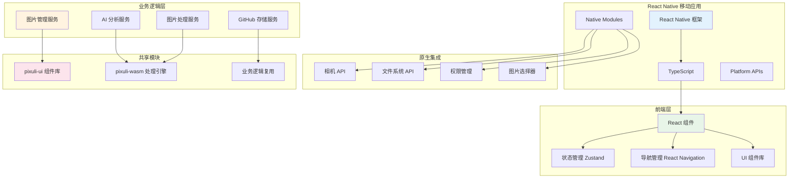

# 📱 Pixuli Mobile - 智能图片管理移动应用

[](https://opensource.org/licenses/MIT)
[](https://reactnative.dev/)
[](https://www.typescriptlang.org/)

## 📖 项目简介

Pixuli Mobile 是 Pixuli 智能图片管理生态系统的移动端应用，基于 React Native + TypeScript 构建，提供跨平台的图片管理、AI 分析和云端同步功能。

## ✨ 主要功能

### 🖼️ 图片管理
- **智能浏览** - 网格布局展示图片，支持懒加载
- **拍照上传** - 支持相机拍照和相册选择
- **批量操作** - 批量上传、删除、重命名
- **格式支持** - JPEG, PNG, WebP, GIF, SVG, BMP
- **预览功能** - 全屏预览、缩放、旋转

### 🤖 AI 智能分析
- **物体检测** - 识别图片中的物体
- **场景识别** - 自动识别场景类型
- **人脸检测** - 检测和标记人脸
- **文字识别** - OCR 文字提取
- **智能标签** - AI 自动生成标签

### 🔧 图片处理
- **WebP 压缩** - 智能压缩优化
- **格式转换** - 支持多种格式转换
- **尺寸调整** - 批量调整图片尺寸
- **质量控制** - 可调节压缩参数

### ☁️ 云端同步
- **GitHub 集成** - 使用 GitHub 仓库存储
- **离线同步** - 支持离线浏览和同步
- **版本控制** - 利用 Git 版本管理
- **团队协作** - 支持多人协作

## 🛠️ 技术架构



## 🚀 快速开始

### 环境要求

- Node.js >= 20.0.0
- React Native CLI
- Android Studio (Android 开发)
- Xcode (iOS 开发，仅 macOS)
- CocoaPods (iOS 依赖管理)

### 安装依赖

```bash
# 安装项目依赖
npm install

# iOS 依赖安装 (仅 macOS)
cd ios && pod install && cd ..
```

### 运行项目

```bash
# 启动 Metro  bundler
npm start

# 运行 Android 版本
npm run android

# 运行 iOS 版本 (仅 macOS)
npm run ios
```

### 开发调试

```bash
# 代码检查
npm run lint

# 运行测试
npm test

# 清理缓存
npx react-native start --reset-cache
```

## 📁 项目结构

```
apps/mobile/
├── src/
│   ├── components/          # 可复用组件
│   │   ├── common/         # 通用组件
│   │   ├── image/          # 图片相关组件
│   │   └── ui/             # UI 组件
│   ├── screens/            # 页面组件
│   │   ├── HomeScreen.tsx
│   │   ├── ImageDetailScreen.tsx
│   │   └── SettingsScreen.tsx
│   ├── services/           # 业务服务
│   │   ├── imageService.ts
│   │   ├── aiService.ts
│   │   └── storageService.ts
│   ├── hooks/              # 自定义 Hooks
│   │   ├── useImages.ts
│   │   ├── useCamera.ts
│   │   └── useTheme.ts
│   ├── utils/              # 工具函数
│   │   ├── theme.ts
│   │   ├── permissions.ts
│   │   └── imageUtils.ts
│   ├── types/              # 类型定义
│   │   └── index.ts
│   └── stores/             # 状态管理
│       └── imageStore.ts
├── android/                # Android 原生代码
├── ios/                    # iOS 原生代码
├── App.tsx                 # 应用入口
└── package.json
```

## 🔧 核心功能实现

### 图片管理

```typescript
// 图片服务示例
import { ImageItem } from '../types';

export class ImageService {
  async getImages(): Promise<ImageItem[]> {
    // 获取图片列表
  }
  
  async uploadImage(imageUri: string): Promise<ImageItem> {
    // 上传图片
  }
  
  async deleteImage(imageId: string): Promise<void> {
    // 删除图片
  }
}
```

### AI 分析

```typescript
// AI 服务示例
export class AIService {
  async analyzeImage(imageUri: string): Promise<AnalysisResult> {
    // AI 图片分析
  }
  
  async generateTags(imageUri: string): Promise<string[]> {
    // 生成智能标签
  }
}
```

### 主题系统

```typescript
// 主题配置
export const lightTheme: ThemeColors = {
  primary: '#007AFF',
  background: '#FFFFFF',
  text: '#000000',
  // ...
};

export const darkTheme: ThemeColors = {
  primary: '#0A84FF',
  background: '#000000',
  text: '#FFFFFF',
  // ...
};
```

## 📱 平台特性

### Android 特性
- Material Design 3 设计语言
- 权限管理优化
- 后台任务处理
- 文件系统访问

### iOS 特性
- Human Interface Guidelines
- 原生导航体验
- 相册权限管理
- 后台应用刷新

## 🔗 与 Pixuli 生态集成

### 共享组件
- 复用 `packages/ui` 中的组件
- 统一的设计系统和主题
- 一致的交互体验

### 业务逻辑
- 共享图片处理逻辑
- 统一的 AI 分析服务
- GitHub 存储集成

### 数据同步
- 与桌面版和 Web 版数据同步
- 云端存储一致性
- 离线缓存策略

## 🧪 测试

```bash
# 运行单元测试
npm test

# 运行 E2E 测试
npm run test:e2e

# 测试覆盖率
npm run test:coverage
```

## 📦 构建发布

### Android 构建

```bash
# 生成签名 APK
cd android
./gradlew assembleRelease

# 生成 AAB (推荐)
./gradlew bundleRelease
```

### iOS 构建

```bash
# 使用 Xcode 构建
# 或使用命令行
npx react-native run-ios --configuration Release
```

## 🐛 常见问题

### 1. Metro 缓存问题
```bash
npx react-native start --reset-cache
```

### 2. iOS 依赖问题
```bash
cd ios && pod install && cd ..
```

### 3. Android 构建问题
```bash
cd android && ./gradlew clean && cd ..
```

### 4. 权限问题
确保在 `android/app/src/main/AndroidManifest.xml` 和 `ios/mobile/Info.plist` 中正确配置权限。

## 🤝 贡献指南

1. Fork 项目
2. 创建功能分支 (`git checkout -b feature/AmazingFeature`)
3. 提交更改 (`git commit -m 'Add some AmazingFeature'`)
4. 推送到分支 (`git push origin feature/AmazingFeature`)
5. 打开 Pull Request

## 📄 许可证

本项目采用 MIT 许可证 - 查看 [LICENSE](LICENSE) 文件了解详情。

## 🔗 相关链接

- [Pixuli Desktop](../desktop/README.md) - 桌面版应用
- [Pixuli Web](../web/README.md) - Web 版应用
- [Pixuli UI Package](../../packages/ui/README.md) - 共享 UI 组件
- [Pixuli WASM Package](../../packages/wasm/README.md) - 图片处理引擎
- [项目主页](https://github.com/trueLoving/Pixuli) - GitHub 仓库

## 📊 开发进度

- [x] 项目初始化
- [x] 基础架构搭建
- [ ] 图片管理功能
- [ ] AI 分析集成
- [ ] 云端同步
- [ ] 性能优化
- [ ] 测试覆盖
- [ ] 应用商店发布

---

**Pixuli Mobile** - 让图片管理更智能，让创作更高效！ 📱✨