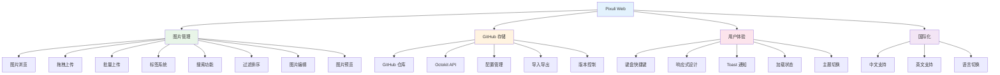
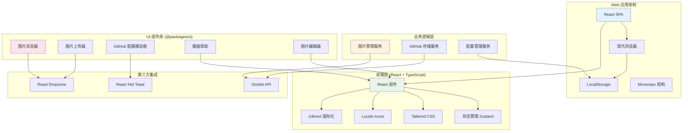

# Pixuli Web - 智能图片管理 Web 应用

[](https://opensource.org/licenses/MIT)
[](https://nodejs.org/about/releases)

## 📖 项目概述

**Pixuli Web** 是 Pixuli Monorepo 中的 Web 应用部分，基于 React + TypeScript +
Vite 构建的智能图片管理 Web 应用。使用 GitHub 作为存储后端，提供完整的图片管理、上传、浏览和编辑功能。

## ✨ 已实现功能



## 🛠️ 技术架构



## 🎯 核心功能

### 📸 图片管理

- **智能浏览**: 网格布局展示图片，支持懒加载和虚拟滚动
- **拖拽上传**: 支持单张和批量图片上传
- **标签系统**: 为图片添加标签，支持标签过滤
- **搜索功能**: 按名称、描述、标签搜索图片
- **元数据编辑**: 编辑图片名称、描述和标签
- **图片预览**: 全屏预览图片，支持缩放和旋转
- **图片编辑**: 在线编辑图片信息

### ☁️ GitHub 存储

- **GitHub 仓库**: 使用 GitHub 仓库作为图片存储
- **Octokit API**: 直接调用 GitHub API 进行文件操作
- **配置管理**: 支持配置的导入、导出和清除
- **版本控制**: 利用 Git 的版本控制功能
- **元数据存储**: 将图片元数据存储为隐藏文件

### 🌐 国际化支持

- **多语言**: 支持中文和英文界面
- **语言切换**: 实时切换界面语言
- **本地化**: 完整的中英文翻译

### ⌨️ 用户体验

- **键盘快捷键**: 支持常用操作的快捷键
- **响应式设计**: 适配桌面和移动设备
- **Toast 通知**: 实时反馈操作结果
- **加载状态**: 显示上传和处理进度
- **主题支持**: 支持明暗主题切换

## 🚀 快速开始

### 环境要求

- Node.js >= 22.0.0
- pnpm
- 现代浏览器 (支持 Canvas API)

### 安装和运行

```bash
# 从项目根目录
cd pixuli

# 安装所有依赖
pnpm install

# 进入 web 应用目录
cd apps/web

# 开发模式
pnpm dev

# 构建应用
pnpm build

# 预览构建结果
pnpm preview
```

### 首次使用

1. **配置 GitHub 仓库**:
   - 点击"配置 GitHub"按钮
   - 输入 GitHub 用户名、仓库名、分支名
   - 提供 GitHub Personal Access Token (需要 repo 权限)
   - 设置图片存储路径

2. **上传图片**:
   - 拖拽图片到上传区域
   - 或点击选择文件
   - 添加图片名称、描述和标签
   - 支持批量上传

3. **管理图片**:
   - 浏览图片网格
   - 使用搜索和标签过滤
   - 编辑图片信息
   - 预览和编辑图片

## 📦 项目结构

```
apps/web/
├── src/                     # 源代码
│   ├── components/             # React 组件
│   │   └── LanguageSwitcher      # 语言切换组件
│   │   └── Demo                  # Demo切换组件
│   ├── config/                 # 配置文件
│   │   └── github.ts             # GitHub 配置管理
│   ├── i18n/                   # 国际化配置
│   │   └── index.ts              # i18n 初始化
│   │   └── useI18n.ts            # i18n hooks
│   ├── services/               # 业务服务
│   │   └── githubStorage.ts      # GitHub 存储服务
│   ├── stores/                 # 状态管理
│   │   └── imageStore.ts         # 图片状态管理
│   ├── utils/                  # 工具函数
│   │   └── keyboardShortcuts.ts  # 快捷键处理函数
│   ├── App.tsx                 # 主应用组件
│   ├── App.css                 # 应用样式
│   ├── main.tsx                # 应用入口
│   └── index.css               # 全局样式
├── public/                     # 静态资源
├── dist/                       # 构建输出
├── package.json                # 项目配置
├── vite.config.ts              # Vite 配置
├── tailwind.config.js          # Tailwind 配置
└── tsconfig.app.json           # TypeScript 配置
```

## ⌨️ 键盘快捷键

| 快捷键   | 功能       | 说明                 |
| -------- | ---------- | -------------------- |
| `Esc`    | 关闭模态框 | 关闭当前打开的对话框 |
| `F1`     | 帮助       | 显示键盘快捷键帮助   |
| `F5`     | 刷新       | 刷新图片列表         |
| `/`      | 搜索       | 聚焦搜索框           |
| `Ctrl+,` | 配置       | 打开 GitHub 配置     |

## 🌐 部署

### 静态网站托管

**Vercel**:

```bash
# 安装 Vercel CLI
npm i -g vercel

# 部署
vercel --prod
```

**Netlify**:

```bash
# 构建
pnpm build

# 部署到 Netlify
# 将 dist/ 目录上传到 Netlify
```

**GitHub Pages**:

```bash
# 构建
pnpm build

# 推送到 gh-pages 分支
# GitHub Actions 会自动部署
```

## 🆚 与 Desktop 版本对比

| 功能         | Desktop | Web | 说明           |
| ------------ | ------- | --- | -------------- |
| GitHub 存储  | ✅      | ✅  | 功能一致       |
| 图片上传     | ✅      | ✅  | 功能一致       |
| 图片浏览     | ✅      | ✅  | 功能一致       |
| 搜索过滤     | ✅      | ✅  | 功能一致       |
| 键盘快捷键   | ✅      | ✅  | 功能一致       |
| 国际化支持   | ✅      | ✅  | Web 端新增支持 |
| 配置导入导出 | ✅      | ✅  | 功能一致       |
| 图片编辑     | ✅      | ✅  | 功能一致       |
| 图片预览     | ✅      | ✅  | 功能一致       |
| 图片压缩     | ✅      | ❌  | Web 端暂不支持 |
| 图片转换     | ✅      | ❌  | Web 端暂不支持 |

## 📄 许可证

本项目采用 [MIT 许可证](LICENSE)

## 🙏 致谢

- [React](https://reactjs.org/) - 用户界面库
- [Vite](https://vitejs.dev/) - 构建工具
- [Tailwind CSS](https://tailwindcss.com/) - CSS 框架
- [Octokit](https://octokit.github.io/) - GitHub API 客户端
- [Lucide React](https://lucide.dev/) - 图标库
- [React Hot Toast](https://react-hot-toast.com/) - 通知组件
- [Zustand](https://zustand-demo.pmnd.rs/) - 状态管理
- [i18next](https://www.i18next.com/) - 国际化框架

---

⭐ 如果这个项目对您有帮助，请给我们一个星标！
