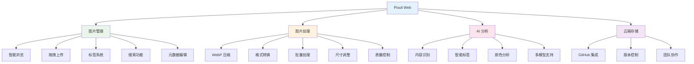
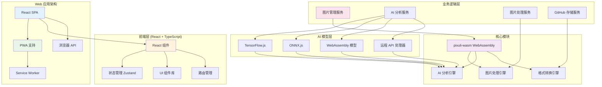

# Pixuli Web - 智能图片管理 Web 应用

[](https://opensource.org/licenses/MIT)
[](https://nodejs.org/about/releases)

## 📖 项目概述

**Pixuli Web** 是 Pixuli Monorepo 中的 Web 应用部分，基于 React + TypeScript + Rust WebAssembly 构建的跨平台智能图片管理 Web 应用。

## ✨ 主要功能



## 🛠️ 技术架构



## 🤖 AI 模型支持

支持多种 AI 模型类型：
- **TensorFlow.js** (`.json`, `.bin`)
- **ONNX.js** (`.onnx`, `.ort`)
- **WebAssembly 模型** (`.wasm`)
- **远程 API** (OpenAI、Qwen、Claude、Gemini 等)

## 🚀 快速开始

### 环境要求
- Node.js >= 22.0.0
- pnpm
- 现代浏览器 (支持 WebAssembly)

### 安装和运行

```bash
# 从项目根目录
cd pixuli

# 安装所有依赖
pnpm install

# 开发模式
pnpm run --filter web dev

# 构建应用
pnpm run --filter web build

# 预览构建结果
pnpm run --filter web preview
```

### Web 应用特性

**优势**：
- ✅ 跨平台访问 (无需安装)
- ✅ PWA 支持 (可安装到桌面)
- ✅ 响应式设计
- ✅ 实时更新
- ✅ 云端同步
- ✅ 团队协作

**支持功能**：
- 🌐 浏览器文件上传
- 📱 移动端适配
- 🔄 离线缓存
- 🚀 快速加载
- 🔒 安全认证

## 📦 项目结构

```
apps/web/
├── src/                    # 源代码
│   ├── components/         # React 组件
│   ├── hooks/             # 自定义 Hooks
│   ├── services/          # 业务服务
│   ├── stores/            # 状态管理
│   ├── types/             # 类型定义
│   └── utils/             # 工具函数
├── public/                # 静态资源
│   ├── manifest.json      # PWA 配置
│   └── sw.js              # Service Worker
├── dist/                  # 构建输出
└── package.json           # 项目配置
```

## 🌐 部署

### 静态网站托管

**Vercel**:
```bash
# 安装 Vercel CLI
npm i -g vercel

# 部署
vercel --prod
```

**Netlify**:
```bash
# 构建
pnpm run build

# 部署到 Netlify
# 将 dist/ 目录上传到 Netlify
```

**GitHub Pages**:
```bash
# 构建
pnpm run build

# 推送到 gh-pages 分支
# GitHub Actions 会自动部署
```

### PWA 配置

应用支持 PWA，可以：
- 安装到桌面
- 离线使用
- 推送通知
- 后台同步

## 🔧 开发指南

### 添加新功能

1. 在 `src/components/` 中创建组件
2. 在 `src/services/` 中添加业务逻辑
3. 在 `src/stores/` 中管理状态
4. 更新类型定义

### WebAssembly 集成

```typescript
// 使用 pixuli-wasm WebAssembly 模块
import { compressToWebp, analyzeImageWithAi } from 'pixuli-wasm'

// 压缩图片
const compressed = await compressToWebp(imageData, { quality: 80 })

// AI 分析
const analysis = await analyzeImageWithAi(imageData, { model: 'tensorflow' })
```

### 性能优化

- 使用 React.memo 优化组件渲染
- 实现虚拟滚动处理大量图片
- 使用 Web Workers 处理重计算
- 实现图片懒加载和预加载

## 📄 许可证

本项目采用 [MIT 许可证](LICENSE)

## 🙏 致谢

- [React](https://reactjs.org/) - 用户界面库
- [Vite](https://vitejs.dev/) - 构建工具
- [Tailwind CSS](https://tailwindcss.com/) - CSS 框架
- [WebAssembly](https://webassembly.org/) - 高性能计算
- [TensorFlow.js](https://www.tensorflow.org/js) - 浏览器端机器学习

---

⭐ 如果这个项目对您有帮助，请给我们一个星标！
