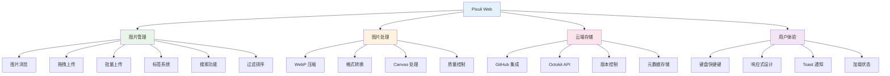
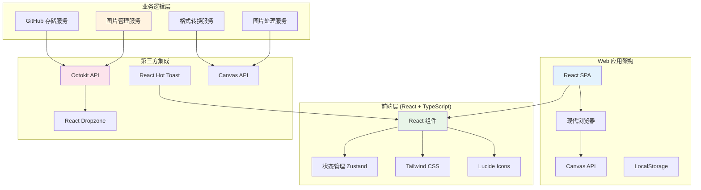

# Pixuli Web - 智能图片管理 Web 应用

[](https://opensource.org/licenses/MIT)
[](https://nodejs.org/about/releases)

## 📖 项目概述

**Pixuli Web** 是 Pixuli Monorepo 中的 Web 应用部分，基于 React + TypeScript + Canvas API 构建的跨平台智能图片管理 Web 应用。与 Pixuli Desktop 保持功能一致，提供相同的用户体验。

## ✨ 已实现功能



## 🛠️ 技术架构



## 🎯 核心功能

### 📸 图片管理
- **智能浏览**: 网格布局展示图片，支持懒加载
- **拖拽上传**: 支持单张和批量图片上传
- **标签系统**: 为图片添加标签，支持标签过滤
- **搜索功能**: 按名称、描述、标签搜索图片
- **元数据编辑**: 编辑图片名称、描述和标签

### 🔧 图片处理
- **WebP 压缩**: 使用 Canvas API 进行 WebP 格式压缩
- **格式转换**: 支持 JPEG、PNG、WebP 格式转换
- **质量控制**: 可调节压缩质量和参数
- **批量处理**: 支持批量格式转换和压缩

### ☁️ 云端存储
- **GitHub 集成**: 使用 GitHub 仓库作为图片存储
- **Octokit API**: 直接调用 GitHub API 进行文件操作
- **版本控制**: 利用 Git 的版本控制功能
- **元数据存储**: 将图片元数据存储为隐藏文件

### ⌨️ 用户体验
- **键盘快捷键**: 支持常用操作的快捷键
- **响应式设计**: 适配桌面和移动设备
- **Toast 通知**: 实时反馈操作结果
- **加载状态**: 显示上传和处理进度

## 🚀 快速开始

### 环境要求
- Node.js >= 22.0.0
- pnpm
- 现代浏览器 (支持 Canvas API)

### 安装和运行

```bash
# 从项目根目录
cd pixuli

# 安装所有依赖
pnpm install

# 进入 web 应用目录
cd apps/web

# 开发模式
pnpm dev

# 构建应用
pnpm build

# 预览构建结果
pnpm preview
```

### 首次使用

1. **配置 GitHub 仓库**:
   - 点击"配置 GitHub"按钮
   - 输入 GitHub 用户名、仓库名、分支名
   - 提供 GitHub Personal Access Token (需要 repo 权限)
   - 设置图片存储路径

2. **上传图片**:
   - 拖拽图片到上传区域
   - 或点击选择文件
   - 添加图片名称、描述和标签
   - 支持批量上传

3. **管理图片**:
   - 浏览图片网格
   - 使用搜索和标签过滤
   - 编辑图片信息

## 📦 项目结构

```
apps/web/
├── src/                    # 源代码
│   ├── components/         # React 组件
│   │   ├── github-config/ # GitHub 配置组件
│   │   └── image-upload/  # 图片上传组件
│   ├── services/          # 业务服务
│   │   ├── githubStorage.ts    # GitHub 存储服务
│   │   ├── formatConversion.ts  # 格式转换服务
│   │   └── webpCompression.ts  # WebP 压缩服务
│   ├── stores/            # 状态管理
│   │   └── imageStore.ts  # 图片状态管理
│   ├── types/             # 类型定义
│   │   ├── image.ts       # 图片相关类型
│   │   ├── formatConversion.ts # 格式转换类型
│   │   └── webp.ts        # WebP 压缩类型
│   ├── utils/             # 工具函数
│   │   ├── keyboardShortcuts.ts # 键盘快捷键
│   │   ├── fileSizeUtils.ts     # 文件大小工具
│   │   ├── filterUtils.ts       # 过滤工具
│   │   ├── sortUtils.ts         # 排序工具
│   │   └── toast.ts             # 通知工具
│   ├── config/            # 配置文件
│   │   └── github.ts      # GitHub 配置管理
│   ├── App.tsx            # 主应用组件
│   ├── App.css            # 应用样式
│   ├── main.tsx           # 应用入口
│   └── index.css          # 全局样式
├── public/                # 静态资源
├── dist/                  # 构建输出
├── package.json           # 项目配置
├── vite.config.ts         # Vite 配置
├── tailwind.config.js     # Tailwind 配置
└── tsconfig.app.json      # TypeScript 配置
```

## ⌨️ 键盘快捷键

| 快捷键 | 功能 | 说明 |
|--------|------|------|
| `Esc` | 关闭模态框 | 关闭当前打开的对话框 |
| `F1` | 帮助 | 显示键盘快捷键帮助 |
| `F5` | 刷新 | 刷新图片列表 |
| `/` | 搜索 | 聚焦搜索框 |
| `Ctrl+,` | 配置 | 打开 GitHub 配置 |

## 🌐 部署

### 静态网站托管

**Vercel**:
```bash
# 安装 Vercel CLI
npm i -g vercel

# 部署
vercel --prod
```

**Netlify**:
```bash
# 构建
pnpm build

# 部署到 Netlify
# 将 dist/ 目录上传到 Netlify
```

**GitHub Pages**:
```bash
# 构建
pnpm build

# 推送到 gh-pages 分支
# GitHub Actions 会自动部署
```

## 🔧 开发指南

### 添加新功能

1. 在 `src/components/` 中创建组件
2. 在 `src/services/` 中添加业务逻辑
3. 在 `src/stores/` 中管理状态
4. 更新 `src/types/` 中的类型定义

### Canvas API 集成

```typescript
// 使用 Canvas API 进行图片处理
const canvas = document.createElement('canvas')
const ctx = canvas.getContext('2d')

// 绘制图片
ctx.drawImage(img, 0, 0)

// 转换为 WebP
canvas.toBlob((blob) => {
  // 处理压缩后的图片
}, 'image/webp', 0.8)
```

### GitHub API 集成

```typescript
// 使用 Octokit 调用 GitHub API
import { Octokit } from 'octokit'

const octokit = new Octokit({ auth: token })

// 上传文件
await octokit.rest.repos.createOrUpdateFileContents({
  owner: 'username',
  repo: 'repository',
  path: 'images/photo.jpg',
  message: 'Upload image',
  content: base64Content,
  branch: 'main'
})
```

## 🆚 与 Desktop 版本对比

| 功能 | Desktop | Web | 说明 |
|------|---------|-----|------|
| GitHub 配置 | ✅ | ✅ | 功能一致 |
| 图片上传 | ✅ | ✅ | 功能一致 |
| 图片浏览 | ✅ | ✅ | 功能一致 |
| 搜索过滤 | ✅ | ✅ | 功能一致 |
| 键盘快捷键 | ✅ | ✅ | 功能一致 |
| WebP 压缩 | ✅ (Canvas) | ✅ (Canvas) | 实现方式相同 |
| 格式转换 | ✅ (Canvas) | ✅ (Canvas) | 实现方式相同 |
| AI 分析 | ✅ | ❌ | Web 端暂不支持 |
| 模型管理 | ✅ | ❌ | Web 端暂不支持 |

## 📄 许可证

本项目采用 [MIT 许可证](LICENSE)

## 🙏 致谢

- [React](https://reactjs.org/) - 用户界面库
- [Vite](https://vitejs.dev/) - 构建工具
- [Tailwind CSS](https://tailwindcss.com/) - CSS 框架
- [Octokit](https://octokit.github.io/) - GitHub API 客户端
- [Lucide React](https://lucide.dev/) - 图标库
- [React Dropzone](https://react-dropzone.js.org/) - 文件拖拽上传
- [React Hot Toast](https://react-hot-toast.com/) - 通知组件
- [Zustand](https://zustand-demo.pmnd.rs/) - 状态管理

---

⭐ 如果这个项目对您有帮助，请给我们一个星标！