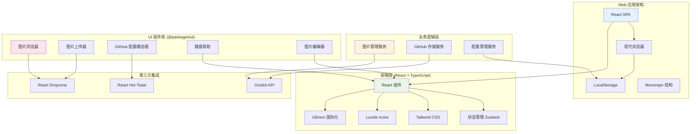

# Pixuli Web - 智能图片管理 Web 应用

[](https://opensource.org/licenses/MIT)
[](https://nodejs.org/about/releases)

## 📖 项目概述

**Pixuli Web** 是 Pixuli Monorepo 中的 Web 应用部分，基于 React + TypeScript +
Vite 构建的智能图片管理 Web 应用。使用 GitHub 和 Gitee 作为存储后端，提供完整的图片管理、上传、浏览和编辑功能。

## ✨ 主要功能

```mermaid
graph TB
    A[Pixuli Web] --> B[图片管理]
    A --> C[云端存储]
    A --> D[用户体验]
    A --> E[国际化]

    B --> B1[图片浏览]
    B --> B2[拖拽上传]
    B --> B3[批量上传]
    B --> B4[批量删除]
    B --> B5[标签系统]
    B --> B6[搜索功能]
    B --> B7[元数据编辑]
    B --> B8[全屏预览]
    B --> B9[幻灯片播放]

    C --> C1[GitHub 存储]
    C --> C2[Gitee 存储]
    C --> C3[存储源切换]
    C --> C4[配置管理]
    C --> C5[导入导出]
    C --> C6[版本控制]

    D --> D1[键盘快捷键]
    D --> D2[响应式设计]
    D --> D3[Toast 通知]
    D --> D4[加载状态]
    D --> D5[主题切换]
    D --> D6[上传前压缩]
    D --> D7[安装到主屏幕]

    E --> E1[中文支持]
    E --> E2[英文支持]
    E --> E3[语言切换]

    style A fill:#e3f2fd
    style B fill:#e8f5e8
    style C fill:#fff3e0
    style D fill:#fce4ec
    style E fill:#f3e5f5
```



## 🛠️ 技术架构



## 🎯 主要功能模块

### 📸 图片管理

- **智能浏览**: 网格布局展示图片，支持懒加载和响应式布局
- **拖拽上传**: 支持单张和批量图片上传，支持拖拽操作
- **批量上传**: 批量上传进度展示，支持批量上传状态管理
- **批量删除**: 支持单张和批量删除，批量删除确认
- **上传前压缩**: 可配置压缩选项（质量、尺寸、格式等）
- **标签系统**: 为图片添加标签，支持标签过滤和搜索
- **搜索功能**: 按名称、描述、标签搜索图片
- **元数据编辑**: 编辑图片名称、描述和标签
- **图片预览**: 全屏预览图片，支持缩放和旋转
- **幻灯片播放**: 支持幻灯片模式浏览图片

### ☁️ 云端存储

- **GitHub 存储**: 使用 GitHub 仓库作为图片存储后端
- **Gitee 存储**: 支持 Gitee 仓库作为存储后端
- **存储源切换**: 支持在 GitHub 和 Gitee 之间切换
- **Octokit API**: 直接调用 GitHub API 进行文件操作
- **配置管理**: 支持 GitHub 和 Gitee 配置的导入、导出和清除
- **配置共存**: GitHub 和 Gitee 配置可共存，互不影响
- **版本控制**: 利用 Git 的版本控制功能
- **元数据存储**: 将图片元数据存储为隐藏文件

### 🌐 国际化支持

- **多语言**: 支持中文和英文界面
- **语言切换**: 实时切换界面语言
- **本地化**: 完整的中英文翻译

### ⌨️ 用户体验

- **键盘快捷键**: 支持常用操作的快捷键（F1 帮助、F5 刷新、Ctrl+, 设置等）
- **响应式设计**: 适配桌面和移动设备
- **Toast 通知**: 实时反馈操作结果
- **加载状态**: 显示上传和处理进度
- **主题支持**: 支持明暗主题切换
- **上传前压缩**: 可配置压缩选项，节省存储空间

### 📱 应用安装

- **安装到主屏幕**: 支持将应用安装到主屏幕，提供类似原生应用的体验

## 🚀 快速开始

### 环境要求

- Node.js >= 22.0.0
- pnpm
- 现代浏览器 (支持 Canvas API)

### 安装和运行

```bash
# 从项目根目录
cd pixuli

# 安装所有依赖
pnpm install

# 进入 web 应用目录
cd apps/web

# 开发模式
pnpm dev

# 构建应用
pnpm build

# 预览构建结果
pnpm preview
```

### Web 应用特性

**核心功能**：

- ✅ **图片管理**：智能浏览、拖拽上传、批量上传、批量删除
- ✅ **图片处理**：上传前压缩，可配置压缩选项
- ✅ **云端存储**：GitHub 和 Gitee 双存储支持，存储源切换
- ✅ **搜索和标签**：按名称、描述、标签搜索，支持标签过滤
- ✅ **键盘快捷键**：支持常用操作的快捷键
- ✅ **国际化支持**：中文和英文界面切换
- ✅ **主题切换**：支持浅色/深色主题
- ✅ **应用安装**：支持将应用安装到主屏幕

**优势**：

- ✅ 跨平台访问（任何现代浏览器）
- ✅ 无需安装，即开即用
- ✅ 响应式设计，适配桌面和移动设备
- ✅ 快速部署，支持多种静态托管服务
- ✅ 实时同步，基于 Git 版本控制

**支持平台**：

- 🌐 现代浏览器（Chrome、Firefox、Safari、Edge 等）
- 📱 移动浏览器（iOS Safari、Chrome Mobile 等）

## 📦 项目结构

```
apps/web/
├── src/                        # 源代码
│   ├── components/             # React 组件
│   │   ├── demo/               # Demo 模式组件
│   │   ├── pwa/                # PWA 相关组件
│   │   │   └── PWAInstallPrompt.tsx   # PWA 安装提示
│   │   └── version-info/       # 版本信息组件
│   ├── config/                 # 配置文件
│   │   ├── github.ts           # GitHub 配置管理
│   │   └── gitee.ts            # Gitee 配置管理
│   ├── i18n/                   # 国际化配置
│   │   ├── index.ts            # i18n 初始化
│   │   └── useI18n.ts          # i18n hooks
│   ├── services/               # 业务服务
│   │   ├── githubStorage.ts    # GitHub 存储服务
│   │   ├── giteeStorage.ts     # Gitee 存储服务
│   │   └── pwaService.ts       # PWA 服务
│   ├── stores/                 # 状态管理
│   │   └── imageStore.ts       # 图片状态管理
│   ├── utils/                  # 工具函数
│   │   ├── keyboardShortcuts.ts  # 快捷键处理函数
│   │   └── loading.ts          # 加载动画工具
│   ├── types/                  # 类型定义
│   │   └── version.d.ts        # 版本类型定义
│   ├── App.tsx                 # 主应用组件
│   ├── App.css                 # 应用样式
│   ├── main.tsx                # 应用入口
│   └── index.css               # 全局样式
├── public/                     # 静态资源
├── api/                        # API 代理
│   └── github-proxy.js         # GitHub 代理服务器
├── dist/                       # 构建输出
├── package.json                # 项目配置
├── vite.config.ts              # Vite 配置
├── tailwind.config.js          # Tailwind 配置
├── vercel.json                 # Vercel 部署配置
└── tsconfig.app.json           # TypeScript 配置
```

## 🙏 致谢

- [React](https://reactjs.org/) - 用户界面库
- [Vite](https://vitejs.dev/) - 构建工具
- [Tailwind CSS](https://tailwindcss.com/) - CSS 框架
- [Octokit](https://octokit.github.io/) - GitHub API 客户端
- [Lucide React](https://lucide.dev/) - 图标库
- [React Hot Toast](https://react-hot-toast.com/) - 通知组件
- [Zustand](https://zustand-demo.pmnd.rs/) - 状态管理
- [i18next](https://www.i18next.com/) - 国际化框架

---

⭐ 如果这个项目对您有帮助，请给我们一个星标！
