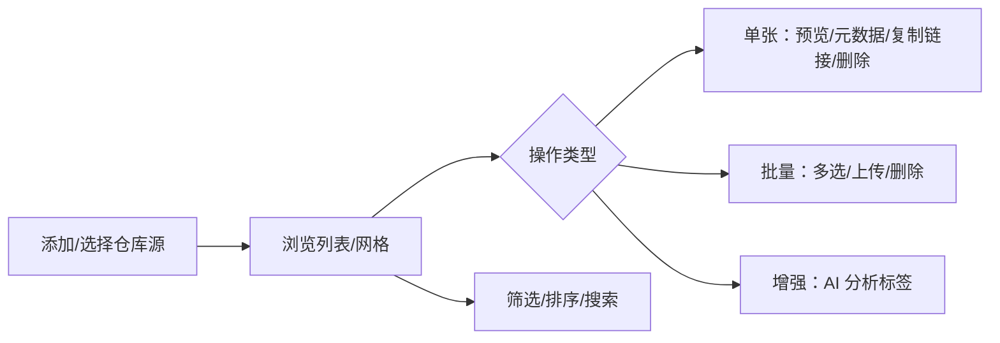
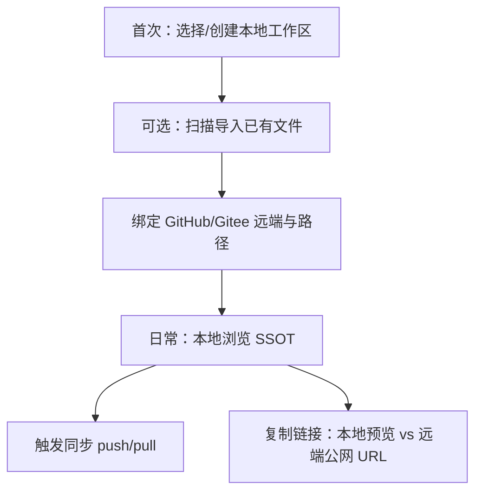

# 三端交互规范（统一体验与差异适配）

- **文档版本**：1.0
- **计划编号**：REF-601（M6）
- **关联 Issue**：[#130](https://github.com/trueLoving/Pixuli/issues/130)
- **读者**：产品、设计、前端（Web / Desktop / Mobile / Capacitor）
- **相关文档**：
  - [01-Product-Requirements-Specification.md](./01-Product-Requirements-Specification.md)
    — 产品底线与功能需求
  - [09-cross-platform-sharing-matrix.md](../02-system-design/09-cross-platform-sharing-matrix.md)
    — 代码共享现状（REF-506 / #116）
  - [02-Three-Platform-Design.md](../02-system-design/02-Three-Platform-Design.md)
    — Capacitor 方案 A
  - `REFACTOR_PLAN.md` §1.8、§10 — 本地工作区与 M6 专项

> **产品主张**：🖼️ Pixuli — AI-based image analysis, automatic tag generation,
> and batch
> processing。交互以**图床管理**为主路径，AI 与批处理为**同等可发现**的增强能力，而非独立产品。

---

## 一、范围与原则

### 1.1 三端定义

| 端          | 运行时                                     | UI 代码库（现状 → 目标）               |
| ----------- | ------------------------------------------ | -------------------------------------- |
| **Web**     | 浏览器 / PWA                               | `apps/pixuli`                          |
| **Desktop** | Electron 渲染进程                          | `apps/pixuli`（与 Web 同一套）         |
| **Mobile**  | Expo RN（过渡）→ Capacitor WebView（目标） | `apps/mobile` → **并入 `apps/pixuli`** |

**决策**：M5 Capacitor PoC（REF-509）通过后，Mobile
**不再维护独立信息架构**；RN 仅作过渡，交互规范以 **Web+Desktop 现网行为**
为 SSOT，窄屏做响应式适配。

### 1.2 设计原则

| 原则                                 | 说明                                                                         |
| ------------------------------------ | ---------------------------------------------------------------------------- |
| **流程一致**                         | 同一用户故事在三端步骤数、命名、反馈语义一致（成功/失败/加载）               |
| **壳层适配**                         | 导航容器、手势、快捷键因输入设备变化；**不**因端别复制业务规则               |
| **本地工作区优先**（目标态 REF-607） | 信息架构从「多远端源」演进为「当前工作区 + 绑定远端」；本文 §二旅程含目标态  |
| **可发现性**                         | 上传、批量、AI、同步（规划）在工具栏/侧栏有固定槽位，不藏三级菜单            |
| **降级显式**                         | 某端不具备的能力（如 Desktop 专属 AI 本地模型）显示为禁用+说明，而非静默缺失 |

### 1.3 与 REF-506 / REF-509 的联动

| 文档 / Issue                                                                                   | 关系                                                                     |
| ---------------------------------------------------------------------------------------------- | ------------------------------------------------------------------------ |
| [09-cross-platform-sharing-matrix.md](../02-system-design/09-cross-platform-sharing-matrix.md) | **代码**重复处；本文规定 **交互**应一致处                                |
| REF-509 Capacitor PoC                                                                          | 验收「Web 交互 + 原生壳」是否成立；PoC 通过则 Mobile 不再单独定侧栏/底栏 |
| REF-602                                                                                        | UI 实现本规范的侧栏、主内容、图片操作                                    |
| REF-607                                                                                        | 首次选目录、同步状态、复制链接分项                                       |

---

## 二、用户旅程地图

### 2.1 核心旅程（现状 — 远端图床）

适用于当前 M3 已交付能力；三端**业务步骤**须一致，**壳层**见 §四。



| 阶段         | 用户目标                   | Web+Desktop（现状）             | Mobile RN（现状）                    | 一致？                               |
| ------------ | -------------------------- | ------------------------------- | ------------------------------------ | ------------------------------------ |
| **配置源**   | 添加 GitHub/Gitee 源并选中 | 侧栏源列表 / 设置 Modal         | 抽屉内源列表 / `StorageConfigModal`  | ✅ 步骤一致，壳不同                  |
| **浏览**     | 查看当前源图片             | `/photos` 网格/列表             | Tab 首页 `ImageBrowser`              | ✅                                   |
| **搜索筛选** | 缩小结果集                 | 顶栏 Search + 筛选              | `SearchAndFilter` / 独立 filter Tab  | ⚠️ Mobile 多一跳（filter Tab）       |
| **上传**     | 添加图片到仓库             | 拖放 / 上传按钮 → Modal         | `ImageUploadButton` → 全屏编辑 Modal | ⚠️ Mobile 多裁剪步（可保留）         |
| **单张操作** | 预览、改标签、复制 URL     | 预览层 + 右键/工具栏            | 点击进详情 / 长按                    | ⚠️ 入口不同，能力应对齐              |
| **批量**     | 多选删除/上传              | 多选条 + `deleteMultipleImages` | 多选有限                             | ❌ Mobile 缺批量删除（REF-507 修）   |
| **AI**       | 生成标签/描述建议          | Desktop：Electron `aiAPI`       | 未接入                               | ❌ 仅 Desktop；Web/Mobile 需规划入口 |

### 2.2 目标旅程（REF-607 — 本地工作区 + 同步）

在 §2.1 之前增加**一次性**与**周期性**步骤；REF-602 /
REF-607 实现时替换纯「远端源」叙事。



| 阶段     | 交互要点        | Web                                      | Desktop          | Mobile                              |
| -------- | --------------- | ---------------------------------------- | ---------------- | ----------------------------------- |
| 选工作区 | 文件夹/授权目录 | File System Access（若可用）或 OPFS 说明 | 系统文件夹选择器 | SAF / 沙箱；Capacitor 后同 Web 分支 |
| 同步状态 | 可见、可重试    | 顶栏/侧栏徽章                            | 同 Web           | 同 Web（Capacitor）                 |
| 复制链接 | 分项菜单        | `local` / `remote-raw` / `proxy`         | 同 Web           | 分享远端 URL；本地 URI 仅应用内     |

---

## 三、信息架构（IA）

### 3.1 一级导航 — 决策表

| 导航项                | Web+Desktop（SSOT）     | Mobile RN（过渡）    | Capacitor 目标                | 备注               |
| --------------------- | ----------------------- | -------------------- | ----------------------------- | ------------------ |
| **图床浏览**          | 侧栏「照片」→ `/photos` | Tab「首页」          | 同 Web 侧栏（窄屏折叠为汉堡） | **必须一致**       |
| **图片工具**          | 侧栏「压缩」「转换」    | 无独立入口（未实现） | 同 Web                        | Mobile 过渡可后置  |
| **仓库源 / 工作区**   | 侧栏源列表 + 添加       | 抽屉内源列表         | 侧栏区块「当前工作区」        | REF-607 升格为一级 |
| **设置**              | 侧栏设置 → 配置 Modal   | Tab「设置」          | 侧栏或全屏设置页              | 配置表单字段对齐   |
| **操作日志**          | 快捷键 / 帮助区         | 抽屉内入口           | 同 Web                        |                    |
| **回收站**（REF-606） | 侧栏或设置子项          | 待定                 | 同 Web                        | 规划               |

**决议（回答「Mobile 要不要侧栏」）**：

- **Capacitor / Web / Desktop**：统一 **左侧边栏**；视口 `< 768px`
  时侧栏**默认收起**，通过左上角汉堡展开**抽屉式侧栏**（覆盖内容，非底栏主导航）。
- **RN 过渡期**：保留底栏（首页/设置）+ 抽屉源列表，但**菜单项命名与图标**与
  `@pixuli/ui` `Sidebar` 对齐，减少双套心智。

### 3.2 二级：图床主内容区（`/photos`）

```text
┌──────────────────────────────────────────────────────────────┐
│ [源/工作区] [搜索] [筛选] [排序] [网格|列表] [上传] [批量] [同步*] │
├──────────────────────────────────────────────────────────────┤
│  图片网格 / 列表（虚拟滚动 REF-603）                            │
│  空态 / 加载 / 错误 + 重试                                      │
├──────────────────────────────────────────────────────────────┤
│  多选时：底部固定操作条（删除/取消/全选）                          │
└──────────────────────────────────────────────────────────────┘
  * 同步：REF-607 目标态
```

---

## 四、一致性与差异矩阵

图例：**一致** = 三端（含 Capacitor 目标）同语义；**适配**
= 交互等价、载体不同；**仅 L3** = 该端独有或暂无。

| 能力域            | 一致                                       | 适配                                          | 仅 L3 / 缺口                      |
| ----------------- | ------------------------------------------ | --------------------------------------------- | --------------------------------- |
| **添加仓库源**    | 表单字段、校验、保存后刷新列表             | Modal（Web）vs 全屏 Modal（Mobile）           | —                                 |
| **切换当前源**    | 选中后列表刷新、选中态可见                 | 侧栏列表 vs 抽屉列表                          | —                                 |
| **列表/网格切换** | 同一套视图模式枚举                         | 工具栏按钮 vs 顶栏图标                        | —                                 |
| **搜索**          | 搜索框占位、清空、无结果文案               | `/` 聚焦搜索（Desktop 快捷键）                | Mobile 无全局 `/`                 |
| **筛选排序**      | 条件与 core `FilterOptions` 对齐           | 侧栏面板 vs 独立 filter 页（RN 应合并为一处） | RN 未用 core filterUtils          |
| **上传**          | 选文件 → 确认 → 进度 → 完成 toast          | 拖放（Web/Desktop）vs 相册/相机（Mobile）     | Mobile 裁剪流可额外一步           |
| **预览**          | 左右切换、缩放、元数据面板                 | 内联 Modal vs 全屏（窄屏默认全屏）            | —                                 |
| **复制链接**      | 复制成功反馈、URL 类型说明（目标 REF-607） | 剪贴板 API vs 系统分享                        | Desktop 本地 file URL             |
| **删除**          | 二次确认文案；目标软删除 REF-606           | —                                             | —                                 |
| **批量多选**      | 多选条、计数、全选当前页策略               | 鼠标框选（Web 可选）vs 长按进入多选（触控）   | RN 缺 batch delete                |
| **批量上传**      | 队列进度 `batchUploadProgress`             | —                                             | —                                 |
| **右键菜单**      | 菜单项集合一致                             | 右键（键鼠）vs 长按上下文（触控）             | —                                 |
| **快捷键**        | —                                          | —                                             | 仅 Web+Desktop（§五）             |
| **AI 分析**       | 结果确认后写入元数据（REF-604）            | 侧栏/详情「AI」按钮                           | 现仅 Desktop Electron             |
| **离线浏览**      | —                                          | —                                             | Desktop REF-503；Web PWA 缓存策略 |

---

## 五、输入方式与响应式

### 5.1 断点（Web / Desktop / Capacitor）

| 断点     | 宽度             | 布局                                                 |
| -------- | ---------------- | ---------------------------------------------------- |
| **窄屏** | `< 768px`        | 侧栏隐藏；汉堡打开抽屉侧栏；主内容全宽；预览默认全屏 |
| **中屏** | `768px – 1024px` | 侧栏可折叠；网格列数减少                             |
| **宽屏** | `> 1024px`       | 侧栏常驻；网格默认列数；Desktop 可利用额外水平空间   |

Desktop
Electron 窗口可自由缩放，**遵循同一 CSS 断点**，不单独做「桌面专属布局」除非 REF-602 明确（如托盘不影响主窗布局）。

### 5.2 键鼠 vs 触控

| 交互           | 键鼠（Web+Desktop）         | 触控（Mobile / 窄屏）  |
| -------------- | --------------------------- | ---------------------- |
| 打开上下文菜单 | 右键图片                    | 长按图片               |
| 多选           | Ctrl/Cmd+点击；Shift 范围选 | 长按进入多选模式       |
| 关闭 Modal     | Esc；点击遮罩               | 下滑关闭或明确关闭按钮 |
| 主操作         | 单击                        | 点击；避免 hover-only  |
| 搜索聚焦       | `/` 或 Ctrl+K（可选）       | 点击搜索框             |

### 5.3 Desktop 快捷键（现状 — 保持并扩展）

来源：`apps/pixuli/src/utils/keyboardShortcuts.ts`、`@pixuli/ui`
`COMMON_SHORTCUTS`。

| 快捷键         | 行为           | 窄屏/Capacitor |
| -------------- | -------------- | -------------- |
| `Esc`          | 关闭顶层 Modal | 不适用         |
| `F1`           | 快捷键帮助     | 不适用         |
| `F5`           | 刷新图片列表   | 可选保留       |
| `Ctrl+,`       | 打开配置       | 不适用         |
| `/`            | 聚焦搜索       | 不适用         |
| `Ctrl+V`       | 切换网格/列表  | 不适用         |
| `Ctrl+Shift+L` | 操作日志       | 不适用         |

新增快捷键（REF-602）须在本表登记，并同步 i18n `keyboard.shortcuts.*`。

---

## 六、线框说明（文字线框 — 供 REF-602）

### 6.1 Web+Desktop 主界面

```text
┌─────────┬────────────────────────────────────────────┐
│ Logo    │  图床浏览                    [搜索…] [上传] │
│ ─────── │ ────────────────────────────────────────── │
│ ■ 照片  │  [筛选] [排序] [⊞⊟] [批量]                   │
│ □ 压缩  │                                            │
│ □ 转换  │   ┌────┐ ┌────┐ ┌────┐                      │
│ ─────── │   │thumb│ │thumb│ │thumb│  …                 │
│ 源 A ✓  │   └────┘ └────┘ └────┘                      │
│ 源 B    │                                            │
│ + 添加  │                                            │
│ ─────── │                                            │
│ ⚙ 设置  │                                            │
└─────────┴────────────────────────────────────────────┘
```

### 6.2 窄屏 / Capacitor（侧栏收起）

```text
┌────────────────────────────────────────┐
│ [≡]  图床浏览              [搜索] [↑]  │
├────────────────────────────────────────┤
│  （主内容与宽屏相同，工具栏可收纳为 …）    │
└────────────────────────────────────────┘
  点击 [≡] → 左侧滑出与 6.1 相同的侧栏内容
```

### 6.3 图片预览层

```text
┌────────────────────────────────────────┐
│ [×]          图片预览        [◀ ▶]      │
│  ┌──────────────────────────────────┐  │
│  │         大图 / 缩放               │  │
│  └──────────────────────────────────┘  │
│  名称 [____]  标签 [____]  描述 [____]   │
│  [复制链接 ▼] [AI 分析] [删除]           │
└────────────────────────────────────────┘
  「复制链接」目标态 REF-607：子项 local / GitHub raw / Gitee proxy
```

---

## 七、可访问性与 i18n

### 7.1 可访问性（最低要求）

| 项       | 要求                                          |
| -------- | --------------------------------------------- |
| 焦点     | Modal 打开时陷阱焦点；关闭归还触发元素        |
| 键盘     | 可 Tab 达主按钮；预览层支持 Esc 关闭          |
| 对比度   | 遵循 Tailwind 主题；错误/成功态不仅靠颜色     |
| 触控目标 | 窄屏可点击区域 ≥ 44×44 CSS px                 |
| 动效     | 尊重 `prefers-reduced-motion`（REF-602 实现） |

### 7.2 国际化

| 项        | 约定                                                                                                  |
| --------- | ----------------------------------------------------------------------------------------------------- |
| 文案 SSOT | 用户可见字符串走 `react-i18next`；共享文案 `@pixuli/ui/locales` + `@pixuli/core/locales`              |
| 键名      | `sidebar.*`、`photos.*`、`upload.*`、`keyboard.shortcuts.*`；新增须三端同时有 zh-CN / en-US           |
| 参数化    | 计数、文件名用 `{{name}}` 插值，避免拼接                                                              |
| RTL       | **预留**：布局使用逻辑属性（`ms-`/`me-`）；暂不实现 ar 翻译，REF-602 避免写死 `left`/`right` 唯一布局 |

### 7.3 平台文案差异

允许**说明性**差异（非功能差异），须用独立 key：

- Web PWA 离线限制说明
- Desktop AI 模型需本地安装
- Mobile 相册权限引导

---

## 八、核心路径验收（#130 验收用）

以下路径在 **Web、Desktop、Capacitor 目标**
上须**步骤与文案一致**（RN 过渡期允许壳差异，业务步骤一致）：

| #      | 路径         | 步骤                                                     |
| ------ | ------------ | -------------------------------------------------------- |
| **P1** | 配置并浏览   | 添加 Gitee/GitHub 源 → 选中 → 列表出现图片               |
| **P2** | 上传单张     | 选择文件 → 确认上传 → 列表出现新项 → 成功提示            |
| **P3** | 复制远端链接 | 打开预览 → 复制链接 → 剪贴板为可访问 URL（Gitee 经代理） |
| **P4** | 批量删除     | 进入多选 → 选 2 张 → 删除 → 确认 → 列表更新              |

AI 路径（P5，REF-604）：Desktop 已通；Web/Capacitor 在本地模型或云端 API 方案确定前，UI 显示「仅桌面可用」占位。

---

## 九、后续 Issue 映射

| Issue                    | 本文档章节                      |
| ------------------------ | ------------------------------- |
| **#131** REF-602 UI 实现 | §三 IA、§六 线框、§四 矩阵      |
| **#132** REF-603 性能    | §3.2 虚拟滚动、分页             |
| **#133** REF-604 AI      | §2.1 F 阶段、§四 AI 行          |
| **#134** REF-605 批处理  | §2.1 E、§四 批量行              |
| **#140** REF-606 回收站  | §3.1 回收站项                   |
| **#144** REF-607 本地库  | §2.2、§四 复制链接、§3.1 工作区 |

---

## 十、修订记录

| 版本 | 日期       | 说明                                                   |
| ---- | ---------- | ------------------------------------------------------ |
| 1.0  | 2026-05-27 | REF-601 初稿：旅程、IA、差异矩阵、断点、线框、验收路径 |
