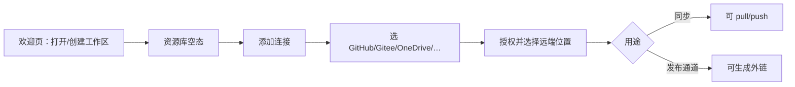

# 资源库 UI 方案：多存储连接 + 对外访问与权限

- **文档版本**：1.1
- **日期**：2026-08-13
- **读者**：产品、设计、前端、插件作者
- **状态**：阶段二产品需求的 **UI SSOT**（PRS v2.3 §2.1a / §5.8a）
- **相关文档**：
  - [01-product-requirements-specification.md](./01-product-requirements-specification.md)
    — §2.1a 现行需求；阶段一图床仍为 `main` 实现基线
  - [04-three-platform-interaction-spec.md](./04-three-platform-interaction-spec.md)
    — 三端交互 SSOT
  - [05-three-platform-ui-optimization.md](./05-three-platform-ui-optimization.md)
    — 对照现行需求的 UI 排期（v2.0）
  - [03-plugin-system.md](../02-system-design/03-plugin-system.md) —
    StorageProvider 契约
  - [05-local-workspace-sync.md](../02-system-design/05-local-workspace-sync.md)
    — 本地工作区 + 同步

> **一句话定位（阶段二需求）**：Pixuli 是本地优先的**资源工作区**。用户管理
> **图片、PDF、视频等**资源；用 **连接器**对接 GitHub / Gitee / OneDrive /
> Google Cloud 等；**本地始终可访问**；**远程对外访问**按云能力配置，云不支持则
> **界面禁用并提示**，禁止静默当成已授权。

本文只定 **UI 信息架构与交互**，不定 Provider
API 细节。技术扩展仍走现有插件体系，禁止 core/provider 依赖 `@pixuli/ui`。

---

## 一、为什么要改 UI 叙事

### 1.1 现行产品（已交付）

| 层     | 现状                                                                |
| ------ | ------------------------------------------------------------------- |
| 对象   | 以**图片**为中心（网格/列表、压缩、转换、AI 标签）                  |
| 存储   | 官方 **GitHub / Gitee** 仓库图床                                    |
| 工作区 | 本地目录为 SSOT，远端可选同步                                       |
| 对外   | `buildPublicUrl` / raw 直链；复制链接分本地预览 vs 远端公网 URL     |
| 权限   | 基本等于「仓库是否公开」+ Token 在客户端；**没有资源级访问策略 UI** |

这对「博客图床」够用，但撑不起「任意数据 + 多种云 + 可控外链」。

### 1.2 目标能力（用户语言）

1. **多种资源**：图片、**PDF**、视频等同一工作区（F-ASSET-01）。
2. **多种云连接**：GitHub、Gitee、OneDrive、Google
   Cloud 等以连接器出现（F-CONN-02）。
3. **本地 + 远程**：本地 SSOT；远程为同步副本与发布通道（F-CONN-01）。
4. **对外访问控制**：云支持则在 UI 内设置；**不支持则禁用并提示原因与替代**（F-ACCESS-02
   / F-ACCESS-03）。

### 1.3 设计原则（UI）

| 原则                               | 说明                                                                                             |
| ---------------------------------- | ------------------------------------------------------------------------------------------------ |
| **本地工作区仍是主舞台**           | 浏览、搜索、预览、批处理默认读本地；远端是「连上的柜子」，不是唯一界面                           |
| **连接 ≠ 发布**                    | 「同步到 OneDrive」和「允许外网打开这张图」是两件事，UI 必须拆开                                 |
| **策略跟资源走，连接器只声明能力** | 用户在资源上选可见性；某连接器若不支持，选项 **禁用 + 提示**（禁止静默）                         |
| **本地与远程分列**                 | 「仅本机可看」永远可设；「远程公开/分享」取决于该连接的能力位                                    |
| **降级显式**                       | Git 仓库公开 ≠ OneDrive 分享链接 ≠ GCS signed URL；文案按连接器能力，不假装同一套 ACL            |
| **三端同一套 IA**                  | Web / Desktop / Mobile 步骤一致；窄屏只改编排（见 [05](./05-three-platform-ui-optimization.md)） |
| **渐进，不推翻图床**               | 第一阶段仍以图片/视频预览为主路径；「全部文件」视图后置，避免一次做成网盘克隆                    |

### 1.4 非目标（本期 UI 不承诺）

- 做成完整企业网盘（团队空间、审批流、SSO）
- Pixuli 官方中心化 CDN / 自建 Server 为一等公民（仍可社区 Provider）
- 在 UI 里暴露云厂商控制台级 IAM
- 为每种存储单独做一套浏览界面

---

## 二、三个用户能懂的概念

UI 全程只用这三层，避免「源 / 仓库 / Host / 同步目标」混用。

```text
工作区（Vault）
  └── 资源（Asset：文件 + 元数据 + 预览）
        ├── 连接（Connection：连到哪个存储、怎么同步）
        └── 发布（Publish / Access：外界怎么打开）
```

| 概念         | 用户理解                                              | 现行代码近似                                 |
| ------------ | ----------------------------------------------------- | -------------------------------------------- |
| **工作区**   | 这台设备上的本地库                                    | `LocalVault` / workspace                     |
| **连接**     | 绑到 GitHub 仓库、Gitee、OneDrive 文件夹、GCS bucket… | `StoredSource` + `StorageProvider`           |
| **资源**     | 一条文件（图/视频/其他）+ 标签/描述                   | 今日 `ImageItem`，宜演进为 `Asset`           |
| **发布策略** | 私有 / 仅链接 / 公开 / 过期链接                       | 今日缺失；部分隐含在仓库公开性与 `publicUrl` |

**连接器能力位（UI 只读 manifest，不写死品牌逻辑）**建议包括：

| 能力位                    | 影响 UI                                                        |
| ------------------------- | -------------------------------------------------------------- |
| `sync.push` / `sync.pull` | 能否出现在「同步」方向选择里                                   |
| `publicUrl`               | 能否「复制公开链接」                                           |
| `shareLink`               | 能否生成「仅链接可见」或带过期的分享                           |
| `acl`                     | 能否在 Pixuli 内改可见性（多数消费云做不到，只能跳转厂商分享） |
| `streaming`               | 视频/大文件是否适合在线播                                      |
| `listPublic`              | 公开后是否允许列目录（防扫库）                                 |

GitHub/Gitee：强项是 **git 版本 + raw/CDN 公网 URL**，弱项是大视频与细 ACL。  
OneDrive / Google Drive：强项是
**个人云 + 厂商分享链接**，弱项是「稳定图床 URL」。  
GCS / 对象存储：强项是 **bucket 策略 + signed URL**，弱项是上手成本。

UI 必须让用户看见「这个连接能干什么」，而不是只显示 Logo。

---

## 三、目标信息架构（三端共用）

宽屏延续工作区壳：活动栏 + 资源树 + 主视图。窄屏见
[05 §3.2](./05-three-platform-ui-optimization.md)（底栏 + sheet）。

```text
┌────────┬──────────────────┬─────────────────────────────────────────────┐
│ 活动栏 │ 资源树            │  主视图 banner                               │
│        │                  │  [库名] [类型筛选] [搜索] [上传] [同步●] [发布] │
│ 资源库 │ 全部              │─────────────────────────────────────────────│
│ 连接   │ 图片/             │  网格 / 列表 /（可选）文件表                    │
│ 发布   │ 视频/             │  卡片角标：私有 · 链接 · 公开 · 同步状态         │
│ 工具   │ 文档/             │                                             │
│        │ …                 │─────────────────────────────────────────────│
│ 设置   │ ─────────────     │  多选底栏：下载 / 同步 / 发布 / 删除            │
│        │ 连接状态 / 冲突    │                                             │
└────────┴──────────────────┴─────────────────────────────────────────────┘
```

### 3.1 一级导航（活动栏 / 窄屏底栏）

建议 **≤5 个** 固定槽位，工具进二级：

| 槽位 | 名称       | 职责                                         |
| ---- | ---------- | -------------------------------------------- |
| 1    | **资源库** | 浏览与管理本地资源（今日「照片」的上位）     |
| 2    | **连接**   | 添加/管理存储连接器、看能力与同步健康        |
| 3    | **发布**   | 已公开/已分享列表、外链、访问策略总览        |
| 4    | **工具**   | 压缩、转换、（规划）转码；从资源「送入工具」 |
| 5    | **设置**   | 工作区、语言、日志、快捷键、版本             |

同步**不要**再占一个与「连接」重复的一级图标：放到资源库 banner 徽章，或连接页的「立即同步」。点击仍可弹出 pull
/ push（已落地）。

「发布」单独成一级的原因：用户要找的是「外界能不能打开」，不是「文件在哪个盘」。若担心导航膨胀，P0 可将发布做成资源库 banner 的一个模式切换（库 | 已发布），P1 再升一级。

### 3.2 资源库主视图（替代纯「图片库」）

Banner 一行（宽屏）建议：

`[当前范围：全部/图片/视频/…]  [搜索+筛选]  [上传]  [视图]  [同步徽章]  [发布选中]`

| 元素     | 行为                                                                            |
| -------- | ------------------------------------------------------------------------------- |
| 类型范围 | 默认 **图片 + 视频 + PDF**；「全部文件」为明确开关                              |
| 卡片     | 缩略图或类型图标（PDF 用文档图标）；角标 = **可见性** + **同步态**              |
| 预览     | 图：现有预览层；视频：播放器；PDF：内嵌预览或系统打开；其他：元数据 + 打开/下载 |
| 上传     | 按 MIME 分流：图/视频走预览确认；其他走简单元数据                               |

多选底栏固定：**下载 · 同步到…
· 发布/取消发布 · 删除**。压缩/转换仅对图片（及后续视频转码）可用，其它类型禁用并说明。

### 3.3 连接页（存储工具）

这是「对接 GitHub / Gitee / OneDrive / Google
Cloud」的主 UI，不要再埋进设置表格当唯一入口。

**列表**：每个连接一张卡片。

```text
┌─────────────────────────────────────────────────────────┐
│ Gitee  ·  owner/repo                                    │
│ 能力：同步 ✓   公开直链 ✓   分享链接 —   视频流 —          │
│ 状态：已同步 · 待推送 3 · 冲突 0                           │
│ [设为默认同步] [同步…] [打开远端] [编辑] [断开]              │
└─────────────────────────────────────────────────────────┘
```

**添加连接向导**（三步，三端步骤一致）：

1. **选服务** — 画廊：已安装连接器 +「更多（规划/社区）」灰显
2. **授权与位置** — Token / OAuth / 选仓库或文件夹或 bucket（表单来自 manifest
   `configSchema`）
3. **用途** — 仅备份同步 / 默认同步目标 / 允许作为发布通道（可多选）

设置里的「同步」分区可降级为：**默认同步目标 + 高级选项**；日常管理以连接页为准。

### 3.4 发布与访问控制（核心新面）

发布与同步分离：**同步 = 副本是否在远端；发布 = 外界有没有合法打开方式。**

#### 可见性档位（用户可选，连接器做不到则禁用）

| 档位          | 含义                               | 典型实现（连接器内部，UI 不暴露 jargon）                     |
| ------------- | ---------------------------------- | ------------------------------------------------------------ |
| **私有**      | 仅本机工作区；不提供外链           | 不同步公开路径 / 不生成 share                                |
| **仅链接**    | 有链接的人可打开，不出现在公开列表 | Drive share、signed URL、私有仓库 raw+难猜路径（需风险提示） |
| **公开**      | 稳定公网 URL，可热链到博客/站点    | GitHub/Gitee public raw、公开 bucket                         |
| **定时/口令** | 过期或口令（P1+，视连接器）        | signed URL expiry、厂商分享过期                              |

#### 发布抽屉（选中 1～N 个资源）

```text
发布到外界
  通道： [Gitee owner/repo ▾]   （只列出支持 publicUrl/shareLink 的连接）
  可见性： ( ) 私有  (•) 仅链接  ( ) 公开
  选项：  □ 允许嵌入（热链）   □ 过期：7 天   □ 口令
  预览：  https://…
  [取消发布]                    [生成链接并复制]
```

规则：

- 未同步到该通道 → 先提示「将先同步再发布」，一次确认完成 push + 发布。
- 通道不支持所选档位 →
  **选项禁用** + 可见提示（标题 + 原因 + 替代，如「换用 Gitee 公开仓库」或「仅保留本地私有」）。符合 PRS
  F-ACCESS-03，禁止只 toast 一下或按钮点了没反应。
- **目录默认私有**：公开单个文件 ≠ 公开整个文件夹；树节点若发布，需二次确认「包含子项」。

#### 「发布」总览页

表格/列表：资源、通道、档位、链接、到期、打开次数（若有）、操作（复制 / 撤销 / 更换通道）。  
这是用户回答「我对外暴露了什么」的唯一清单，避免链接散落在复制历史里。

### 3.5 单资源详情 / 预览层

在现有图片预览底栏上扩展分区，而不是另做一套 App：

| 分区   | 内容                                                              |
| ------ | ----------------------------------------------------------------- |
| 预览   | 图 / 视频 / 文件图标                                              |
| 元数据 | 名称、类型、大小、标签、描述（AI 仍可写标签）                     |
| 位置   | 工作区相对路径                                                    |
| 连接   | 各连接上的同步态                                                  |
| 访问   | 当前档位、公开 URL、复制、撤销；无通道时 CTA「添加可发布的连接」  |
| 操作   | 编辑、删除、送去压缩/转换（类型允许时）、分享（系统分享，Mobile） |

复制链接菜单与 REF-601 对齐并扩展：

- 本地预览（仅本机/应用内）
- 远端公开 URL（若已发布）
- 分享链接（若仅链接档）
- （可选）厂商原始页

---

## 四、关键用户旅程

### 4.1 首次：工作区 + 第一个连接



空态 CTA：**上传资源** 与 **连接存储** 并列，不要只写「添加图床」。

### 4.2 日常：本地管理，按需同步

与今日一致：本地增删改 → 待推送徽章 → 点击同步 → 选 远程→本地 / 本地→远程。  
多连接时：默认同步目标 + 「同步到…」指定某一连接；避免一次对所有云 push。

### 4.3 对外：让一张图/一段视频可在线打开

1. 选中资源 → **发布**
2. 选通道（须已连接且具备 URL 能力）
3. 选可见性 → 生成并复制链接
4. 在「发布」总览可撤销

博客场景：公开 + 允许嵌入 ≈ 传统图床。  
临时给客户看视频：仅链接 + 过期。  
敏感文档：私有，只本地或私有云，不出现「复制公开链接」。

### 4.4 收权

在发布总览或资源详情点 **取消发布 / 设为私有**。  
UI 须说明后果因连接器而异：撤销 Drive 分享 vs 把 Git 仓库改私有 vs 使 signed URL 失效。做不到「立即全球缓存失效」的（如 CDN/jsDelivr）要诚实写出来。

---

## 五、与当前界面的映射（怎么长出来）

| 当前 UI                        | 目标 UI                         | 迁移策略                                                                 |
| ------------------------------ | ------------------------------- | ------------------------------------------------------------------------ |
| 活动栏「照片」                 | **资源库**                      | 先改文案与类型筛选，网格仍以图为主                                       |
| 文件夹树                       | 资源树（类型/文件夹）           | 保留路径树；增加「图片 / 视频 / 其他」虚拟节点可选                       |
| ImageBrowser banner            | 资源 banner + 同步徽章 + 发布   | 在 [05](./05-three-platform-ui-optimization.md) 批次 B 上叠加            |
| 设置 → 同步 → 远端表格         | **连接**页 + 设置里只留默认目标 | 表格升格为一级，避免「存储 = 设置里一项」                                |
| 同步方向弹窗                   | 保留                            | 多连接时增加「目标连接」下拉                                             |
| 复制链接                       | 发布策略 + 复制                 | 未发布时复制公开 URL 应引导去发布，而不是静默给一个用户没意识到的 raw 链 |
| 压缩/转换                      | 工具槽 +「送入工具」            | 仅适用于支持的类型                                                       |
| Header 已移除 / 设置含日志语言 | 维持                            | 连接与发布不要再塞进设置堆里                                             |

三端：Desktop 右键「发布…」；触控长按同一菜单。设置窄屏全屏页（05 批次 A）同样适用于连接向导。

---

## 六、权限模型怎么在 UI 里讲清楚

用户不需要懂 IAM。本地与远程必须同时出现在同一面板：

| 范围     | 用户可做的                                      | 云不支持时                                                                                                                     |
| -------- | ----------------------------------------------- | ------------------------------------------------------------------------------------------------------------------------------ |
| **本地** | 始终可浏览、预览、设为「仅本机 / 不发布」       | —（工作区能力，与云无关）                                                                                                      |
| **远程** | 在已连接且能力允许时：公开 URL / 分享链接 / ACL | **禁用该档位**，提示：「当前连接（如 xxx）不支持此项。可：保持仅本地 / 添加支持公开访问的连接 / 使用该云官网分享（若有外链）」 |

四句状态：

1. **工作区里永远能看自己的文件**（本地）。
2. **连接上**是否有一份副本（同步态）。
3. **外界**是否拿得到打开方式（远程发布档位）。
4. **链接失效**了没有（过期、撤销、仓库改私有、CDN 延迟）。

卡片/列表用统一徽章：

| 徽章   | 含义                 |
| ------ | -------------------- |
| 锁     | 私有                 |
| 链     | 仅链接               |
| 地球   | 公开                 |
| 云点   | 已同步到至少一处     |
| 云叹号 | 冲突或发布通道不可用 |

危险操作二次确认：

- 将整个文件夹设为公开
- 把发布通道从「仅链接」改为「公开」
- 断开仍作为唯一发布通道的连接

---

## 七、连接器差异在 UI 上的处理（避免做成假网盘）

| 服务类型                | 用户应看到的能力摘要                     | 发布 UI                                                      |
| ----------------------- | ---------------------------------------- | ------------------------------------------------------------ |
| GitHub / Gitee          | 适合站点图床、版本历史；不适合很大的视频 | 公开直链为主；私有仓库给出「仅链接其实仍可被猜测/Token」风险 |
| OneDrive / Google Drive | 适合备份与分享给熟人                     | 主路径 = 打开厂商分享设置或生成分享链接；不承诺永久 CDN URL  |
| GCS / S3 类             | 适合稳定托管与过期 URL                   | 可见性映射到 bucket/object；signed URL 必须显示到期时间      |
| 仅本地 / OPFS           | 无外网                                   | 发布入口禁用：「请先添加支持公开访问的连接」                 |

能力摘要来自 manifest，**不要**在 React 里 `if (pluginId === 'gitee')`
写死一长串例外（与插件体系一致）。

---

## 八、建议落地批次（UI）

与 [05](./05-three-platform-ui-optimization.md)
的 A–E 可并行，但叙事以本表为准。

| 批次   | UI 范围                                                                        | 依赖（技术，非本文展开）           |
| ------ | ------------------------------------------------------------------------------ | ---------------------------------- |
| **U0** | 文案与 IA 预埋：照片→资源库；banner 预留发布按钮（可先打开「复制远端链接」）   | 无                                 |
| **U1** | **连接页**：列表 + 添加向导；设置同步表降级；能力位展示（GitHub/Gitee 先填满） | manifest 能力字段                  |
| **U2** | **发布抽屉 + 资源角标 + 发布总览**；复制链接与发布态打通                       | `publicUrl` / 分享状态写入本地索引 |
| **U3** | 类型：视频预览/播放、**PDF 预览**；「全部文件」开关；工具对非图片禁用说明      | 本地类型索引                       |
| **U4** | 新连接器 UI（OneDrive / Google / GCS）：OAuth 与「厂商分享」分支文案           | 新 `@pixuli/provider-*`            |
| **U5** | 过期/口令/热链开关、撤销后果说明、目录发布确认                                 | 连接器 share/ACL 能力              |

现行图床路径（U0–U2 +
GitHub/Gitee）应在新连接器之前就可用，避免「等 OneDrive 才有发布」。

---

## 九、验收故事（产品）

| #   | 故事                          | 通过标准                                             |
| --- | ----------------------------- | ---------------------------------------------------- |
| A1  | 只开工作区、不连云            | 可上传浏览图片/文件；发布按钮说明需连接              |
| A2  | 只连 Gitee 做图床             | 同步 + 公开直链 + 复制；与今日博客场景等价           |
| A3  | 同一工作区连 Gitee + OneDrive | 默认同步目标清晰；发布时可选通道；能力差异可见       |
| A4  | 视频仅链接分享                | 生成仅链接档；总览可撤销；公开档若连接器不支持则禁用 |
| A5  | 取消发布                      | 总览消失或标私有；UI 说明缓存/CDN 可能延迟           |
| A6  | 三端                          | 同一旅程；窄屏用底栏/全屏向导，不另做 Mobile 产品    |

---

## 十、对 PRS / 规范 / 工程的影响（汇总）

| 文档                                                             | 建议                                                                            |
| ---------------------------------------------------------------- | ------------------------------------------------------------------------------- |
| 本文                                                             | **阶段二 UI SSOT**                                                              |
| [PRS](./01-product-requirements-specification.md)                | v2.3 §2.1a / §5.8a 为现行需求；阶段一图床实现情况仍以 §5.1～§5.4 为准           |
| [REF-601](./04-three-platform-interaction-spec.md)               | 修订时把「照片 / 源列表」升级为「资源库 / 连接 / 发布」；复制链接与发布档位对齐 |
| [05 UI 优化](./05-three-platform-ui-optimization.md)             | 窄屏壳、同步徽章、多选底栏仍有效；活动栏槽位按本文 §3.1 调整                    |
| [插件体系](../02-system-design/03-plugin-system.md)              | 扩展 manifest 能力位与（可选）非 Git Provider；**不**在 provider 包内放 React   |
| [本地工作区同步](../02-system-design/05-local-workspace-sync.md) | 索引从「仅图片」扩到资源类型 + 发布态字段；同步与发布状态分列                   |

**官方 Server**：仍非一等公民。若某连接器必须经自建网关才能做口令/统计，以社区/自建 Provider 出现，UI 只消费能力位。

---

## 十一、修订记录

| 版本 | 日期       | 说明                                                    |
| ---- | ---------- | ------------------------------------------------------- |
| 1.0  | 2026-08-13 | 初稿：资源工作区、连接器、发布与访问策略的三端 UI IA    |
| 1.1  | 2026-08-13 | 对齐 PRS v2.3：PDF、本地+远程分列、云不支持则禁用并提示 |
