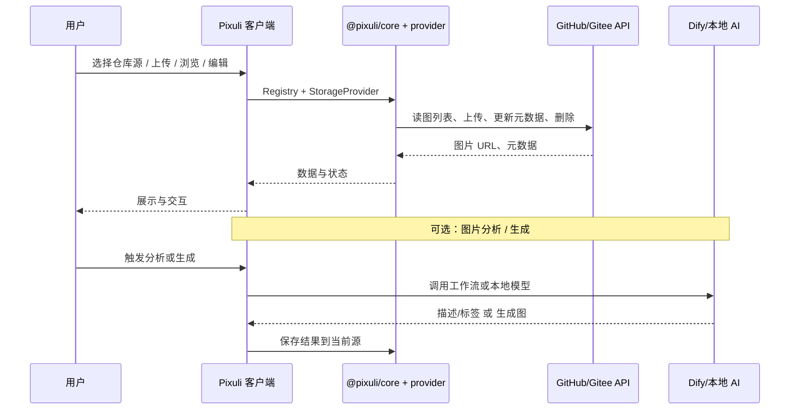
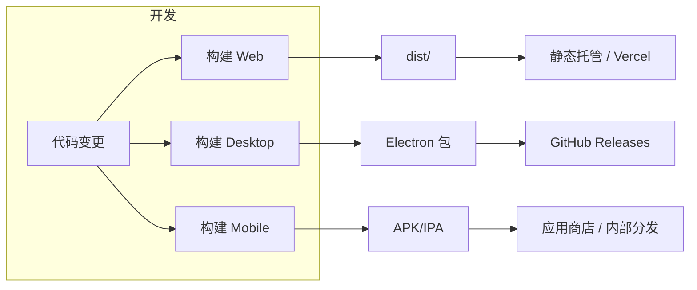
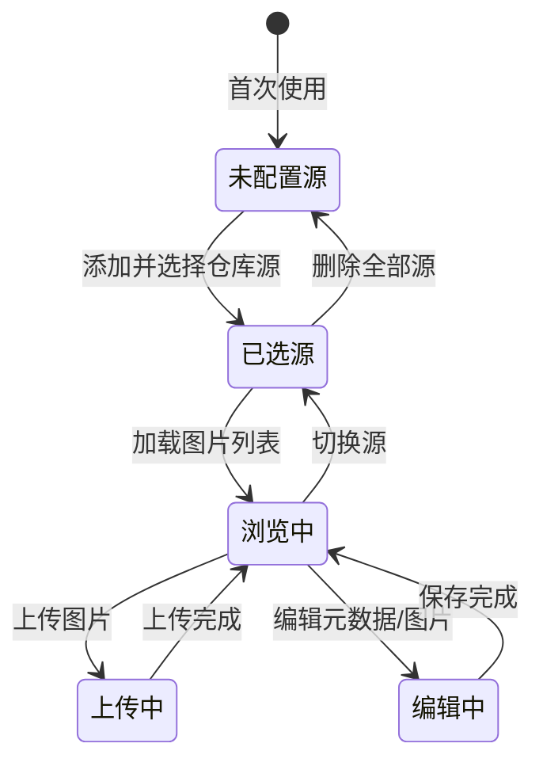

# Pixuli 整体系统设计

> **最后核对**：2026-06-17 · 适用分支 `main` · REF-407 / 文档 P0  
> **说明**：M3 后共享层为 `@pixuli/core` + `@pixuli/ui` +
> `@pixuli/provider-*`；`packages/common`、主路径 WASM、`server/`
> 已归档。Mobile 由 **`apps/pixuli` + Capacitor Android** 交付（非 Expo
> RN）。官方不提供 NestJS
> Server。图床主界面为**网格/列表**（幻灯片/时间线已移除，见
> [backlog](../backlog.md)）。

## 目录

- [一、方案概述](#一方案概述)
- [二、专业术语](#二专业术语)
- [三、系统架构设计](#三系统架构设计)
- [四、模块与职责](#四模块与职责)
- [五、数据流与存储](#五数据流与存储)
- [六、技术栈与平台能力](#六技术栈与平台能力)
- [七、部署与构建形态](#七部署与构建形态)
- [八、与设计文档及 CI/CD 的衔接](#八与设计文档及-cicd-的衔接)
- [九、扩展与演进](#九扩展与演进)
- [十、附录](#十附录)

---

## 一、方案概述

### 1.1 目标

为 **Pixuli** 项目建立一套**整体系统设计说明**，用于：

- **统一认知**：产品、前端、后端、多端开发对系统边界、模块划分、数据流形成一致理解。
- **指导实现**：与 [01-product](../01-product/)
  下的 PRD 文档配合，指导开发与排期。
- **对外展示**：便于文档站、Wiki、新成员入职时快速把握系统全貌。

### 1.2 设计原则

- **多端一致**：Web、Desktop、Mobile 在业务能力上对齐；Web/Desktop 共用
  `apps/pixuli` + `@pixuli/ui`；逻辑与类型在 `@pixuli/core`，存储经
  `StorageProvider` 插件。
- **存储插件化**：默认以 **GitHub / Gitee 仓库**为图床；**官方不提供** NestJS
  Server（`archive/server/` 仅归档参考）。
- **性能与体积**：Web/Desktop 图片处理以 **Canvas**（`@pixuli/ui`
  imageProcessor）为主；Mobile 使用 expo-image-manipulator 等原生能力。Rust
  WASM 已归档至 `archive/wasm/`。
- **可扩展**：AI 能力（分析、生成）通过 Dify 工作流或本地模型接入，压缩/编辑/转换采用传统实现，便于后续按需扩展新能力。

### 1.3 系统定位

| 维度         | 说明                                                                                           |
| ------------ | ---------------------------------------------------------------------------------------------- |
| **产品定位** | 智能图床与图片管理：以仓库为存储、支持多端浏览、上传、编辑、压缩、格式转换、元数据管理与检索。 |
| **目标用户** | 个人博客/静态站运营者、内容创作者、需要自托管图床的开发者与运维。                              |
| **核心价值** | 版本化存储（Git）、多端统一体验、可选 AI 分析/生成、可选服务端增强。                           |

---

## 二、专业术语

### 2.1 架构与工程术语

| 术语           | 英文             | 说明                                                                             |
| -------------- | ---------------- | -------------------------------------------------------------------------------- |
| **Monorepo**   | Monorepo         | pnpm workspace：`apps/*`、`packages/*`、`docs`；`archive/` 不参与日常构建        |
| **共享包**     | Shared Package   | `@pixuli/core`、`@pixuli/ui`、`@pixuli/provider-*`                               |
| **平台适配层** | Platform Adapter | 抽象平台差异的接口与实现，使同一业务逻辑在 Web/Desktop/Mobile 上分别调用对应能力 |
| **图床**       | Image Hosting    | 以用户配置的 GitHub/Gitee 仓库为后端；非官方自建 Server                          |

### 2.2 前端与多端术语

| 术语           | 英文              | 说明                                                                                         |
| -------------- | ----------------- | -------------------------------------------------------------------------------------------- |
| **Web 端**     | Web               | 基于 Vite + React，运行在浏览器中的 Web 应用，支持 PWA                                       |
| **Desktop 端** | Desktop           | 基于 Electron + React 的桌面应用，与 Web 共享同一套前端代码与 Vite 构建                      |
| **Mobile 端**  | Mobile            | **`apps/pixuli` + Capacitor Android**（与 Web 同一套 UI）；归档 RN 见 `archive/apps/mobile/` |
| **仓库源**     | Repository Source | 用户配置的 GitHub 或 Gitee 仓库，作为当前图片存储的「来源」                                  |
| **当前源**     | Current Source    | 用户选中的、用于读写图片的仓库配置（owner、repo、branch、path、token 等）                    |

### 2.3 图片处理术语

| 术语         | 英文              | 说明                                                               |
| ------------ | ----------------- | ------------------------------------------------------------------ |
| **WASM**     | WebAssembly       | 历史方案，已归档至 `archive/wasm/`；主应用以 Canvas 处理图片       |
| **图片分析** | Image Analysis    | 由图片得到文本描述、标签、场景等（image→text），可依赖 AI 或规则   |
| **图片生成** | Image Generation  | 由文本或条件生成图片（text→image），通常依赖 AI 工作流（如 Dify）  |
| **格式转换** | Format Conversion | 图片在不同编码格式间转换（如 PNG→JPEG、JPEG→WebP）                 |
| **元数据**   | Metadata          | 与图片关联的名称、描述、标签、尺寸、拍摄信息等，可存于仓库或服务端 |

### 2.4 服务与部署术语

| 术语              | 英文           | 说明                                                                                     |
| ----------------- | -------------- | ---------------------------------------------------------------------------------------- |
| **Pixuli Server** | Pixuli Server  | 已归档 NestJS 后端（`archive/server/`），**非官方交付**；见 [backlog §三](../backlog.md) |
| **Dify**          | Dify           | 开源 LLM 应用开发平台，通过工作流 API 实现图片分析、图片生成等能力                       |
| **制品**          | Build Artifact | 构建产物（如 Web 的 dist/、Desktop 的 Electron 包、Mobile 的 APK/IPA），用于发布或部署   |

---

## 三、系统架构设计

### 3.1 整体架构图

```mermaid
graph TB
    subgraph "用户端"
        U1[Web 浏览器]
        U2[Desktop Electron]
        U3[Mobile App]
    end

    subgraph "Pixuli 客户端 (Monorepo)"
        subgraph "应用层 apps/"
            A1[apps/pixuli<br/>Web + Desktop + Capacitor Android]
        end
        subgraph "共享层 packages/"
            Core[@pixuli/core<br/>类型·Registry·工具]
            UI[@pixuli/ui<br/>Web/Desktop UI]
            Prov[@pixuli/provider-*<br/>GitHub/Gitee 插件]
        end
    end

    subgraph "存储与外部服务"
        G[GitHub API]
        GE[Gitee API]
        D[Dify 工作流<br/>可选]
    end

    U1 --> A1
    U2 --> A1
    U3 --> A1

    A1 --> Core
    A1 --> UI
    A1 --> Prov

    Prov -->|读写图片与元数据| G
    Prov -->|读写图片与元数据| GE
    A1 -.->|分析/生成| D

    style Core fill:#e8f5e9
    style UI fill:#e3f2fd
    style Prov fill:#c8e6c9
    style D fill:#f3e5f5
```

### 3.2 分层说明

| 层级           | 含义               | 主要产物                                                |
| -------------- | ------------------ | ------------------------------------------------------- |
| **用户端**     | 用户使用的运行环境 | 浏览器、Electron 窗口、移动设备                         |
| **应用层**     | 各端入口应用       | `apps/pixuli`（Web / Desktop / Capacitor Android 一体） |
| **共享层**     | 跨端复用代码与能力 | `@pixuli/core`、`@pixuli/ui`、`@pixuli/provider-*`      |
| **存储与外部** | 持久化与增强能力   | GitHub/Gitee API；可选 Dify                             |

### 3.3 核心数据流（简化）



---

## 四、模块与职责

### 4.1 仓库目录与模块映射

| 路径                            | 模块名称       | 职责简述                                                                                             |
| ------------------------------- | -------------- | ---------------------------------------------------------------------------------------------------- |
| **apps/pixuli**                 | 三端主应用     | Vite + React + Electron + Capacitor Android；图床、上传、工具、设置；各端薄适配见 `src/platforms/`。 |
| **archive/apps/mobile**         | RN 历史归档    | Expo RN 只读参考（REF-513）；非 workspace。                                                          |
| **packages/core**               | `@pixuli/core` | 类型、`StoragePluginRegistry`、工具函数。                                                            |
| **packages/ui**                 | `@pixuli/ui`   | Web/Desktop/Mobile（Capacitor）共享 UI；`./native` 已 deprecated（随 RN 归档）。                     |
| **packages/plugin-provider-\*** | 存储插件       | 官方 GitHub/Gitee `StorageProvider` 实现。                                                           |
| **archive/**                    | 历史归档       | wasm、benchmark、server；见 [archive/README](../../archive/README.md)。                              |

### 4.2 应用层与共享层依赖关系

```mermaid
graph LR
    subgraph apps
        P[apps/pixuli]
    end
    subgraph packages
        Core[@pixuli/core]
        UI[@pixuli/ui]
        Prov[@pixuli/provider-*]
    end

    P --> Core
    P --> UI
    P --> Prov

    style Core fill:#c8e6c9
    style UI fill:#bbdefb
    style Prov fill:#a5d6a7
```

- **apps/pixuli** 依赖
  **@pixuli/core**、**@pixuli/ui**、**@pixuli/provider-\***；图片处理在 UI 层 Canvas 实现。Mobile 与 Web/Desktop 共用同一应用与 store。

### 4.3 平台能力矩阵（与 PRD 一致）

| 能力                       | Web | Desktop            | Mobile      |
| -------------------------- | --- | ------------------ | ----------- |
| 仓库源管理（GitHub/Gitee） | ✅  | ✅                 | ✅          |
| 图床 CRUD（网格/列表）     | ✅  | ✅                 | ✅          |
| 压缩/转换工具页            | ✅  | ✅                 | ✅ 部分     |
| PWA / 离线                 | ✅  | ⏳                 | ⏳          |
| AI 分析/生成               | ⏳  | ⏳ 桌面已接本地 AI | ⏳ 低优先级 |
| 相机/相册                  | —   | —                  | ✅          |

---

## 五、数据流与存储

### 5.1 图片与元数据存储模式

| 模式              | 说明                   | 数据所在                                                                    |
| ----------------- | ---------------------- | --------------------------------------------------------------------------- |
| **Git 仓库图床**  | **默认且唯一官方路径** | 图片与元数据存于用户配置的 GitHub/Gitee 仓库；经 `StorageProvider` 读写     |
| **自建 HTTP API** | 非官方                 | 可实现自定义 Provider 或参考 `archive/server/`；见 [backlog](../backlog.md) |

### 5.2 客户端配置与状态

- **仓库源配置**：Web/Desktop 使用 **localStorage**，Mobile 使用
  **AsyncStorage**；内容包含 owner、repo、branch、path、token 等，**仅存本地**，不提交到第三方。
- **状态管理**：使用
  **Zustand**，图片列表、当前源、筛选与排序、操作日志等在各端一致使用 store。

### 5.3 与外部系统的数据流

- **GitHub/Gitee**：通过各自 REST API 上传文件、读写仓库内元数据；由
  `@pixuli/provider-github` / `@pixuli/provider-gitee` 封装，经
  `StoragePluginRegistry` 注册到各端 imageStore。
- **（归档）Pixuli Server**：`archive/server/`
  内 NestJS 实现，**非官方主路径**；REST Key（Header 或 Bearer）。
- **Dify**：客户端或 Server 通过 HTTP 调用工作流 run
  API，传入图片（Base64/URL）或 prompt，接收文本或图片结果；API
  Key 存客户端本地或 Server 环境变量。

---

## 六、技术栈与平台能力

### 6.1 技术栈总览

| 层级                    | 技术选型                       | 说明                                |
| ----------------------- | ------------------------------ | ----------------------------------- |
| 前端框架                | React 19.x + TypeScript        | 三端统一技术栈                      |
| 构建工具                | Vite                           | Web/Desktop 构建                    |
| 桌面运行时              | Electron                       | 跨平台桌面，主进程 Node 与本地能力  |
| 移动端                  | Capacitor（Android）           | `apps/pixuli` Web 产物 + 原生壳     |
| 状态管理                | Zustand                        | 轻量、与框架解耦                    |
| 图片处理（Web/Desktop） | Canvas（`@pixuli/ui`）         | 压缩、转换等；WASM 已归档           |
| 图片处理（Mobile）      | 同 Web（Capacitor WebView）    | 与 Desktop/Web 共用 UI 处理路径     |
| 图床默认                | GitHub API / Gitee API         | 仓库即图床；经 StorageProvider 插件 |
| 可选后端                | 无官方 Server                  | `archive/server/` 仅社区参考        |
| 可选 AI                 | Dify 工作流 / Ollama / Qwen 等 | 图片分析、图片生成                  |

### 6.2 关键设计文档与能力对应

| 能力域            | 设计文档                                                      | 要点                                              |
| ----------------- | ------------------------------------------------------------- | ------------------------------------------------- |
| 三端工程与复用    | [15-apps-pixuli-engineering](./15-apps-pixuli-engineering.md) | Capacitor 三端、目录、脚本、构建（**SSOT**）      |
| 性能优化与监控    | [03-Performance](./03-Performance.md)                         | 虚拟滚动、懒加载、Worker、性能采集与面板          |
| 存储插件体系      | [04-Plugin-System](./04-Plugin-System.md)                     | Registry、Provider 开发、M3 回归清单              |
| 历史选型 / 矩阵   | [archive/design/](../archive/design/README.md)                | `01`/`02`/`06`～`14` 归档快照；原路径 stub 重定向 |
| AI / Dify（延后） | [backlog §二](../backlog.md)                                  | 分析/生成待功能开发后再补设计文档                 |

---

## 七、部署与构建形态

### 7.1 客户端制品形态

| 端      | 构建产物                              | 发布方式                                       |
| ------- | ------------------------------------- | ---------------------------------------------- |
| Web     | 静态资源（如 `dist/`）                | 可部署至 Vercel、Nginx、任意静态托管；支持 PWA |
| Desktop | Electron 安装包（Windows/macOS）      | GitHub Releases 提供 exe、dmg 等               |
| Mobile  | Capacitor Android APK（`v*-android`） | GitHub Releases / CI（REF-515 #153）           |

### 7.2 服务端部署（非官方）

- **官方态度**：不提供 NestJS Server 为一等公民；`archive/server/`
  仅供社区自建参考。
- 若需中心化 API，请实现自定义 `StorageProvider` 或 fork 归档 server。

### 7.3 构建与发布流程（概念）



- Web/Desktop/Mobile 的构建由 **pnpm**
  与各自脚本（如 Vite、Electron-builder、EAS）完成；具体流水线见仓库
  `.github/workflows/`（如 release-web、release-desktop、release-mobile）。

---

## 八、与设计文档及 CI/CD 的衔接

### 8.1 文档体系

| 文档/目录                        | 用途                                                                      |
| -------------------------------- | ------------------------------------------------------------------------- |
| [01-product](../01-product/)     | 产品需求（PRD）、使用教程等                                               |
| [02-system-design](../README.md) | 架构与方案设计索引；本系统设计为 00-System-Design，与 01～04 专项设计并列 |

### 8.2 本系统设计与各文档的关系

- **00-System-Design（本文）**：描述系统全貌、模块、数据流、技术栈与部署形态，不替代各专项设计，而是与之互补。
- **01～04 专项设计**：在各自领域内细化（三端能力共享、三端设计、性能、插件体系）；实现时以 PRD 为需求来源、以专项设计为技术方案。
- **CICD.md**：若 Pixuli 的 Web 静态站或 Pixuli
  Server 需要接入同一套 CI/CD，可按照 CICD 中的「项目契约」（build.sh、artifacts.yml、deploy.sh）与 Workflow 设计进行接入。

### 8.3 新增能力时的参考顺序

1. **PRD**：确认需求与优先级（01-product）。
2. **系统设计**：判断新能力归属模块（apps/common/server）及与现有数据流的关系（本文）。
3. **专项设计**：若涉及跨端能力、三端架构、性能、插件或 AI，查阅
   `02-system-design/` 下对应文档。
4. **部署**：若涉及新制品或新服务，参考 CICD.md 的契约与 Workflow 设计。

---

## 九、扩展与演进

### 9.1 已规划方向（与 PRD 一致）

- **批量元数据编辑**：多选图片后统一改标签、描述等；见 M6 REF-604/605。
- **布局与性能**：列数/瀑布流/虚拟列表等，见
  [03-Performance](./03-Performance.md)。
- **AI 能力**：自动打标、场景识别、OCR、文生图；设计文档待开发后补充，见
  [backlog](../backlog.md) 与现有 Desktop `aiService`。
- **官方 Server**：不在路线图；历史能力见 [backlog §三](../backlog.md)。

### 9.2 架构扩展原则

- **新端或新入口**：优先复用 `@pixuli/core` + `@pixuli/ui`（或 Capacitor 套壳
  `apps/pixuli`）。
- **新存储后端**：实现 `StorageProvider` 并注册到 `StoragePluginRegistry`（见
  [04-Plugin-System §第二部分](./04-Plugin-System.md#第二部分-存储插件开发指南)）。
- **新 AI 能力**：优先通过 Dify 工作流扩展；若需本地模型，在 Desktop 主进程或 Server 侧扩展，对前端暴露统一「分析/生成」抽象。

---

## 十、附录

### 10.1 仓库结构速览

```
Pixuli/
├── apps/
│   └── pixuli/                    # Web + Desktop + Mobile（Capacitor）
├── packages/
│   ├── core/                      # @pixuli/core
│   ├── ui/                        # @pixuli/ui
│   └── plugin-provider-github|gitee/
├── docs/                          # PRD、系统设计、业务设计
├── archive/                       # wasm、benchmark、server、apps/mobile（非 workspace）
├── .github/workflows/
├── pnpm-workspace.yaml
└── package.json
```

### 10.2 状态图（客户端与存储）



### 10.3 参考文档

- [Pixuli README](../../README.md) - 项目介绍与快速开始
- [产品需求规格说明书](../01-product/01-Product-Requirements-Specification.md)

### 10.4 相关文件清单

| 类型       | 路径/说明                                                                |
| ---------- | ------------------------------------------------------------------------ |
| 应用入口   | `apps/pixuli`（三端）                                                    |
| 共享包     | `packages/core`、`packages/ui`、`packages/plugin-provider-*`             |
| 归档       | `archive/wasm`、`archive/server`、`archive/benchmark`                    |
| 产品与设计 | `docs/01-product/`、`docs/02-system-design/`、`docs/03-business-design/` |
| 流水线     | `.github/workflows/*.yml`                                                |
