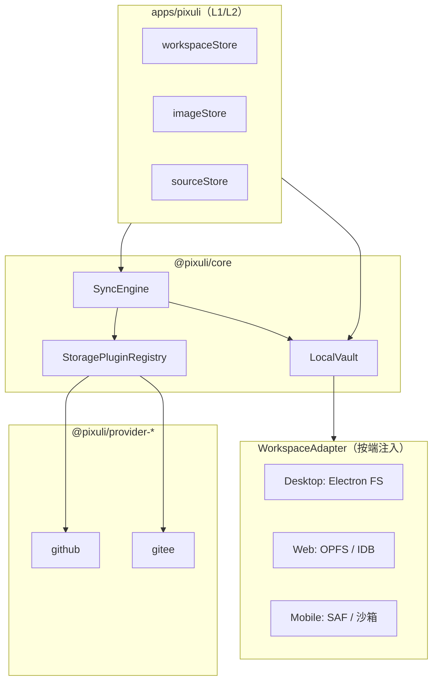

# 本地工作区与远端同步（REF-607）

- **文档版本**：1.0（设计稿）
- **计划编号**：REF-607（M6）
- **关联 Issue**：[#144](https://github.com/trueLoving/Pixuli/issues/144)
- **最后核对**：2026-06-11 · 适用分支 `main`
- **相关文档**：
  - [REFACTOR_PLAN.md §1.8 / §10.7](../../REFACTOR_PLAN.md)
  - [04-three-platform-interaction-spec.md §2.2](../01-product/04-three-platform-interaction-spec.md)
  - [04-Plugin-System.md](./04-Plugin-System.md)
  - [09-cross-platform-sharing-matrix.md](./09-cross-platform-sharing-matrix.md)

本文是 **#144** 的技术设计 SSOT：定义
`LocalVault`、`SyncEngine`、`StorageProvider`
同步扩展与三端适配边界。产品交互见 REF-601；实现按本文 **§九 分阶段交付** 推进。

---

## 目录

- [一、背景与目标](#一背景与目标)
- [二、设计原则](#二设计原则)
- [三、架构总览](#三架构总览)
- [四、本地工作区目录约定](#四本地工作区目录约定)
- [五、核心类型与接口](#五核心类型与接口)
- [六、StorageProvider 同步扩展](#六storageprovider-同步扩展)
- [七、同步引擎](#七同步引擎)
- [八、URL 与链接解析](#八url-与链接解析)
- [九、分阶段交付](#九分阶段交付)
- [十、应用层改造要点](#十应用层改造要点)
- [十一、三端平台适配](#十一三端平台适配)
- [十二、与关联 Issue 的边界](#十二与关联-issue-的边界)
- [十三、迁移：仅远端源用户](#十三迁移仅远端源用户)
- [十四、风险与开放问题](#十四风险与开放问题)
- [十五、验收对照（#144）](#十五验收对照144)

---

## 一、背景与目标

### 1.1 现状（M3）

| 维度       | 现状                                                                              |
| ---------- | --------------------------------------------------------------------------------- |
| 列表数据源 | `imageStore.loadImages()` → `storageProvider.listImages()`，**远端 Git API 为主** |
| 配置       | `sourceStore` 持久化多条 **远端仓库源**（`StoredSourceEntry`），无工作区根路径    |
| Provider   | `list` / `upload` / `delete` / `getRawUrl`；**无 sync**                           |
| 用户心智   | 「添加 GitHub/Gitee 源 → 浏览远端仓库」                                           |

### 1.2 目标态（Obsidian 式，非实现拷贝）

用户**先指定本地工作目录**（Vault），图片与元数据以**本地为 SSOT**；远端经已有
`StorageProvider` **可选同步**；「复制链接」区分本地预览与远端公网 URL。

```text
┌─────────────────────────────────────────────────────────────┐
│  LocalVault（本地 SSOT）                                      │
│    文件：images/…  索引：.pixuli/index  配置：.pixuli/config │
├─────────────────────────────────────────────────────────────┤
│  SyncEngine                                                   │
│    待上传队列 · pull 游标 · 冲突记录（LWW 优先）                │
├─────────────────────────────────────────────────────────────┤
│  StorageProvider（github / gitee）                            │
│    现有 CRUD + sync.push / sync.pull / buildPublicUrl         │
└─────────────────────────────────────────────────────────────┘
```

### 1.3 不在本期范围

- 非 Git 远端（S3、MinIO、Pixuli Server）
- 实时双向合并 UI 全量（先 **LWW + 冲突列表 + 手动重试**）
- Web File System Access **全浏览器**覆盖（按能力降级，见 §十一）
- Capacitor 原生选目录完整落地（链 REF-510；P0 以 Desktop 为主）

---

## 二、设计原则

| 原则               | 说明                                                                                  |
| ------------------ | ------------------------------------------------------------------------------------- |
| **本地 SSOT**      | 列表/搜索/批处理默认读本地索引；远端是同步目标，不是唯一数据源                        |
| **Core 无 UI**     | `LocalVault` / `SyncEngine` 契约在 `@pixuli/core`；平台 IO 经 `WorkspaceAdapter` 注入 |
| **Provider 无 UI** | 同步仍走 `StorageProvider`；扩展 sync 子接口，不另起插件体系                          |
| **渐进迁移**       | 保留「仅远端源」模式至迁移完成；`workspaceMode: 'local' \| 'remote-only'`             |
| **Desktop 先行**   | P0 PoC 在 Electron 真实路径验证，再扩 Web/Mobile                                      |
| **与 M3 兼容**     | `getRawUrl` 保留；公网分享走 `buildPublicUrl` / `resolveLinkKind`                     |

---

## 三、架构总览



**数据流（日常浏览）**：

1. 用户打开应用 → 若已绑定工作区，`LocalVault.list()` 读
   **本地索引**（必要时后台增量扫描 `images/`）。
2. 上传/删除 → **先写本地文件 + 更新索引** → `SyncEngine.enqueuePush()`。
3. 用户点「同步」→ `SyncEngine.run()`：flush push 队列 → `provider.sync.pull()`
   → 合并索引。

**与现 `imageStore` 关系**：P0 不删除远端路径；P1 起 `imageStore` 在
`workspaceMode === 'local'` 时改调 `LocalVault`，`storageProvider.listImages`
仅用于 sync/pull 与「仅远端」回退。

---

## 四、本地工作区目录约定

工作区根目录 `{workspace}` 由用户选择（Desktop）或虚拟根（Web/Mobile）。

```text
{workspace}/
  images/                      # 用户可见图片（可按相册分子目录）
    album-a/
      photo.jpg
      photo.jpg.pixuli.json    # 可选 sidecar 元数据（标签/描述）
  .pixuli/
    config.json                # 工作区元数据、绑定列表、schema 版本
    index.json                 # P0：JSON 索引；P2+ 可迁 SQLite（REF-603）
    sync/
      state.json               # 各 binding 的 lastSyncAt、cursor、pending 计数
      queue.jsonl              # 待 push 操作队列（或 Desktop 复用 REF-503 队列格式）
      conflicts.json           # 冲突记录（path、localRev、remoteRev、strategy）
    trash/                     # 本地软删除映射（与 REF-606 对齐）
    thumbs/                    # 可选缩略图缓存
```

### 4.1 `config.json`（草案）

```json
{
  "schemaVersion": 1,
  "workspaceId": "uuid",
  "displayName": "My Pixuli Library",
  "createdAt": "2026-06-11T00:00:00.000Z",
  "bindings": [
    {
      "id": "binding-1",
      "label": "博客图床",
      "pluginId": "github",
      "remotePathPrefix": "images",
      "localPathPrefix": "images/blog",
      "config": {
        "owner": "user",
        "repo": "blog-assets",
        "branch": "main",
        "path": "images",
        "token": "…"
      }
    }
  ]
}
```

- **binding**：一条「本地子树 ↔ 远端仓库路径」映射；复用 M3
  `pluginId + config`，增加路径映射字段。
- **敏感字段**：`token`
  仅存工作区外应用级安全存储（Desktop：可选 keychain；过渡期仍可加密写入 config 或沿用现有 localStorage 源配置，P0 可合并迁移）。

### 4.2 索引项（`index.json` 单条）

```typescript
interface LocalImageIndexEntry {
  id: string; // 稳定 id，默认 hash(workspaceRelativePath)
  relativePath: string; // 相对 workspace，如 images/blog/photo.jpg
  name: string;
  size: number;
  width: number;
  height: number;
  mimeType: string;
  tags: string[];
  description?: string;
  createdAt: string;
  updatedAt: string;
  deletedAt?: string; // REF-606 软删除
  bindingId?: string; // 由哪条 binding 负责同步
  remotePath?: string; // 远端相对 path（sync 后填写）
  syncState?: 'local-only' | 'synced' | 'pending-push' | 'conflict';
}
```

---

## 五、核心类型与接口

建议新增包路径：`@pixuli/core/vault`（与 `plugins`、`sources` 并列）。

### 5.1 WorkspaceAdapter（平台 IO）

```typescript
/** 读写工作区文件的端口；由各端实现 */
export interface WorkspaceAdapter {
  readonly kind: 'desktop' | 'web' | 'mobile';
  /** 是否已授权/已选择根目录 */
  isReady(): boolean;
  getRootPath(): string | null; // Desktop 绝对路径；Web 为虚拟 id
  pickRoot(): Promise<boolean>; // 首次选目录
  readFile(relativePath: string): Promise<Uint8Array>;
  writeFile(relativePath: string, data: Uint8Array): Promise<void>;
  deleteFile(relativePath: string): Promise<void>;
  listFiles(
    relativeDir: string,
    options?: { recursive?: boolean },
  ): Promise<string[]>;
  exists(relativePath: string): Promise<boolean>;
}
```

### 5.2 LocalVault

```typescript
export interface LocalVault {
  readonly adapter: WorkspaceAdapter;
  open(): Promise<void>; // 读 config、校验 schema、加载 index
  getConfig(): WorkspaceConfig;
  list(options?: LocalListOptions): Promise<LocalImageIndexEntry[]>;
  getByPath(relativePath: string): Promise<LocalImageIndexEntry | null>;
  importFile(
    source: File | string,
    targetRelativePath: string,
    meta?: Partial<LocalImageIndexEntry>,
  ): Promise<LocalImageIndexEntry>;
  updateMetadata(
    relativePath: string,
    patch: Partial<Pick<LocalImageIndexEntry, 'name' | 'tags' | 'description'>>,
  ): Promise<LocalImageIndexEntry>;
  softDelete(relativePath: string): Promise<void>; // 移入 .pixuli/trash 映射
  scan(): Promise<number>; // 可选：全量扫描 images/ 重建索引
}
```

### 5.3 SyncEngine

```typescript
export type SyncDirection = 'push' | 'pull' | 'both';

export interface SyncRunOptions {
  bindingId?: string;
  direction?: SyncDirection;
}

export interface SyncRunResult {
  pushed: number;
  pulled: number;
  conflicts: SyncConflict[];
  errors: Array<{ path: string; message: string }>;
}

export interface SyncEngine {
  enqueuePush(op: SyncPushOperation): Promise<void>;
  getStatus(): Promise<SyncStatusSummary>;
  run(options?: SyncRunOptions): Promise<SyncRunResult>;
}

export type SyncPushOperation =
  | { type: 'upload'; relativePath: string }
  | { type: 'delete'; relativePath: string; remotePath?: string }
  | { type: 'metadata'; relativePath: string };
```

### 5.4 workspaceStore（应用层，新建）

```typescript
interface WorkspaceState {
  mode: 'unset' | 'local' | 'remote-only'; // remote-only = 现 M3 行为
  vault: LocalVault | null;
  syncEngine: SyncEngine | null;
  activeBindingId: string | null;
  syncStatus: SyncStatusSummary | 'idle';
}
```

持久化：`pixuli.workspace.v1`（localStorage / Electron 仅存 **根路径引用** +
`workspaceId`，不复制整库）。

---

## 六、StorageProvider 同步扩展

在 **不破坏** 现有 `StorageProvider` 的前提下，用 **可选子接口** 扩展（与
`StorageProviderWithMetadata` 同模式）。

```typescript
export interface SyncPullOptions {
  since?: string; // cursor / commit sha / etag，由 provider 定义
  pathPrefix?: string;
}

export interface SyncPullResult {
  items: Array<{
    remotePath: string;
    action: 'add' | 'update' | 'delete';
    contentHash?: string;
    metadata?: Partial<ImageItem>;
  }>;
  nextCursor?: string;
}

export interface SyncPushItem {
  localRelativePath: string;
  remotePath: string;
  action: 'upload' | 'delete' | 'metadata';
  file?: Uint8Array;
  metadata?: Partial<ImageItem>;
}

export interface StorageProviderSync {
  syncPull(options?: SyncPullOptions): Promise<SyncPullResult>;
  syncPush(items: SyncPushItem[]): Promise<void>;
  getSyncCursor(): Promise<string | null>;
}

export type LinkKind = 'local' | 'remote-raw' | 'remote-proxy';

export interface StorageProviderPublicUrl {
  buildPublicUrl(remotePath: string): string;
  resolveLinkKind(url: string): LinkKind;
}

export interface StorageProviderWithSync
  extends StorageProvider,
    StorageProviderSync,
    StorageProviderPublicUrl {}
```

**Manifest 能力位**（`StorageCapabilities` 扩展）：

```typescript
interface StorageCapabilities {
  // 现有 list | upload | delete | updateMetadata | needsProxy
  sync?: boolean;
  publicUrl?: boolean;
}
```

**GitHub / Gitee P1 实现要点**：

- `syncPull`：基于 Contents API 列目录 + 对比 cursor（可用最近 commit
  sha 或 path etag）。
- `syncPush`：批量映射为现有 `uploadImage` / `deleteImage` /
  `updateImageMetadata`。
- `buildPublicUrl`：返回各远端**公网直链**（GitHub raw、Gitee
  raw）；**仅**用于「复制链接」，不经站点代理。
- `getRawUrl`：P7 前保留「当前配置下远端 raw（含 Gitee 代理形态）」；P7 后删除或仅限非 UI 内部用途。
- 本地预览由 `LocalVault` 生成 `blob:` / `file:`
  URL；**禁止**新 Provider 引入「每源一套同源图片代理」模式。

---

## 七、同步引擎

### 7.1 冲突策略（P0）

| 策略             | 规则                                                                    |
| ---------------- | ----------------------------------------------------------------------- |
| **默认 LWW**     | 比较 `updatedAt`；较新者胜                                              |
| **冲突登记**     | 无法自动合并时写入 `.pixuli/sync/conflicts.json`，UI 展示「需手动处理」 |
| **删除 vs 修改** | 若一端 deleted、一端 modified → 记冲突，不静默覆盖                      |

### 7.2 Push 队列

1. 本地写操作完成 → `enqueuePush` 追加 `queue.jsonl`。
2. `SyncEngine.run({ direction: 'push' })` 按 binding 分组，调用
   `provider.syncPush`。
3. 成功 → 更新 `index` 条目的
   `syncState: 'synced'`、`remotePath`；失败 → 保留队列 + 可重试计数。

### 7.3 Pull 流程

1. `getSyncCursor()` → `syncPull({ since })`。
2. 对每个远端变更：写入/更新/软删本地文件与索引。
3. 更新 `sync/state.json` 中 `lastSyncAt`、`cursor`。

### 7.4 与 REF-503 的关系

Desktop **离线浏览与上传队列**（#88）与 SyncEngine
**共享队列持久化格式**（`queue.jsonl` 或抽象
`PersistentQueue`），避免两套实现。P0 可在 Electron
main 进程实现队列落盘；P1 再统一命名。

---

## 八、URL 与链接解析

| 类型           | 来源                                   | 用途                                   | 终态（P7 后）                          |
| -------------- | -------------------------------------- | -------------------------------------- | -------------------------------------- |
| `local`        | `WorkspaceAdapter` + `blob:` / `file:` | 本机预览，**不**作为对外 Markdown 链接 | **唯一预览路径**                       |
| `remote-raw`   | `buildPublicUrl`                       | GitHub raw、Gitee 公网 raw             | **仅**「复制链接」；不经应用内 `` |
| `remote-proxy` | Gitee + 站点 `/api/gitee-proxy`        | M3 remote-only 时代 Web/Capacitor 预览 | **删除**（REF-607 P7）                 |

**UI（REF-602 / REF-601）**：「复制链接」子菜单：`local`（导出路径）+
`remote-raw`（公网直链）；未绑定远端时仅 `local`。P7 后移除 `remote-proxy` 项。

**浏览规则（local-only 终态）**：`imageStore`
列表与缩略图**只**读 LocalVault；远端未 pull 的条目显示「待同步」占位，**不**回退到
`getRawUrl()` / 代理 URL。

`ImageItem` 演进（P1，Breaking 可控）：

- 增加 `localPath?: string`、`linkKind?: LinkKind`、`publicUrl?: string`。
- `githubUrl` 保留为兼容字段，标记 **deprecated**，映射到 `publicUrl`。
- P7：`LinkKind` 移除 `remote-proxy`；`linkKind` 预览侧恒为 `local`。

### 8.1 Gitee 图片代理退役（P7）

**动机**：Gitee raw 在浏览器 `` 受 CORS 限制，M3 以站点同源代理绕过（Vite /
Vercel / Electron / Capacitor env）。该路径服务于 **remote-only**
远端列表预览，与 local-first SSOT 冲突；若每增一种「raw CDN +
CORS」云端都复制代理，维护成本不可接受（**Google Drive /
OneDrive 等不得沿用此模式**）。

**终态模型**：

```text
┌─────────────────────────────────────────┐
│  LocalVault（浏览与预览唯一数据源）        │
│    预览 → blob: / file:                  │
├─────────────────────────────────────────┤
│  StorageProvider（github / gitee / 未来） │
│    认证、list、upload、delete、syncPush/Pull │
│    不给 UI 拼可跨域  URL             │
├─────────────────────────────────────────┤
│  buildPublicUrl（可选）                  │
│    对外 Markdown 公网直链，不经 Pixuli 代理 │
└─────────────────────────────────────────┘
```

**P7 前置**：#160 Web 工作区 ✅ · #161 Mobile 工作区 ✅ · 默认
`workspaceMode: 'local'` · 预览无代理 URL 依赖。

**P7 删除清单**（整段移除，非 `if (useProxy)` 长期并存）：

| 层级                     | 范围                                                                          |
| ------------------------ | ----------------------------------------------------------------------------- |
| `@pixuli/provider-gitee` | `useProxy`、`proxyBaseUrl`、`/proxy/*` 预览拼链（**保留** Contents API sync） |
| Host（REF-411）          | `viteGiteeProxyPlugin`、`startGiteeProxyServer`、`api/gitee-proxy`、nginx 段  |
| 应用                     | `giteeProxyBase`、`VITE_GITEE_PROXY_ORIGIN`、`window.giteeProxyBase`          |
| Core                     | `StorageCapabilities.needsProxy`（若无其他引用）                              |

**新 Provider 约束**：仅实现 `StorageProviderSync` + 可选
`buildPublicUrl`；内容同步至 LocalVault 后本地预览；**禁止**新增 Host 级图片 CORS 代理。

---

## 九、分阶段交付

| 阶段               | 范围                                                              | 产物                                                    | 依赖             | Issue                                                      |
| ------------------ | ----------------------------------------------------------------- | ------------------------------------------------------- | ---------------- | ---------------------------------------------------------- |
| **P0 设计**        | 本文 + #144 勾选「技术设计」                                      | 本文件、接口草案                                        | REF-601 ✅       | [#155](https://github.com/trueLoving/Pixuli/issues/155) ✅ |
| **P1 Core 契约**   | `@pixuli/core/vault` 类型 + 内存/假适配器单测                     | `vault/types.ts`、测试                                  | P0               | [#156](https://github.com/trueLoving/Pixuli/issues/156)    |
| **P2 Desktop PoC** | 选目录、本地列表、单文件上传至本地、手动 push 一张到 GitHub/Gitee | Electron `WorkspaceAdapter`、`workspaceStore`、最小 UI  | P1、M3 Provider  | [#157](https://github.com/trueLoving/Pixuli/issues/157)    |
| **P3 索引与 pull** | `index.json`、`scan()`、单向 pull、同步状态徽章                   | `SyncEngine` MVP                                        | P2               | [#158](https://github.com/trueLoving/Pixuli/issues/158)    |
| **P4 应用切换**    | `imageStore` 在 local 模式走 `LocalVault`；过渡期保留 remote-only | 特性开关 / 迁移向导                                     | P3、REF-507 可选 | [#159](https://github.com/trueLoving/Pixuli/issues/159)    |
| **P5 Web**         | OPFS 或 IDB 虚拟工作区；FSA 可选增强                              | Web `WorkspaceAdapter`                                  | REF-503 能力说明 | [#160](https://github.com/trueLoving/Pixuli/issues/160)    |
| **P6 Mobile**      | SAF / Capacitor 文件插件                                          | Mobile 适配器                                           | REF-510          | [#161](https://github.com/trueLoving/Pixuli/issues/161)    |
| **P7 代理退役**    | Gitee image proxy 整段删除；`remote-only` 移除；local-only 锁死   | 无 `useProxy` / Host 集成；新 Provider 禁止同源图片代理 | P5、P6           | [#173](https://github.com/trueLoving/Pixuli/issues/173)    |

里程碑：[REF-607-本地工作区分阶段](https://github.com/trueLoving/Pixuli/milestone/7)
· 父 Issue [#144](https://github.com/trueLoving/Pixuli/issues/144)

**#144 验收「Desktop PoC」对应 P2～P3**。**REF-607 收官**对应
**P7**（三端工作区就绪后执行，见 [§8.1](#81-gitee-图片代理退役p7)）。

---

## 十、应用层改造要点

### 10.1 新增

| 模块                     | 路径（建议）                                            |
| ------------------------ | ------------------------------------------------------- |
| WorkspaceAdapter Desktop | `apps/pixuli/src/platforms/desktop/workspaceAdapter.ts` |
| workspaceStore           | `apps/pixuli/src/stores/workspaceStore.ts`              |
| 首次选目录引导           | `apps/pixuli/src/features/workspace/`（薄 UI）          |

### 10.2 修改

| 模块             | 改动                                                                                        |
| ---------------- | ------------------------------------------------------------------------------------------- |
| `imageStore`     | `loadImages`：`local` → `vault.list()`；P7 前过渡期 `remote-only` → 现逻辑，P7 后删除该分支 |
| `sourceStore`    | `binding` 迁入 `workspace config`；过渡期双写或迁移脚本                                     |
| `createProvider` | 不变；SyncEngine 内 `registry.create(binding.pluginId, ctx)`                                |
| 侧栏             | 「当前工作区」+ 同步状态（REF-602，可 P2 用最简文案）                                       |

### 10.3 Electron 主进程

- `dialog.showOpenDialog({ properties: ['openDirectory'] })` 选根目录。
- 通过 IPC 暴露：`workspace:readFile`、`workspace:writeFile`、`workspace:list`（避免 Renderer 直接
  `fs`）。
- 与现有 `aiService` 中 `showOpenDialog` 模式一致，抽为 `workspaceIpc`。

---

## 十一、三端平台适配

| 端                      | 本地根                  | 实现优先级 | 说明                                |
| ----------------------- | ----------------------- | ---------- | ----------------------------------- |
| **Desktop**             | 用户任选文件夹          | **P0**     | Electron main FS + IPC              |
| **Web**                 | OPFS / IndexedDB 虚拟根 | P2         | 无真实 `file://`；复制链接仅 remote |
| **Mobile（Capacitor）** | SAF / 应用沙箱          | P3         | REF-510；与 RN 过渡期并存           |

Web **File System Access
API**：可用则允许「连接本地文件夹」；不可用则仅 OPFS + 文案说明（REF-601
§2.2）。

---

## 十二、与关联 Issue 的边界

| Issue            | 关系                                                          |
| ---------------- | ------------------------------------------------------------- |
| **#130 REF-601** | 交互 SSOT；本文实现其 §2.2 技术侧                             |
| **#131 REF-602** | 侧栏工作区、同步按钮、复制链接 UI；可在 P2 用最简壳           |
| **#132 REF-603** | 大库时 `index.json` → SQLite、分页；P3 前 JSON + 内存分页即可 |
| **#140 REF-606** | `.pixuli/trash/` 与 `deletedAt`；P3 与 softDelete 对齐        |
| **#88 REF-503**  | Desktop 离线队列与 sync 队列复用                              |
| **#117 REF-507** | store 抽取；vault 稳定后再迁 core 工厂                        |

---

## 十三、迁移：仅远端源用户

1. 检测 `sourceStore.sources.length > 0` 且无 `workspace config`。
2. 引导：**选择本地目录**（作为缓存/工作区）→ **导入绑定**：每条
   `StoredSourceEntry` → `config.bindings[]`。
3. 提供 **「从远端全量 pull 一次」**（可选，耗时提示）。
4. 完成后 `workspaceMode: 'local'`；「切换回仅远端浏览」在
   **P7 移除**（与 Gitee 代理一并退役）。

---

## 十四、风险与开放问题

| 项                 | 说明                         | 暂定                                            |
| ------------------ | ---------------------------- | ----------------------------------------------- |
| Token 存哪         | 工作区 config vs 应用 global | P0 沿用 sourceStore 字段，binding 引用 sourceId |
| 索引格式           | JSON vs SQLite               | P0 JSON；>5k 图迁 SQLite（REF-603）             |
| 大图二进制         | 是否进 index                 | 仅元数据；文件在 `images/`                      |
| 多 binding 同 path | 冲突                         | 禁止重叠 `localPathPrefix`；config 校验         |
| Gitee 图片代理     | remote-only 预览曾依赖代理   | P7 整段删除；预览仅 local（§8.1）               |
| Git LFS            | 超大文件                     | 超出 Provider `maxUploadBytes` 则队列失败并提示 |

---

## 十五、验收对照（#144）

| #144 验收项                                       | 本文章节          | 实现阶段            |
| ------------------------------------------------- | ----------------- | ------------------- |
| PRD / 交互：首次流程、绑定、同步、复制链接        | §一、§八、REF-601 | P0 文档 ✅ / UI P2+ |
| 技术设计：LocalVault + SyncEngine + Provider 扩展 | §五～§七          | **P0 本文**         |
| Desktop PoC：选目录 + 本地列表 + push/pull 一次   | §九 P2～P3        | 待开发              |
| URL：本地 vs 远端公网                             | §八、§8.1         | P2 / **P7 收官**    |
| Gitee 代理退役                                    | §8.1              | **P7**              |
| 迁移说明                                          | §十三             | P4                  |

---

## 附录 A：文件与包清单（实现时）

```text
packages/core/src/vault/
  types.ts           # WorkspaceConfig, LocalImageIndexEntry, Sync*
  localVault.ts      # LocalVault 实现（依赖 WorkspaceAdapter）
  syncEngine.ts      # SyncEngine 实现
  index.ts           # 导出

packages/core/src/plugins/types.ts
  # StorageProviderSync, StorageProviderPublicUrl, capabilities.sync

apps/pixuli/electron/main/
  workspaceIpc.ts    # FS + pickRoot

apps/pixuli/src/stores/
  workspaceStore.ts
```

## 附录 B：相关 Issue 链接

- [#144 REF-607 总览](https://github.com/trueLoving/Pixuli/issues/144) ·
  [里程碑 #7](https://github.com/trueLoving/Pixuli/milestone/7)
- 分阶段：[#155 P0](https://github.com/trueLoving/Pixuli/issues/155) ·
  [#156 P1](https://github.com/trueLoving/Pixuli/issues/156) ·
  [#157 P2](https://github.com/trueLoving/Pixuli/issues/157) ·
  [#158 P3](https://github.com/trueLoving/Pixuli/issues/158) ·
  [#159 P4](https://github.com/trueLoving/Pixuli/issues/159) ·
  [#160 P5](https://github.com/trueLoving/Pixuli/issues/160) ·
  [#161 P6](https://github.com/trueLoving/Pixuli/issues/161)
- [#130 REF-601](https://github.com/trueLoving/Pixuli/issues/130)（已关闭）
- [#140 REF-606](https://github.com/trueLoving/Pixuli/issues/140)
- [#132 REF-603](https://github.com/trueLoving/Pixuli/issues/132)
