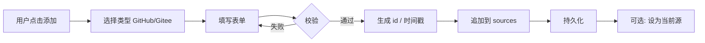
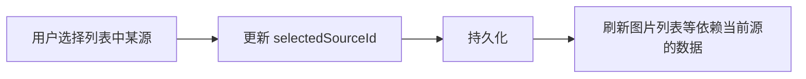

# 仓库源管理 - 业务设计

- **文档版本**：1.0
- **所属目录**：`.github/03-business-design`
- **相关 PRD**：
  [01-Product-Requirements-Document](../01-product/01-Product-Requirements-Document.md)
  第 4.1 节
- **相关系统设计**： [00-System-Design](../02-system-design/00-System-Design.md)

---

## 目录

- [一、业务目标与范围](#一业务目标与范围)
- [二、业务实体与数据模型](#二业务实体与数据模型)
- [三、业务规则](#三业务规则)
- [四、业务流程](#四业务流程)
- [五、与上下游衔接](#五与上下游衔接)
- [六、三端差异与一致性](#六三端差异与一致性)
- [七、附录](#七附录)

---

## 一、业务目标与范围

### 1.1 业务目标

**仓库源管理**为 Pixuli 的「图床来源」提供配置与切换能力，使用户能够：

- 将 **GitHub** 或 **Gitee** 仓库配置为图片存储源（一个或多个）；
- 在已配置的源之间**切换当前活跃源**，所有图片的读写（上传、列表、编辑、删除）均针对当前源；
- 对已有源进行**编辑、删除**，以及**配置的导入、导出与清空**，并保证配置在本地持久化、敏感信息不泄露。

### 1.2 范围边界

| 在范围内                                                            | 不在范围内                                                        |
| ------------------------------------------------------------------- | ----------------------------------------------------------------- |
| 仓库源的增删改、列表展示、当前源切换                                | 仓库内具体图片的 CRUD（由「图片 CRUD」业务负责）                  |
| 配置的本地持久化（Web/Desktop：localStorage；Mobile：AsyncStorage） | 服务端集中存储或同步用户配置                                      |
| 配置表单校验、导入导出与清空                                        | 仓库 API 的鉴权协议细节（由 common 存储服务封装）                 |
| GitHub / Gitee 两种类型源的统一抽象与展示                           | 其他存储类型（如对象存储、Server 模式）的配置入口（可另文档约定） |

### 1.3 术语

| 术语                | 说明                                                                                              |
| ------------------- | ------------------------------------------------------------------------------------------------- |
| **仓库源**          | 用户添加的一条存储配置，对应一个 GitHub 或 Gitee 仓库（含 owner、repo、branch、path、token 等）。 |
| **当前源 / 活跃源** | 用户选中的、用于本次会话读写图片的仓库源；切换后，后续所有图片操作针对新选中的源。                |
| **源类型**          | 当前支持 `github`、`gitee`；每条源仅一种类型。                                                    |

---

## 二、业务实体与数据模型

### 2.1 仓库源配置（SourceConfig）

每条仓库源对应一条**配置记录**，结构上区分 GitHub 与 Gitee，但字段形态一致，便于统一列表与切换。

| 字段        | 类型                  | 必填 | 说明                                                            |
| ----------- | --------------------- | ---- | --------------------------------------------------------------- |
| `id`        | string                | 是   | 唯一标识，由客户端生成（如 UUID），用于列表、切换、编辑、删除。 |
| `name`      | string                | 是   | 用户为源起的名称，用于列表展示与区分。                          |
| `type`      | `'github' \| 'gitee'` | 是   | 源类型，决定调用哪类存储服务与 API。                            |
| `owner`     | string                | 是   | 仓库所属用户或组织。                                            |
| `repo`      | string                | 是   | 仓库名。                                                        |
| `branch`    | string                | 是   | 使用的分支（如 `main`、`master`）。                             |
| `token`     | string                | 是   | 访问仓库的凭证；仅本地持久化，不上传。                          |
| `path`      | string                | 是   | 仓库内用于存放图片的路径（如 `images`、`blog/assets`）。        |
| `createdAt` | number                | 是   | 创建时间戳。                                                    |
| `updatedAt` | number                | 是   | 最后更新时间戳。                                                |

- **GitHub** 与 **Gitee** 在业务上共用上述结构，仅 `type`
  不同；实现上可为两种 TypeScript 类型（如
  `GitHubSourceConfig`、`GiteeSourceConfig`），或联合类型 `SourceConfig`。

### 2.2 当前选中源（Selected Source）

- 用 **当前源的 `id`** 表示（如 `selectedSourceId: string | null`）。
- `null`
  表示尚未选择任何源（如首次进入、或列表被清空）；此时图片列表为空，上传等操作应引导用户先添加并选择源。

### 2.3 配置列表与持久化

- **列表**：`sources: SourceConfig[]`，顺序可依创建时间或用户排序保留。
- **持久化**：整份列表（及当前选中 id）按端写入本地存储（见
  [六、三端差异与一致性](#六三端差异与一致性)），不落库到 Pixuli 可控之外的服务。

---

## 三、业务规则

### 3.1 多源与切换

- 允许配置**多个**仓库源；GitHub 与 Gitee 可同时存在。
- **同一时刻**仅有一个「当前源」；切换即更新当前源 id，不改变其他源配置。
- 切换后，图片列表、上传、编辑、删除等**立即**针对新当前源，无需重启应用。

### 3.2 增删改

- **添加**：用户填写表单（名称、类型、owner、repo、branch、token、path）；校验通过后生成
  `id`、`createdAt`、`updatedAt`，追加到列表并可选设为当前源。
- **编辑**：仅允许修改当前已有源；可修改名称、owner、repo、branch、token、path 等（具体可编辑字段以产品为准）；`id`、`type`、`createdAt`
  不变，`updatedAt` 更新。
- **删除**：从列表中移除该条配置；若被删的是当前源，则当前源置为 `null`
  或自动选中列表中另一条（以产品为准）。

### 3.3 敏感信息

- **Token** 等敏感信息**仅存于客户端本地**（localStorage /
  AsyncStorage），不提交到用户不可控的第三方服务。
- 配置导出时，若包含 token，需在交互或文档中提示用户妥善保管；导入时仅本机使用，不向服务端回传。

### 3.4 校验规则（表单与持久化前）

- **必填**：name、type、owner、repo、branch、token、path。
- **格式**：owner/repo 符合对应平台规范；path 合法；token 非空。
- 可选：同一 (owner, repo, branch,
  path) 是否允许重复添加，由产品决定（建议可重复，以 name 区分）。

---

## 四、业务流程

### 4.1 添加仓库源

### 4.2 切换当前源

### 4.3 编辑 / 删除

- **编辑**：打开某条源的表单 → 修改字段 → 校验 → 更新该条 `updatedAt`
  与对应字段 → 持久化。
- **删除**：确认后从 `sources` 中移除该条；若为当前源则按规则处理当前源 id
  → 持久化。

### 4.4 导入 / 导出 / 清空

- **导出**：将当前 `sources`（及可选
  `selectedSourceId`）序列化为 JSON/文件，供用户备份或迁移。
- **导入**：解析用户选择的文件，校验结构后合并或覆盖 `sources`，并持久化；若包含
  `selectedSourceId` 且 id 仍存在，可恢复当前源。
- **清空**：清空 `sources` 并将 `selectedSourceId` 置为
  `null`，持久化；需二次确认。

---

## 五、与上下游衔接

### 5.1 上游（用户与 UI）

- **入口**：各端「仓库源管理」或「设置」中的源列表与添加/编辑入口。
- **展示**：列表展示每条源的 name、类型、owner/repo（及可选 path）；高亮或标记当前源；支持点击切换、编辑、删除。

### 5.2 下游（存储与图片业务）

- **存储服务**：common 内 GitHub/Gitee 存储服务根据**当前源**的配置（owner、repo、branch、path、token）调用对应平台 API，完成文件与元数据的读写。仓库源管理仅负责「配置的增删改与当前源 id」；不直接调用仓库 API。
- **图片 CRUD**：图片列表加载、上传、编辑、删除等，均依赖「当前源」；当
  `selectedSourceId` 为 null 或对应源不存在时，应提示用户先添加并选择源。

### 5.3 状态与持久化

- 源列表与当前源 id 存入**客户端本地**（Web/Desktop：localStorage；Mobile：AsyncStorage），应用启动时读取并恢复；不依赖服务端会话或账号体系。

---

## 六、三端差异与一致性

### 6.1 持久化介质

| 端            | 存储         | 说明                                                                    |
| ------------- | ------------ | ----------------------------------------------------------------------- |
| Web / Desktop | localStorage | 同一域名/应用内共享；Desktop 为 Electron 渲染进程 localStorage。        |
| Mobile        | AsyncStorage | React Native/Expo 提供的异步本地存储，与 Web 的 localStorage 语义等价。 |

- 各端使用**同一套数据模型**（SourceConfig、selectedSourceId）；仅读写 API 不同（localStorage
  vs AsyncStorage），由各端 store 或 common 适配层封装。

### 6.2 一致性要求

- **业务规则一致**：多源、切换、增删改、校验、敏感信息不上传等，三端一致。
- **展示与交互**：列表、表单、切换、编辑、删除、导入导出等能力三端均有；UI 与交互可依平台规范略有差异，但功能等价。

### 6.3 数据迁移与兼容

- 若存储 key 或结构升级（如从单源到多源、或增加字段），应在读取时做**兼容与迁移**（如旧 key 解析后写入新 key、补全默认 type），避免用户升级后配置丢失。

---

## 七、附录

### 7.1 实现参考（代码位置，仅供参考）

| 内容                              | 位置                                                                                                      |
| --------------------------------- | --------------------------------------------------------------------------------------------------------- |
| 源配置类型与 Store（Web/Desktop） | `apps/pixuli/src/stores/sourceStore.ts`                                                                   |
| 源配置类型与 Store（Mobile）      | `apps/mobile/stores/sourceStore.ts`                                                                       |
| 源管理 Hook、配置弹窗等           | `apps/pixuli/src/hooks/useSourceManagement.ts`、`useConfigManagement.ts`；各端配置 UI 与 Sidebar/设置入口 |

### 7.2 相关文档

- [01-Product-Requirements-Document 4.1 仓库源管理](../01-product/01-Product-Requirements-Document.md)
- [02-Pixuli-Usage-Tutorial 仓库源配置](../01-product/02-Pixuli-Usage-Tutorial.md)
- [00-System-Design 客户端配置与状态](../02-system-design/00-System-Design.md)
