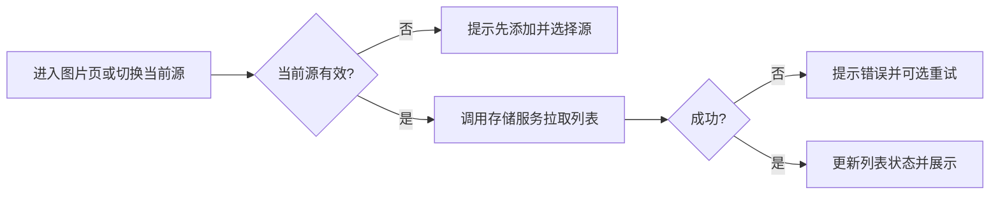
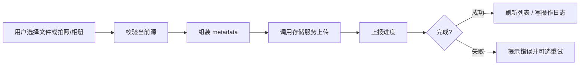
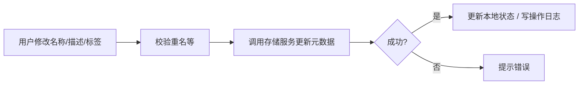
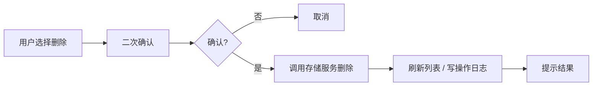

# 图片 CRUD - 业务设计

- **文档版本**：1.0
- **所属目录**：`.github/03-business-design`
- **相关 PRD**：[01-Product-Requirements-Document](../01-product/01-Product-Requirements-Document.md)
  第 4.2 节
- **相关系统设计**：[00-System-Design](../02-system-design/00-System-Design.md)

---

## 目录

- [一、业务目标与范围](#一业务目标与范围)
- [二、业务实体与数据模型](#二业务实体与数据模型)
- [三、业务规则](#三业务规则)
- [四、业务流程](#四业务流程)
- [五、与上下游衔接](#五与上下游衔接)
- [六、三端差异与一致性](#六三端差异与一致性)
- [七、附录](#七附录)

---

## 一、业务目标与范围

### 1.1 业务目标

**图片 CRUD**
为 Pixuli 在当前选中的存储源内提供图片的完整生命周期管理，使用户能够：

- **创建**：单张或批量上传图片，并附带元数据（名称、描述、标签等）；移动端支持相机拍摄与相册选择。
- **读取**：从当前源加载图片列表，以网格/列表形式展示，支持全屏预览、缩放、切换及单张元数据查看；支持下拉刷新同步。
- **更新**：编辑单张或批量编辑多张图片的元数据（描述、标签、名称等），支持重命名与冲突检测。
- **删除**：单张或批量删除图片，并带确认机制，避免误删。

所有操作均针对**当前选中的仓库源**（由
[仓库源管理](01-repository-source-management.md)
提供）；未选源或源不可用时，应引导用户先配置并选择源。

### 1.2 范围边界

| 在范围内                                                           | 不在范围内                                                                      |
| ------------------------------------------------------------------ | ------------------------------------------------------------------------------- |
| 图片的创建（上传）、读取（列表/预览/元数据）、更新（元数据）、删除 | 仓库源的新增/编辑/删除/切换（由仓库源管理负责）                                 |
| 当前源下的图片列表加载、分页或懒加载策略                           | 图片处理（压缩、格式转换、裁剪）的算法与契约（见 02-cross-image-process）       |
| 元数据的结构、校验、持久化（随图片存仓库或 Server）                | AI 分析/生成、搜索与筛选的详细规则（可另文档约定）                              |
| 上传进度、错误提示、操作日志记录                                   | 浏览模式（文件/幻灯片/时间线）的 UI 形态（PRD 4.3，本文档仅约定数据与接口依赖） |

### 1.3 术语

| 术语            | 说明                                                                                                                        |
| --------------- | --------------------------------------------------------------------------------------------------------------------------- |
| **当前源**      | 用户选中的、用于本次会话读写图片的仓库源（GitHub/Gitee 或 Pixuli Server）；来自仓库源管理的 `selectedSourceId`。            |
| **图片项**      | 一条可展示、可操作的图片记录，包含文件引用（如 path/url）、元数据（名称、描述、标签等）及可选基础信息（尺寸、格式、时间）。 |
| **元数据**      | 与图片关联的名称、描述、标签、尺寸、拍摄信息等；存于仓库内约定文件（如 JSON）或 Server 端数据库。                           |
| **仅仓库模式**  | 不启用 Pixuli Server，图片与元数据均存于 GitHub/Gitee 仓库。                                                                |
| **Server 模式** | 启用 Pixuli Server，图片文件存 Local/MinIO，元数据存 MySQL；客户端通过 REST API 读写。                                      |

---

## 二、业务实体与数据模型

### 2.1 图片项（ImageItem）

单条图片在业务侧的抽象，用于列表展示、预览与编辑。结构需兼容「仅仓库」与「Server 模式」。

| 字段           | 类型             | 必填 | 说明                                                                                  |
| -------------- | ---------------- | ---- | ------------------------------------------------------------------------------------- |
| `id`           | string           | 是   | 唯一标识；仓库模式下可为 path 或 path 的稳定派生；Server 模式下为服务端返回的 id。    |
| `name`         | string           | 是   | 展示用名称，可与文件名一致或为用户编辑后的名称。                                      |
| `path`         | string           | 是   | 在存储中的路径（仓库内相对 path 或 Server 存储路径），用于访问与删除。                |
| `url`          | string           | 否   | 可直接访问的图片 URL（仓库模式下可为 raw/cdn URL；Server 模式下为 API 或 CDN 地址）。 |
| `thumbnailUrl` | string           | 否   | 缩略图 URL，用于列表展示；可选，无则用 url。                                          |
| `description`  | string           | 否   | 描述文本。                                                                            |
| `tags`         | string[]         | 否   | 标签列表。                                                                            |
| `width`        | number           | 否   | 图片宽度（像素）。                                                                    |
| `height`       | number           | 否   | 图片高度（像素）。                                                                    |
| `size`         | number           | 否   | 文件大小（字节）。                                                                    |
| `mimeType`     | string           | 否   | MIME 类型（如 image/jpeg）。                                                          |
| `createdAt`    | number \| string | 否   | 创建时间（时间戳或 ISO 字符串）。                                                     |
| `updatedAt`    | number \| string | 否   | 最后更新时间。                                                                        |

- **仅仓库模式**：列表与元数据由 common 内存储服务通过 GitHub/Gitee
  API 获取；元数据可存于仓库内约定路径的 JSON 等文件中。
- **Server 模式**：列表与详情由 Pixuli Server 的 REST
  API 返回；字段命名可与上表对齐或做映射。

### 2.2 元数据（Metadata）子集

编辑与上传时涉及的元数据子集，至少包含：

| 字段          | 类型     | 说明                                   |
| ------------- | -------- | -------------------------------------- |
| `name`        | string   | 名称，必填；重命名时需校验与冲突检测。 |
| `description` | string   | 描述，可选。                           |
| `tags`        | string[] | 标签，可选。                           |

扩展字段（如拍摄时间、地理位置）可由产品与实现按需增加，本业务设计不排除。

### 2.3 上传入参（Create 输入）

| 字段            | 类型          | 说明                                                              |
| --------------- | ------------- | ----------------------------------------------------------------- |
| `file` / `blob` | File \| Blob  | 图片文件（Web/Desktop 多为 File；移动端可能为 blob 或本地 URI）。 |
| `metadata`      | Metadata 子集 | 名称、描述、标签等；名称可默认取自文件名。                        |

批量上传时为上述结构的数组；进度与错误以回调或事件形式上报。

### 2.4 列表与分页

- **列表**：`ImageItem[]`，按当前源加载；排序规则（时间、名称等）以产品与实现为准。
- **分页/懒加载**：若当前源支持分页或目录分批拉取，由 common 存储服务封装；业务层消费「当前页/追加列表」与「是否还有更多」即可。

---

## 三、业务规则

### 3.1 前置条件

- 所有图片 CRUD 操作要求**已选择当前源**（`selectedSourceId`
  非空且对应源存在）。
- 若未选源或当前源被删除，应提示用户先添加并选择仓库源，且不发起列表请求或上传。

### 3.2 创建（上传）

- **单张上传**：必填文件与名称（可默认文件名）；描述、标签可选。上传前可做格式/大小校验（以产品为准）。
- **批量上传**：多文件依次或并发上传（由实现与限流策略决定）；需展示整体或单张进度（进度条/百分比），并汇总成功与失败结果。
- **重名与冲突**：若当前源已存在同 path/同名文件，采用「覆盖」「重命名后上传」或「拒绝」由产品与实现约定；重命名时建议带序号或时间戳避免冲突。
- **移动端**：支持从相机拍摄与相册选择作为上传来源；其余规则与 Web/Desktop 一致。

### 3.3 读取（列表与预览）

- **列表加载**：进入图片页或切换当前源后，根据当前源加载图片列表；失败时提示并可选重试。
- **下拉刷新**：用户主动刷新时重新拉取列表并更新本地状态。
- **预览**：支持全屏预览、缩放、左右切换；数据来源为当前列表或按 id/path 请求单张详情（视实现而定）。
- **元数据展示**：单张详情可展示名称、描述、标签、尺寸、时间等；只读与可编辑区分以 UI 为准。

### 3.4 更新（元数据）

- **单张编辑**：可修改名称、描述、标签；名称修改时需做重名检测（同源下不重复），保存时更新
  `updatedAt`。
- **批量编辑**：对多张图片统一修改部分元数据（如批量加标签、改描述）；若涉及重命名，需保证同批内与现网不冲突。
- **持久化**：仅仓库模式下写入仓库内元数据文件（如 JSON）；Server 模式下调用更新 API。

### 3.5 删除

- **单张删除**：需二次确认（弹窗或等价交互）；确认后从当前源删除文件及关联元数据。
- **批量删除**：多选后执行删除，同样需确认；确认后批量调用删除接口，并汇总成功/失败。
- **不可恢复**：删除为物理删除（或按产品约定为软删除）；需在确认文案中说明后果。

### 3.6 操作日志

- 上传（单张/批量）、元数据更新、删除等关键操作，应写入**操作日志**（见 PRD
  4.4）；日志类型、摘要与 common 内 `OperationLogService`
  约定一致，便于三端与审计统一。

---

## 四、业务流程

### 4.1 进入图片列表 / 切换源后加载

### 4.2 单张 / 批量上传

### 4.3 编辑元数据（单张 / 批量）

### 4.4 删除（单张 / 批量）

---

## 五、与上下游衔接

### 5.1 上游（用户与 UI）

- **入口**：各端主界面「图片列表」、上传按钮、预览、编辑入口、删除入口；依赖「当前源」由仓库源管理提供。
- **展示**：列表（网格/列表）、预览（全屏、缩放、切换）、元数据面板；布局与交互形态见 PRD 与各端 UI 规范。

### 5.2 下游（存储与 common）

- **仓库源管理**：提供当前源 id 与对应配置（owner、repo、branch、path、token 等）；图片 CRUD 不维护源列表，仅读取当前源并调用存储服务。
- **存储服务**：common 内封装 GitHub/Gitee API 或 Pixuli Server REST API，提供：
  - 列表（含分页/懒加载）、
  - 单张详情、
  - 上传（单张/批量）、
  - 元数据更新、
  - 删除。
- **操作日志**：common 内 `OperationLogService`
  与存储适配器；图片 CRUD 在关键操作后写入日志（类型、摘要、时间等）。

### 5.3 与「仅仓库」和「Server 模式」的关系

| 模式        | 列表/详情/上传/更新/删除的承担方                                                                       |
| ----------- | ------------------------------------------------------------------------------------------------------ |
| 仅仓库      | common 内 GitHub/Gitee 存储服务，直接调平台 API；元数据存仓库内约定文件。                              |
| Server 模式 | common 内面向 Pixuli Server 的客户端，调用 `/api/images/*` 等 REST；文件与元数据由 Server 落盘与落库。 |

业务层（图片 CRUD）不区分具体存储实现，仅依赖 common 的**存储抽象**（如「当前源 + 统一接口」），由 common 根据当前源类型路由到仓库 API 或 Server
API。

---

## 六、三端差异与一致性

### 6.1 能力矩阵（与 PRD 4.2 对齐）

| 能力                          | Web       | Desktop   | Mobile      |
| ----------------------------- | --------- | --------- | ----------- |
| 单张/批量上传、进度展示       | ✅        | ✅        | ✅          |
| 相机/相册上传                 | —         | —         | ✅          |
| 列表、网格/列表展示、下拉刷新 | ✅        | ✅        | ✅          |
| 全屏预览、缩放、切换          | ✅        | ✅        | ✅          |
| 单张元数据查看与编辑          | ✅        | ✅        | ✅          |
| 批量元数据编辑                | ⏳ 待实现 | ⏳ 待实现 | ⏳ 高优先级 |
| 单张/批量删除与确认           | ✅        | ✅        | ✅          |
| 元数据缓存（优化加载/离线）   | —         | —         | ✅ 已实现   |

### 6.2 一致性要求

- **业务规则一致**：前置条件（当前源有效）、创建/读取/更新/删除的规则、操作日志写入，三端一致。
- **数据模型一致**：ImageItem、元数据子集、上传入参等由 common 统一类型定义，三端共用。
- **存储接口一致**：列表、详情、上传、更新、删除均由 common 存储服务抽象，三端调用同一套接口（平台仅区分 localStorage/AsyncStorage 等非存储后端差异）。

### 6.3 平台差异（实现层）

- **文件选择**：Web/Desktop 用文件选择器；Mobile 用相机与相册 API（expo-image-picker 等）。
- **预览与手势**：移动端可增加手势（长按菜单、滑动删除等），与 PRD 移动端需求对齐；CRUD 语义与接口不变。
- **缓存与离线**：移动端元数据缓存、离线浏览策略在实现层完成，不改变「当前源 + 存储服务」的契约。

---

## 七、附录

### 7.1 与 PRD 需求 ID 对应

| PRD 需求 ID | 说明                           |
| ----------- | ------------------------------ |
| F-CRUD-C01  | 单张图片上传并带元数据         |
| F-CRUD-C02  | 批量图片上传并显示进度         |
| F-CRUD-C03  | 移动端：相机拍摄与相册选择上传 |
| F-CRUD-R01  | 从当前源加载图片列表           |
| F-CRUD-R02  | 网格/列表形式展示              |
| F-CRUD-R03  | 全屏预览、缩放、左右切换       |
| F-CRUD-R04  | 查看单张图片元数据             |
| F-CRUD-R05  | 下拉刷新同步列表               |
| F-CRUD-R06  | 移动端：元数据缓存             |
| F-CRUD-U01  | 编辑图片元数据，支持重命名检测 |
| F-CRUD-U02  | 批量编辑元数据（待实现）       |
| F-CRUD-D01  | 单张删除并确认                 |
| F-CRUD-D02  | 批量选择与批量删除             |

### 7.2 实现参考（代码位置，仅供参考）

| 内容                                            | 位置                                                             |
| ----------------------------------------------- | ---------------------------------------------------------------- |
| 图片列表、上传、预览、编辑、删除（Web/Desktop） | `apps/pixuli` 内页面与组件；与 common 存储服务、sourceStore 配合 |
| 图片列表、上传、预览、编辑、删除（Mobile）      | `apps/mobile` 内对应页面与组件                                   |
| 存储服务抽象与 GitHub/Gitee 实现                | `packages/common` 内存储相关服务                                 |
| 操作日志类型与服务                              | `packages/common` 内 `OperationLogService`、类型与存储适配器     |
| 图片项与元数据类型                              | `packages/common` 内类型定义                                     |

### 7.3 相关文档

- [01-Product-Requirements-Document 4.2 图片 CRUD](../01-product/01-Product-Requirements-Document.md)
- [01-repository-source-management 仓库源管理](01-repository-source-management.md)
- [00-System-Design 数据流与存储、模块与职责](../02-system-design/00-System-Design.md)
- [02-cross-image-process 跨端图片处理](../02-system-design/02-cross-image-process.md)（处理契约，与 CRUD 存储配合）
