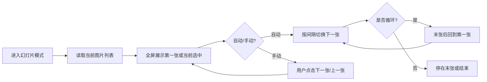

# 浏览模式 - 业务设计

- **文档版本**：1.0
- **所属目录**：`docs/03-business-design`
- **相关 PRD**：[01-Product-Requirements-Document](../01-product/01-Product-Requirements-Document.md)
  第 4.3 节
- **相关系统设计**：[00-System-Design](../02-system-design/00-System-Design.md)

---

## 目录

- [一、业务目标与范围](#一业务目标与范围)
- [二、业务实体与数据模型](#二业务实体与数据模型)
- [三、业务规则](#三业务规则)
- [四、业务流程](#四业务流程)
- [五、与上下游衔接](#五与上下游衔接)
- [六、三端差异与一致性](#六三端差异与一致性)
- [七、附录](#七附录)

---

## 一、业务目标与范围

### 1.1 业务目标

**浏览模式**为 Pixuli 对**同一套图片数据**提供多种展示与浏览方式，使用户能够：

- **文件模式**：以网格或列表形式浏览当前源图片，支持点击预览、全屏查看与左右切换。
- **幻灯片模式**：以自动或手动方式连续播放图片，支持过渡动画、循环与播放控制。
- **时间线模式**：按时间（如创建/更新日期）分组展示图片，便于按时间维度浏览。

各模式共用**当前源的图片列表**（由 [图片 CRUD](02-image-crud.md)
提供）；切换模式仅改变展示形态与交互，不改变数据源。

### 1.2 范围边界

| 在范围内                                    | 不在范围内                                           |
| ------------------------------------------- | ---------------------------------------------------- |
| 三种模式的切换入口、路由/视图与状态         | 图片列表的加载、上传、编辑、删除（由图片 CRUD 负责） |
| 文件模式的网格/列表布局、点击预览与图片切换 | 当前源的配置与切换（由仓库源管理负责）               |
| 幻灯片模式的播放控制、过渡、循环            | 图片处理（压缩、转换等）的算法与契约                 |
| 时间线模式的分组维度（时间）与展示顺序      | 搜索、筛选、标签等检索逻辑（可另文档约定）           |
| Web/Desktop 三模式、移动端幻灯片能力与入口  | 具体 UI 组件与动效实现细节（属前端实现）             |

### 1.3 术语

| 术语           | 说明                                                               |
| -------------- | ------------------------------------------------------------------ |
| **文件模式**   | 网格或列表展示当前源图片，支持点击进入预览、左右切换查看。         |
| **幻灯片模式** | 全屏连续展示图片，可自动/手动切换，带过渡动画与循环选项。          |
| **时间线模式** | 按时间（日/月等）分组，组内展示图片，便于按时间浏览。              |
| **当前模式**   | 用户当前选中的浏览模式（文件 / 幻灯片 / 时间线）；切换后立即生效。 |

---

## 二、业务实体与数据模型

### 2.1 模式枚举

| 值          | 说明                  | 平台                 |
| ----------- | --------------------- | -------------------- |
| `file`      | 文件模式（网格/列表） | Web、Desktop         |
| `slideshow` | 幻灯片模式            | Web、Desktop、Mobile |
| `timeline`  | 时间线模式            | Web、Desktop         |

- 移动端当前以幻灯片为主；是否提供文件/时间线由产品与实现约定。

### 2.2 数据依赖

- **图片列表**：来自图片 CRUD 的当前源列表（`ImageItem[]`），含
  `id`、`name`、`path`、`url`、`thumbnailUrl`、`createdAt`、`updatedAt` 等。
- **时间线分组**：以 `createdAt` 或 `updatedAt`
  为分组依据，按日/周/月等粒度聚合；分组键与排序规则由实现约定。
- 浏览模式**不持久化图片数据**，仅消费列表与可选「当前模式」的本地偏好（如记住上次选择的模式）。

### 2.3 当前模式状态（可选持久化）

| 字段                | 类型                                  | 说明                                                                                  |
| ------------------- | ------------------------------------- | ------------------------------------------------------------------------------------- |
| `currentBrowseMode` | `'file' \| 'slideshow' \| 'timeline'` | 当前选中的浏览模式；可存于前端 state 或 localStorage/AsyncStorage，用于恢复上次选择。 |

---

## 三、业务规则

### 3.1 前置条件

- 浏览模式依赖**已加载的图片列表**；若未选当前源或列表为空，各模式仍可进入，但展示空状态或引导用户先配置源/等待加载。
- 模式切换**不触发重新拉取列表**，仅切换展示视图与交互。

### 3.2 模式切换

- **同一时刻**仅一种浏览模式生效；用户在侧边栏（或等价入口）选择模式后，立即跳转至对应页面/视图。
- Web/Desktop：侧边栏菜单切换三种模式并跳转对应页面（F-BROWSE-04）；移动端：以幻灯片为主，入口可为图库进入后切换或独立入口（以产品为准）。

### 3.3 文件模式

- 以**网格**或**列表**展示图片（布局可配置）；支持点击单张进入**全屏预览**，预览内支持缩放、左右切换至上一张/下一张。
- 数据源为当前列表；顺序与图片 CRUD 列表一致（如按时间倒序）。

### 3.4 幻灯片模式

- **播放方式**：自动轮播（可配置间隔）或手动切换；支持**循环**（播完最后一张回到第一张）。
- **过渡**：切换时可有过渡动画（淡入淡出、滑动等），由实现决定。
- **控件**：播放/暂停、上一张/下一张、进度或序号展示等；Web/Desktop 与移动端均需支持基本控件（F-BROWSE-02、F-BROWSE-05）。
- 数据源为当前列表或当前列表的子集（如从某张开始）；不修改列表数据。

### 3.5 时间线模式

- 按**时间**分组（如按日、按周或按月）；组内图片按时间或名称排序展示。
- 分组依据字段：`createdAt` 或
  `updatedAt`（以产品与实现为准）；无时间字段的项可归入「未分类」或按 path 排序。

---

## 四、业务流程

### 4.1 模式切换

### 4.2 文件模式：进入与预览

### 4.3 幻灯片模式：播放

### 4.4 时间线模式：分组展示

---

## 五、与上下游衔接

### 5.1 上游（用户与 UI）

- **入口**：Web/Desktop 侧边栏菜单切换三种模式并跳转对应页面；移动端为幻灯片入口（及可选文件/时间线）。
- **展示**：文件模式（网格/列表 + 预览）、幻灯片（全屏 + 控件）、时间线（分组 + 组内列表）；具体布局与动效由各端 UI 实现。

### 5.2 下游（数据与业务）

- **图片 CRUD**：提供当前源的图片列表（`ImageItem[]`）及刷新能力；浏览模式只读消费该列表，不执行上传、编辑、删除。列表为空或未选源时，各模式展示空状态或引导文案。
- **仓库源管理**：当前源由仓库源管理提供；切换源后图片列表会刷新，浏览模式自动基于新列表展示。

### 5.3 与操作日志

- 浏览模式切换、幻灯片播放/暂停等为**纯展示行为**，一般不写入操作日志；若产品需要统计「模式使用频率」等，可单独约定日志类型与上报策略。

---

## 六、三端差异与一致性

### 6.1 模式覆盖

| 端            | 文件模式                 | 幻灯片模式                     | 时间线模式    |
| ------------- | ------------------------ | ------------------------------ | ------------- |
| Web / Desktop | ✅ 网格/列表、预览、切换 | ✅ 自动/手动、过渡、循环、控件 | ✅ 按时间分组 |
| Mobile        | 以产品为准               | ✅ 自动/手动、过渡、循环与控件 | 以产品为准    |

### 6.2 一致性要求

- **数据源一致**：三端均使用同一套「当前源 + 图片列表」数据；模式仅改变展示形态。
- **幻灯片能力**：Web/Desktop 与 Mobile 均需支持基本播放控制（播放/暂停、上一张/下一张、循环）；交互与动效可依平台规范差异化。

### 6.3 状态持久化（可选）

- **当前模式**：可将 `currentBrowseMode`
  存于 localStorage（Web/Desktop）或 AsyncStorage（Mobile），下次进入时恢复上次选择；非必选。

---

## 七、附录

### 7.1 实现参考（仅供参考）

| 内容                 | 位置                                                |
| -------------------- | --------------------------------------------------- |
| 模式切换、路由与视图 | apps/pixuli 侧边栏、路由与各模式页面组件            |
| 幻灯片逻辑与控件     | 各端幻灯片组件与状态（播放状态、当前索引、循环等）  |
| 时间线分组与展示     | 时间线页面组件，基于列表的 createdAt/updatedAt 分组 |

### 7.2 相关文档

- [PRD 4.3 浏览模式](../01-product/01-Product-Requirements-Document.md)
- [图片 CRUD 业务设计](02-image-crud.md)（列表与预览数据来源）
- [仓库源管理业务设计](01-repository-source-management.md)（当前源来源）
