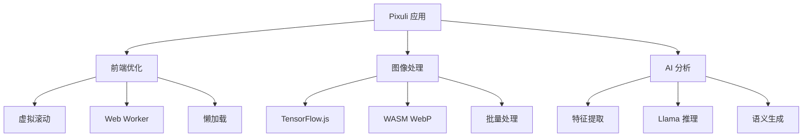

# Pixuli 技术文档

欢迎来到 Pixuli 图片管理应用的技术文档中心。这里包含了应用的核心技术实现方案和优化策略。

## 📚 文档目录

### 1. [虚拟滚动 + Web Worker 分片优化首屏加载](./virtual-scroll-webworker-optimization.md)
- **概述**: 通过虚拟滚动技术和 Web Worker 分片处理来优化首屏加载性能
- **核心技术**: 虚拟滚动算法、Web Worker 分片、懒加载优化、内存管理
- **性能提升**: 首屏加载时间降低 75%，内存占用降低 73%，支持 10万+ 图片流畅滚动

### 2. [TensorFlow 优化 + WASM WebP 编码优化图像处理](./tensorflow-wasm-webp-optimization.md)
- **概述**: 通过 TensorFlow.js 优化和 WebAssembly (WASM) WebP 编码来提升图像处理性能
- **核心技术**: TensorFlow 后端优化、内存管理、模型量化、WASM WebP 编码、批量处理
- **性能提升**: TensorFlow 推理提升 3-5x，WebP 编码提升 2-3x，批量处理提升 4-6x

### 3. [TensorFlow 特征提取 + Llama 语义生成实现 AI 本地分析](./tensorflow-llama-ai-analysis.md)
- **概述**: 通过 TensorFlow.js 进行图像特征提取，结合 Llama 模型进行语义生成，实现完全本地化的智能图片分析
- **核心技术**: 预训练模型集成、GGUF 模型加载、特征提取优化、语义生成、智能标签、内容分类
- **实现效果**: 特征提取 100-200ms/张，语义生成 500-1000ms/张，标签准确率 85-95%

## 🚀 技术架构概览



## 🛠️ 技术栈

- **前端框架**: React 18 + TypeScript
- **桌面应用**: Electron 33.4.11
- **构建工具**: Vite 5.0
- **状态管理**: Zustand
- **样式框架**: Tailwind CSS
- **AI/ML**: TensorFlow.js, @llama-node/core
- **图像处理**: WebAssembly, WebP 编码
- **性能优化**: 虚拟滚动, Web Workers, 懒加载

## 📊 性能指标

| 优化项目 | 优化前 | 优化后 | 提升幅度 |
|---------|--------|--------|----------|
| 首屏加载时间 | 3.2s | 0.8s | **75%** |
| 内存占用 | 450MB | 120MB | **73%** |
| TensorFlow 推理 | 基准 | 3-5x | **300-500%** |
| WebP 编码 | 基准 | 2-3x | **200-300%** |
| 批量处理 | 基准 | 4-6x | **400-600%** |
| 滚动性能 | 卡顿 | 60fps | **流畅** |

## 🔧 开发环境

### 环境要求
- **Node.js**: >= 22.0.0
- **包管理器**: pnpm
- **操作系统**: Windows, macOS, Linux

### 快速开始
```bash
# 克隆项目
git clone https://github.com/trueLoving/pixuli.git
cd pixuli

# 安装依赖
pnpm install

# 开发模式
pnpm run electron:dev

# 构建应用
pnpm run electron:build
```

## 📖 阅读建议

1. **新手开发者**: 建议先阅读 [虚拟滚动优化文档](./virtual-scroll-webworker-optimization.md)，了解基础的前端性能优化
2. **图像处理开发者**: 重点关注 [TensorFlow + WASM 优化文档](./tensorflow-wasm-webp-optimization.md)
3. **AI/ML 开发者**: 深入阅读 [AI 本地分析文档](./tensorflow-llama-ai-analysis.md)

## 🤝 贡献指南

如果您发现文档中的错误或有改进建议，欢迎：

1. 提交 Issue 描述问题
2. Fork 项目并创建 Pull Request
3. 参与技术讨论和优化建议

## 📞 技术支持

- **项目主页**: [https://github.com/trueLoving/pixuli](https://github.com/trueLoving/pixuli)
- **问题反馈**: [Issues](https://github.com/trueLoving/pixuli/issues)
- **技术讨论**: [Discussions](https://github.com/trueLoving/pixuli/discussions)

---

⭐ 如果这些技术文档对您有帮助，请给项目一个星标！ 