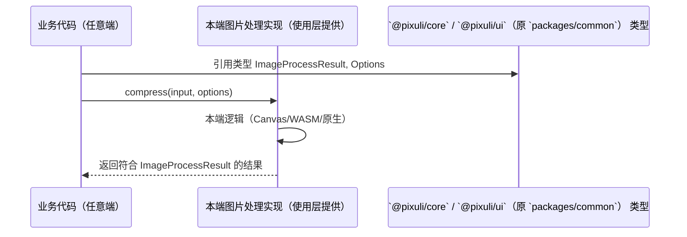
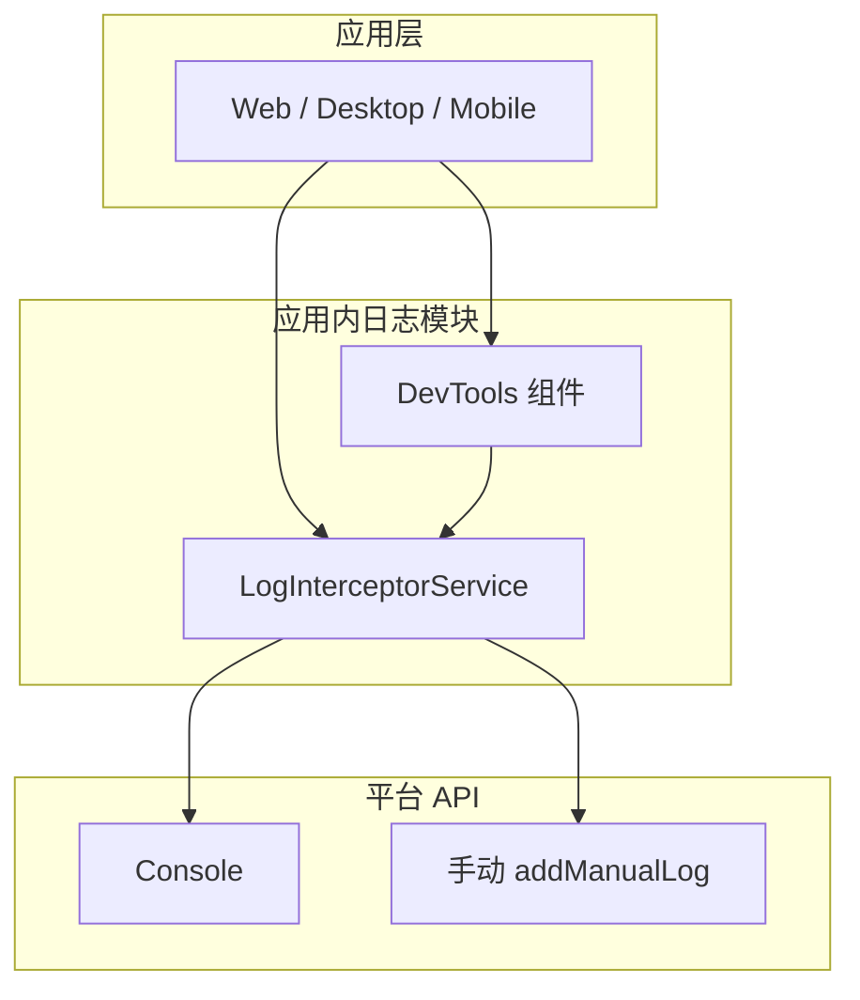

# 三端能力共享设计

> **文档状态**：📦 **已归档（只读快照）** · 2026-06-17  
> **归档原因**：M2/M3 RN 共享层与 `./native`
> 设计已过时；Capacitor 三端已落地（REF-509～516）。  
> **当前请读**：[06-apps-pixuli-engineering.md](../../02-system-design/06-apps-pixuli-engineering.md) ·
> [01-system-design.md](../../02-system-design/01-system-design.md) · 索引
> [README.md](./README.md)

> **现状（2026-06）**：Mobile 由 `apps/pixuli` + Capacitor 交付；RN 在
> `archive/apps/mobile`。`./native`
> 已 deprecated。下文部分段落保留 M2/M3 迁移**历史**。

本文描述 Pixuli **Web、Desktop、Mobile**
三端在资源共享、图片处理契约、日志收集上的统一设计，与
[01-system-design](../../02-system-design/01-system-design.md)、[02-three-platform-design](./02-three-platform-design.md)、[03-plugin-system](../../02-system-design/03-plugin-system.md)
配合使用。

## 目录

- [第一部分 跨端资源共享](#第一部分-跨端资源共享)
- [第二部分 跨端图片处理](#第二部分-跨端图片处理)
- [第三部分 跨端日志](#第三部分-跨端日志)

---

# 第一部分 跨端资源共享

## 一、方案概述

### 1.1 目标

本文档描述 Pixuli 跨端（Web、Desktop、Mobile）资源共享设计。当前实现基于
`@pixuli/core` + `@pixuli/ui` + `@pixuli/provider-*`（原 `packages/common`
已迁移），用于：

- **代码复用**：最大化三端代码复用率，减少重复开发。
- **一致性**：保证三端功能与体验一致。
- **可维护性**：统一资源库，便于维护与更新。
- **类型安全**：通过完整 TypeScript 类型定义，确保跨端类型一致。

### 1.2 设计原则

- **分层设计**：业务逻辑层、适配层、平台层分离。
- **平台适配**：通过适配层与平台特定实现处理平台差异。
- **渐进增强**：基础功能通用，高级功能可按平台特定实现。
- **类型优先**：使用 TypeScript 确保类型安全。
- **纯函数原则**：组件实现为纯函数，通过 Props 获取外部数据，通过回调与外部通信。

### 1.3 范围

- 适用端：Web（Vite +
  React）、Desktop（Electron + 同一套 Web 代码）、Mobile（React Native +
  Expo）。
- 共享范围：组件、Hooks、工具函数、服务、类型定义、国际化语言包。
- 与
  [01-system-design](../../02-system-design/01-system-design.md)、[第二部分 跨端图片处理](#第二部分-跨端图片处理)、[03-plugin-system](../../02-system-design/03-plugin-system.md)
  等设计文档配合使用。

---

## 二、专业术语

### 2.1 架构与平台术语

| 术语           | 英文                  | 说明                                                                          |
| -------------- | --------------------- | ----------------------------------------------------------------------------- |
| **资源共享层** | Shared Resource Layer | `packages/common` 内组件、Hooks、工具、服务、类型、语言包等可被多端引用的代码 |
| **平台导出层** | Export Layer          | 通过不同入口文件（如 `index.ts` / `index.native.ts`）向各平台导出对应实现     |
| **平台层**     | Platform Layer        | 实际运行环境：Desktop（Electron）、Web（Browser）、Mobile（React Native）     |
| **平台适配器** | Platform Adapter      | 抽象平台差异的接口与实现，如 `PlatformAdapter`，供服务层注入使用              |

### 2.2 组件与实现术语

| 术语                | 英文                    | 说明                                                                                        |
| ------------------- | ----------------------- | ------------------------------------------------------------------------------------------- |
| **Web 版本组件**    | Web Component           | 使用 HTML 元素（`<div>`, `<button>` 等）与 DOM API 的实现，供 Web/Desktop 使用              |
| **Native 版本组件** | Native Component        | 使用 React Native 组件（`<View>`, `<TouchableOpacity>` 等）与 RN API 的实现，供 Mobile 使用 |
| **共享代码**        | Shared Code             | 平台无关的类型、工具函数、Hooks，通常放在组件或模块下的 `common/` 目录                      |
| **纯函数组件**      | Pure Function Component | 不依赖外部可变状态，通过 Props 入参与回调出参与外部通信的组件                               |

---

## 三、整体架构

### 3.1 平台运行环境区分

Pixuli 三端运行环境可简化为两类：

| 类型                | 包含端                    | 共同特征                                                             |
| ------------------- | ------------------------- | -------------------------------------------------------------------- |
| **Web 端运行环境**  | PC 端（Electron）、Web 端 | 使用 HTML 元素与 DOM API；PC 端基于 Electron，本质为浏览器环境       |
| **React Native 端** | 移动端                    | 使用 RN 组件（`<View>`, `<TouchableOpacity>` 等）与 React Native API |

### 3.2 三层架构模型

跨端资源共享采用三层架构，通过 Monorepo 与 `packages/common` 实现：

```mermaid
graph TB
    subgraph 资源共享层
        C[`@pixuli/core` / `@pixuli/ui`（原 `packages/common`）]
        C1[组件 Components]
        C2[Hooks]
        C3[工具 Utils]
        C4[服务 Services]
        C5[类型 Types]
        C6[语言包 Locales]
        C --> C1 & C2 & C3 & C4 & C5 & C6
    end

    subgraph 平台导出层
        E1[index.ts<br/>Web/Desktop]
        E2[index.native.ts<br/>Mobile]
    end

    subgraph 平台层
        P1[Desktop Electron]
        P2[Web Browser]
        P3[Mobile RN/Expo]
    end

    C1 & C2 & C3 & C4 & C5 & C6 --> E1
    C1 & C2 & C3 & C4 & C5 & C6 --> E2
    E1 --> P1 & P2
    E2 --> P3
```

### 3.3 目录结构

| 路径                  | 说明                                                                                |
| --------------------- | ----------------------------------------------------------------------------------- |
| `src/index.ts`        | Web/Desktop 平台入口，导出 Web 版本组件与共享能力                                   |
| `src/index.native.ts` | React Native 平台入口，由 Metro 解析，导出 Native 版本                              |
| `src/components/`     | 组件目录；平台特定组件含 `common/`、`web/`、`native/` 或 `.web.tsx` / `.native.tsx` |
| `src/hooks/`          | 共享或平台相关 Hooks                                                                |
| `src/utils/`          | 纯函数工具与平台适配工具                                                            |
| `src/services/`       | 存储服务、平台适配器接口与实现                                                      |
| `src/types/`          | 共享类型与平台相关类型                                                              |
| `src/locales/`        | 国际化 JSON 与加载逻辑                                                              |

```
`@pixuli/core` / `@pixuli/ui`（原 `packages/common`）/
├── src/
│   ├── index.ts
│   ├── index.native.ts
│   ├── components/
│   ├── hooks/
│   ├── utils/
│   ├── services/
│   ├── types/
│   └── locales/
└── package.json
```

---

## 四、资源共享策略

### 4.1 组件

#### 4.1.1 平台区分与实现原则

- **Web 端组件**：使用 HTML 元素与 DOM API。
- **React Native 端组件**：使用 RN 组件与 RN API。
- **纯函数原则**：组件通过 Props 获取数据，通过回调与外部通信；仅保留必要 UI 状态。

#### 4.1.2 组件分类

| 类型             | 说明                     | 实现方式                                                        |
| ---------------- | ------------------------ | --------------------------------------------------------------- |
| **完全共享逻辑** | 平台无关逻辑             | 抽到 `common/`：types、utils、hooks                             |
| **平台特定 UI**  | 因元素/API 不同需两套 UI | `.web.tsx` 与 `.native.tsx`，或 `web/` / `native/` 目录分别实现 |
| **导出**         | 各端使用各自入口         | `index.ts` 导出 Web 版，`index.native.ts` 导出 Native 版        |

#### 4.1.3 推荐目录结构（平台特定组件）

```
components/my-component/
├── common/
│   ├── types.ts
│   ├── utils.ts
│   └── hooks.ts
├── web/
│   └── MyComponent.web.tsx
└── native/
    └── MyComponent.native.tsx
```

### 4.2 工具函数

- **完全共享**：纯逻辑、不依赖平台 API（如 `filterUtils`、`sortUtils`）。
- **平台适配**：需文件、存储等平台能力时，通过参数注入平台适配器或平台特定实现。

### 4.3 服务层

- **平台适配器模式**：通过 `PlatformAdapter` 接口统一文件、存储、网络等差异。
- **依赖注入**：业务服务（如
  `GitHubStorageService`、`GiteeStorageService`）在构造函数中注入适配器。
- **统一接口**：对应用层暴露统一业务接口，隐藏平台差异。

### 4.4 Hooks

- **共享 Hooks**：纯逻辑、不依赖平台 API（如 `useInfiniteScroll`）。
- **平台相关 Hooks**：需平台 API 时提供平台特定实现或通过适配器调用（如
  `useKeyboard` 在 RN 端需特殊处理）。

### 4.5 类型定义

- **共享类型**：平台无关的接口与类型。
- **平台相关类型**：通过联合类型或条件类型区分（如 `File | string` 表示 Web
  File 与 Mobile URI）。

### 4.6 语言包

- **统一格式**：JSON；三端共用同一套 key 与文件。
- **动态加载**：支持运行时切换语言。

---

## 五、平台适配方案

### 5.1 平台特定导出

| 入口文件          | 使用端       | 说明                               |
| ----------------- | ------------ | ---------------------------------- |
| `index.ts`        | Web、Desktop | Vite/构建默认解析                  |
| `index.native.ts` | Mobile       | Metro bundler 按 `.native.ts` 解析 |

### 5.2 平台适配器

- **接口**：`PlatformAdapter` 定义文件大小、MIME 类型、图片尺寸等能力的抽象。
- **实现**：各端提供默认或自定义实现，在创建存储服务等时注入。
- **使用**：服务类通过构造函数接收适配器，内部统一调用接口方法。

### 5.3 平台差异对照（概要）

| 能力          | Web/Desktop                     | Mobile                     |
| ------------- | ------------------------------- | -------------------------- |
| 文件/图片输入 | `File`、DOM API                 | URI、`expo-file-system` 等 |
| 持久化配置    | `localStorage` / Electron store | `AsyncStorage`             |
| 网络          | `fetch` / Node `http`           | `fetch`                    |
| UI 与样式     | HTML + CSS                      | RN 组件 + `StyleSheet`     |
| 事件          | DOM 事件                        | RN 事件（`onPress` 等）    |

---

## 六、实现策略与最佳实践

### 6.1 组件实现

- **Props 设计**：数据 Props、回调 Props、配置 Props、必要时平台特定 Props。
- **共享代码提取**：类型、工具、Hooks 放入
  `common/`，避免在 web/native 中重复实现。
- **平台检测**：通过不同入口与构建配置区分平台，而非依赖运行时 UA 等检测。

### 6.2 代码组织

- 平台无关逻辑集中在 `common/`。
- 平台特定实现放在 `web/`、`native/` 或 `.web.tsx` / `.native.tsx`。
- 公共 API 在 `index.ts` / `index.native.ts` 中统一导出。

### 6.3 UI/UX 适配

- **Web/Desktop**：CSS 或 CSS-in-JS；键盘快捷键、DOM 事件。
- **React Native**：`StyleSheet.create`、主题与 `colorScheme`；触摸与 RN 事件。

---

## 七、注意事项

### 7.1 平台差异处理

- **API 差异**：文件系统、持久化、网络在各端实现方式不同，统一通过适配器或平台分支封装。
- **UI 差异**：组件库与样式系统不同，需分别实现 Web 与 Native 两套 UI，共享逻辑与数据层。

### 7.2 构建与依赖

- **Web/Desktop**：以 `index.ts` 为入口。
- **React Native**：Metro 配置使用 `index.native.ts`。
- **平台特定依赖**：通过 `peerDependencies` 或 `optionalDependencies`
  声明，避免在不需要的端打包。

### 7.3 测试

- 对 `common/` 下共享逻辑做单元测试。
- 对 Web 与 Native 组件分别做渲染/集成测试。

---

## 八、附录

### 8.1 代码复用统计（参考）

| 类别     | 共享比例（约）                 |
| -------- | ------------------------------ |
| 组件     | 60–70%（通过 common 与双实现） |
| 工具函数 | 约 90%                         |
| 服务层   | 约 80%（平台适配器封装差异）   |
| Hooks    | 约 70%                         |
| 类型定义 | 约 95%                         |
| 语言包   | 100%                           |

总体约 **75–80%** 代码在三端共享，其余为平台特定实现。

### 8.2 开发指南摘要

1. **新建平台特定组件**：创建目录 → 在 `common/` 定义类型与共享逻辑 → 在
   `web/`、`native/` 实现 UI → 在对应 index 中导出。
2. **新建平台适配器**：实现 `PlatformAdapter` 接口，在服务构造时注入。
3. **保持纯函数**：组件通过 Props 与回调通信，避免隐式依赖全局状态。

### 8.3 相关文档

- [01-system-design - 整体系统设计](../../02-system-design/01-system-design.md)
- [第二部分 跨端图片处理](#第二部分-跨端图片处理)
- [02-performance](../../02-system-design/02-performance.md)

---

# 第二部分 跨端图片处理

## 一、方案定位与原则

### 1.1 目标

本方案约定 Pixuli **三端（Web、Desktop、Mobile）**
的图片处理在**数据格式与调用契约上统一**，但**具体处理逻辑由各端自行实现**：

- **@pixuli/core /
  @pixuli/ui**：定义**数据格式与契约**（类型、接口）；**不包含**各端具体算法实现。
- **使用层（各端应用）**：`apps/pixuli` 经 `@pixuli/ui`
  的 Canvas 实现；`apps/mobile`
  经 expo-image-manipulator 等原生实现；入参出参对齐共享类型。

### 1.2 设计原则

- **common 不关心平台**：common 层不依赖、不实现任何具体平台的图片处理能力，只定义「入参是什么、出参是什么、方法长什么样」。
- **使用层提供实现**：各端在各自工程内实现图片处理逻辑，并保证满足 common 规定的接口与返回值类型（如
  `ImageProcessResult`）。
- **类型与契约在 common 维护**：所有三端共用的类型（Options、Result）、以及「处理器」的接口形状（如
  `compress(input, options): Promise<ImageProcessResult>`）仅在 common 定义与演进，保证三端数据格式统一。

---

## 二、common 的职责：只做数据格式与契约

### 2.1 只做两件事

| 职责                     | 说明                                                                                                                                                                                                                                                       |
| ------------------------ | ---------------------------------------------------------------------------------------------------------------------------------------------------------------------------------------------------------------------------------------------------------- |
| **数据格式的统一与维护** | 在 `@pixuli/core` / `@pixuli/ui`（原 `packages/common`） 中定义并导出所有图片处理相关的**类型**：如 `ImageProcessResult`、`ImageCompressionOptions`、`ImageConversionOptions`、`OutputMimeType` 等。三端均从 common 引用这些类型，保证入参、出参结构一致。 |
| **方法契约的定义**       | 在 common 中定义**处理器接口**（如 `IImageProcessor`）：规定 `compress`、`convert` 等方法的**方法名、参数类型、返回值类型**。不包含任何实现；具体实现由使用层提供。                                                                                        |

### 2.2 common 不做什么

- **不实现**压缩、转换、裁剪等具体算法或调用（不调用 Canvas、WASM、expo-image-manipulator）。
- **不选择**运行在哪个平台、用哪种技术；不包含「Web 适配器」「Native 适配器」等平台分支逻辑。
- **不依赖**各端运行环境（不依赖 DOM、Node、React
  Native 等），仅提供纯类型与接口定义，以便各端引用。

---

## 三、使用层的职责：提供符合契约的实现

### 3.1 使用层需要提供什么

各端应用（apps/pixuli、apps/mobile 等）需要**自己实现**图片处理逻辑，并对外暴露符合 common 契约的**图片处理工具**：

- **方法签名**：与 common 定义的接口一致（例如
  `compress(input, options): Promise<ImageProcessResult>`）。
- **返回值**：必须符合 common 定义的
  `ImageProcessResult`（或契约规定的其他类型），便于上游业务统一处理（展示、上传、统计等）。

### 3.2 各端可采用的实现方式

| 端            | 实现方式（由使用层自行选择） | 说明                                                                                                                    |
| ------------- | ---------------------------- | ----------------------------------------------------------------------------------------------------------------------- |
| Web / Desktop | Canvas API、或 packages/wasm | 在 apps/pixuli（或对应工程）内实现，接收 `File` 等，返回 `ImageProcessResult`。                                         |
| Mobile        | expo-image-manipulator 等    | 在 apps/mobile 内实现，接收 URI 等，返回与 common 约定一致的 `ImageProcessResult`（如 uri、尺寸、大小、压缩率等字段）。 |

- common 不关心各端内部用 Canvas 还是 WASM 还是原生；只要**入参、出参符合 common 的契约**即可。

### 3.3 使用方式（建议）

- 各端在应用入口或模块内**注册/注入**本端的图片处理实现（例如通过 Context、DI 或单例），业务代码统一调用「当前端的处理器」，而不写
  `if (web) ... else if (mobile) ...`。
- 业务层只依赖 **common 的类型**（从 common 导入
  `ImageProcessResult`、Options 等），以及**本端提供的、符合契约的处理器实例**（从本端模块或 Context 获取）。

---

## 四、架构设计

### 4.1 整体架构（common 仅契约与类型，实现在使用层）

```mermaid
graph TB
    subgraph 使用层
        A1[apps/pixuli]
        A2[apps/mobile]
    end

    subgraph 使用层提供的实现
        B1[Web 图片处理实现<br/>Canvas / WASM]
        B2[Mobile 图片处理实现<br/>expo-image-manipulator]
    end

    subgraph `@pixuli/core` / `@pixuli/ui`（原 `packages/common`） 仅契约与类型
        C[类型与接口定义<br/>ImageProcessResult / IImageProcessor 等]
    end

    A1 --> B1
    A2 --> B2
    B1 -.符合契约.-> C
    B2 -.符合契约.-> C
    A1 --> C
    A2 --> C
```

- **common**：只提供 C（类型 + 接口契约）；不包含 B1/B2。
- **使用层**：A1/A2 引用 common 的类型；B1/B2 由各端实现并满足 C 的契约。

### 4.2 调用关系



- 业务代码依赖 common 的**类型**，调用**本端提供的**处理器实现；common 不参与具体调用链。

---

## 五、契约定义（方法签名与数据类型）

### 5.1 统一类型（common 定义并维护）

以下类型在 **`@pixuli/core` / `@pixuli/ui`（原 `packages/common`）**
中定义，三端共用：

- **ImageProcessResult**：统一结果结构
  - `uri`、`blob`/`file`（可选）、`originalSize`、`processedSize`、`compressionRatio`、`width`、`height`、`originalWidth`、`originalHeight`、`mimeType`
    等。
- **ImageCompressionOptions**：压缩选项（quality、maxWidth、maxHeight、outputFormat、minSizeToCompress 等）。
- **ImageConversionOptions**：转换选项（quality、maxWidth、maxHeight、maintainAspectRatio 等）。
- **OutputMimeType**：支持的输出 MIME（如
  `'image/jpeg' | 'image/png' | 'image/webp'`）。

### 5.2 处理器接口（common 定义，使用层实现）

common 中可定义**接口**（无实现），规定使用层必须提供的方法形状，例如：

| 方法                               | 约定                                                                                                   |
| ---------------------------------- | ------------------------------------------------------------------------------------------------------ |
| `compress(input, options)`         | 入参：`File \| string`（或扩展）+ `ImageCompressionOptions`；返回：`Promise<ImageProcessResult>`。     |
| `convert(input, format, options?)` | 入参：`File \| string`、目标格式、可选 `ImageConversionOptions`；返回：`Promise<ImageProcessResult>`。 |

- 输入：各端可接受 `File`（Web/Desktop）或
  `string`（URI，Mobile）；实现内部自行处理类型差异。
- 输出：**必须**符合 common 的 `ImageProcessResult`，便于三端业务统一使用。

### 5.3 输入输出约定（非流式）

- **整图处理**：当前约定为整图读入、整图输出，不做流式。
- **输入**：`File | string`（或各端约定扩展类型），由使用层实现自行解析。
- **输出**：统一为 `ImageProcessResult`；Web 侧可为 Blob URL +
  File，Mobile 侧为本地 file URI，但字段名与含义一致。

---

## 六、当前实现情况

### 6.1 `@pixuli/core` / `@pixuli/ui`（原 `packages/common`） 现状

| 项目                   | 位置                                                                                 | 说明                                                                                                                                                        |
| ---------------------- | ------------------------------------------------------------------------------------ | ----------------------------------------------------------------------------------------------------------------------------------------------------------- |
| **类型**               | ``@pixuli/core` / `@pixuli/ui`（原 `packages/common`）/src/types/image.ts`           | `ImageCompressionOptions`、`ImageProcessResult`、`ImageConversionOptions`、`OutputMimeType` 等已定义并导出，**符合「common 只做数据格式」**。               |
| **Web 实现（待迁出）** | ``@pixuli/core` / `@pixuli/ui`（原 `packages/common`）/src/services/imageProcessor/` | 当前存在 `WebImageProcessorService`（Canvas 实现）。按新逻辑，**具体处理逻辑不应放在 common**；应视为过渡实现，目标迁至使用层（见迁移方案）。               |
| **工具**               | ``@pixuli/core` / `@pixuli/ui`（原 `packages/common`）/src/utils/imageUtils.ts`      | `compressImage`、`getImageDimensions` 等内含 Canvas 逻辑，同样属于「具体实现」；若需统一契约，应由使用层提供实现，common 仅保留与契约相关的类型或工具类型。 |

### 6.2 各端使用情况

| 端              | 当前状态                                                                                                                                                                       |
| --------------- | ------------------------------------------------------------------------------------------------------------------------------------------------------------------------------ |
| **apps/pixuli** | 压缩页、转换页使用 common 的 `webImageProcessorService`（实现在 common 内）；上传组件等使用 `compressImage`。按新逻辑，这些实现应迁至 apps/pixuli，并实现 common 的接口契约。  |
| **apps/mobile** | 使用 **apps/mobile/utils/imageUtils.ts** 的 `processImage(uri, options)`；返回形态与 common 的 `ImageProcessResult` 不完全一致。需在 mobile 层封装为符合 common 契约的返回值。 |

### 6.3 与目标架构的差距

- common 内仍有**具体图片处理实现**（Web 用 Canvas）；目标为 common
  **仅保留类型与契约**，实现全部在使用层。
- 使用层尚未统一「注入符合 common 契约的处理器」；部分仍直接依赖 common 内的实现或各端私有 utils。

---

## 七、迁移方案

### 7.1 目标状态

- **common**：仅包含图片处理相关的**类型**与**接口契约**（如
  `IImageProcessor`）；**不包含**任何具体实现（无 Canvas、WASM、expo 调用）。
- **使用层**：各端提供符合 common 契约的图片处理工具函数/对象，业务代码通过本端注入的处理器调用，并统一使用 common 的类型。

### 7.2 阶段一：在 common 中明确契约，收敛实现

- 在 common 中**正式定义**处理器接口（如
  `IImageProcessor`）：仅方法签名与返回值类型，无实现。
- **保留**
  common 内现有类型（`ImageProcessResult`、Options 等），确保三端继续从 common 引用。
- 将 common 内现有的 **Web 实现**（`WebImageProcessorService` /
  `webImageProcessorService`）**迁出**至
  **apps/pixuli**（或 Web/Desktop 专用包）：在 apps/pixuli 中实现
  `IImageProcessor`，内部使用 Canvas 或 WASM，返回 `ImageProcessResult`。
- apps/pixuli 的压缩页、转换页、上传组件等改为使用**本端提供的**处理器实例（来自 apps/pixuli），不再从 common 导入具体实现。

### 7.3 阶段二：使用层统一注入与调用

- **apps/pixuli**：在应用内注册/注入本端图片处理器（实现 common 的
  `IImageProcessor`）；业务代码通过 Context 或单例获取该处理器并调用
  `compress`、`convert` 等。
- **apps/mobile**：在应用内实现符合 common 契约的处理器（内部仍可用
  `processImage` / expo-image-manipulator），将返回值映射为 common 的
  `ImageProcessResult`；同样通过注入方式供业务使用。
- 两端的业务代码**只依赖**
  common 的类型与接口定义，以及**本端注入的处理器**，不依赖对端的实现或 common 内的具体逻辑。

### 7.4 阶段三：清理 common 中的实现代码

- 从 `@pixuli/core` / `@pixuli/ui`（原
  `packages/common`） 中**移除**图片处理的具体实现（如
  `webImageProcessor.ts`、以及 utils 中纯图片处理相关的实现）；若存在仅被 Web 使用的工具（如
  `calculateDisplayDimensions`），可迁至 apps/pixuli 或保留为「与契约无直接关系的工具」并在文档中说明。
- common 仅保留：类型定义、处理器接口定义、以及必要的文档说明契约与使用方式。

### 7.5 迁移检查清单

- [ ] common 中定义并导出
      `IImageProcessor`（或等价接口），仅方法签名与类型，无实现。
- [ ] common 中移除或迁出所有具体图片处理实现（Canvas/WASM/expo 等）。
- [ ] apps/pixuli 实现并注入符合契约的 Web/Desktop 图片处理器；压缩页、转换页、上传等改为使用该处理器。
- [ ] apps/mobile 实现并注入符合契约的图片处理器，返回
      `ImageProcessResult`；业务改为使用该处理器。
- [ ] 三端业务仅依赖 common 的类型与契约，以及本端提供的处理器；无跨端实现依赖。

---

## 八、技术栈与项目结构

### 8.1 common 内保留内容（目标）

| 路径                                                                                           | 内容                                                                                                   |
| ---------------------------------------------------------------------------------------------- | ------------------------------------------------------------------------------------------------------ |
| ``@pixuli/core` / `@pixuli/ui`（原 `packages/common`）/src/types/image.ts`                     | 类型：`ImageProcessResult`、`ImageCompressionOptions`、`ImageConversionOptions`、`OutputMimeType` 等。 |
| ``@pixuli/core` / `@pixuli/ui`（原 `packages/common`）/src/services/imageProcessor/`（或等价） | 仅**接口定义**（如 `IImageProcessor`）、以及导出类型；无具体实现文件。                                 |

### 8.2 使用层各端

| 端          | 实现位置（建议）                      | 实现方式                                                                                |
| ----------- | ------------------------------------- | --------------------------------------------------------------------------------------- |
| Web/Desktop | apps/pixuli 或 packages 下 Web 专用包 | Canvas API 或 packages/wasm，实现 `IImageProcessor`，返回 `ImageProcessResult`。        |
| Mobile      | apps/mobile                           | expo-image-manipulator 等，封装为符合 `IImageProcessor` 的接口与 `ImageProcessResult`。 |

---

## 九、附录

### 9.1 专业术语

| 术语                   | 说明                                                                           |
| ---------------------- | ------------------------------------------------------------------------------ |
| **契约**               | common 中定义的方法签名与数据类型；使用层实现必须满足的接口与返回值形状。      |
| **ImageProcessResult** | common 定义并维护的统一结果类型；各端实现必须返回符合该结构的对象。            |
| **使用层**             | 各端应用（apps/pixuli、apps/mobile）；负责提供符合 common 契约的图片处理实现。 |

### 9.2 为何 common 不做具体实现

- **平台差异大**：Web（Canvas/WASM）、Mobile（原生）依赖不同运行时与依赖，若实现放在 common，common 会依赖多套环境或需要大量条件分支，违背「common 只做类型与契约」的边界。
- **依赖与体积**：具体实现会引入 Canvas、WASM、expo 等依赖，不利于 common 保持轻量、可被任意端引用。
- **职责清晰**：common 只负责「数据长什么样、方法叫什么、返回什么」；「怎么算」由使用层各端自行负责，便于各端选型与优化。

### 9.3 相关文档

- [01-system-design - 整体系统设计](../../02-system-design/01-system-design.md)
- [第一部分 跨端资源共享](#第一部分-跨端资源共享)
- （Dify 设计待功能开发后补充，见 [backlog](../../04-backlog.md)）
- [archive/wasm/README](../../archive/wasm/README.md) - 历史 WASM（已归档）

---

# 第三部分 跨端日志

## 一、方案概述

### 1.1 目标

本文档描述 Pixuli 跨平台（Web、Desktop、Mobile）的日志输出与收集方案，用于：

- **统一日志接口**：提供跨平台一致的日志使用方式。
- **日志拦截与收集**：自动拦截 console 输出并收集，便于调试与问题排查。
- **日志管理**：支持过滤、搜索、导出；提供可视化查看（DevTools）。
- **跨平台支持**：在 PC（Electron）、Web、移动端（React
  Native）均可使用，且不影响应用性能。

### 1.2 解决的问题

| 问题       | 说明                                   |
| ---------- | -------------------------------------- |
| 日志分散   | 各平台输出方式不同，难以统一管理       |
| 日志丢失   | 控制台在刷新后清空，无法追溯           |
| 生产排查   | 生产环境无法直接看控制台，难以定位问题 |
| 格式不统一 | 不同开发者的日志格式不一致，难以分析   |

### 1.3 范围

- 适用端：Web、Desktop（Electron 渲染进程/主进程）、Mobile（React Native）。
- 与
  [02-performance](../../02-system-design/02-performance.md)（性能面板可集成）、[第一部分 跨端资源共享](#第一部分-跨端资源共享)（common 内实现）配合使用。

---

## 二、专业术语

### 2.1 日志相关术语

| 术语                      | 英文                    | 说明                                                                 |
| ------------------------- | ----------------------- | -------------------------------------------------------------------- |
| **LogInterceptorService** | Log Interceptor Service | 负责拦截 console、存储日志、通知监听器的核心服务                     |
| **LogEntry**              | Log Entry               | 单条日志数据结构：id、level、message、args、timestamp、stack（可选） |
| **LogLevel**              | Log Level               | 日志级别：log、info、warn、error、debug                              |
| **DevTools 组件**         | DevTools Component      | 用于展示日志与（可选）性能指标的浮球与侧边面板 UI                    |

### 2.2 平台相关术语

| 术语             | 英文                 | 说明                                                                |
| ---------------- | -------------------- | ------------------------------------------------------------------- |
| **Console 拦截** | Console Interception | 在 Web/Electron 中重写 console 各方法，在保留原输出的同时写入收集器 |
| **手动添加日志** | Manual Log           | 在无法拦截 console 的平台（如 RN）通过 API 手动写入一条日志         |

---

## 三、架构设计

### 3.1 整体架构



### 3.2 数据流

- **收集**：Console 输出 → 保留原样输出 → 格式化为 LogEntry
  → 写入内存数组 → 检查数量上限 → 通知监听器。
- **展示**：用户打开 DevTools
  → 选择日志/性能标签 → 应用过滤 → 展示列表；DevTools 作为监听器订阅 LogInterceptorService。

### 3.3 模块关系

| 模块                      | 职责                                                               |
| ------------------------- | ------------------------------------------------------------------ |
| **LogInterceptorService** | 拦截（或接收手动日志）、存储、过滤、清空、监听器通知、最大条数限制 |
| **DevTools 组件**         | 浮球按钮、侧边面板、日志列表、级别过滤、导出、可选性能指标展示     |
| **平台适配**              | Web/Electron 使用 console 拦截；RN 使用 addManualLog 或适配器      |

---

## 四、核心模块

### 4.1 LogInterceptorService

#### 4.1.1 功能特性

| 特性         | 说明                                                          |
| ------------ | ------------------------------------------------------------- |
| 自动拦截     | 拦截 console 的 log、info、warn、error、debug（Web/Electron） |
| 原始输出保留 | 拦截后仍调用原始 console，不影响正常调试                      |
| 日志存储     | 内存数组存储，支持最大条数（如 1000），超出删除最旧           |
| 事件通知     | 监听器模式，新增日志时通知所有监听器                          |
| 跨平台       | Web/Electron 自动拦截；RN 通过 addManualLog 等写入            |

#### 4.1.2 日志数据结构（示例）

```typescript
interface LogEntry {
  id: string;
  level: LogLevel; // 'log' | 'info' | 'warn' | 'error' | 'debug'
  message: string;
  args: any[];
  timestamp: number;
  stack?: string; // 仅 error/warn 可选带堆栈
}
```

#### 4.1.3 API 概要

| 方法                                | 说明                         |
| ----------------------------------- | ---------------------------- |
| start() / stop()                    | 开始/停止拦截                |
| addManualLog(level, message, args?) | 手动添加一条（供 RN 等使用） |
| getLogs() / getLogsByLevel(level)   | 获取全部或按级别过滤         |
| clearLogs()                         | 清空                         |
| addListener / removeListener        | 订阅/取消订阅日志变化        |
| setMaxLogs(max)                     | 设置最大条数                 |

### 4.2 DevTools 组件

| 功能         | 说明                                                                             |
| ------------ | -------------------------------------------------------------------------------- |
| 浮球按钮     | 可拖动，点击打开侧边面板                                                         |
| 侧边面板     | 从右侧滑出，高度撑满视口；标签：日志 / 性能                                      |
| 日志列表     | 按级别颜色区分，支持过滤、自动滚动、导出 JSON                                    |
| 国际化       | 中英文等                                                                         |
| 性能（可选） | 与 [02-performance](../../02-system-design/02-performance.md) 集成，展示关键指标 |

---

## 五、实现要点

### 5.1 日志拦截（Web/Electron）

- 保存原始 `console.log` 等引用；重写
  `console.log = (...args) => { 原方法(...args); addLog('log', args); }`；其他 level 同理。

### 5.2 存储策略

- 内存数组；默认最大 1000 条，超出时 shift 删除最旧；避免频繁大数组操作以控制性能。

### 5.3 事件通知

- 使用 Set 存储监听器；每次添加日志后遍历通知；监听器异常不影响收集。

### 5.4 平台适配

| 平台                | 实现方式                                                      |
| ------------------- | ------------------------------------------------------------- |
| **Web / Electron**  | 拦截全局 console                                              |
| **Electron 主进程** | 同 Node 环境，可拦截 console 或通过 IPC 转发渲染进程日志      |
| **React Native**    | 不依赖全局 console 拦截，通过 addManualLog 或封装 logger 调用 |

---

## 六、安全、性能与测试

### 6.1 安全与隐私

- **本地存储**：日志仅存内存，不默认上报服务器；导出由用户主动触发。
- **敏感信息**：建议避免在日志中输出密码、Token 等；生产环境可关闭拦截或限制条数。
- **清理**：提供清空接口；刷新或关闭页面后内存释放。

### 6.2 性能

- 限制最大条数；格式化与通知尽量不阻塞主线程；DevTools 列表量大时可考虑虚拟滚动。

### 6.3 测试

- **单元测试**：LogInterceptorService 的拦截、存储、过滤、监听器。
- **集成测试**：各平台下 DevTools 展示、过滤、导出；与性能面板联合展示（若集成）。

---

## 七、附录

### 7.1 使用示例

- **Web/Electron**：引入 DevTools 与 logInterceptorService；挂载 DevTools；拦截通常自动 start。
- **React Native**：引入 logInterceptorService；在需要处调用
  `addManualLog('info', 'message', [...])`；可选挂载 RN 版 DevTools 或仅使用服务层。

### 7.2 相关文档

- [01-system-design - 整体系统设计](../../02-system-design/01-system-design.md)
- [第一部分 跨端资源共享](#第一部分-跨端资源共享)
- [02-performance](../../02-system-design/02-performance.md)
